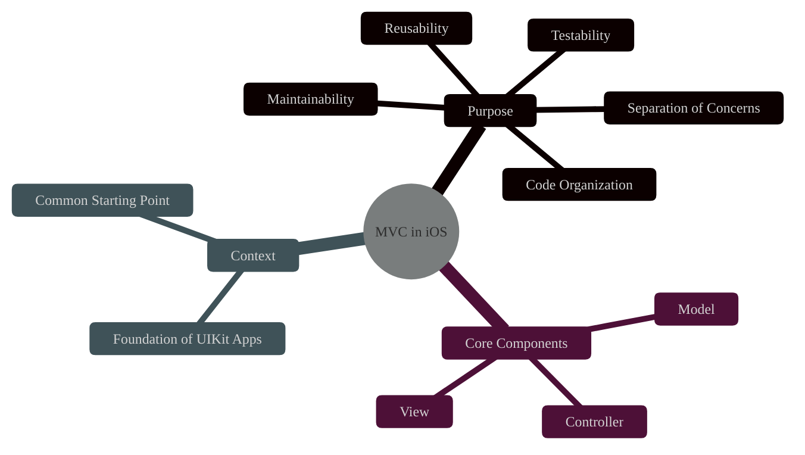
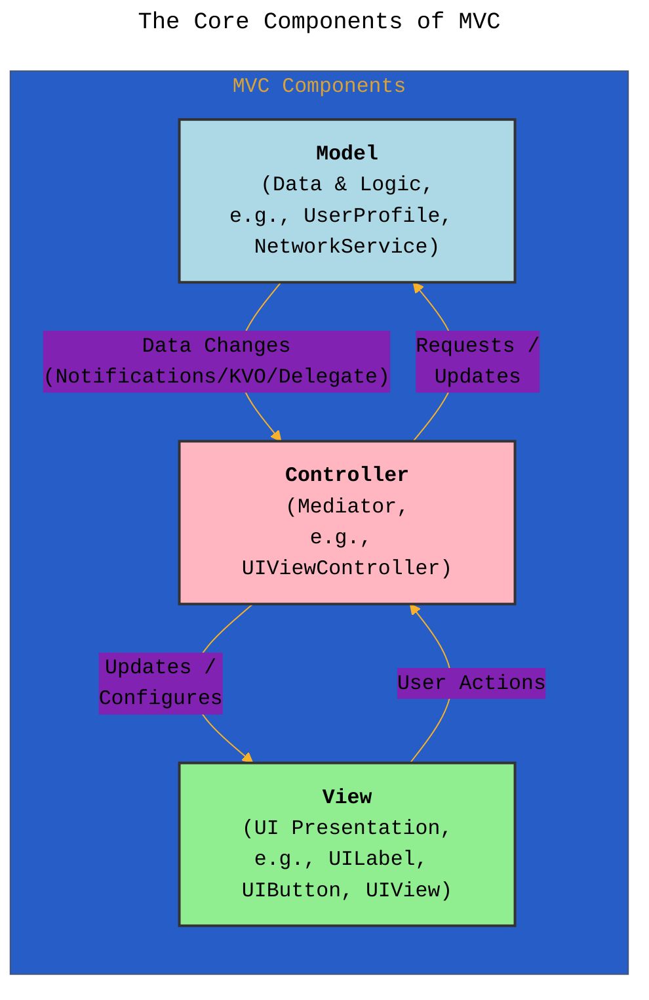
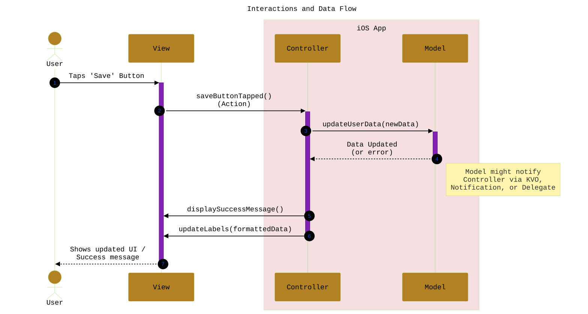
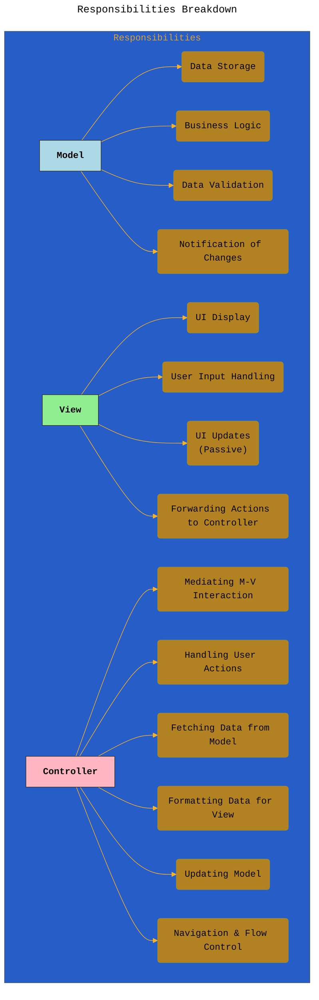
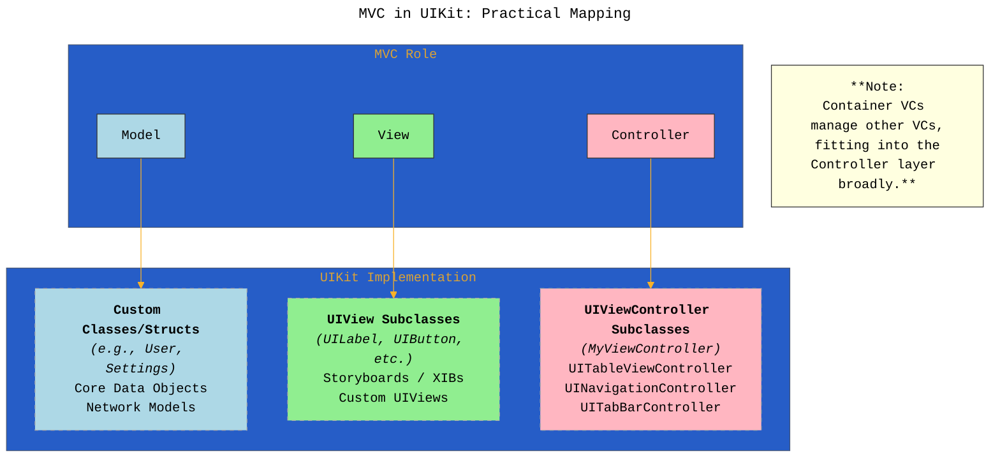
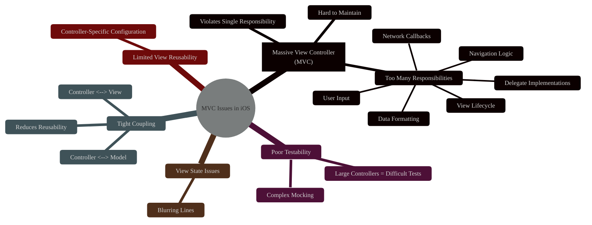
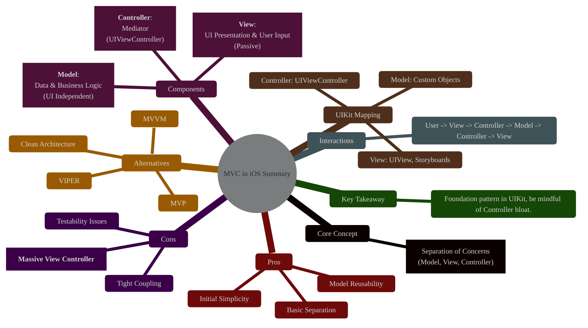

# Understanding the Model-View-Controller (MVC) Pattern in iOS Development
> **Disclaimer:**
>
> This document contains my personal notes on the topic,
> compiled from publicly available documentation and various cited sources.
> The materials are intended for educational purposes, personal study, and reference.
> The content is dual-licensed:
> 1. **MIT License:** Applies to all code implementations (Swift, Mermaid, and other programming languages).
> 2. **Creative Commons Attribution 4.0 International License (CC BY 4.0):** Applies to all non-code content, including text, explanations, diagrams, and illustrations.
---

## 1. Introduction: The Foundation of iOS App Architecture

Model-View-Controller (MVC) is a foundational software architectural pattern widely used in graphical user interfaces (GUIs) and particularly prominent in Apple's Cocoa Touch framework (UIKit) for iOS development. Its primary goal is to **separate concerns** within an application, dividing the codebase into three distinct, interconnected components: Model, View, and Controller. This separation aims to improve code organization, maintainability, testability, and reusability.

---

## 2. The Core Components of MVC

MVC divides application logic into three roles. Understanding each role is crucial for implementing the pattern effectively.

### a. Model
*   **Purpose:** The Model represents the application's data and the business logic that manipulates it. It's the "what" of the application – the information it manages and the rules governing that information.
*   **Responsibilities:**
    *   Holds the application's data (e.g., user profiles, product lists, game state).
    *   Contains the logic to manipulate data (validation, computation, persistence).
    *   Notifies the Controller about changes to its data (often using patterns like Key-Value Observing (KVO), Notifications, or delegation).
    *   Is **UI-independent**: It should have no knowledge of how the data is presented in the View or how user interactions occur.
*   **Examples in iOS:** Custom data structures (`struct`, `class`), Core Data objects, network response models, business logic services.

### b. View
*   **Purpose:** The View is responsible for presenting the Model's data to the user and handling user input (taps, swipes, text entry). It's the "how" the data looks and interacts visually.
*   **Responsibilities:**
    *   Displays data provided by the Controller.
    *   Forwards user actions (like button taps) to the Controller for processing.
    *   Is typically **passive**: It doesn't contain application logic but might have view-specific logic (like animations or drawing).
    *   Should have minimal knowledge of the Model. It often gets data in a display-ready format from the Controller.
*   **Examples in iOS:** `UIView` and its subclasses (`UILabel`, `UIButton`, `UITableView`, `UIImageView`), custom `UIView` subclasses, Storyboards, XIB files.

### c. Controller
*   **Purpose:** The Controller acts as the intermediary or "glue" between the Model and the View. It coordinates the flow of data and user interactions.
*   **Responsibilities:**
    *   Accesses data from the Model based on user actions or application events.
    *   Processes user input received from the View (e.g., handles button taps).
    *   Updates the View with data retrieved from the Model.
    *   Updates the Model based on user input or other logic.
    *   Contains application-specific logic that doesn't belong in the Model or View.
*   **Examples in iOS:** `UIViewController` and its subclasses (`UITableViewController`, `UINavigationController`), custom `UIViewController` subclasses.

---

## 3. Interactions and Data Flow

The interaction pattern in MVC is key to maintaining separation. A typical flow for a user action looks like this:

1.  **User Action:** The user interacts with the View (e.g., taps a button).
2.  **View Notifies Controller:** The View forwards the action event to the Controller (often via Target-Action, delegates, or closures). The View doesn't know *what* to do, only that an interaction occurred.
3.  **Controller Acts:** The Controller receives the event and decides how to respond. This might involve:
    *   Requesting data from the Model.
    *   Updating the Model based on the input.
    *   Performing application-specific logic.
4.  **Controller Updates Model (if necessary):** If the action requires data modification (e.g., saving user input), the Controller updates the Model.
5.  **Model Notifies Controller (if data changed):** If the Model's data changes (either due to the Controller's action or an external event), it notifies the Controller.
6.  **Controller Updates View:** The Controller receives the notification (or fetches fresh data) from the Model and updates the View accordingly, formatting the data as needed for display.

----

## 4. Responsibilities Breakdown

Clarity on responsibilities helps avoid blurring the lines between components:

---

## 5. MVC in UIKit: Practical Mapping

Apple's UIKit framework heavily influences how MVC is implemented in iOS:

*   **Model:** These are typically your custom Swift or Objective-C classes/structs. They often have no direct dependency on UIKit.
*   **View:** Primarily `UIView` subclasses. Storyboards and XIBs define the structure and layout of views, often connecting UI elements to Controller outlets.
*   **Controller:** Almost always a subclass of `UIViewController`. UIKit provides specialized controllers (like `UINavigationController`, `UITabBarController`) that manage other view controllers. The `UIViewController` lifecycle methods (`viewDidLoad`, `viewWillAppear`, etc.) are central to managing the view and interacting with the model.

---

## 6. Advantages of Using MVC

*   **Separation of Concerns:** Clear division makes the codebase easier to understand, navigate, and maintain.
*   **Reusability:**
    *   Models can often be reused across different parts of the application or even different applications.
    *   Views can sometimes be reused with different data (though coupling with the Controller can limit this).
*   **Testability:** Models can be tested independently of the UI. Controllers can be tested by mocking Models and Views (though tight coupling can sometimes hinder this).
*   **Parallel Development:** Different team members can potentially work on the Model, View, and Controller layers simultaneously (though the Controller often becomes a bottleneck).
*   **Simplicity (Initially):** For smaller applications or screens, MVC is relatively straightforward to understand and implement, especially given UIKit's structure.
---

## 7. Disadvantages and Common Issues ("Massive View Controller")

Despite its benefits, MVC in iOS is notorious for leading to a common problem:

*   **Massive View Controller (MVC):** This is the most significant drawback. Because `UIViewController` handles so many responsibilities (view lifecycle, user interactions, data formatting, navigation, network callbacks, delegation), it tends to grow very large and complex, violating the Single Responsibility Principle.
*   **Poor Testability:** Large View Controllers become difficult to test due to their numerous dependencies and intertwined logic. Mocking becomes complex.
*   **Tight Coupling:** The Controller often becomes tightly coupled to both the specific View implementation and the Model, reducing the reusability of both the Controller and the View.
*   **View State Management:** Views sometimes end up holding state, blurring the lines with the Controller or Model.
*   **Limited View Reusability:** Views are often configured directly by the Controller, making them hard to reuse with different Controllers or data formats without modification.

---

## 8. Variations and Alternatives

Due to the challenges of traditional MVC in iOS (especially the Massive View Controller problem), several alternative patterns have gained popularity:

*   **MVVM (Model-View-ViewModel):** Uses a ViewModel to mediate between View and Model, often leveraging data binding. Better testability and reduced Controller size. Very popular with SwiftUI and Combine/RxSwift.
*   **VIPER (View-Interactor-Presenter-Entity-Router):** Enforces stricter separation with more distinct components. Good for large teams and complex modules, but involves more boilerplate code.
*   **MVP (Model-View-Presenter):** Similar to MVC, but the Presenter has a stronger reference to the View interface, often involving more direct method calls to update the view.
*   **Clean Architecture:** Focuses on dependency rules and layers (Entities, Use Cases, Interface Adapters, Frameworks) for maximum separation and testability.

These patterns aim to address the shortcomings of MVC by further distributing responsibilities.

---

## 9. Conclusion: Summary of MVC in iOS

MVC remains a fundamental pattern in iOS development, particularly for UIKit applications. Its strength lies in providing a basic structure for separating data, presentation, and control logic. While simple to grasp initially, developers must be vigilant to avoid the common "Massive View Controller" pitfall by consciously delegating responsibilities away from the `UIViewController` where appropriate (e.g., to helper classes, services, or by adopting patterns like MVVM or VIPER for more complex scenarios).

---

<!-- 

---
**Licenses:**

- **MIT License:**   - Full text in [LICENSE](LICENSE) file.
- **Creative Commons Attribution 4.0 International:**  - Legal details in [LICENSE-CC-BY](LICENSE-CC-BY) and at [Creative Commons official site](http://creativecommons.org/licenses/by/4.0/).

---
