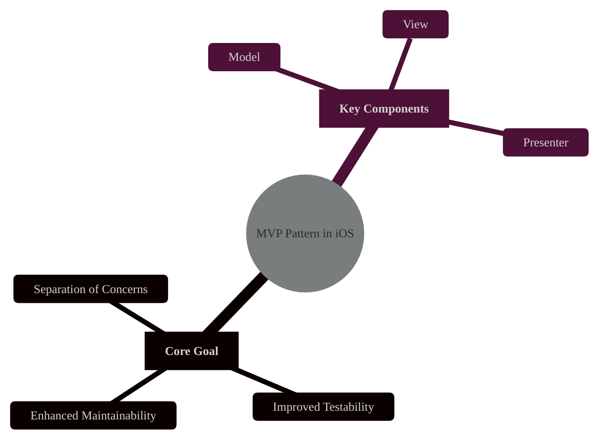
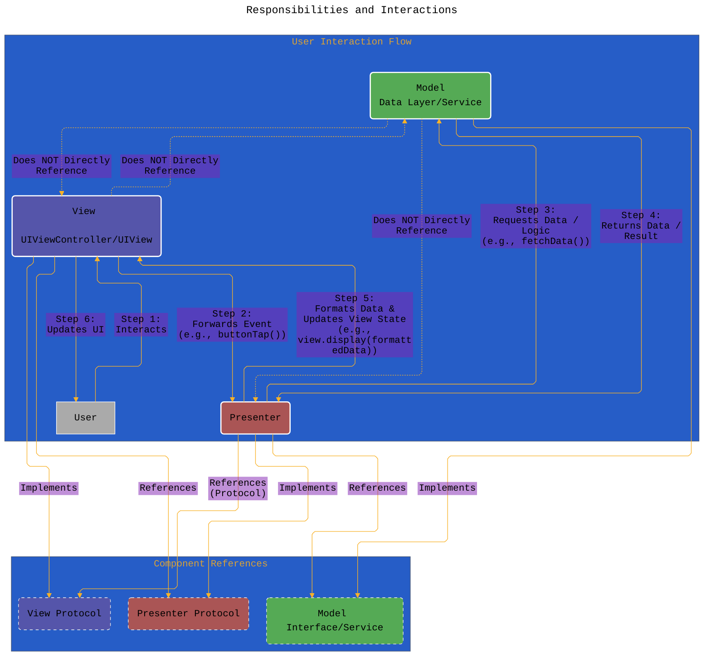
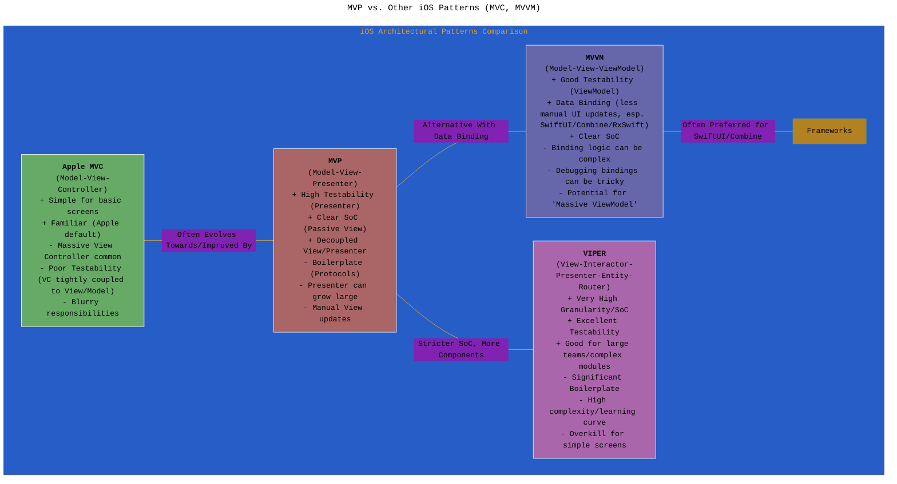
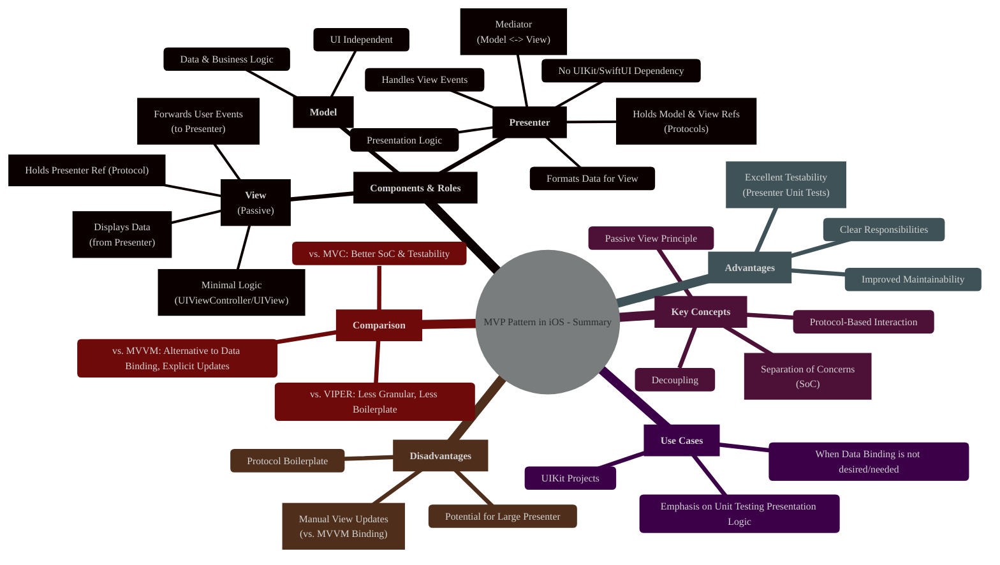

# MVP Design Pattern in iOS Development
> **Disclaimer:**
>
> This document contains my personal notes on the topic,
> compiled from publicly available documentation and various cited sources.
> The materials are intended for educational purposes, personal study, and reference.
> The content is dual-licensed:
> 1. **MIT License:** Applies to all code implementations (Swift, Mermaid, and other programming languages).
> 2. **Creative Commons Attribution 4.0 International License (CC BY 4.0):** Applies to all non-code content, including text, explanations, diagrams, and illustrations.
---


## 1. Introduction: What is MVP?

The **Model-View-Presenter (MVP)** pattern is an architectural design pattern used in software development to separate concerns within the user interface (UI) layer. It aims to improve code modularity, testability, and maintainability by clearly defining the roles and responsibilities of its core components. In the context of iOS development, MVP provides an alternative to the more traditional Model-View-Controller (MVC) pattern, offering distinct advantages, particularly in unit testing the presentation logic.



---

## 2. Core Components of MVP

MVP divides the UI-related logic into three distinct parts:

*   **Model:**
    *   Represents the application's data and business logic.
    *   It's responsible for managing data (fetching, storing, updating) and implementing the core business rules.
    *   The Model is entirely independent of the UI (View and Presenter). It knows nothing about how the data will be displayed or manipulated by the user interface.
    *   Examples in iOS: Structs/Classes representing data entities, network managers, data persistence layers (Core Data, Realm wrappers), business logic services.

*   **View:**
    *   Represents the UI elements that the user interacts with. Its primary responsibility is to display data provided by the Presenter and forward user input events to the Presenter.
    *   Crucially, in the standard "Passive View" variant of MVP, the View is kept as "dumb" as possible. It contains minimal logic, often just setters for UI elements and delegates/closures to notify the Presenter of events.
    *   The View holds a reference to its Presenter (usually via an interface/protocol).
    *   Examples in iOS: `UIViewController`, `UIView`, `UITableViewCell`, `Storyboard`/`XIB` files. The `UIViewController` typically *acts* as the View in UIKit-based MVP.

*   **Presenter:**
    *   Acts as the intermediary or "middle-man" between the Model and the View.
    *   It retrieves data from the Model, formats it for display, and passes it to the View.
    *   It receives user input events from the View and decides how to react, potentially interacting with the Model or updating the View's state.
    *   The Presenter contains the presentation logic (how data is prepared for the UI, handling UI events, navigation logic).
    *   It holds references to both the Model (or data services) and the View (typically via an interface/protocol to enable mocking).
    *   The Presenter should *not* have direct knowledge of specific UIKit/SwiftUI components (like `UILabel`, `UIButton`). It interacts with the View through an abstraction (the View protocol).

---

## 3. Responsibilities and Interactions

The power of MVP lies in the well-defined communication flow, typically facilitated by protocols (interfaces) in Swift.



**Explanation of Interactions:**

1.  **User Action:** The user interacts with the View (e.g., taps a button).
2.  **View to Presenter:** The View captures the event and calls a corresponding method on the Presenter (e.g., `presenter.saveButtonTapped()`). The View doesn't know *what* happens next, only that it needs to inform the Presenter.
3.  **Presenter to Model:** The Presenter processes the event. If data is needed or business logic must execute, it interacts with the Model (e.g., `userService.fetchUser(id: ...)` or `dataManager.save(item: ...)`).
4.  **Model to Presenter:** The Model performs the operation and returns data or a result (success/failure) to the Presenter, often asynchronously via completion handlers or Combine/async-await.
5.  **Presenter to View:** The Presenter receives the result from the Model. It formats the data into a displayable format (e.g., formatting a `Date` into a `String`, creating view-specific data structures) and tells the View *what* to display by calling methods defined in the View protocol (e.g., `view.showLoadingIndicator(false)`, `view.displayUserDetails(viewModel: formattedData)`, `view.showError(message: "...")`).
6.  **View Update:** The View implements the methods called by the Presenter to update its UI elements accordingly.

**Key Role of Protocols:** Protocols abstract the View and Presenter, breaking direct dependencies. The Presenter interacts with a `ViewProtocol`, not a concrete `UIViewController`. The View interacts with a `PresenterProtocol`. This is essential for testability, as mock implementations of these protocols can be injected during testing.

-----

## 4. Key Characteristic: The Passive View

The most common and arguably most beneficial variant of MVP implements the **Passive View** principle.

*   **Definition:** The View is stripped of almost all logic. It only updates its state based on instructions from the Presenter and forwards user events. It does *not* pull data or make decisions.
*   **Benefit:** This makes the View extremely simple and highly testable (often UI tests suffice). The complex presentation logic resides entirely within the Presenter, which can be easily unit-tested without needing the UI framework (UIKit/SwiftUI) or a running simulator/device because it interacts with a mock View protocol.

*Contrast with Supervising Controller:* Another MVP variant where the View might have some minimal binding logic, and the Presenter (Supervising Controller) coordinates more observation. Passive View provides stronger separation and testability.

-----

## 5. Conceptual Implementation Example (Swift)

```swift
// --------------------
// MARK: - Protocols (Contracts)
// --------------------
protocol UserViewProtocol: AnyObject { // Use AnyObject for class-bound protocols often needed for weak refs
    func displayUserName(_ name: String)
    func displayLoading(_ isLoading: Bool)
    func displayError(_ message: String)
}

protocol UserPresenterProtocol: AnyObject {
    func viewDidLoad() // Event from View
    func refreshButtonTapped() // Event from View
}

protocol UserServiceProtocol {
    func fetchUser(completion: @escaping (Result<User, Error>) -> Void)
}

// --------------------
// MARK: - Model
// --------------------
struct User {
    let id: String
    let name: String
    // ... other properties
}

// Concrete Model Service (could be Network Manager, DB Manager etc.)
class RealUserService: UserServiceProtocol {
    func fetchUser(completion: @escaping (Result<User, Error>) -> Void) {
        // ... actual network/data fetching logic ...
        // Simulate async call
        DispatchQueue.main.asyncAfter(deadline: .now() + 1.0) {
            // Simulate success/failure
            let shouldSucceed = Bool.random()
            if shouldSucceed {
                 let fetchedUser = User(id: "123", name: "Alice")
                 completion(.success(fetchedUser))
            } else {
                 enum FetchError: Error { case networkError }
                 completion(.failure(FetchError.networkError))
            }
        }
    }
}


// --------------------
// MARK: - Presenter
// --------------------
class UserPresenter: UserPresenterProtocol {
    // Weak reference to avoid retain cycles if View holds strong ref to Presenter
    private weak var view: UserViewProtocol?
    private let userService: UserServiceProtocol

    init(view: UserViewProtocol, userService: UserServiceProtocol) {
        self.view = view
        self.userService = userService
    }

    func viewDidLoad() {
        loadUserData()
    }

    func refreshButtonTapped() {
         loadUserData()
    }

    private func loadUserData() {
        view?.displayLoading(true) // Tell View to show loading indicator
        userService.fetchUser { [weak self] result in
            // Ensure view and self are still valid (important for async)
            guard let self = self, let view = self.view else { return }

            view.displayLoading(false) // Tell View to hide loading indicator

            switch result {
            case .success(let user):
                // Presentation Logic: Format data for the view
                let formattedName = "User: \(user.name.uppercased())" // Example formatting
                view.displayUserName(formattedName) // Tell View what to display
            case .failure(let error):
                 // Presentation Logic: Format error for the view
                view.displayError("Failed to load user: \(error.localizedDescription)") // Tell View to show error
            }
        }
    }
}

// --------------------
// MARK: - View (UIViewController)
// --------------------
// Assume this ViewController is set up in Storyboard/XIB with outlets connected
class UserViewController: UIViewController, UserViewProtocol {

    // IBOutlet connections (example)
    @IBOutlet weak var nameLabel: UILabel!
    @IBOutlet weak var loadingIndicator: UIActivityIndicatorView!
    @IBOutlet weak var errorLabel: UILabel!
    @IBOutlet weak var refreshButton: UIButton!

    // Presenter instance (injected)
    var presenter: UserPresenterProtocol! // Usually injected via Initializer or Property

    override func viewDidLoad() {
        super.viewDidLoad()
        // Crucially: Instantiate the presenter here or have it injected.
        // This setup can vary (dependency injection framework, manual init)
        // Example: Assuming presenter is injected *before* viewDidLoad
        if presenter == nil {
             // Simple manual setup (better ways exist)
             presenter = UserPresenter(view: self, userService: RealUserService())
             print("Warning: Presenter manually created. Consider dependency injection.")
        }

        presenter.viewDidLoad() // Inform Presenter that view is ready
        errorLabel.isHidden = true // Initial UI state
    }

    // --- IBAction ---
    @IBAction func refreshButtonAction(_ sender: UIButton) {
        presenter.refreshButtonTapped() // Forward event to presenter
    }

    // --- UserViewProtocol Implementation ---
    func displayUserName(_ name: String) {
        nameLabel.text = name
        nameLabel.isHidden = false
        errorLabel.isHidden = true
    }

    func displayLoading(_ isLoading: Bool) {
        if isLoading {
            loadingIndicator.startAnimating()
            loadingIndicator.isHidden = false
            refreshButton.isEnabled = false // Disable button while loading
            nameLabel.isHidden = true
            errorLabel.isHidden = true
        } else {
            loadingIndicator.stopAnimating()
            loadingIndicator.isHidden = true
            refreshButton.isEnabled = true // Re-enable button
        }
    }

    func displayError(_ message: String) {
        errorLabel.text = message
        errorLabel.isHidden = false
        nameLabel.isHidden = true
    }
}
```

Full GitHub implementation [GitHub - CongLeSolutionX/MyApp at DESIGN\_PATTERNS\_MVP](https://github.com/CongLeSolutionX/MyApp/tree/DESIGN_PATTERNS_MVP)


---

## 6. Advantages of MVP in iOS

*   **Testability:** This is the primary driver for MVP. The Presenter contains the presentation logic and has no dependency on UIKit/SwiftUI (due to the View protocol). It can be fully unit-tested (using `XCTest`) by providing mock View and Model objects.
*   **Separation of Concerns:** Clear roles for Model (data/business logic), View (UI display/events), and Presenter (presentation logic/coordination) lead to more organized code.
*   **Maintainability:** Changes in the UI (View) are less likely to affect the presentation logic (Presenter) or business logic (Model), and vice-versa. Code is easier to understand and modify.
*   **Modularity:** Components are more independent and potentially reusable.

---

## 7. Disadvantages of MVP in iOS

*   **Boilerplate:** Requires creating protocols for View and Presenter interactions, which can add boilerplate code, especially for simple screens.
*   **Presenter Complexity:** The Presenter can sometimes become a large class ("Massive Presenter") if it handles too many responsibilities, especially complex state management or navigation. Careful design is needed.
*   **1:1 View-Presenter Coupling:** Typically, each View (UIViewController) has its own dedicated Presenter, leading to potentially many Presenter classes.
*   **State Management:** Explicit state management within the Presenter is required. Patterns like MVVM leverage data binding, which can sometimes simplify state synchronization between the View and its logic layer (ViewModel).

---

## 8. MVP vs. Other iOS Patterns (MVC, MVVM)



*   **vs. MVC (Apple's variant):** In Apple's MVC, the `UIViewController` often handles both View logic *and* presentation logic, leading to "Massive View Controllers" that are hard to test and maintain. MVP explicitly extracts presentation logic into the Presenter, decoupling it from the `UIViewController` (which becomes the View).
*   **vs. MVVM (Model-View-ViewModel):** Both MVP and MVVM improve testability over MVC. MVVM uses a ViewModel that exposes data via observable properties or streams (using Combine, RxSwift, or simple callbacks). The View then *binds* to this data. This reduces the need for the ViewModel to hold a direct reference to the View or call specific `view.display(...)` methods. MVP typically involves more explicit `view.display(...)` calls from the Presenter. MVVM is often favored in modern iOS, especially with SwiftUI's declarative nature and Combine's reactive capabilities.

---

## 9. Testing MVP Components

*   **Presenter:** Easy to unit test. Create mock objects conforming to `ViewProtocol` and `Model/ServiceProtocol`. Inject these mocks into the Presenter instance. Call Presenter methods (simulating view events or lifecycle calls) and assert that the correct methods were called on the mock View (e.g., `mockView.displayLoading(true)` was called) and mock Model/Service.
*   **View (`UIViewController`):** Typically requires UI Testing (`XCTest`) or Snapshot Testing to verify visual layout and basic interactions. Unit testing Views is difficult due to their dependence on the UI framework. However, since the View is "passive," the amount of logic needing testing here is minimal.
*   **Model:** Unit testable independently, focusing on business logic and data manipulation rules.

----

## 10. Conclusion: When to Use MVP in iOS?

MVP is a valuable pattern in the iOS developer's toolkit, particularly when:

*   **High testability of presentation logic** is a primary goal.
*   Working with **UIKit** where data binding isn't as integrated as in SwiftUI.
*   Clear separation between UI display and presentation logic is desired **without the complexity of data binding frameworks** (like Combine/RxSwift if not already used).
*   You prefer explicit control over View updates rather than reactive binding.

While MVVM has gained significant popularity, especially with SwiftUI and Combine, MVP remains a viable and effective pattern for building testable and maintainable iOS applications, particularly in UIKit-based projects or when a simpler alternative to reactive programming is preferred.




---
