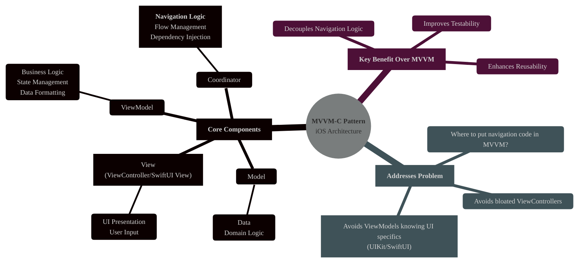
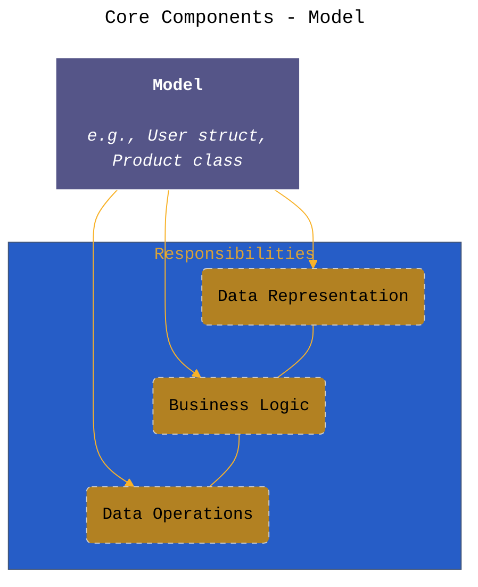
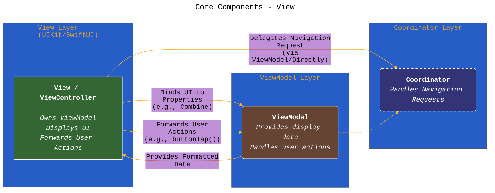
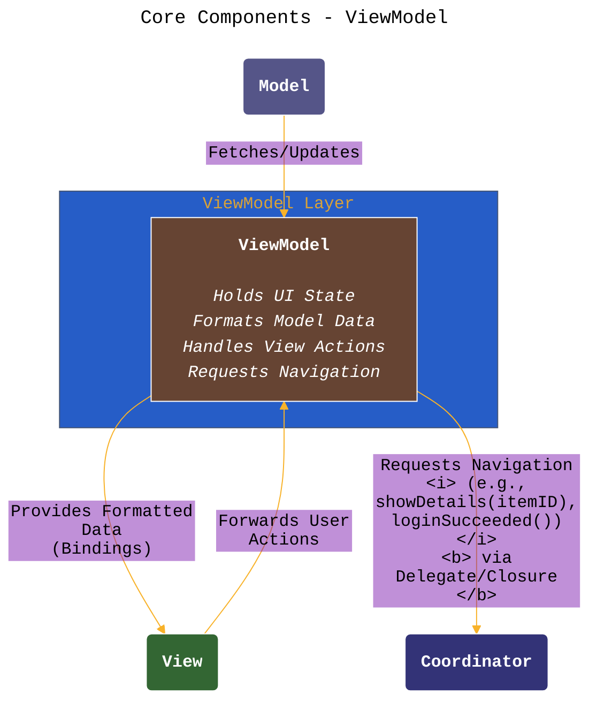
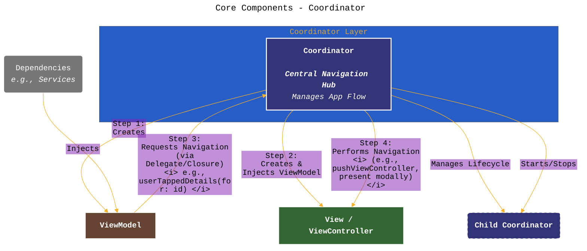
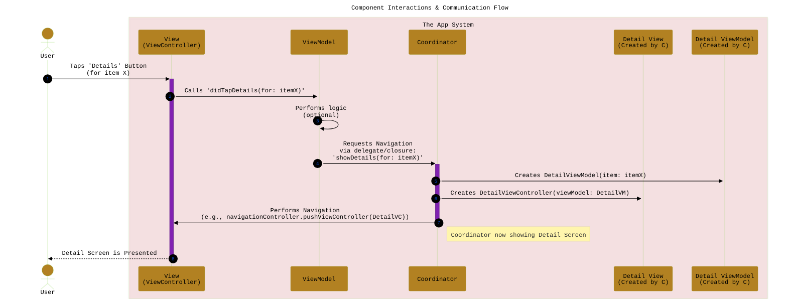
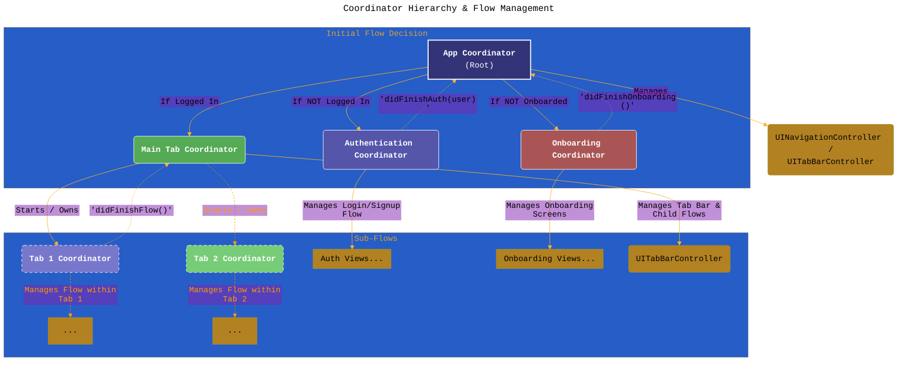
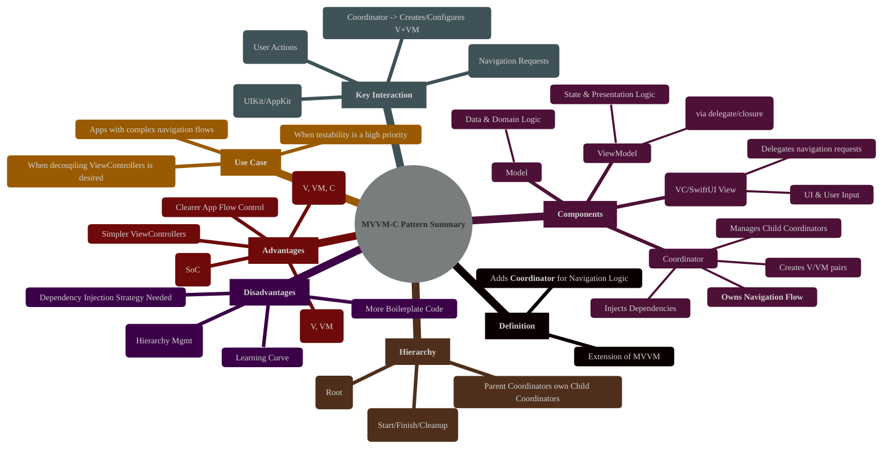

# MVVM-C Design Pattern in iOS Development
> **Disclaimer:**
>
> This document contains my personal notes on the topic,
> compiled from publicly available documentation and various cited sources.
> The materials are intended for educational purposes, personal study, and reference.
> The content is dual-licensed:
> 1. **MIT License:** Applies to all code implementations (Swift, Mermaid, and other programming languages).
> 2. **Creative Commons Attribution 4.0 International License (CC BY 4.0):** Applies to all non-code content, including text, explanations, diagrams, and illustrations.
---


## 1. Introduction: What is MVVM-C?

The **Model-View-ViewModel-Coordinator (MVVM-C)** pattern is an architectural pattern used in iOS development. It extends the popular **MVVM (Model-View-ViewModel)** pattern by introducing a new component: the **Coordinator**.

**Core Idea:** While MVVM effectively separates UI logic (View) from business logic and state management (ViewModel), it often leaves the responsibility of **navigation** ambiguous. ViewModels shouldn't know about `UINavigationController` or how to present other View Controllers, and Views (View Controllers) become bloated if they handle navigation directly. MVVM-C addresses this by isolating navigation logic into Coordinators.

**Purpose:** To decouple View Controllers from navigation responsibilities, making them more reusable, testable, and focused solely on presenting the UI and forwarding user interactions. Coordinators manage the application's flow and the creation/presentation of View Controllers.




---

## 2. Core Components Breakdown

MVVM-C consists of four main components:

### a. Model
The Model represents the application's data and core domain logic. It's unaware of the ViewModel, View, or Coordinator. This is identical to the Model in MVC or MVVM.

*   **Responsibilities:** Holds data, enforces business rules, performs data operations (fetching, saving).
*   **Example:** Structs or classes representing user data, network responses, database entities.



### b. View (ViewController / SwiftUI View)
The View is responsible for presenting the UI to the user and capturing user input. In UIKit, this is typically a `UIViewController` subclass. In SwiftUI, it's a `View` struct. It owns or has a reference to its ViewModel.

*   **Responsibilities:** Renders UI based on ViewModel state, forwards user actions (button taps, text input) to the ViewModel, binds UI elements to ViewModel properties. **Crucially, it does NOT handle navigation directly.** It delegates navigation requests (often triggered by the ViewModel) to its Coordinator.
*   **Interaction:** Binds to ViewModel properties (e.g., using Combine, RxSwift, delegates, or closures). Receives formatted data from the ViewModel. Notifies the ViewModel of user interactions.




### c. ViewModel
The ViewModel acts as an intermediary between the Model and the View. It prepares data from the Model for display in the View and handles logic triggered by user interactions forwarded from the View.

*   **Responsibilities:** Holds UI state, performs data formatting, contains presentation logic, handles user actions passed from the View. **Crucially, it asks the Coordinator to perform navigation** when a specific flow needs to start (e.g., after successful login, tapping a detail button). It does *not* know *how* the navigation happens, only *that* it needs to happen.
*   **Communication for Navigation:** Typically uses a delegate protocol or closure property, implemented/provided by the Coordinator, to signal navigation events.




### d. Coordinator
This is the defining component of MVVM-C. The Coordinator manages the navigation flow for a specific part of the application (e.g., authentication flow, settings flow, main tab flow).

*   **Responsibilities:**
    *   Instantiates ViewControllers and their corresponding ViewModels.
    *   Injects dependencies (like the ViewModel itself, or services) into the ViewController/ViewModel.
    *   Listens for navigation requests from ViewModels (via delegate/closure).
    *   Performs the actual navigation (pushing, presenting modally, switching tabs) using UIKit APIs (`UINavigationController`, `UITabBarController`, `present(_:animated:completion:)`).
    *   Manages the lifecycle of child coordinators for sub-flows.
    *   Starts and stops itself or its children.
*   **Key Aspect:** It encapsulates *how* to navigate, abstracting this away from Views and ViewModels.



---

## 3. Component Interactions & Communication Flow

The power of MVVM-C lies in its clean separation and defined communication paths, especially for navigation.

**Typical Flow (e.g., User Taps a Button to See Details):**

1.  **User Interaction:** User taps a button on the `View` (ViewController).
2.  **Forward Action:** The `View` calls a method on its `ViewModel` (e.g., `viewModel.didTapDetailsButton(for: itemID)`).
3.  **Process Logic:** The `ViewModel` handles any necessary logic (e.g., validating the ID).
4.  **Request Navigation:** The `ViewModel` determines navigation is needed and calls a method on its `coordinatorDelegate` (which is the `Coordinator`) (e.g., `coordinatorDelegate?.viewModelDidRequestDetails(for: itemID)`).
5.  **Coordinator Acts:** The `Coordinator` receives the request.
6.  **Instantiate & Configure:** The `Coordinator` creates the `DetailsViewModel` and the `DetailsViewController`, injecting the ViewModel and any other dependencies.
7.  **Perform Navigation:** The `Coordinator` uses its `UINavigationController` (or other presentation context) to push or present the newly created `DetailsViewController`.



---

## 4. Coordinator Hierarchy & Flow Management

For non-trivial applications, a single coordinator becomes unmanageable. MVVM-C promotes a hierarchy of coordinators:

*   **App Coordinator:** The root coordinator, often started in the `AppDelegate` or `SceneDelegate`. It typically manages top-level navigation components like `UITabBarController` or orchestrates the initial flow (e.g., deciding whether to show onboarding, authentication, or the main app).
*   **Parent/Child Coordinators:** A coordinator can start other coordinators (`Child Coordinators`) to manage specific sub-flows (e.g., an `AuthCoordinator` started by the `AppCoordinator`, or a `SettingsCoordinator` started from a `ProfileCoordinator`).
*   **Lifecycle:** Parent coordinators typically hold strong references to their active children. When a child coordinator's flow finishes (e.g., user logs out, completes onboarding), it notifies its parent, which then removes the reference, allowing the child coordinator and its associated view controllers/view models to be deallocated.



*(Note: Dashed arrows indicate potential notification/completion flow)*

---

## 5. Implementation Example (Conceptual Swift Structure)

```swift
// Protocol for ViewModel to signal navigation needs
protocol SomeViewModelCoordinatorDelegate: AnyObject {
    func viewModelDidRequestNavigateToNextScreen(_ viewModel: SomeViewModel, data: SomeData)
    func viewModelDidFinish(_ viewModel: SomeViewModel)
}

// ViewModel asks Coordinator via delegate
class SomeViewModel {
    weak var coordinatorDelegate: SomeViewModelCoordinatorDelegate?
    // ... other properties and logic ...

    func userTappedNextButton() {
        let dataToSend = // ... prepare data ...
        coordinatorDelegate?.viewModelDidRequestNavigateToNextScreen(self, data: dataToSend)
    }

    func userTappedCloseButton() {
        coordinatorDelegate?.viewModelDidFinish(self)
    }
}

// Coordinator Protocol (Common interface for coordinators)
protocol Coordinator: AnyObject {
    var childCoordinators: [Coordinator] { get set }
    var navigationController: UINavigationController { get set } // Or other context

    func start()
    func childDidFinish(_ child: Coordinator?) // For cleanup
}

extension Coordinator {
    func childDidFinish(_ child: Coordinator?) {
        childCoordinators.removeAll { $0 === child }
    }
}


// Concrete Coordinator Implementation
class SomeCoordinator: Coordinator, SomeViewModelCoordinatorDelegate {
    var childCoordinators: [Coordinator] = []
    var navigationController: UINavigationController

    init(navigationController: UINavigationController) {
        self.navigationController = navigationController
    }

    func start() {
        let viewModel = SomeViewModel()
        viewModel.coordinatorDelegate = self // ViewModel talks back to Coordinator
        let viewController = SomeViewController(viewModel: viewModel)
        // Inject other dependencies if needed

        // How it's presented depends on context (push, modal, root)
        navigationController.pushViewController(viewController, animated: true)
    }

    // --- SomeViewModelCoordinatorDelegate ---

    func viewModelDidRequestNavigateToNextScreen(_ viewModel: SomeViewModel, data: SomeData) {
        // Start another coordinator or directly present another VC
        let nextCoordinator = NextCoordinator(navigationController: navigationController, initialData: data)
        childCoordinators.append(nextCoordinator)
        nextCoordinator.start() // Start the sub-flow
    }

     func viewModelDidFinish(_ viewModel: SomeViewModel) {
        // Logic to dismiss the flow, e.g., pop the VC, or tell the parent coordinator
        // parentCoordinator?.childDidFinish(self) // If this coordinator itself needs to end
        navigationController.popViewController(animated: true) // Example: just pop
    }
}

// ViewController remains relatively simple
class SomeViewController: UIViewController {
    let viewModel: SomeViewModel

    init(viewModel: SomeViewModel) {
        self.viewModel = viewModel
        super.init(nibName: nil, bundle: nil)
        // Setup view bindings to viewModel properties here
    }

    required init?(coder: NSCoder) { fatalError("init(coder:) has not been implemented") }

    // ... UI setup, button actions calling viewModel methods ...
    @objc func handleNextButtonTap() {
        viewModel.userTappedNextButton()
    }

     @objc func handleCloseButtonTap() {
        viewModel.userTappedCloseButton(
     }
}
```

Full GitHub repo implementation [GitHub - CongLeSolutionX/MyApp at DESIGN\_PATTERNS\_MVVM-C](https://github.com/CongLeSolutionX/MyApp/tree/DESIGN_PATTERNS_MVVM-C)


---

## 6. Advantages of MVVM-C

*   **Improved Separation of Concerns:** Navigation logic is cleanly extracted from ViewControllers and ViewModels.
*   **Enhanced Testability:**
    *   ViewModels can be tested without importing UIKit or needing a navigation context (mock the coordinator delegate).
    *   Coordinators can be tested independently to verify navigation flow logic.
    *   ViewControllers become simpler and easier to test (primarily UI and action forwarding).
*   **Increased Reusability:** ViewControllers and ViewModels don't contain specific navigation paths, making them potentially reusable in different flows managed by different coordinators. Coordinators themselves can sometimes be reused.
*   **Clearer Application Flow:** The coordinator hierarchy provides a clear map of the application's possible navigation paths and states.
*   **Simplified ViewControllers:** Reduces the "Massive View Controller" problem by offloading navigation responsibilities.


----

## 7. Disadvantages/Considerations

*   **Increased Boilerplate:** Introduces an extra layer (Coordinator) which can add more files and initial setup code, potentially feeling like overkill for very simple applications.
*   **Complexity:** Managing the coordinator hierarchy, parent-child relationships, and their lifecycles (especially cleanup) can add complexity compared to simpler patterns. Requires careful handling of `childCoordinators` arrays and finish callbacks.
*   **Learning Curve:** Developers new to the pattern need to understand the role of each component and the communication flow, particularly how ViewModels signal navigation needs to coordinators.
*   **Dependency Management:** Coordinators often become responsible for dependency injection (creating ViewModels and injecting services), requiring a clear strategy.

---

## 8. Summary Mind Map




---

<!-- 


---
**Licenses:**

- **MIT License:**  [](LICENSE) - Full text in [LICENSE](LICENSE) file.
- **Creative Commons Attribution 4.0 International:** [](LICENSE-CC-BY) - Legal details in [LICENSE-CC-BY](LICENSE-CC-BY) and at [Creative Commons official site](http://creativecommons.org/licenses/by/4.0/).

---
