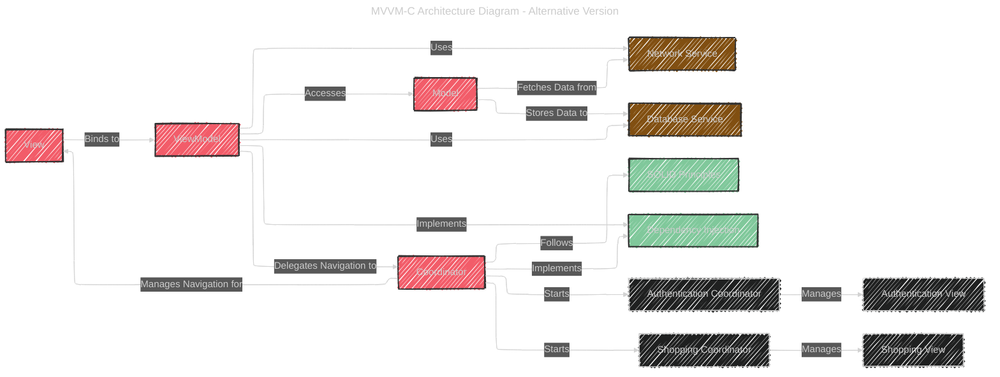

# MVVM-C in Swift

> This content is dual-licensed under your choice of the following licenses:
> 1.  **MIT License:** For the code implementations in Swift and Mermaid provided in this document.
> 2.  **Creative Commons Attribution 4.0 International License (CC BY 4.0):** For all other content, including the text, explanations, and the Mermaid diagrams and illustrations.

---

Below is a version of the **MVVM-C (Model-View-ViewModel-Coordinator)** architecture diagram for Swift and iOS development. This rendition emphasizes accurate naming conventions and clarifies the relationships between components for better understanding.

### Diagram Breakdown

1. **Core Components:**
    - **Model**:
        - **Description**: Manages the application's data and business logic.
        - **Interactions**: Fetches data from the **Network Service** and stores data using the **Database Service**.
    - **View**:
        - **Description**: Represents the user interface using SwiftUI `Views` or UIKit `Views`.
        - **Interactions**: Binds directly to the **ViewModel** to display data and handle user interactions.
    - **ViewModel**:
        - **Description**: Serves as an intermediary between the **View** and the **Model**.
        - **Interactions**:
            - Accesses data from the **Model**.
            - Utilizes **Network Service** and **Database Service** for data operations.
            - Delegates navigation tasks to the **Coordinator**.
    - **Coordinator**:
        - **Description**: Manages the navigation flow and orchestrates transitions between different **Views**.
        - **Interactions**:
            - Controls navigation for the associated **View**.
            - Initiates **Child Coordinators** for specific flows such as authentication and shopping.
2. **Services:**
    - **Network Service**:
        - **Role**: Handles all network-related operations, including API requests and data fetching.
        - **Interaction with Model**: Provides data to the **Model** for processing.
    - **Database Service**:
        - **Role**: Manages local data storage solutions like CoreData or Realm.
        - **Interaction with Model**: Facilitates data persistence and retrieval for the **Model**.
3. **Design Patterns and Principles:**
    - **SOLID Principles**:
        - **Application**: The **Coordinator** adheres to SOLID principles, ensuring single responsibility and enhancing maintainability.
    - **Dependency Injection (DI)**:
        - **Application**: Both the **ViewModel** and **Coordinator** implement **Dependency Injection** to receive their dependencies, promoting flexibility and testability.
4. **Child Coordinators:**
    - **Authentication Coordinator**:
        - **Role**: Manages the authentication flow, including login, registration, and password recovery.
        - **Manages**: `Authentication View`
    - **Shopping Coordinator**:
        - **Role**: Oversees the shopping-related flow, such as product browsing, cart management, and checkout.
        - **Manages**: `Shopping View`
5. **Styling and Organization:**
    - **Core Components**: Highlighted in **yellow** to signify their primary role in the architecture.
    - **Services**: Shown in **green** to represent supporting functionalities.
    - **Design Patterns**: Displayed in **blue** to denote architectural best practices.
    - **Relationships**: Styled with dashed lines for clarity in interactions.

### Key Highlights

- **Separation of Concerns**: By dividing responsibilities among **Model**, **View**, **ViewModel**, and **Coordinator**, each component remains focused on its specific role, enhancing code clarity and maintainability.
- **Scalability with Child Coordinators**: Introducing **Child Coordinators** like `Authentication Coordinator` and `Shopping Coordinator` allows the app to manage complex navigation flows without cluttering the primary **Coordinator**.
- **Adherence to SOLID Principles**: Ensuring that each component follows SOLID principles promotes a robust and flexible codebase that is easier to extend and maintain.
- **Dependency Injection**: Implementing DI in **ViewModels** and **Coordinators** decouples dependencies, facilitating easier testing and greater modularity.
- **Service Integration**: Centralizing network and database operations within dedicated services simplifies data management and promotes reuse across different parts of the application.

### Additional Considerations

- **Memory Management**: Ensure that **Coordinators** hold weak references to their child coordinators and **Views** to prevent retain cycles and memory leaks.
- **Communication Protocols**: Utilize delegates, closures, or Combine publishers to facilitate communication between **ViewModels** and **Coordinators** without tight coupling.
- **Testing**: With navigation logic decoupled from **ViewModels**, unit testing becomes more straightforward, allowing developers to mock **Coordinators** and test **ViewModels** in isolation.

---

<!-- 

---
**Licenses:**

- **MIT License:**   - Full text in [LICENSE](LICENSE) file.
- **Creative Commons Attribution 4.0 International:**  - Legal details in [LICENSE-CC-BY](LICENSE-CC-BY) and at [Creative Commons official site](http://creativecommons.org/licenses/by/4.0/).

---
