# MVVM-C V2
> **Disclaimer:**
>
> This document contains my personal notes on the topic,
> compiled from publicly available documentation and various cited sources.
> The materials are intended for educational purposes, personal study, and reference.
> The content is dual-licensed:
> 1. **MIT License:** Applies to all code implementations (Swift, Mermaid, and other programming languages).
> 2. **Creative Commons Attribution 4.0 International License (CC BY 4.0):** Applies to all non-code content, including text, explanations, diagrams, and illustrations.
---

## Enhanced version - WIP

This is a draft enhanced version from the initial version at [here](./MVVM-C_V1.md).

```mermaid
---
title: Comprehensive MVVM-C Architecture
config:
  layout: elk
  look: handDrawn
  theme: dark
---
%%{
  init: {
    'fontFamily': 'verdana',
    'themeVariables': {
      'primaryColor': '#BB2528',
      'primaryTextColor': '#f529',
      'primaryBorderColor': '#7C0000',
      'lineColor': '#F8B229',
      'secondaryColor': '#006100',
      'tertiaryColor': '#fff'
    }
  }
}%%
classDiagram
    %% Core Components
    class Model {
        << Core >>
        - data: Data
        + fetchData()
        + saveData()
        + updateData()
        + notifyViewModel()
    }
    class View {
        << UI >>
        - viewModel: ViewModel
        + displayData()
        + handleUserInteraction()
    }
    class ViewModel {
        << Presentation Logic >>
        - model: Model
        - coordinator: Coordinator
        + transformData()
        + handleAction()
        + navigate()
    }
    class Coordinator {
        << Navigation >>
        - childCoordinators: List<Coordinator>
        + start()
        + presentView()
        + dismissView()
        + startChildCoordinator()
        + stopChildCoordinator()
    }

    %% Services
    class NetworkService {
        << Service >>
        + fetchData(url: URL)
        + postData(url: URL, data: Data)
    }
    class DatabaseService {
        << Service >>
        + saveData(data: Data)
        + getData(id: String)
    }

    %% Child Coordinators
    class AuthenticationCoordinator {
        << Coordinator >>
        + start()
        + showLogin()
        + showRegistration()
    }
    class ShoppingCoordinator {
        << Coordinator >>
        + start()
        + showProductList()
        + showProductDetail()
        + showCart()
    }

    %% Data Types
    class Data {
        << Data Model >>
        + properties: ...
    }

    %% Relationships
    View -- ViewModel : binds to
    ViewModel -- Model : accesses
    ViewModel -- Coordinator : delegates navigation to
    Coordinator -- View : manages navigation for
    Coordinator -- AuthenticationCoordinator : starts
    Coordinator -- ShoppingCoordinator : starts
    Model -- NetworkService : fetches data from
    Model -- DatabaseService : stores data to

    ViewModel ..> NetworkService : uses
    ViewModel ..> DatabaseService : uses

    %% %% Communication Patterns
    note for View "User Interactions"
    note for ViewModel "Transforms Data, Handles Actions"
    note for Coordinator "Manages Navigation, Creates Views"

    %% %% Advanced Considerations
    note for Model "Data Validation, Business Logic"
    note for NetworkService "Error Handling, Caching"
    note for DatabaseService "Data Migrations, Schema Updates"

    %% Styling
    style Model fill:#e2115,stroke:#333,stroke-width:2px
    style View fill:#e991,stroke:#333,stroke-width:2px
    style ViewModel fill:#e2229,stroke:#333,stroke-width:2px
    style Coordinator fill:#e2359,stroke:#333,stroke-width:2px
    style NetworkService fill:#8111,stroke:#333,stroke-width:2px
    style DatabaseService fill:#8111,stroke:#333,stroke-width:2px
    style AuthenticationCoordinator fill:#1458,stroke:#333,stroke-width:2px
    style ShoppingCoordinator fill:#1458,stroke:#333,stroke-width:2px
    style Data fill:#135,stroke:#333,stroke-width:1px
    
```

Key improvements and explanations:

*   **Class Diagram:**  Switched to a `classDiagram` for a clearer representation of the components and their relationships.  This allows us to define properties and methods for each class.
*   **Stereotypes (`<<...>>`):** Added stereotypes to the class names to clarify their roles (e.g., `<<Core>>`, `<<UI>>`, `<<Presentation Logic>>`, `<<Navigation>>`, `<<Service>>`, `<<Coordinator>>`, `<<Data Model>>`).
*   **Properties and Methods:** Included example properties and methods within each class to illustrate their responsibilities.  These are just examples and would be tailored to the specific application.
*   **Relationships:** Used more precise relationship notations (e.g., `--` for association)
*   **Services and Child Coordinators:** Clearly defined the services and child coordinators as separate classes with their responsibilities.
*   **Data Type (Data):**  Added a `Data` class to represent the data model.
*   **Communication Patterns:**  Added notes to the diagram to explain the communication patterns between the components.
*   **Advanced Considerations:**  Included notes about data validation, error handling, and data migrations.
*   **Styling:** Kept the styling from the original diagram for consistency.

How to Interpret the Diagram:

*   **Classes:** Each box represents a class in the MVVM-C architecture.
*   **Stereotypes:** The text inside `<<...>>` describes the role of the class.
*   **Properties and Methods:** The `-` and `+` indicate private and public members, respectively.
*   **Relationships:** The lines between the boxes show the relationships between the classes.  The arrowheads indicate the direction of the relationship.
*   **Notes:** The notes provide additional information about the components.

---
