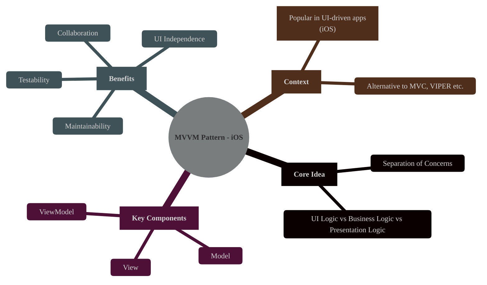
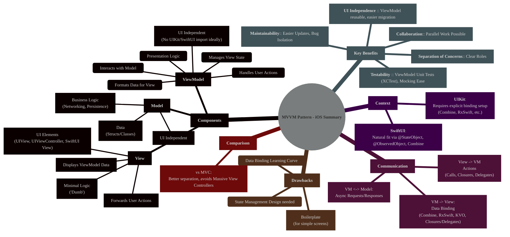

# Understanding the MVVM Design Pattern in iOS Development
> **Disclaimer:**
>
> This document contains my personal notes on the topic,
> compiled from publicly available documentation and various cited sources.
> The materials are intended for educational purposes, personal study, and reference.
> The content is dual-licensed:
> 1. **MIT License:** Applies to all code implementations (Swift, Mermaid, and other programming languages).
> 2. **Creative Commons Attribution 4.0 International License (CC BY 4.0):** Applies to all non-code content, including text, explanations, diagrams, and illustrations.
---

## 1. Introduction: What is MVVM?

The Model-View-ViewModel (MVVM) pattern is an architectural design pattern widely used in modern software development, especially popular in UI-driven platforms like iOS. Its primary goal is to achieve a clean separation of concerns between the user interface (View), the data and business logic (Model), and the presentation logic and data state (ViewModel). This separation enhances testability, maintainability, and code organization.

---

## 2. Core Components of MVVM

MVVM divides the application's responsibilities into three distinct layers:

```mermaid
---
title: "Core Components of MVVM"
author: "Cong Le"
version: "1.0"
license(s): "MIT, CC BY 4.0"
copyright: "Copyright (c) 2025 Cong Le. All Rights Reserved."
config:
  theme: base
---
%%%%%%%% Mermaid version v11.4.1-b.14
%%%%%%%% Available curve styles include the following keywords:
%% basis, bumpX, bumpY, cardinal, catmullRom, linear, monotoneX, monotoneY, natural, step, stepAfter, stepBefore.
%%{
  init: {
    'graph': { 'htmlLabels': false, 'curve': 'basis' },
    'fontFamily': 'Monospace',
    'themeVariables': {
      'primaryColor': '#B28122',
      'primaryTextColor': '#000',
      'primaryBorderColor': '#7C33',
      'lineColor': '#F8B229',
      'stroke':'#000',
      'stroke-width': '0.5px'
    }
  }
}%%
graph LR
    subgraph MVVM_Components["MVVM Components"]
    style MVVM_Components fill:#222,stroke:#ccc
        M["<b>Model</b><br/>Data & Business Logic<br/>(e.g., API client, Database, Structs/Classes)"]
        V["<b>View</b><br/>UI Representation<br/>(e.g., UIView, UIViewController, SwiftUI View)"]
        VM["<b>ViewModel</b><br/>Presentation Logic & State<br/>(e.g., Class/Struct preparing data for View)"]
    end

    V -- "User Actions" --> VM
    VM -- "Updates /<br/>State" --> V
    VM -- "Requests /<br/> Updates" --> M
    M -- "Data /<br/> Responses" --> VM

    style M fill:#38a,stroke:#ccc,stroke-width:2px
    style V fill:#a38,stroke:#ccc,stroke-width:2px
    style VM fill:#3a3,stroke:#ccc,stroke-width:2px

    linkStyle 0 stroke:#fff,stroke-width:1px
    linkStyle 1 stroke:#fff,stroke-width:1px
    linkStyle 2 stroke:#aaa,stroke-width:1px,stroke-dasharray: 5 5
    linkStyle 3 stroke:#aaa,stroke-width:1px,stroke-dasharray: 5 5

```

*   **Model:**
    *   Represents the application's data and business logic.
    *   It's responsible for fetching, storing, and manipulating data (e.g., from network requests, databases, or local storage).
    *   It should be independent of the UI (View) and the ViewModel. Examples include data structures (structs, classes), network clients, persistence layers (Core Data, Realm), etc.

*   **View:**
    *   Represents the User Interface (UI) elements that the user interacts with.
    *   Its primary responsibility is to display data received from the ViewModel and forward user actions (button taps, text input) to the ViewModel.
    *   The View should be as "dumb" as possible, containing minimal logic, primarily related to UI presentation (layout, animations).
    *   In iOS UIKit, this often corresponds to `UIViewController` and its `UIView`s. In SwiftUI, it corresponds to the `View` struct. Crucially, even the `UIViewController` in UIKit should delegate presentation logic to the ViewModel.

*   **ViewModel:**
    *   Acts as an intermediary between the Model and the View.
    *   It holds the presentation logic and the state of the data to be displayed by the View.
    *   It retrieves data from the Model, formats it appropriately for display (e.g., converting a `Date` to a formatted `String`), and exposes this prepared data to the View, often through data binding mechanisms.
    *   It handles user actions received from the View, performing necessary operations (often involving the Model) and updating its state, which in turn updates the View.
    *   The ViewModel should have *no direct reference* to the View (e.g., no import of `UIKit` or `SwiftUI` required, unless using observable objects mechanism from Combine/SwiftUI).

---

## 3. Communication and Data Binding

The power of MVVM lies in how the components communicate, particularly between the View and ViewModel, typically using data binding.

```mermaid
---
title: "Communication and Data Binding"
author: "Cong Le"
version: "1.0"
license(s): "MIT, CC BY 4.0"
copyright: "Copyright (c) 2025 Cong Le. All Rights Reserved."
config:
  theme: base
---
%%%%%%%% Mermaid version v11.4.1-b.14
%%%%%%%% Available curve styles include the following keywords:
%% basis, bumpX, bumpY, cardinal, catmullRom, linear, monotoneX, monotoneY, natural, step, stepAfter, stepBefore.
%%{
  init: {
    'flowchart': { 'htmlLabels': false, 'curve': 'basis' },
    'fontFamily': 'Monospace',
    'themeVariables': {
      'primaryColor': '#B28122',
      'primaryTextColor': '#000',
      'primaryBorderColor': '#7C33',
      'lineColor': '#F8B229',
      'stroke':'#000',
      'stroke-width': '0.5px'
    }
  }
}%%
flowchart TD
    subgraph MVVM_Communication_Flow["MVVM Communication Flow"]
    style MVVM_Communication_Flow fill:#222,stroke:#ccc

        User["User Interaction"] --> V("<b>View</b><br/>Displays UI<br/>Sends actions")
        V -- "Action /<br/> Event (e.g., buttonTap)<br/>[Direct Call /<br/> Delegate /<br/> Closure]" --> VM("<b>ViewModel</b><br/>Handles Actions<br/>Manages State<br/>Formats Data")
        VM -- "Request Data / <br/>Perform Action" --> M("<b>Model</b><br/>Fetches/Saves Data<br/>Business Logic")
        M -- "Returns Data / <br/>Completion" --> VM
        VM -- "Updates State / Data <br/>[Data Binding:<br/>Combine, RxSwift, KVO, Closure, Delegate]" --> V
        V -- Renders Updated UI --> UserDisplay["User Sees Update"]

    end

    style V fill:#a38,stroke:#ccc,stroke-width:2px
    style VM fill:#3a3,stroke:#ccc,stroke-width:2px
    style M fill:#38a,stroke:#ccc,stroke-width:2px
    style User fill:#ccc,stroke:#333
    style UserDisplay fill:#ccc,stroke:#333

    linkStyle 0 stroke-width:2px,stroke:#f9f
    linkStyle 1 stroke-width:2px,stroke:#9cf
    linkStyle 2 stroke-width:2px,stroke:#aaa,stroke-dasharray: 5 5
    linkStyle 3 stroke-width:2px,stroke:#aaa,stroke-dasharray: 5 5
    linkStyle 4 stroke-width:2px,stroke:#9fc
    linkStyle 5 stroke-width:2px,stroke:#f9f

```

*   **View to ViewModel:** User actions (button taps, text changes) are typically communicated from the View to the ViewModel through direct function calls, closures, or delegate patterns. The View tells the ViewModel *what* happened.
*   **ViewModel to View:** This is where data binding is crucial. The ViewModel exposes data properties (state) that the View observes. When these properties change in the ViewModel (e.g., after fetching data from the Model or processing a user action), the View automatically updates itself to reflect the new state. Common mechanisms in iOS include:
    *   **Combine Framework:** Apple's modern framework for handling asynchronous events and data flow. `@Published` properties in the ViewModel can be directly bound to SwiftUI Views or observed in UIKit.
    *   **RxSwift/RxCocoa:** A popular third-party reactive programming library providing similar observable streams and binding capabilities.
    *   **Key-Value Observing (KVO):** An older Objective-C mechanism, less common in modern Swift.
    *   **Closures/Callbacks:** Simple mechanism where the View provides closures that the ViewModel calls upon state changes.
    *   **Delegate Pattern:** The ViewModel defines a protocol, and the View acts as the delegate to receive update notifications.
*   **ViewModel to Model:** The ViewModel interacts with the Model by calling its methods to request data or perform business logic operations. This is usually done asynchronously.
*   **Model to ViewModel:** The Model typically returns data to the ViewModel asynchronously via completion handlers, Combine publishers, RxSwift observables, or async/await.

----

GitHub link to full code implementation [GitHub - CongLeSolutionX/MyApp at DESIGN\_PATTERNS\_MVVM](https://github.com/CongLeSolutionX/MyApp/tree/DESIGN_PATTERNS_MVVM)

---

## 4. MVVM vs. MVC in iOS

Compared to Apple's traditional Model-View-Controller (MVC) pattern, MVVM offers clearer separation, especially regarding the Controller's responsibilities.

*   **MVC:** The Controller often becomes a "Massive View Controller," handling UI logic, data formatting, network calls, and navigation, leading to poor testability and maintainability. The View and Controller are tightly coupled.
*   **MVVM:** The ViewModel takes over the presentation logic and data formatting from the MVC Controller. The `UIViewController` (in UIKit) acts more purely as the "View" layer, primarily managing the view lifecycle and delegating user actions and data display logic to the ViewModel. This makes the ViewModel easier to test independently of the UI.

---

## 5. Benefits of MVVM

*   **Testability:** ViewModels contain presentation logic without UI dependencies (`UIKit`/`SwiftUI`). This makes them easily testable with unit tests (using `XCTest`) without needing UI testing frameworks or simulators. You can verify the logic by providing inputs and checking the ViewModel's output state.
*   **Separation of Concerns:** Clear division of responsibilities makes the codebase more organized, understandable, and easier to manage.
*   **Maintainability:** Changes in the UI (View) have less impact on the presentation logic (ViewModel) and business logic (Model), and vice-versa. Bugs are often easier to isolate.
*   **UI Independence:** The ViewModel doesn't know about the specific UI implementation (UIKit or SwiftUI). This makes it easier to potentially reuse ViewModels or migrate UI frameworks.
*   **Collaboration:** Different developers can work on the Model, View, and ViewModel layers somewhat independently.

---

## 6. Potential Drawbacks of MVVM

*   **Boilerplate:** For very simple screens, setting up a ViewModel and data binding might feel like unnecessary overhead compared to basic MVC.
*   **Data Binding Complexity:** Understanding and implementing data binding (especially with reactive frameworks like Combine or RxSwift) can have a learning curve. Debugging binding issues can sometimes be challenging.
*   **State Management:** For complex states, managing the ViewModel's state effectively can still require careful design.

---

## 7. Testing in MVVM

Testability is a major advantage of MVVM.

```mermaid
---
title: "Testing in MVVM"
author: "Cong Le"
version: "1.0"
license(s): "MIT, CC BY 4.0"
copyright: "Copyright (c) 2025 Cong Le. All Rights Reserved."
config:
  theme: base
---
%%%%%%%% Mermaid version v11.4.1-b.14
%%%%%%%% Available curve styles include the following keywords:
%% basis, bumpX, bumpY, cardinal, catmullRom, linear, monotoneX, monotoneY, natural, step, stepAfter, stepBefore.
%%{
  init: {
    'flowchart': { 'htmlLabels': false, 'curve': 'basis' },
    'fontFamily': 'Monospace',
    'themeVariables': {
      'primaryColor': '#B28122',
      'primaryTextColor': '#000',
      'primaryBorderColor': '#7C33',
      'lineColor': '#F8B229',
      'stroke':'#000',
      'stroke-width': '0.5px'
    }
  }
}%%
graph TD
    subgraph MVVM_Testing_Focus["MVVM Testing Focus"]
        style MVVM_Testing_Focus fill:#222,stroke:#ccc

        T["<b>XCTest Case</b><br/>(Unit Test)"] -- "Instantiates & Interacts" --> VM("<b>ViewModel</b>")
        T -- "Provides Mock Inputs / Actions" --> VM
        VM -- "(Optionally)<br/>Interacts" --> MockM["<b>Mock Model</b><br/>(Controlled Behavior)"]
        VM -- "Updates Internal State" --> OutputState{"ViewModel State"}
        T -- Asserts --> OutputState["Expected State / <br/>Property Values Verified"]
    end

    V[("View /<br/> UI Tests - Separate")] -.- VM

    style T fill:#d9a,stroke:#333
    style VM fill:#3a3,stroke:#ccc,stroke-width:2px
    style MockM fill:#38a,stroke:#666,stroke-dasharray: 5 5
    style OutputState fill:#eee,stroke:#333
    style V fill:#a38,stroke:#666,stroke-dasharray: 5 5

    linkStyle 0 stroke-width:1px,stroke:#fff
    linkStyle 1 stroke-width:1px,stroke:#fff
    linkStyle 2 stroke-width:1px,stroke:#aaa,stroke-dasharray: 2 2
    linkStyle 3 stroke-width:1px,stroke:#9fc
    linkStyle 4 stroke-width:1px,stroke:#fff
    linkStyle 5 stroke-width:1px,stroke:#a38,stroke-dasharray: 8 8

```

*   **ViewModel Unit Tests:** Since ViewModels don't depend on `UIKit` or `SwiftUI`, you can instantiate them directly in a unit test (`XCTestCase`).
*   **Mocking Dependencies:** Dependencies of the ViewModel (like network services or databases accessed via the Model layer) can be easily mocked or stubbed. This allows testing the ViewModel's logic in isolation under controlled conditions.
*   **Input/Output:** You trigger actions on the ViewModel (simulating user interaction) and assert that its output properties (the state exposed to the View) change as expected.

---

## 8. MVVM in SwiftUI vs. UIKit

*   **SwiftUI:** MVVM feels very natural. SwiftUI's declarative nature, built-in state management (`@State`, `@StateObject`, `@ObservedObject`), and tight integration with Combine make data binding between the View (SwiftUI `View`) and the ViewModel (`ObservableObject`) straightforward.
*   **UIKit:** Requires more explicit setup for data binding. Developers typically use Combine, RxSwift, or custom callback mechanisms (closures/delegates) to connect the `UIViewController` (acting as the View) to the ViewModel.

---

## 9. Summary

MVVM is a powerful architectural pattern for iOS development that promotes clean code, separation of concerns, and testability by dividing responsibilities among the Model, View, and ViewModel. Its emphasis on isolating presentation logic in the ViewModel makes it highly suitable for unit testing and adapts well to both UIKit and, especially, SwiftUI applications.

---

<!-- 

---
**Licenses:**

- **MIT License:**   - Full text in [LICENSE](LICENSE) file.
- **Creative Commons Attribution 4.0 International:**  - Legal details in [LICENSE-CC-BY](LICENSE-CC-BY) and at [Creative Commons official site](http://creativecommons.org/licenses/by/4.0/).

---
