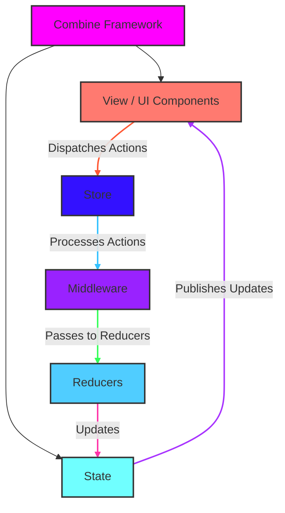

# Redux in Swift

> This content is dual-licensed under your choice of the following licenses:
> 1.  **MIT License:** For the code implementations in Swift and Mermaid provided in this document.
> 2.  **Creative Commons Attribution 4.0 International License (CC BY 4.0):** For all other content, including the text, explanations, and the Mermaid diagrams and illustrations.

---

Below is a Mermaid diagram that illustrates the Redux architecture in Swift and iOS development. This diagram visualizes the core components and their interactions, highlighting the unidirectional data flow that Redux promotes.

## Diagram Breakdown

1. **View / UI Components**
    - **Role**: Represents the SwiftUI or UIKit views that the user interacts with.
    - **Interaction**: Dispatches actions to the Store when user events occur (e.g., button taps).
2. **Store**
    - **Role**: Centralizes the application state and manages the dispatching of actions.
    - **Interaction**: Receives actions from the View, processes them through Middleware, and passes them to Reducers.
3. **Middleware**
    - **Role**: Intercepts actions dispatched to the Store, allowing for additional processing such as logging, analytics, or handling asynchronous operations.
    - **Interaction**: Processes actions before they reach the Reducers and can dispatch new actions if needed.
4. **Reducers**
    - **Role**: Pure functions that take the current state and an action to produce a new state.
    - **Interaction**: Receive actions from Middleware and update the State accordingly.
5. **State**
    - **Role**: Represents the entire state of the application.
    - **Interaction**: Updated by Reducers and published to the View components to reflect changes in the UI.
6. **Combine Framework**
    - **Role**: Handles the reactive aspects of the application, managing data streams and state updates.
    - **Interaction**: Publishes state changes to the Views and can be used within Middleware for handling asynchronous tasks.

### Unidirectional Data Flow

The diagram emphasizes the unidirectional data flow inherent in Redux:

1. **Action Dispatching**: The user interacts with the View, which dispatches an Action to the Store.
2. **Middleware Processing**: The Action flows through Middleware for any necessary preprocessing.
3. **State Transition**: The Reducers process the Action to produce a new State.
4. **State Publication**: The updated State is published back to the View, ensuring the UI reflects the latest state.
5. **Reactive Updates**: The Combine Framework facilitates reactive updates, subscribing the View to State changes.

---
**Licenses:**

- **MIT License:**   - Full text in [LICENSE](LICENSE) file.
- **Creative Commons Attribution 4.0 International:**  - Legal details in [LICENSE-CC-BY](LICENSE-CC-BY) and at [Creative Commons official site](http://creativecommons.org/licenses/by/4.0/).

---
