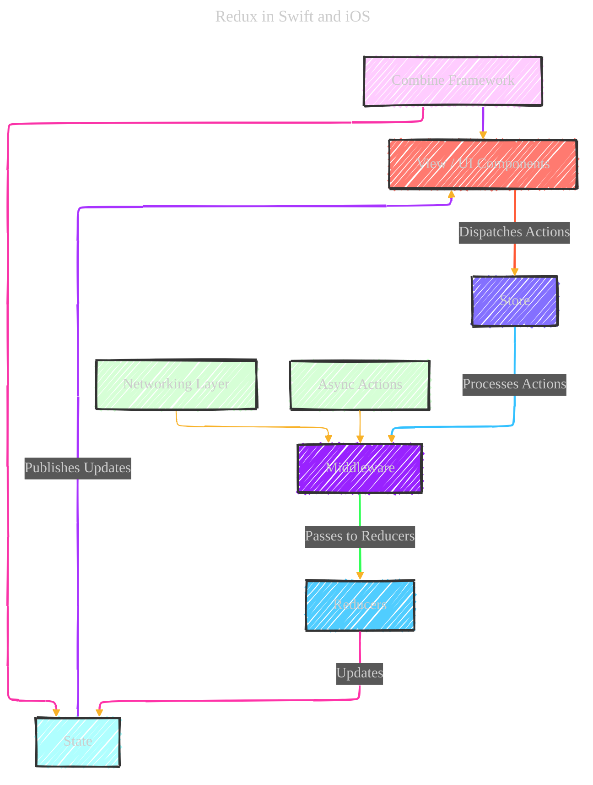

# Redux V2
> **Disclaimer:**
>
> This document contains my personal notes on the topic,
> compiled from publicly available documentation and various cited sources.
> The materials are intended for educational purposes, personal study, and reference.
> The content is dual-licensed:
> 1. **MIT License:** Applies to all code implementations (Swift, Mermaid, and other programming languages).
> 2. **Creative Commons Attribution 4.0 International License (CC BY 4.0):** Applies to all non-code content, including text, explanations, diagrams, and illustrations.
---

## Enhanced version - WIP

This is a draft enhanced version from the initial version at [here](./Redux_V1.md).

## Diagram Breakdown (Expanded)

1.  **View / UI Components**
    *   **Role:** Represents the SwiftUI or UIKit views that the user interacts with. This layer is responsible for rendering the UI and capturing user input.
    *   **Interaction:**
        *   Dispatches actions to the Store when user events occur (e.g., button taps, form submissions).
        *   Observes the State for changes and updates the UI accordingly.  Often uses `@ObservedObject` or `@State` in SwiftUI, or KVO/Delegates in UIKit.
    *   **Swift Implementation Notes:**
        *   In SwiftUI, views typically subscribe to changes in the Store via `@ObservedObject` or `@EnvironmentObject`.
        *   In UIKit, delegate patterns or key-value observing (KVO) can be used to observe state changes.
        *   Careful attention should be paid to UI thread updates to avoid performance issues.
2.  **Store**
    *   **Role:** Centralizes the application state, manages the dispatching of actions, and notifies subscribers (Views) of state changes.  Acts as the single source of truth for the application.
    *   **Interaction:**
        *   Receives actions from the View.
        *   Passes actions through Middleware.
        *   Calls the Reducer with the current state and the action.
        *   Updates the state with the result from the Reducer.
        *   Notifies subscribed Views about the state change.
    *   **Swift Implementation Notes:**
        *   The Store is typically implemented as a class with a single `state` property.
        *   The `dispatch` function is the main entry point for actions.
        *   Consider using a `CurrentValueSubject` from Combine to hold the state and publish updates. This allows for easy observation by SwiftUI views.
3.  **Middleware**
    *   **Role:** Intercepts actions dispatched to the Store, allowing for side effects such as logging, analytics, or asynchronous operations (e.g., network requests).  Provides a way to extend the core Redux functionality without modifying the Store or Reducers.
    *   **Interaction:**
        *   Receives actions from the Store.
        *   Can perform asynchronous tasks (e.g., API calls).
        *   Can dispatch new actions to the Store.
        *   Passes the action to the next Middleware or the Reducer.
    *   **Swift Implementation Notes:**
        *   Middleware is often implemented as a chain of functions that process actions sequentially.
        *   Common Middleware examples:
            *   **Thunk:** Enables dispatching functions (async actions) instead of plain actions.
            *   **Logger:** Logs actions and state changes for debugging.
            *   **Analytics:** Sends analytics events based on dispatched actions.
        *   Use `URLSession` or a third-party networking library (e.g., Alamofire) within middleware to handle API calls.
4.  **Reducers**
    *   **Role:** Pure functions that take the current state and an action as input and produce a new state.  *Crucially, they must be pure functions: they must not have side effects and must always return the same output for the same input.* This is what makes Redux state predictable.
    *   **Interaction:**
        *   Receives actions from Middleware.
        *   Uses a `switch` statement or similar logic to determine how to update the state based on the action type.
        *   Returns the new state.
    *   **Swift Implementation Notes:**
        *   Reducers should be implemented as functions, not classes.
        *   Use immutable data structures to ensure that the state is not mutated directly.  Structs are a good choice in Swift.
        *   Consider using Swift's `Codable` protocol to easily serialize and deserialize state.
5.  **State**
    *   **Role:** Represents the entire state of the application at a given point in time. It's a single, immutable data structure that holds all the data needed by the UI.
    *   **Interaction:**
        *   Updated by Reducers.
        *   Published to the View components to reflect changes in the UI.
    *   **Swift Implementation Notes:**
        *   The state should be defined as a struct or a class with immutable properties.
        *   Consider using nested structs to represent complex state.
        *   Ensure the state is serializable (e.g., conforms to `Codable`) for persistence and debugging.
6.  **Combine Framework**
    *   **Role:** Handles the reactive aspects of the application, managing data streams and state updates.  Provides a declarative way to subscribe to state changes and update the UI.
    *   **Interaction:**
        *   Publishes state changes to the Views via `CurrentValueSubject`.
        *   Can be used within Middleware for handling asynchronous tasks.
    *   **Swift Implementation Notes:**
        *   Use `CurrentValueSubject` to hold and publish the state.
        *   Views can subscribe to state changes using `.sink` or other Combine operators.
        *   Combine can be used to implement complex data transformations and filtering.
7. **Networking Layer:**
    - **Role**: Handles all network requests.
    - **Interaction**: Interacts with Middleware to fetch data asynchronously and dispatch actions upon completion.
    - **Swift Implementation Notes:**
        - Uses `URLSession` or Alamofire to make API requests.
        - Implements error handling and retries.
8. **Async Actions:**
    - **Role**: Represents actions that perform asynchronous operations.
    - **Interaction**: Dispatched from Middleware after completing async tasks.
    - **Swift Implementation Notes:**
        - Often used with Thunk middleware to handle asynchronous operations like fetching data from an API.

### Unidirectional Data Flow (Expanded)

The diagram emphasizes the unidirectional data flow inherent in Redux, making the application state predictable and easier to debug:

1.  **Action Dispatching:** The user interacts with the View, which dispatches an Action to the Store.  Actions should be small, plain Swift structs or enums that describe *what* happened, not *how* to update the state.
2.  **Middleware Processing:** The Action flows through Middleware for any necessary preprocessing. This is where side effects like logging, analytics, and asynchronous operations occur.
3.  **State Transition:** The Reducers process the Action to produce a new State.  Reducers *must* be pure functions.
4.  **State Publication:** The updated State is published back to the View, ensuring the UI reflects the latest state.  Views subscribe to state changes, typically using Combine.
5.  **Reactive Updates:** The Combine Framework facilitates reactive updates, subscribing the View to State changes.

### Best Practices for Redux in Swift and iOS

*   **Immutability:**  Always use immutable data structures for the state. This prevents accidental state mutations and makes debugging easier.
*   **Pure Reducers:** Reducers must be pure functions.  No side effects allowed!
*   **Middleware for Side Effects:**  Handle all side effects (e.g., network requests, logging) in Middleware.
*   **Combine for Reactive Updates:**  Use the Combine framework to subscribe to state changes and update the UI.
*   **Type Safety:**  Leverage Swift's type system to ensure type safety throughout the Redux cycle.  Use enums for actions and well-defined structs for state.
*   **Testing:**  Write unit tests for Reducers and Middleware to ensure they behave as expected.
*   **Consider Alternatives:** For simpler apps, consider SwiftUI's built-in state management tools (`@State`, `@ObservedObject`, `@EnvironmentObject`) before introducing Redux. Redux adds complexity, so only use it when the benefits outweigh the costs.

### Considerations for iOS Development

*   **UI Thread Updates:** Ensure that UI updates happen on the main thread to avoid performance issues. Use `DispatchQueue.main.async` when necessary.
*   **Memory Management:** Be mindful of memory management, especially when using Combine.  Use `.sink` with care, and consider using `.store(in: &cancellables)` to manage subscriptions.
*   **App Architecture:**  Redux fits well with various iOS app architectures, such as MVVM or VIPER.
*   **Debugging:** Use Xcode's debugger and Instruments to debug Redux-based apps.  Logging Middleware can also be helpful.

---

