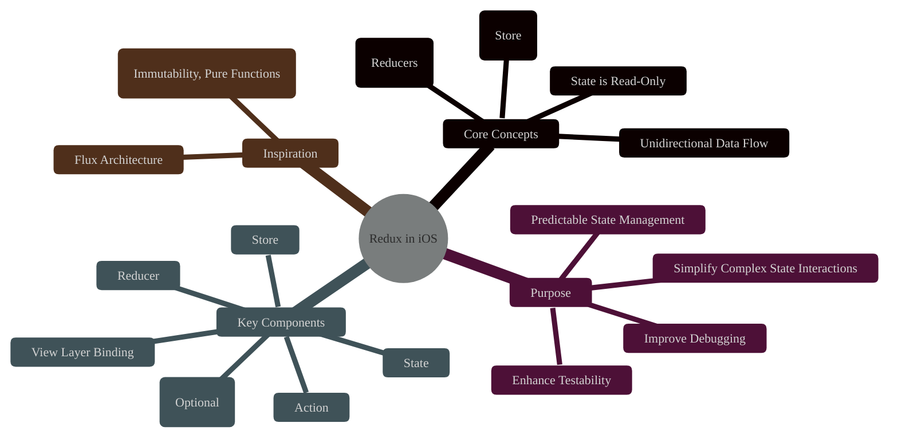
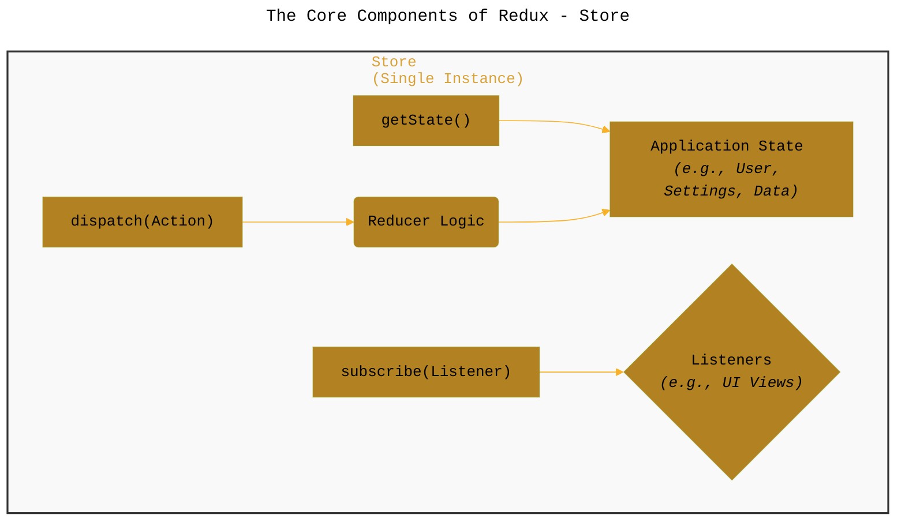
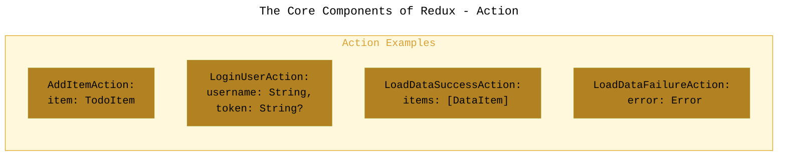
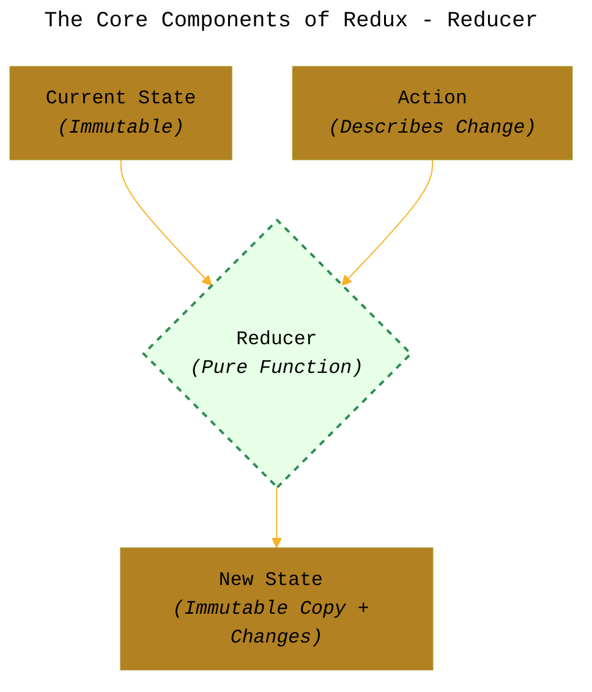
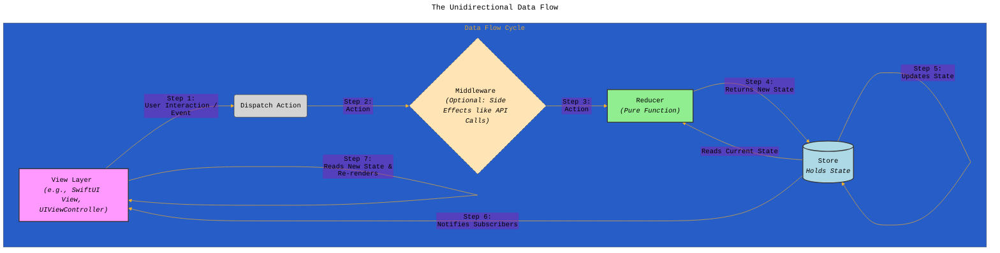
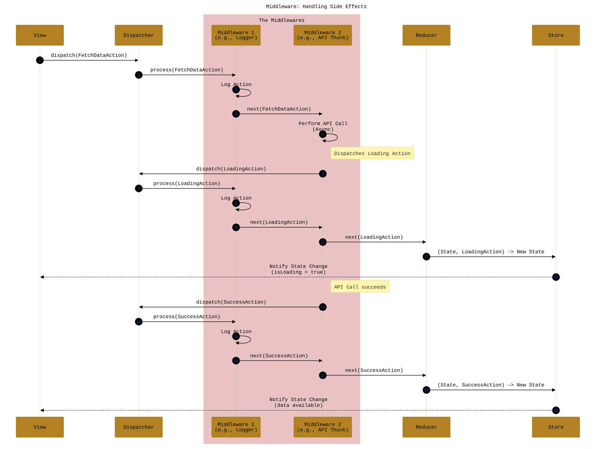
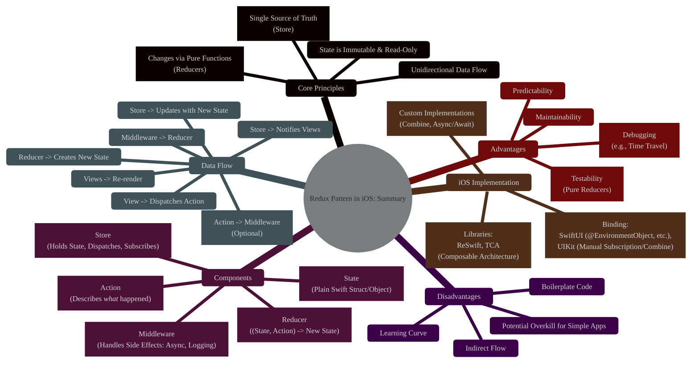

# Understanding the Redux Pattern in iOS Development
> **Disclaimer:**
>
> This document contains my personal notes on the topic,
> compiled from publicly available documentation and various cited sources.
> The materials are intended for educational purposes, personal study, and reference.
> The content is dual-licensed:
> 1. **MIT License:** Applies to all code implementations (Swift, Mermaid, and other programming languages).
> 2. **Creative Commons Attribution 4.0 International License (CC BY 4.0):** Applies to all non-code content, including text, explanations, diagrams, and illustrations.
---

## 1. Introduction: What is Redux in iOS?

Redux is a predictable state container pattern, originally popularized in the JavaScript ecosystem (specifically with React), but its core principles can be applied effectively to manage application state in iOS development. It provides a structured way to handle data flow and state changes, aiming for predictability, testability, and maintainability, especially in complex applications. The central idea is to have a single source of truth for the application state and enforce a strict unidirectional data flow.

---

## 2. The Core Components of Redux

Redux architecture revolves around a few key components that enforce its unidirectional data flow.

### a. Store

The **Store** is the central hub of the Redux architecture. It holds the entire application **State** tree within a single object. There is typically only one Store in a Redux application.

*   **Responsibilities:**
    *   Holds the application state.
    *   Allows access to the state via `getState()`.
    *   Allows state to be updated via `dispatch(action)`.
    *   Registers listeners via `subscribe(listener)`.
    *   Handles unregistering of listeners.

### b. State

The **State** is a plain data structure (like a Swift `struct`) representing the entire state of your application. It's considered the "single source of truth." Crucially, the state in Redux is **immutable**. You don't modify the state directly; instead, reducers produce a *new* state object reflecting the changes.

### c. Action

**Actions** are plain objects (often Swift `structs` or `enums` conforming to an `Action` protocol) that represent payloads of information describing *what* happened in the application. They are the *only* way to send data from the application to the Store.

*   They must have a `type` property (often implicitly defined by the struct/enum type itself in Swift implementations) that indicates the type of action being performed.
*   They can optionally contain other data (`payload`) necessary to describe the change.

### d. Reducer

**Reducers** are the workhorses that specify how the application's state changes in response to actions. A reducer is a **pure function** that takes the previous state and an action, and returns the *next* state.

*   **Signature:** `(currentState: State, action: Action) -> newState: State`
*   **Pure Function:** Given the same inputs (state and action), it always returns the same output (new state) and has no side effects (like API calls or mutating external variables).
*   **Immutability:** Reducers must not modify the `currentState` directly. They create a *new* state object with the necessary modifications.

---

## 3. The Unidirectional Data Flow

The strict unidirectional data flow is the core principle that makes Redux predictable.

1.  **Action Dispatched:** An event occurs in the UI (e.g., button tap) or a side effect completes (e.g., API response), triggering the dispatch of an Action.
2.  **Middleware (Optional):** If middleware is used, it intercepts the Action. Middleware can perform side effects (API calls, logging, analytics), modify the action, dispatch other actions, or pass the action along.
3.  **Reducer Processes Action:** The Store forwards the Action (potentially modified by middleware) to the root Reducer function.
4.  **Reducer Returns New State:** The Reducer calculates the new state based on the current state and the action.
5.  **Store Updates:** The Store saves the new state returned by the Reducer.
6.  **Listeners Notified:** The Store notifies all subscribed listeners (typically UI components) that the state has changed.
7.  **UI Re-renders:** Subscribed UI components read the latest state from the Store and re-render themselves based on the new data.

---

## 4. Middleware: Handling Side Effects

Since Reducers must be pure functions, they cannot perform side effects like network requests, database operations, or complex asynchronous logic. **Middleware** provides an extension point between dispatching an action and the moment it reaches the reducer.

*   **Purpose:** Logging, crash reporting, talking to asynchronous APIs, routing, etc.
*   **Mechanism:** Middleware functions wrap the Store's `dispatch` method. They can inspect actions, execute code (including async operations), dispatch other actions, or pass the action to the next middleware in the chain (eventually reaching the reducer).
*   **Common Examples:** Thunks (dispatching functions instead of actions for async logic), Sagas (using generators for complex async flows), logging middleware.

---

Full Swift code implementationdemo in GitHub link: [GitHub - CongLeSolutionX/MyApp at DESIGN\_PATTERNS\_Redux](https://github.com/CongLeSolutionX/MyApp/tree/DESIGN_PATTERNS_Redux)

---

## 5. Redux in Practice on iOS

Several libraries help implement Redux in Swift/iOS:

*   **RxSwift:** One of the most popular and established Redux-inspired libraries for Swift. Provides core components like `Store`, `Action`, `Reducer`, and `Middleware`.
*   **The Composable Architecture (TCA):** Developed by Point-Free, TCA is heavily inspired by Redux and the Elm architecture. It provides a powerful and opinionated framework for building applications in a functional way, handling state management, composition, testing, and side effects. While not strictly "Redux," it shares many core principles (reducers, actions, environment for effects similar to middleware).
*   **Custom Implementations:** The core Redux pattern is simple enough that developers sometimes create their own lightweight implementations using Combine or async/await for state updates and side effects.

**Binding to UI:**

*   **SwiftUI:** SwiftUI's declarative nature pairs well with Redux. Views can subscribe to changes in the Store (often via `@EnvironmentObject`, `@StateObject`, or custom property wrappers provided by libraries like TCA or ReSwift) and re-render automatically when relevant state changes. Actions are dispatched from view event handlers (like button taps).
*   **UIKit:** In UIKit, View Controllers typically subscribe to the Store upon creation (`viewDidAppear` or `viewDidLoad`) and unsubscribe on disappearance (`viewDidDisappear`). They update UI elements manually in the subscription handler based on the new state. Actions are dispatched from IBActions or other event handling methods. Combine can significantly simplify this subscription process in UIKit as well.

---

## 6. Pros and Cons

| Pros                                    | Cons                                            |
| :-------------------------------------- | :---------------------------------------------- |
| **Predictability:** Unidirectional data flow makes state changes easy to follow. | **Boilerplate:** Can require writing more code for simple actions/state changes (actions, reducer cases). |
| **Testability:** Pure reducers are trivial to unit test. Middleware and actions are also relatively isolated. | **Learning Curve:** Understanding the concepts (immutability, pure functions, middleware) takes time. |
| **Maintainability:** Clear separation of concerns makes code easier to understand and modify. | **Overhead for Simple Apps:** Can be overkill for applications with minimal shared state or simple interactions. |
| **Debugging:** Time-travel debugging (stepping back through actions/state) is possible. Explicit actions make tracing changes easier. | **Indirectness:** Logic can feel spread out (UI action -> Action struct -> Middleware -> Reducer -> State update -> UI update). |
| **Centralized State:** Easy to access any part of the state from anywhere. | **Single Store Bottleneck (Rare):** In extremely complex scenarios, performance *could* be impacted if state updates trigger widespread UI changes inefficiently (often solvable with selectors/memoization). |

----

## 7. Summary

Redux offers a robust pattern for managing application state in iOS, particularly beneficial for complex applications where predictability and testability are paramount. It enforces a unidirectional data flow using a central Store, immutable State, descriptive Actions, and pure Reducers, with Middleware handling side effects. While it introduces some boilerplate, the clarity and structure it provides can significantly improve the development and maintenance lifecycle.

---
**Licenses:**

- **MIT License:**   - Full text in [LICENSE](LICENSE) file.
- **Creative Commons Attribution 4.0 International:**  - Legal details in [LICENSE-CC-BY](LICENSE-CC-BY) and at [Creative Commons official site](http://creativecommons.org/licenses/by/4.0/).

---