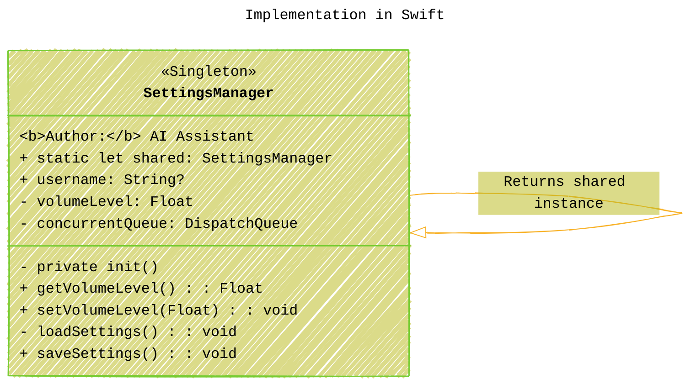

# The Singleton Pattern in iOS Development
> **Disclaimer:**
>
> This document contains my personal notes on the topic,
> compiled from publicly available documentation and various cited sources.
> The materials are intended for educational purposes, personal study, and reference.
> The content is dual-licensed:
> 1. **MIT License:** Applies to all code implementations (Swift, Mermaid, and other programming languages).
> 2. **Creative Commons Attribution 4.0 International License (CC BY 4.0):** Applies to all non-code content, including text, explanations, diagrams, and illustrations.
---


## 1. Introduction: What is a Singleton?

The Singleton pattern is one of the most well-known *creational* design patterns. Its primary intent is to **ensure that a class has only one instance** and to **provide a global point of access to that instance**. In the context of iOS development, this pattern appears frequently, both within Apple's frameworks and sometimes in application code, often used to manage shared resources or services.


---

## 2. Core Concept and Purpose

At its heart, the Singleton pattern addresses two problems simultaneously:

1.  **Guaranteed Single Instance:** It ensures that no matter how many times you try to create an instance of the Singleton class, you always get back the *exact same* object. This is crucial when dealing with resources that conceptually should only exist once, like a settings manager, a hardware interface abstraction, or the main application object.
2.  **Global Accessibility:** It provides a well-known, easily accessible point (`ClassName.shared`) from anywhere in the codebase to get hold of that single instance. This avoids the need to pass the instance around through initializers or properties across many layers of your application (though this convenience comes with significant drawbacks, discussed later).

The pattern enforces this by:
*   Making the standard initializer (`init()`) `private` or `fileprivate`, preventing external code from creating new instances directly.
*   Providing a `static` property or method (commonly named `shared` or `standard` in Apple's APIs) that returns the single, shared instance. This static member is responsible for creating the instance the first time it's accessed (often lazily) and returning that same instance on subsequent calls.

----

## 3. Implementation in Swift

Swift provides a very concise and thread-safe way to implement the Singleton pattern using a `static let` constant for the shared instance.

```swift
import Foundation // Often needed, e.g., for DispatchQueue

// Example: A Singleton class to manage app settings
final class SettingsManager {

    // 1. The static, shared instance.
    // 'let' ensures it's assigned only once.
    // Static properties are lazily initialized by default in Swift,
    // and this initialization is guaranteed to be thread-safe.
    static let shared = SettingsManager()

    // Example properties managed by the singleton
    var username: String?
    private var volumeLevel: Float = 0.5

    // Use a private queue for thread-safe access to mutable properties
    private let concurrentQueue = DispatchQueue(label: "com.yourapp.settingsManagerQueue", attributes: .concurrent)

    // 2. The private initializer prevents creating other instances.
    private init() {
        // Initialization code here, e.g., load settings from UserDefaults
        print("SettingsManager initialized.")
        loadSettings() // Example private method call
    }

    // Public methods to access or modify settings safely
    func getVolumeLevel() -> Float {
        var volume: Float = 0
        concurrentQueue.sync { // Read with sync
            volume = self.volumeLevel
        }
        return volume
    }

    func setVolumeLevel(_ level: Float) {
        concurrentQueue.async(flags: .barrier) { // Write with async barrier
            self.volumeLevel = max(0.0, min(1.0, level)) // Clamp between 0 and 1
            // Optionally save settings here
             print("Volume level set to: \(self.volumeLevel)")
            // self.saveSettings()
        }
    }

    // Example private helper methods
    private func loadSettings() {
        // Load settings from persistent storage (e.g., UserDefaults)
        self.username = UserDefaults.standard.string(forKey: "username")
        self.volumeLevel = UserDefaults.standard.float(forKey: "volumeLevel")
        if UserDefaults.standard.object(forKey: "volumeLevel") == nil { // Check if key exists
             self.volumeLevel = _5 // Default value
        }
         print("Settings loaded: Username=\(username ?? "nil"), Volume=\(volumeLevel)")
    }

    func saveSettings() {
         concurrentQueue.async(flags: .barrier) {
            UserDefaults.standard.set(self.username, forKey: "username")
            UserDefaults.standard.set(self.volumeLevel, forKey: "volumeLevel")
            print("Settings saved.")
        }
    }
}

// Usage:
// Access the single instance from anywhere
let settings = SettingsManager.shared
settings.username = "iOSDev"
settings.setVolumeLevel(0.8)
SettingsManager.shared.saveSettings() // Or call save explicitly later

let currentVolume = SettingsManager.shared.getVolumeLevel()
print("Current volume retrieved: \(currentVolume)")

// Attempting to create a new instance fails:
// let anotherSettings = SettingsManager() // Error: 'SettingsManager' initializer is inaccessible due to 'private' protection level
```

**Key Swift Implementation Details:**

*   **`static let shared = ClassName()`:** This is the modern Swift way. `static` makes it a type property, `let` ensures it's assigned only once. Swift guarantees that the initialization of lazy static properties (`let` or `var`) is performed atomically (thread-safe) the first time they are accessed. You don't need `dispatch_once` like in Objective-C.
*   **`private init()`:** Prevents creating instances from outside the class definition.
*   **`final class`:** Prevents subclassing, which could potentially break the singleton contract (e.g., a subclass overriding methods or adding its own shared instance). While not strictly required by the pattern definition, it's good practice for singletons in Swift.
*   **Thread Safety for Mutable State:** While *initialization* is thread-safe, if the Singleton holds mutable state (like `volumeLevel` or `username`), you *must* manage access to that state carefully to prevent race conditions. Using a concurrent dispatch queue with barrier flags for writes and synchronous reads (or Actors in modern Swift) is a common approach.

### Implementation Visualization




---


## 4. Common Use Cases in iOS Frameworks

Apple's own frameworks use the Singleton pattern extensively. Recognizing these helps understand where the pattern *might* be appropriate.

*   **`UIApplication.shared`:** Represents the single running application instance. Essential for accessing application-level settings and responding to events.
*   **`UserDefaults.standard`:** Provides access to the default user preferences database. A single point for storing small amounts of user data.
*   **`NotificationCenter.default`:** The default mechanism for broadcasting and receiving notifications within the application (Observer pattern).
*   **`FileManager.default`:** Provides access to the file system.
*   **`URLSession.shared`:** A pre-configured shared session for basic network requests, convenient for simple tasks.
*   **`SKPaymentQueue.default()`:** The queue for processing StoreKit payment transactions.


-----


## 5. Benefits of Using Singletons

While often criticized in modern development, the Singleton pattern does offer some advantages:

1.  **Guaranteed Single Instance:** Ensures only one object of its kind exists, preventing conflicts or inconsistent state that might arise from multiple instances managing the same resource.
2.  **Global Access:** Provides a convenient, well-known access point from anywhere in the code, simplifying access to shared services or data.
3.  **Lazy Initialization:** In Swift, using `static let` provides lazy initialization automatically. The instance is only created when it's first needed, which can save resources if the singleton isn't always used.

---

## 6. Drawbacks and Criticisms

The convenience of Singletons comes at a significant cost, leading to common criticisms:

1.  **Global State:** Singletons introduce global state into an application. Global state makes it hard to reason about the code, as dependencies are hidden and changes in one part of the app can have unexpected side effects elsewhere.
2.  **Tight Coupling:** Code that directly references `Singleton.shared` becomes tightly coupled to that specific implementation. Replacing the singleton or changing its interface becomes difficult and affects all calling code.
3.  **Testability Issues:** Singletons make unit testing significantly harder.
    *   **Difficult to Mock/Stub:** You can't easily replace the shared instance with a mock or fake version for testing purposes, as the creation logic is hardcoded.
    *   **Persistent State:** State modified in one test can leak into subsequent tests because the singleton instance persists throughout the test suite's lifetime, leading to flaky and order-dependent tests.
4.  **Concurrency Problems:** While Swift's `static let` handles initialization safely, mutable state *within* the singleton requires careful manual synchronization (queues, locks, actors) to avoid race conditions. This complexity is often overlooked.
5.  **Violates SOLID Principles:**
    *   **Single Responsibility Principle (SRP):** Singletons often end up doing too much – managing their own lifecycle *and* providing their core functionality. They also encourage unrelated objects to fetch shared state, blurring responsibility lines.
    *   **Dependency Inversion Principle (DIP):** High-level modules become dependent on the concrete low-level singleton implementation, rather than abstractions.
6.  **Hides Dependencies:** When an object uses a singleton internally, its dependency on that singleton isn't clear from its public interface (initializer or properties). This makes the object's requirements opaque.

### Benefits vs. Drawbacks Overview


---


## 7. Alternatives to Singletons

Given the drawbacks, especially regarding testability and coupling, modern iOS development often favors alternatives:

1.  **Dependency Injection (DI):** This is the most common and recommended alternative. Instead of objects reaching out to a global singleton (`SomeService.shared`), the required dependencies (`SomeService` instance) are "injected" into the object from the outside.
    *   **Constructor Injection:** Pass dependencies via the `init` method.
    *   **Property Injection:** Set dependencies via public `var` properties.
    *   **Method Injection:** Pass dependencies as arguments to specific methods.
    *   DI makes dependencies explicit, improves testability (inject mocks), and reduces coupling. Frameworks like Swinject or Resolver can help manage DI containers, but manual DI is often sufficient.

2.  **Service Locator:** A central registry where services (which might be single instances) are registered and can be requested. It's like a configurable dictionary of services. While better than hardcoded singletons, it can still hide dependencies if used improperly, acting like a "DI container used as a singleton."

3.  **Passing Instances:** For simpler cases, just create a regular instance of an object in a high-level coordinator (like the `AppDelegate` or a SceneDelegate/Coordinator object) and pass it down explicitly to the objects that need it.

4.  **SwiftUI's `@EnvironmentObject`:** In SwiftUI, this property wrapper allows you to inject shared data or services into the view hierarchy, making them available to any child view that declares it. It's a form of DI tailored for SwiftUI views.

5.  **Factory Pattern:** Use a factory to create instances. The factory *could* return the same instance each time (acting like a singleton provider), but it offers more flexibility.

### Alternatives Mind Map


---


## 8. Best Practices and When to (Carefully) Use Singletons

While generally discouraged in application-level architecture, there are rare cases where a Singleton *might* be justifiable:

*   **True Global Uniqueness:** When modeling something that is fundamentally unique and globally accessible by its nature (e.g., an abstraction over a specific hardware component, perhaps a centralized logger where dependency injection feels overly cumbersome *and* you accept the testability trade-off).
*   **Compatibility with Legacy APIs:** When interfacing with C libraries or older Objective-C APIs that rely heavily on singleton access patterns.
*   **Very Simple Apps:** In extremely small applications where the overhead of setting up DI might seem disproportionate (though establishing good habits early is still recommended).

**If you *must* use a Singleton:**

*   **Minimize Mutable State:** Prefer immutable singletons. If state must change, ensure thread safety rigorously (e.g., use Swift Actors or DispatchQueues with barriers).
*   **Keep it Focused:** Ensure the singleton adheres to the Single Responsibility Principle. Don't let it become a "god object."
*   **Consider Injecting It:** Even if you have a singleton, consider injecting it where needed rather than accessing `shared` directly everywhere. This mitigates some coupling and testability issues. `let service: MyServiceProtocol = MySingleton.shared`
*   **Define via Protocol:** Define your singleton's interface using a protocol. Code should depend on the protocol, and the singleton class implements it. This aids testability, as you can create mock implementations of the protocol.

---

## 9. Conclusion: Summary Mind Map

The Singleton pattern offers a simple way to ensure a single instance and provide global access, seen in many Apple frameworks. However, its convenience often leads to tightly coupled, hard-to-test code with hidden dependencies and potential concurrency issues due to global state. Modern iOS development strongly favors Dependency Injection and other patterns that promote testability, maintainability, and clearer architecture. Use Singletons with extreme caution and awareness of their significant drawbacks.


---
**Licenses:**

- **MIT License:**  [](LICENSE) - Full text in [LICENSE](LICENSE) file.
- **Creative Commons Attribution 4.0 International:** [](LICENSE-CC-BY) - Legal details in [LICENSE-CC-BY](LICENSE-CC-BY) and at [Creative Commons official site](http://creativecommons.org/licenses/by/4.0/).

---