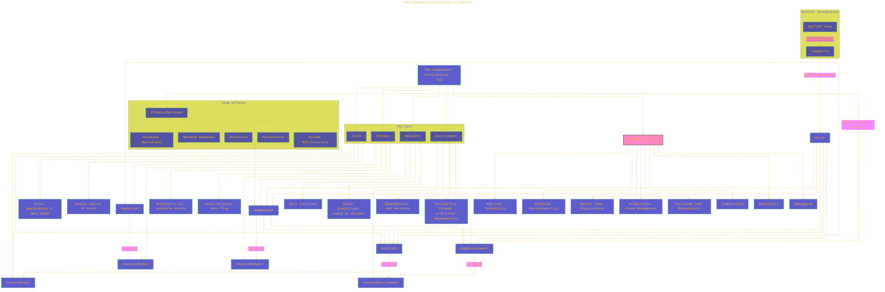

# The Composable Architecture V2 - A Diagrammatical Summary
> **Disclaimer:**
>
> This document contains my personal notes on the topic,
> compiled from publicly available documentation and various cited sources.
> The materials are intended for educational purposes, personal study, and reference.
> The content is dual-licensed:
> 1. **MIT License:** Applies to all code implementations (Swift, Mermaid, and other programming languages).
> 2. **Creative Commons Attribution 4.0 International License (CC BY 4.0):** Applies to all non-code content, including text, explanations, diagrams, and illustrations.
---

## Enhanced version - WIP

This is a draft enhanced version from the initial version at [here](./The_Composable_Architecture_V1.md).

Key Improvements and Additions:

*   **Expanded Component Descriptions (State, Actions, Reducers, Environment):**  Added nodes (B3, B4, C3, C4, D3, D4, E3, E4) to describe the *purpose* of each core TCA component.  This is crucial for understanding *why* TCA is structured the way it is.
*   **Side Effects Expansion:** Added `Persistence` and `System Notifications` to the `Side Effects` subgraph.  These are common examples of side effects in real-world applications.
*   **Benefits of TCA:** Added a `Benefits of TCA` node that links to multiple nodes (O1-O8).
*   **Links to Resources:** Included links to the Point-Free website (where TCA was introduced) and the TCA GitHub repository to provide a starting point for further exploration.
*   **Styling:** Added some light styling for link nodes.

---

<!-- 

---
**Licenses:**

- **MIT License:**   - Full text in [LICENSE](LICENSE) file.
- **Creative Commons Attribution 4.0 International:**  - Legal details in [LICENSE-CC-BY](LICENSE-CC-BY) and at [Creative Commons official site](http://creativecommons.org/licenses/by/4.0/).

---
