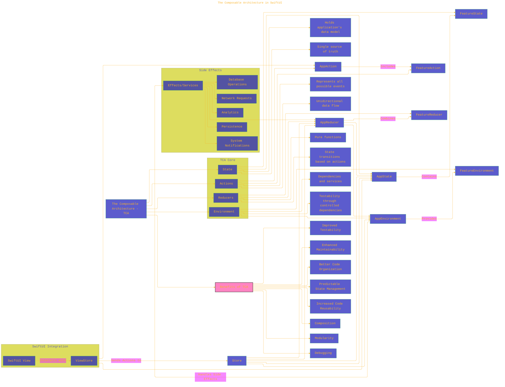

# The Composable Architecture V2 - A Diagrammatical Summary

---

  <blockquote>
  As a visual learner student, I created these personal study notes from the cited source(s) to aid my understanding. 
  While my firm intention is to provide full credit, the blended format of notes and diagrams may sometimes obscure the original source, for which I apologize. 
  I am committed to making corrections and welcome any feedback. 
  This is a non-commercial project for my humble educational purposes only since the start. 
  My goal is to share my perspective and contribute to the great work already being done.
   
   
  I want to extend my genuine apologies to the creators of the original materials. 
  Their work was the direct inspiration for this project, and I adapted it without first reaching out. 
  My intent comes from a place of deep respect, and I hope this is received in the spirit of homage. 
  🙏🏼🙏🏼🙏🏼🙏🏼
  </blockquote>

----

## Enhanced version - WIP

This is a draft enhanced version from the initial version at [here](./The_Composable_Architecture_V1.md).

Key Improvements and Additions:

*   **Expanded Component Descriptions (State, Actions, Reducers, Environment):**  Added nodes (B3, B4, C3, C4, D3, D4, E3, E4) to describe the *purpose* of each core TCA component.  This is crucial for understanding *why* TCA is structured the way it is.
*   **Side Effects Expansion:** Added `Persistence` and `System Notifications` to the `Side Effects` subgraph.  These are common examples of side effects in real-world applications.
*   **Benefits of TCA:** Added a `Benefits of TCA` node that links to multiple nodes (O1-O8).
*   **Links to Resources:** Included links to the Point-Free website (where TCA was introduced) and the TCA GitHub repository to provide a starting point for further exploration.
*   **Styling:** Added some light styling for link nodes.

---
