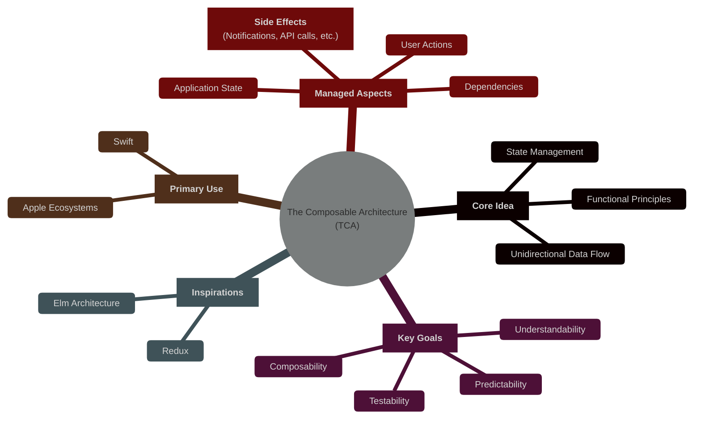
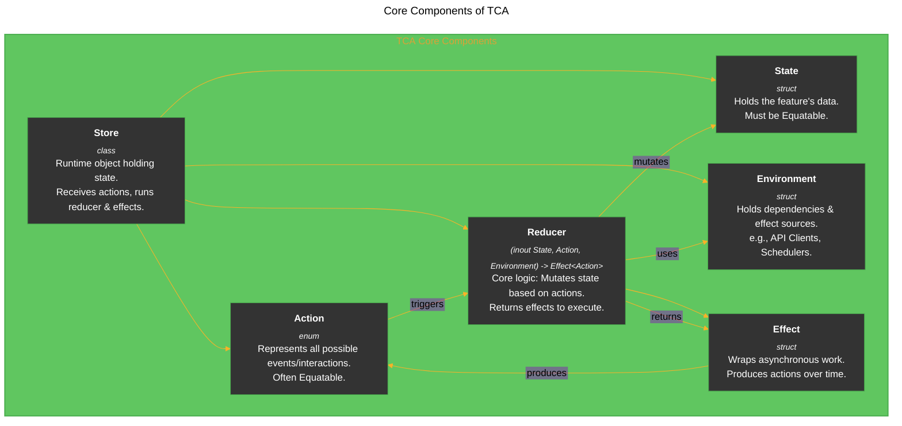
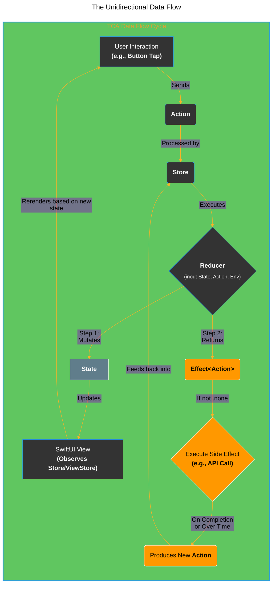
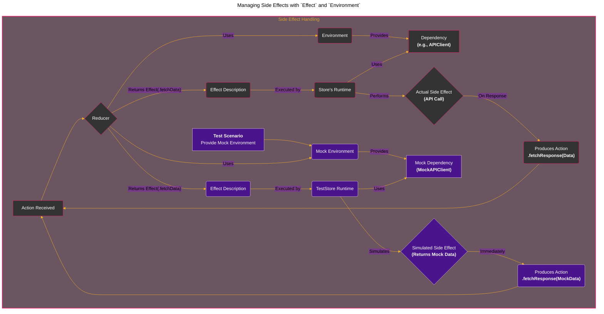
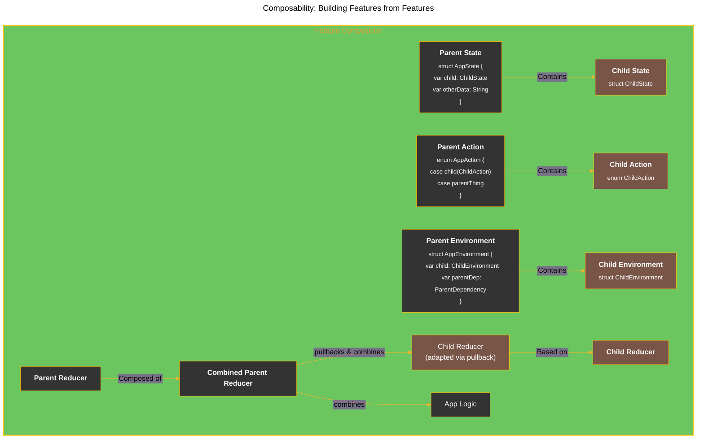
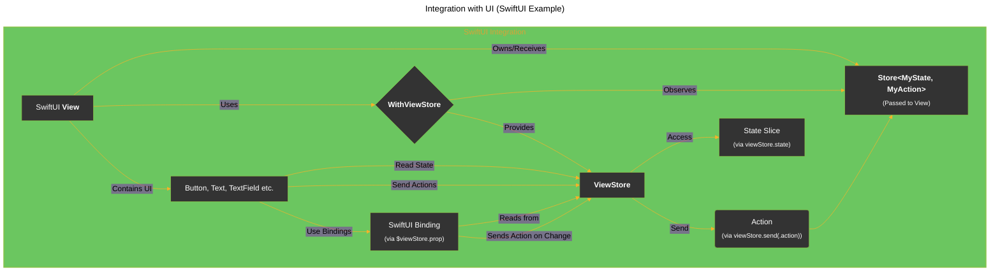
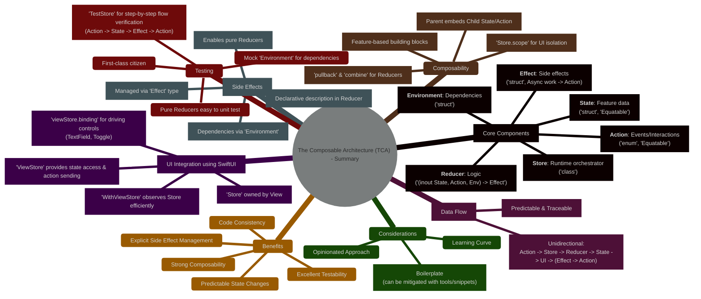

# Understanding The Composable Architecture (TCA) in iOS Development

---

  <blockquote>
  As a visual learner student, I created these personal study notes from the cited source(s) to aid my understanding. 
  While my firm intention is to provide full credit, the blended format of notes and diagrams may sometimes obscure the original source, for which I apologize. 
  I am committed to making corrections and welcome any feedback. 
  This is a non-commercial project for my humble educational purposes only since the start. 
  My goal is to share my perspective and contribute to the great work already being done.
   
   
  I want to extend my genuine apologies to the creators of the original materials. 
  Their work was the direct inspiration for this project, and I adapted it without first reaching out. 
  My intent comes from a place of deep respect, and I hope this is received in the spirit of homage. 
  🙏🏼🙏🏼🙏🏼🙏🏼
  </blockquote>

----

## 1. Introduction: What is The Composable Architecture?

The Composable Architecture (TCA), developed by Point-Free, is a library for building applications in a consistent, understandable, and testable way, primarily targeting Swift and the Apple ecosystem (iOS, macOS, watchOS, tvOS). It draws inspiration heavily from functional programming concepts, the Elm Architecture, and Redux. TCA provides a structured approach to state management, side effects, and composition, making complex applications easier to reason about and maintain.

Its core idea is to manage the state of your entire application (or a significant feature) in a single data type and handle all changes to that state through a controlled system of actions and reducers, explicitly managing side effects along the way.

***

## 2. Core Components of TCA

TCA is built around a few fundamental components that work together to manage the lifecycle of a feature.

*   **State:** A `struct` (usually) that holds all the data needed for a feature to function. It should conform to `Equatable` to allow for efficient view updates.
*   **Action:** An `enum` that represents every possible event or user interaction that can occur within the feature. This includes user taps, text field inputs, responses from network requests, timer ticks, etc. Making it `Equatable` aids testing.
*   **Environment:** A `struct` that holds all the dependencies the feature needs to perform its tasks, such as API clients, analytics SDKs, date generators, notification schedulers, etc. This is crucial for dependency injection and testability.
*   **Reducer:** A function that defines how the feature's state changes in response to actions. It takes the current `State` (as `inout`), the `Action` that occurred, and the `Environment`, and returns an `Effect` value. The reducer is responsible for all state mutations and describing any side effects that need to run.
    *   **Signature:** `(inout State, Action, Environment) -> Effect<Action>`
    *   **Key Property:** Reducers must be *pure functions* concerning state mutation. Given the same state and action, they should produce the same state modification. Side effects are described declaratively via the returned `Effect`.
*   **Effect:** A value type (`struct`) that wraps asynchronous work or side effects. Effects typically perform tasks like fetching data from an API, writing to a database, starting timers, etc. When an effect completes its work, it often sends a new `Action` back into the system. `Effect.none` indicates no side effect should be executed.
*   **Store:** An object (`class`) that brings all the other components together at runtime. It holds the current state, receives actions, runs the reducer to update the state, executes the effects returned by the reducer, and allows UI components (like SwiftUI views) to observe state changes.

***

## 3. The Unidirectional Data Flow

TCA enforces a strict unidirectional data flow, which makes application logic predictable and easier to debug.

1.  **Action Sent:** An event occurs (e.g., user taps a button, a timer fires, a network request returns). This event is represented as an `Action` and sent to the `Store`.
2.  **Reducer Executes:** The `Store` runs the `Reducer` with the current `State`, the received `Action`, and the `Environment`.
3.  **State Mutates:** The `Reducer` synchronously modifies the `State` based on the logic defined for that specific action. Since `State` is typically a value type (`struct`), this creates a new version of the state.
4.  **Effect Returned:** The `Reducer` returns an `Effect`. This could be `Effect.none` if no side effect is needed, or it could describe an asynchronous operation (like a network request).
5.  **State Update Observed:** The `Store` notifies observers (typically UI components like SwiftUI Views via a `ViewStore`) that the state has changed.
6.  **UI Updates:** The UI re-renders based on the new `State`.
7.  **Effect Executes (if any):** If the `Reducer` returned an `Effect` other than `.none`, the `Store` executes it. This happens *after* the state mutation.
8.  **Effect Produces Action:** The asynchronous `Effect` performs its work (e.g., fetches data). Upon completion (or over time, like a timer), it can send a new `Action` back into the `Store`. This restarts the cycle from Step 1.

This cycle ensures that state changes are predictable and traceable, as they only happen within the reducer in response to specific actions.

***

## 4. Managing Side Effects with `Effect` and `Environment`

Handling side effects (networking, timers, analytics, disk I/O) is a central challenge in application architecture. TCA addresses this explicitly.

*   **Problem:** Side effects are inherently impure. Calling a network fetch function directly within a state mutation logic makes it hard to test and reason about.
*   **TCA Solution:**
    *   **Declarative Effects:** Reducers don't *perform* side effects; they *describe* them by returning `Effect` values.
    *   **`Effect` Type:** `Effect` is a wrapper (often based on Combine Publishers or Swift Concurrency) that manages asynchronous operations. It's configured to produce zero or more `Action` values back into the system over time.
    *   **`Environment` for Dependencies:** The `Environment` provides the actual *implementations* of these effects (e.g., the `live` API client vs. a `mock` one). The reducer requests the effect via the environment.

This separation makes reducers pure and easy to test—you just need to verify that they return the correct `Effect` description for a given action. The execution of the effect itself is tested separately or through integration tests, often using the specialized `TestStore`.

***

## 5. Composability: Building Features from Features

TCA shines when building complex applications by composing smaller, independent features together.

*   **Feature Domains:** Each feature has its own `State`, `Action`, `Environment`, and `Reducer`.
*   **Embedding:** A parent feature can embed the state and actions of a child feature within its own `State` and `Action` types.
*   **Scoping:** The `Store` can be `scoped` to focus on the domain of a child feature, allowing child views to operate independently without knowing about the parent.
*   **Reducer Composition:** Parent reducers use higher-order reducers like `pullback` and `combine`:
    *   `reducer.pullback(state: \.childState, action: /Action.childAction, environment: { $0.childEnvironment })`: Adapts a child reducer to work on the parent's domain.
    *   `Reducer.combine(parentReducer, childReducer)`: Merges multiple reducers (including pulled-back child reducers) into a single reducer for the parent domain.

This allows building large applications like assembling Lego bricks, where each brick (feature) is self-contained and testable, and the connections (composition) are clearly defined.

***

## 6. Testing in TCA

Testability is a first-class citizen in TCA, enabled by its architecture.

*   **Pure Reducers:** Since reducers are pure functions (regarding state change), testing them involves providing input state/action/environment and asserting the output state and returned effect description.
*   **Mock Environment:** By defining dependencies in the `Environment`, tests can easily provide mock implementations (e.g., an API client that returns predefined data instantly).
*   **`TestStore`:** TCA provides a powerful `TestStore` tool specifically designed for testing the entire flow:
    1.  `store.send(.someAction)`: Simulate sending an action.
    2.  Assert State Changes: Provide a closure that modifies a mutable copy of the state to match the expected state *after* the reducer runs for that action. `TestStore` verifies the change.
    3.  `store.receive(.expectedEffectAction)`: If the action's reducer returned an effect that produces another action, assert that this action is received. Again, assert any state changes caused by this received action.
    4.  Exhaustivity: `TestStore` ensures all state changes are asserted and all effects are handled (either finished or explicitly ignored if long-living).

```mermaid
---
title: "Testing in TCA"
author: "Cong Le"
version: "1.0"
license(s): "MIT, CC BY 4.0"
copyright: "Copyright (c) 2025 Cong Le. All Rights Reserved."
config:
  theme: base
---
%%%%%%%% Mermaid version v11.4.1-b.14
%%%%%%%% Available curve styles include the following keywords:
%% basis, bumpX, bumpY, cardinal, catmullRom, linear, monotoneX, monotoneY, natural, step, stepAfter, stepBefore.
%%{
  init: {
    'flowchart': { 'htmlLabels': false, 'curve': 'basis' },
    'fontFamily': 'Helvetica',
    'themeVariables': {
      'primaryColor': '#B28122',
      'primaryTextColor': '#000',
      'primaryBorderColor': '#7C33',
      'lineColor': '#F8B229',
      'stroke':'#000',
      'stroke-width': '0.5px'
    }
  }
}%%
graph TD
    subgraph TCA_Testing_Flow_with_TestStore["TCA Testing Flow with TestStore"]
        style TCA_Testing_Flow_with_TestStore fill:#1a1a,stroke:#00BCD4,stroke-width:2px

        A["Create <b>TestStore</b><br>with initial state & mock environment"] --> B{"Send Action<br><b>store.send(.buttonTapped)</b>"}
        B --> C{"Assert State Change<br><SUB>Provide closure: state.count += 1</SUB>"}
        C -- Verification --> D{"Did Reducer return Effect?"}
        D -- "No Effect<br/>(.none)" --> E["End Test Step /<br/> Send Next Action"]
        D -- "Yes,<br/>Effect Returned" --> F{"Wait for Effect to Produce Action"}
        F --> G{"Receive Action<br><b>store.receive(.incrementResponse)</b>"}
        G --> H{"Assert State Change<br/>(if any from received action)"}
        H --> I{"Did Effect Finish?"}
        I -- Yes --> E
        I -- "No<br/>(Long-living Effect?)" --> J["Scope or Manage Effect Lifetime"]

    end

    classDef step fill:#333,stroke:#00BCD4,color:#fff,stroke-width:1px
    class A,B,C,D,E,F,G,H,I,J step
    
    classDef decision fill:#006064,stroke:#00BCD4,color:#fff,stroke-width:1px
    class D,I decision
    
```

This step-by-step testing approach makes it highly effective for verifying complex user flows and ensuring correctness, including the intricate timing of effects.

***

## 7. Integration with UI (SwiftUI Example)

TCA integrates seamlessly with SwiftUI (and UIKit, though less commonly shown).

*   **`Store` in the View:** Typically, a SwiftUI `View` owns or receives a `Store` scoped to its specific domain.
*   **`WithViewStore`:** To make the `Store`'s state observable by SwiftUI and minimize re-renders, you wrap parts of your view body in `WithViewStore { viewStore in ... }`.
*   **`ViewStore`:** `WithViewStore` provides a `ViewStore` object. It's a lightweight observer of the `Store`'s state.
    *   Accessing State: `viewStore.state` (or `viewStore.propertyName`). `ViewStore` ensures the view only re-renders when the relevant part of the state actually changes (if `Equatable`).
    *   Sending Actions: `viewStore.send(.actionName)` is used to send actions directly from UI controls (like `Button` actions).
    *   Bindings: `viewStore.binding(get:send:)` or `$viewStore.propertyName` (if using derived binding helpers) creates SwiftUI `Binding`s that read from the state and send actions on change (e.g., for `TextField`, `Toggle`).

This integration keeps views relatively simple, primarily responsible for displaying state and sending actions, while the complex logic resides in the testable reducer and effects.

***

## 8. Conclusion: Summary Mind Map

The Composable Architecture offers a powerful and opinionated way to build robust, testable, and maintainable iOS applications. By embracing functional programming principles, unidirectional data flow, and explicit effect/dependency management, it tackles common complexities in modern app development. While it introduces some learning curve, its benefits in terms of predictability, testability, and composability often outweigh the initial investment, especially for larger teams or complex projects.

---
