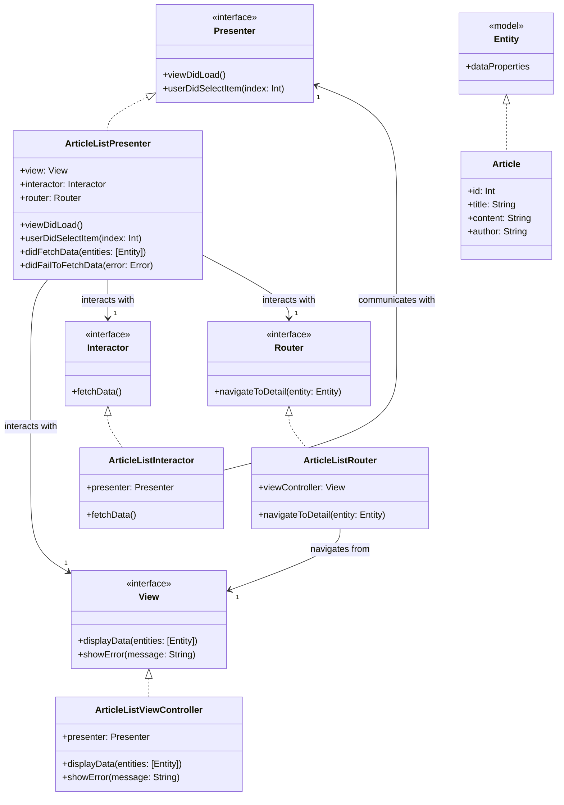

# VIPER in Swift

> This content is dual-licensed under your choice of the following licenses:
> 1.  **MIT License:** For the code implementations in Swift and Mermaid provided in this document.
> 2.  **Creative Commons Attribution 4.0 International License (CC BY 4.0):** For all other content, including the text, explanations, and the Mermaid diagrams and illustrations.

---

Below is a **Mermaid** illustration that visualizes the **VIPER** architecture as discussed in the comprehensive guide. This class diagram showcases the relationships and interactions between the primary VIPER components: **View**, **Interactor**, **Presenter**, **Entity**, and **Router**.

### Explanation of the Diagram

- **Interfaces and Models**:
    - **View**, **Presenter**, **Interactor**, and **Router** are defined as interfaces, representing the contracts each VIPER component must adhere to.
    - **Entity** is marked as a model, representing the data structures used within the application (e.g., `Article`).
- **Concrete Implementations**:
    - **ArticleListViewController** implements the **View** interface, handling UI rendering and user interactions.
    - **ArticleListPresenter** implements the **Presenter** interface, orchestrating the flow between View, Interactor, and Router.
    - **ArticleListInteractor** implements the **Interactor** interface, managing business logic and data fetching.
    - **ArticleListRouter** implements the **Router** interface, handling navigation and module transitions.
    - **Article** is a concrete implementation of the **Entity**, representing the data model for articles.
- **Relationships**:
    - **Inheritance**: Concrete classes inherit from their respective interfaces.
    - **Interactions**:
        - **Presenter** interacts with **View**, **Interactor**, and **Router**.
        - **Interactor** communicates back to the **Presenter** with fetched data or errors.
        - **Router** uses the **View** (typically a `UIViewController`) to perform navigation.

### Additional Diagram Elements

- **Multiplicity**: Indicated by `"1"`, showing that each Presenter interacts with one View, one Interactor, and one Router.
- **Interfaces and Models**: Highlighted using stereotypes `<<interface>>` and `<<model>>` for clarity.

---

## Enhancing the Diagram

You can further enhance the diagram by adding more details, such as method signatures or additional components, depending on the complexity of your application. Here's an expanded version with more interactions:

### Using the Diagram

- **Development Reference**: Use this diagram as a blueprint when structuring your VIPER modules, ensuring each component adheres to its specific role.
- **Team Communication**: Share the diagram with your development team to maintain a common understanding of the architecture, facilitating better collaboration.
- **Documentation**: Include the diagram in your project documentation to provide a visual overview of the VIPER implementation.

---