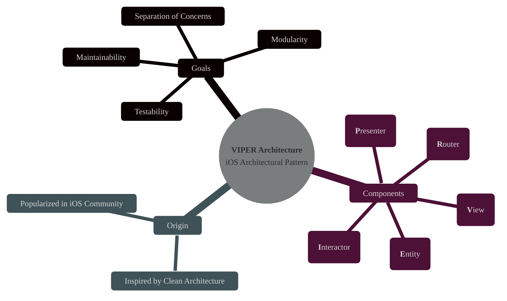
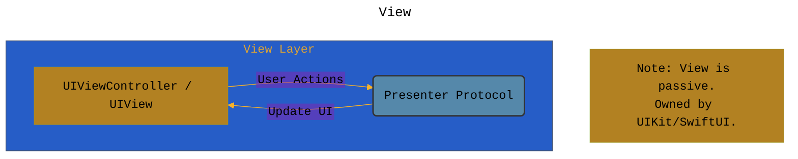
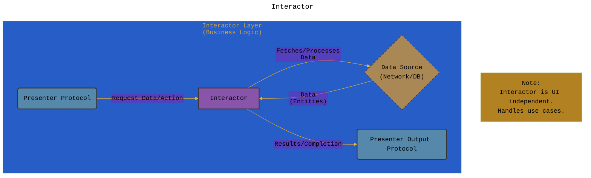
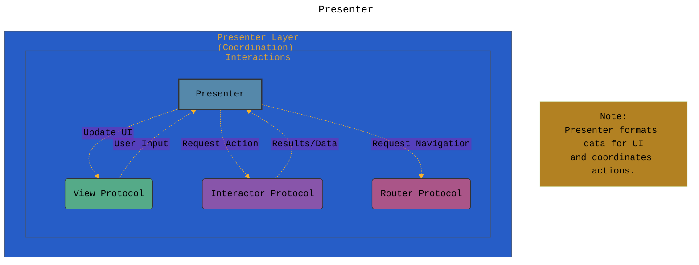
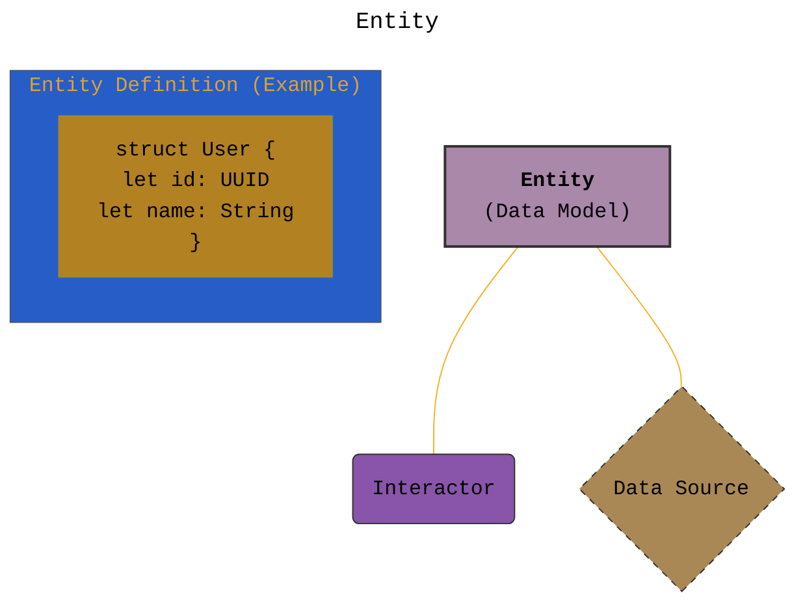
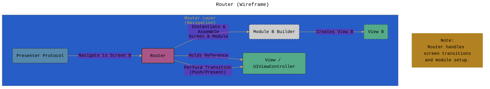
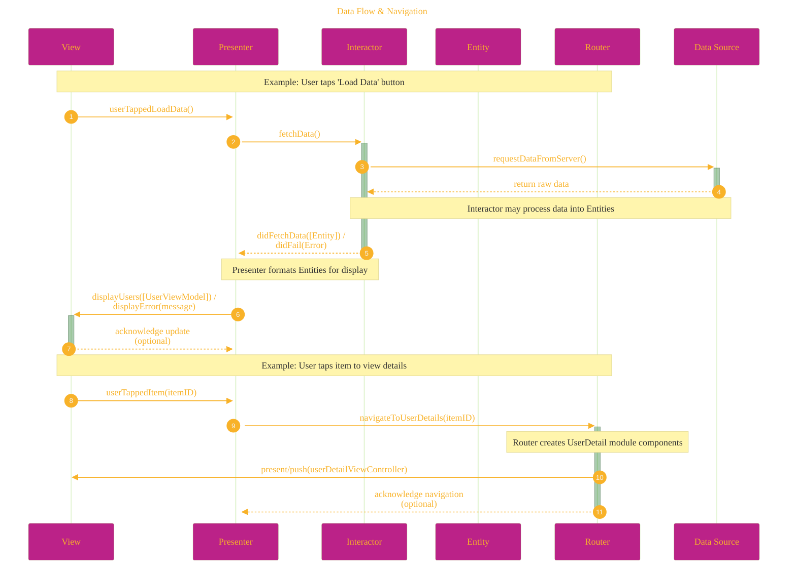
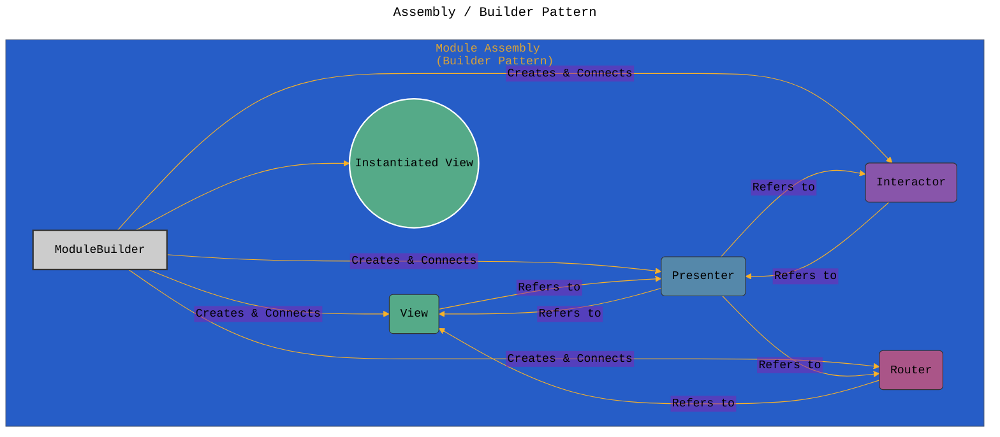
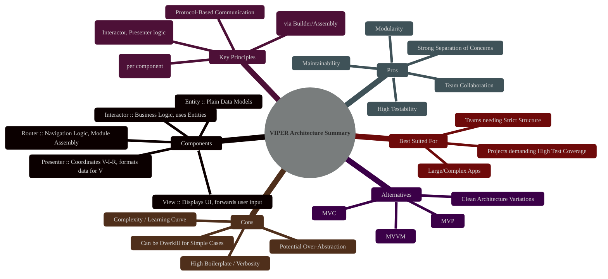
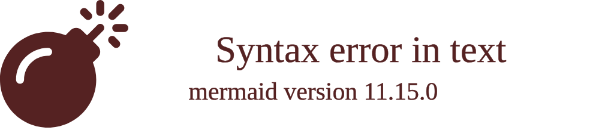

# Understanding the VIPER Architecture in iOS Development
> **Disclaimer:**
>
> This document contains my personal notes on the topic,
> compiled from publicly available documentation and various cited sources.
> The materials are intended for educational purposes, personal study, and reference.
> The content is dual-licensed:
> 1. **MIT License:** Applies to all code implementations (Swift, Mermaid, and other programming languages).
> 2. **Creative Commons Attribution 4.0 International License (CC BY 4.0):** Applies to all non-code content, including text, explanations, diagrams, and illustrations.
---

## 1. Introduction: What is VIPER?

VIPER is an architectural pattern primarily used in iOS application development, designed to enforce a strong separation of concerns and enhance testability. Its name is an acronym representing the five core components or layers it defines for a single module or screen: **View**, **Interactor**, **Presenter**, **Entity**, and **Router**.

The main goal of VIPER is to isolate each component's responsibilities, making the codebase more modular, maintainable, and easier to test, especially for complex applications or large teams. It's often considered a refinement of Clean Architecture principles applied to iOS.

---

## 2. The Core Components of VIPER

VIPER divides the responsibilities of a typical application screen (or module) into five distinct layers. Each layer has a specific role and interacts with others through well-defined interfaces (protocols in Swift).

### 2.1. View

*   **Responsibility:** Displays what the Presenter tells it to display and forwards user input/events back to the Presenter. It is typically passive and "dumb."
*   **Implementation:** Usually a `UIViewController` and its associated `UIView`s (or SwiftUI Views, though VIPER is more common with UIKit).
*   **Key Interactions:** Receives updates from the Presenter to render UI. Sends user actions (button taps, text input changes) to the Presenter.
*   **Knowledge:** Only knows about the Presenter (through a protocol). Does *not* contain any business logic or data manipulation logic.

### 2.2. Interactor

*   **Responsibility:** Contains the core business logic for a use case. It manipulates data (Entities), performs calculations, interacts with data sources (networking, database), etc.
*   **Implementation:** A plain Swift class/struct. It should be independent of any UI framework (UIKit/SwiftUI).
*   **Key Interactions:** Receives requests from the Presenter to perform tasks. Executes the business logic. Returns results (or notifies of completion/failure) back to the Presenter asynchronously.
*   **Knowledge:** Knows about Entities. Interacts with external services (e.g., Network Layer, Database Layer). Does *not* know about the View or any UI specifics. Exposes its results via a Presenter protocol.

### 2.3. Presenter

*   **Responsibility:** Acts as the central coordinator or "middle-man." It receives user input from the View, validates it (if necessary), instructs the Interactor to perform business logic, receives results from the Interactor, formats data received from the Interactor into a displayable format for the View, and tells the View what to display. It also instructs the Router when navigation is needed.
*   **Implementation:** A plain Swift class/struct. It's UI-independent but knows how to format data for the UI.
*   **Key Interactions:** Communicates with the View (via protocol) to update the UI. Communicates with the Interactor (via protocol) to trigger business logic. Communicates with the Router (via protocol) to handle navigation.
*   **Knowledge:** Knows about the View (protocol), Interactor (protocol), and Router (protocol). It references Entities indirectly through the Interactor's response but typically works with simpler, presentation-ready data structures passed to the View.

### 2.4. Entity

*   **Responsibility:** Represents the basic data models or domain objects used by the Interactor. These are typically simple data structures (structs or classes) holding information.
*   **Implementation:** Plain Swift structs or classes. They contain only data properties and possibly some simple validation logic intrinsic to the data itself. They should not contain business logic that belongs in the Interactor.
*   **Key Interactions:** Used by the Interactor for business logic. Often passed from the Data Source layer to the Interactor, and potentially from the Interactor back to the Presenter (though the Presenter might receive simpler data structures).
*   **Knowledge:** Only knows about its own data properties. Completely independent of other layers.

### 2.5. Router (Wireframe)

*   **Responsibility:** Handles navigation logic, such as presenting or pushing new screens (modules). It knows how to instantiate and assemble the components of the next VIPER module and perform the view transition.
*   **Implementation:** Usually a Swift class. It often holds a reference to the `UIViewController` (the View) to perform segues, present modally, or push onto a navigation stack.
*   **Key Interactions:** Receives navigation instructions from the Presenter. Creates and configures the next View/Module. Performs the UI transition (e.g., using `UINavigationController`, `present(_:animated:completion:)`).
*   **Knowledge:** Knows how to create and connect the components of other modules. Knows about `UIKit` or `SwiftUI` navigation APIs.

---

## 3. How Components Interact: Data Flow & Navigation

The interactions typically follow these patterns:

1.  **User Action:** View captures user input -> Sends action to Presenter.
2.  **Business Logic Request:** Presenter receives action -> Tells Interactor to perform work.
3.  **Data Processing:** Interactor performs business logic (may involve Entities and Data Sources) -> Sends results back to Presenter.
4.  **UI Update:** Presenter receives results -> Formats data -> Tells View to update UI.
5.  **Navigation Request:** Presenter decides navigation is needed -> Tells Router to navigate.
6.  **Screen Transition:** Router creates the next module -> Performs the view transition using the current View's context.

----

## 4. Assembly / Builder Pattern

Because the components are decoupled, something needs to be responsible for creating and connecting them (dependency injection). This is often handled by a dedicated "Builder" or "Assembler" object associated with the module. The Router typically initiates the building process when navigating to a new module.

---

## 5. Advantages of VIPER

*   **High Testability:** Each component (especially Interactor and Presenter) can be tested in isolation easily because dependencies are injected via protocols. Business logic and presentation logic are separate from UI concerns.
*   **Strong Separation of Concerns:** Each component has a single, well-defined responsibility (aligns with SOLID principles).
*   **Modularity:** Modules are self-contained units, making them easier to manage and potentially reuse (though full reusability can be complex).
*   **Maintainability:** Clear structure makes it easier for developers to understand where specific logic resides, reducing bugs and simplifying modifications.
*   **Team Collaboration:** Different team members can work on different layers (View, Interactor, etc.) simultaneously with fewer merge conflicts.

----

## 6. Disadvantages of VIPER

*   **Increased Boilerplate:** Requires creating many files (protocols, classes) even for simple screens, leading to a perception of high upfront complexity and development time.
*   **Complexity:** Can be overkill for simple applications or screens. The conceptual overhead for new team members can be significant.
*   **Potential for Over-Abstraction:** Defining protocols and strict boundaries for everything can sometimes feel cumbersome.
*   **Module Communication:** Inter-module communication (passing data back from a presented screen) requires careful design, often involving delegate patterns or closures managed by the Router/Presenter层.

----

## 7. Comparison with Other Patterns (Briefly)

*   **vs. MVC (Model-View-Controller):** VIPER provides much stricter separation. In MVC, the Controller often becomes a "Massive View Controller" handling too many responsibilities (view logic, business logic, navigation), which VIPER explicitly avoids.
*   **vs. MVVM (Model-View-ViewModel):** MVVM separates View and ViewModel (presentation logic + data), often using data binding. VIPER further separates business logic (Interactor) and navigation logic (Router) from the presentation logic (Presenter). VIPER generally involves more explicit communication paths than MVVM's binding mechanisms.

----

## 8. Conclusion: When to Use VIPER?

VIPER is a powerful pattern that excels in **large, complex iOS applications** where **testability, maintainability, and clear separation of concerns are paramount**. It's particularly beneficial for teams where structure and explicit responsibilities help manage complexity.

However, for smaller projects or simpler screens, the overhead and boilerplate code associated with VIPER might outweigh its benefits. In such cases, simpler patterns like MVC or MVVM might be more pragmatic choices. The decision depends on project scale, team expertise, and specific requirements.

---

<!-- 

---
**Licenses:**

- **MIT License:**   - Full text in [LICENSE](LICENSE) file.
- **Creative Commons Attribution 4.0 International:**  - Legal details in [LICENSE-CC-BY](LICENSE-CC-BY) and at [Creative Commons official site](http://creativecommons.org/licenses/by/4.0/).

---
