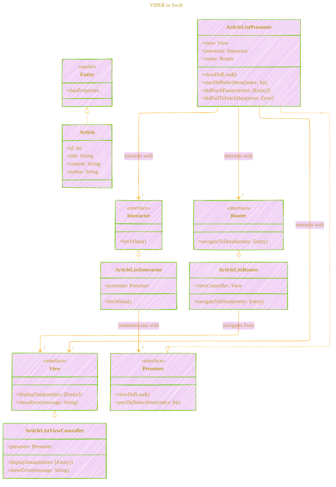
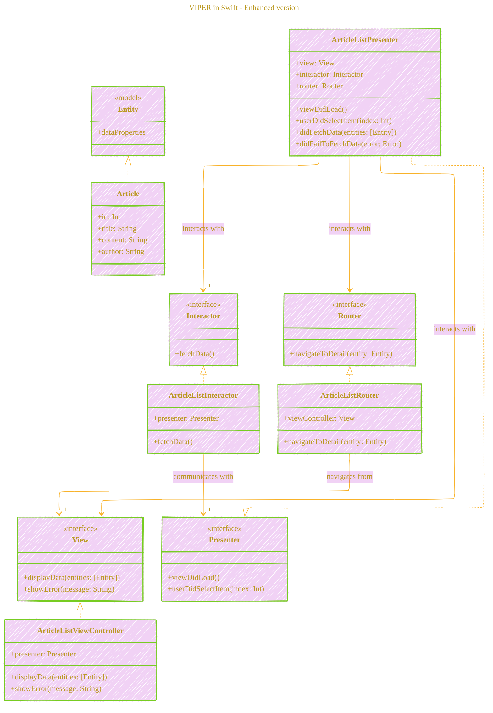

# VIPER in Swift

---

  <blockquote>
  As a visual learner student, I created these personal study notes from the cited source(s) to aid my understanding. 
  While my firm intention is to provide full credit, the blended format of notes and diagrams may sometimes obscure the original source, for which I apologize. 
  I am committed to making corrections and welcome any feedback. 
  This is a non-commercial project for my humble educational purposes only since the start. 
  My goal is to share my perspective and contribute to the great work already being done.
   
   
  I want to extend my genuine apologies to the creators of the original material. 
  Their work was the direct inspiration for this project, and I adapted it without first reaching out. 
  My intent comes from a place of deep respect, and I hope this is received in the spirit of homage. 
  🙏🏼🙏🏼🙏🏼🙏🏼
  </blockquote>

----

Below is a **Mermaid** illustration that visualizes the **VIPER** architecture as discussed in the comprehensive guide. This class diagram showcases the relationships and interactions between the primary VIPER components: **View**, **Interactor**, **Presenter**, **Entity**, and **Router**.

### Explanation of the Diagram

- **Interfaces and Models**:
    - **View**, **Presenter**, **Interactor**, and **Router** are defined as interfaces, representing the contracts each VIPER component must adhere to.
    - **Entity** is marked as a model, representing the data structures used within the application (e.g., `Article`).
- **Concrete Implementations**:
    - **ArticleListViewController** implements the **View** interface, handling UI rendering and user interactions.
    - **ArticleListPresenter** implements the **Presenter** interface, orchestrating the flow between View, Interactor, and Router.
    - **ArticleListInteractor** implements the **Interactor** interface, managing business logic and data fetching.
    - **ArticleListRouter** implements the **Router** interface, handling navigation and module transitions.
    - **Article** is a concrete implementation of the **Entity**, representing the data model for articles.
- **Relationships**:
    - **Inheritance**: Concrete classes inherit from their respective interfaces.
    - **Interactions**:
        - **Presenter** interacts with **View**, **Interactor**, and **Router**.
        - **Interactor** communicates back to the **Presenter** with fetched data or errors.
        - **Router** uses the **View** (typically a `UIViewController`) to perform navigation.

### Additional Diagram Elements

- **Multiplicity**: Indicated by `"1"`, showing that each Presenter interacts with one View, one Interactor, and one Router.
- **Interfaces and Models**: Highlighted using stereotypes `<<interface>>` and `<<model>>` for clarity.

---

## Enhancing the Diagram

You can further enhance the diagram by adding more details, such as method signatures or additional components, depending on the complexity of your application. Here's an expanded version with more interactions:

### Using the Diagram

- **Development Reference**: Use this diagram as a blueprint when structuring your VIPER modules, ensuring each component adheres to its specific role.
- **Team Communication**: Share the diagram with your development team to maintain a common understanding of the architecture, facilitating better collaboration.
- **Documentation**: Include the diagram in your project documentation to provide a visual overview of the VIPER implementation.

---
