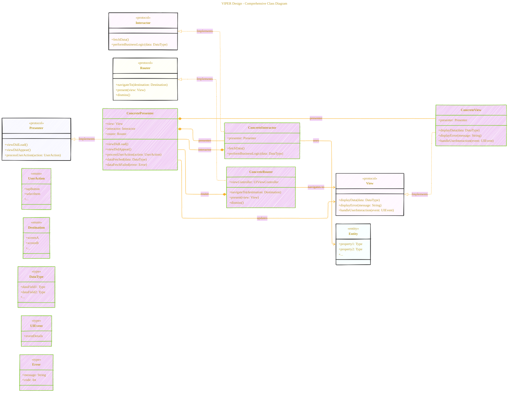

# VIPER - A Diagrammatical Summary
> **Disclaimer:**
>
> This document contains my personal notes on the topic,
> compiled from publicly available documentation and various cited sources.
> The materials are intended for educational purposes, personal study, and reference.
> The content is dual-licensed:
> 1. **MIT License:** Applies to all code implementations (Swift, Mermaid, and other programming languages).
> 2. **Creative Commons Attribution 4.0 International License (CC BY 4.0):** Applies to all non-code content, including text, explanations, diagrams, and illustrations.
---


## Enhanced version - WIP

This is a draft enhanced version from the initial version at [here](./VIPER_V1.md).





Key improvements and explanations:

*   **Direction**:  `direction LR` sets the layout to left-to-right, improving readability.
*   **Protocols**:  Clear `<<protocol>>` stereotypes for View, Presenter, Interactor, and Router to emphasize their interface nature.
*   **Concrete Implementations**:  Includes concrete classes (`ConcreteView`, `ConcretePresenter`, etc.) to show how the protocols are implemented.
*   **Relationships**: Explicit relationships between components using `--*` (composition), `-->` (dependency), and `<|..` (implementation).
*   **Enums & Types**: Introduces `UserAction`, `Destination`, `DataType`, `UIEvent` and `Error` as enums and types to represent possible user interactions, navigation destinations, data structures and event data and errors, respectively.
*   **Annotations**:  `link` directives add descriptive text to the diagram, explaining the responsibilities of each component.  These appear as tooltips when hovering over the elements in supporting Mermaid editors.
*   **Styling**: Added custom `style` directives to color-code the components, making the diagram more visually appealing and easier to understand.
*   **Error Handling**:  Explicit `displayError` in `View` and `dataFetchFailed` in `Presenter` to represent error handling.
*   **User Interaction**: Added `handleUserInteraction` to the `View` to show that it handles user events.
*   **Lifecycle Methods**: Includes common lifecycle methods like `viewDidLoad` and `viewDidAppear` in the `Presenter`.
*   **Comprehensive Structure**: The diagram now offers a more complete picture of the VIPER architecture, including the interfaces, concrete classes, relationships, and data flow.

----


## Deep Dive into VIPER Components

1.  **View (ArticleListViewController)**
    *   **Responsibilities**: The View is responsible for displaying data to the user and forwarding user actions to the Presenter. It should be as passive as possible, with minimal logic.
    *   **Details**:
        *   **UI Rendering**: Uses UIKit or SwiftUI to display information. The `displayData(entities:)` method updates the UI with the provided entities.
        *   **User Interaction**: Captures user events (e.g., tapping a cell) and notifies the Presenter.
        *   **Lifecycle**: Manages the lifecycle of UI elements, handling view loading, appearing, and disappearing.
    *   **Implementation Notes**:
        *   Keep UI logic separate from data formatting. The View shouldn't perform data transformations.
        *   Use outlets for UI elements and actions for user interactions.
        *   Consider using collection views or table views for displaying lists of data.
2.  **Presenter (ArticleListPresenter)**
    *   **Responsibilities**: The Presenter acts as a mediator between the View and the Interactor. It receives user actions from the View, requests data from the Interactor, and formats the data for display in the View.
    *   **Details**:
        *   **Receiving User Actions**: Handles events like `viewDidLoad()` or `userDidSelectItem(index:)`.
        *   **Requesting Data**: Calls the Interactor to fetch data via `fetchData()`.
        *   **Formatting Data**: Transforms data from the Interactor into a format suitable for the View.
        *   **Updating View**: Calls methods on the View to update the UI.
        *   **Error Handling**: Handles errors from the Interactor and displays error messages in the View.
    *   **Implementation Notes**:
        *   Avoid UI-related code in the Presenter. It should only deal with data formatting and logic.
        *   Use protocols to define the interface between the Presenter and the View, allowing for easier testing.
3.  **Interactor (ArticleListInteractor)**
    *   **Responsibilities**: The Interactor contains the business logic of the module. It fetches data from data sources (e.g., local database, network API), performs any necessary transformations, and provides the data to the Presenter.
    *   **Details**:
        *   **Data Fetching**: Retrieves data from data sources, potentially using services or repositories.
        *   **Business Logic**: Applies business rules and performs data transformations.
        *   **Data Caching**: Can implement caching strategies to improve performance.
    *   **Implementation Notes**:
        *   Keep the Interactor focused on business logic and data fetching, avoiding UI-related code.
        *   Use dependency injection to provide data sources to the Interactor, making it easier to test.
        *   Handle errors and pass them back to the Presenter for display.
4.  **Entity (Article)**
    *   **Responsibilities**: The Entity represents the data model used within the application. It's a simple data structure with properties.
    *   **Details**:
        *   **Data Storage**: Holds the data for a specific object (e.g., an article).
        *   **Data Integrity**: May contain validation logic to ensure data integrity.
    *   **Implementation Notes**:
        *   Keep Entities simple and focused on data storage.
        *   Use value types (structs) for Entities to ensure immutability.
        *   Consider using Codable for easy serialization and deserialization.
5.  **Router (ArticleListRouter)**
    *   **Responsibilities**: The Router handles navigation between modules. It's responsible for creating and presenting new ViewControllers.
    *   **Details**:
        *   **Module Transitions**: Manages transitions between different parts of the application.
        *   **Dependency Injection**: Creates and injects dependencies into new modules.
    *   **Implementation Notes**:
        *   Use a navigation controller to manage the navigation stack.
        *   Consider using segues or manual presentation for transitioning between ViewControllers.
        *   Keep the Router focused on navigation, avoiding business logic.

### VIPER Workflow

1.  **User Action**: The user interacts with the View (e.g., taps a cell).
2.  **Presenter Notification**: The View notifies the Presenter about the user action.
3.  **Interactor Request**: The Presenter asks the Interactor for data.
4.  **Data Fetching**: The Interactor fetches data from a data source.
5.  **Data Transformation**: The Interactor transforms the data if needed.
6.  **Presenter Update**: The Interactor provides the data to the Presenter.
7.  **View Update**: The Presenter formats the data and updates the View.
8.  **Navigation (if needed)**: The Presenter asks the Router to navigate to another module.

### Benefits of VIPER

*   **Testability**: Each component is easily testable in isolation.
*   **Maintainability**: Clear separation of concerns makes it easier to maintain and modify the code.
*   **Reusability**: Components can be reused in different parts of the application.
*   **Scalability**: The modular structure makes it easier to scale the application.

### Challenges of VIPER

*   **Complexity**: VIPER can be more complex than simpler architectures like MVC or MVVM.
*   **Boilerplate Code**: It requires more code to set up each module.
*   **Learning Curve**: Developers need to understand the roles and responsibilities of each component.

### Practical Implementation Tips

*   **Start Small**: Begin by implementing VIPER in a small part of the application and gradually expand it.
*   **Use Protocols**: Define protocols for communication between components.
*   **Dependency Injection**: Use dependency injection to provide dependencies to components.
*   **Testing**: Write unit tests for each component to ensure they work correctly.

### Example Code Snippets (Illustrative)

```swift
// View (ArticleListViewController)
protocol ArticleListViewProtocol: AnyObject {
    func displayData(articles: [Article])
    func showError(message: String)
}

class ArticleListViewController: UIViewController, ArticleListViewProtocol {
    var presenter: ArticleListPresenterProtocol!

    func displayData(articles: [Article]) {
        // Update UI with articles
    }

    func showError(message: String) {
        // Show error message
    }

    override func viewDidLoad() {
        super.viewDidLoad()
        presenter.viewDidLoad()
    }
}

// Presenter (ArticleListPresenter)
protocol ArticleListPresenterProtocol: AnyObject {
    func viewDidLoad()
    func didSelectArticle(at index: Int)
}

class ArticleListPresenter: ArticleListPresenterProtocol {
    weak var view: ArticleListViewProtocol?
    var interactor: ArticleListInteractorProtocol!
    var router: ArticleListRouterProtocol!

    func viewDidLoad() {
        interactor.fetchArticles()
    }

    func didSelectArticle(at index: Int) {
        // Handle selection logic and navigation
    }
}

// Interactor (ArticleListInteractor)
protocol ArticleListInteractorProtocol: AnyObject {
    func fetchArticles()
}

class ArticleListInteractor: ArticleListInteractorProtocol {
    weak var presenter: ArticleListPresenter?

    func fetchArticles() {
        // Fetch articles from data source
        // Notify presenter with results
    }
}

// Router (ArticleListRouter)
protocol ArticleListRouterProtocol: AnyObject {
    func navigateToArticleDetail(article: Article)
}

class ArticleListRouter: ArticleListRouterProtocol {
    weak var viewController: UIViewController?

    func navigateToArticleDetail(article: Article) {
        // Navigate to article detail view
    }
}

// Entity (Article)
struct Article {
    let id: Int
    let title: String
    let content: String
}
```


---
**Licenses:**

- **MIT License:**  [](LICENSE) - Full text in [LICENSE](LICENSE) file.
- **Creative Commons Attribution 4.0 International:** [](LICENSE-CC-BY) - Legal details in [LICENSE-CC-BY](LICENSE-CC-BY) and at [Creative Commons official site](http://creativecommons.org/licenses/by/4.0/).

---
