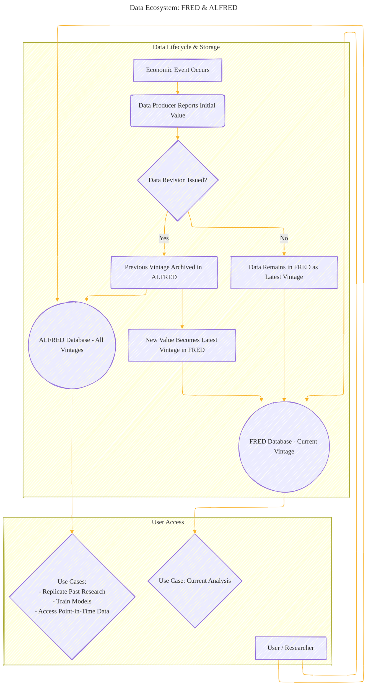
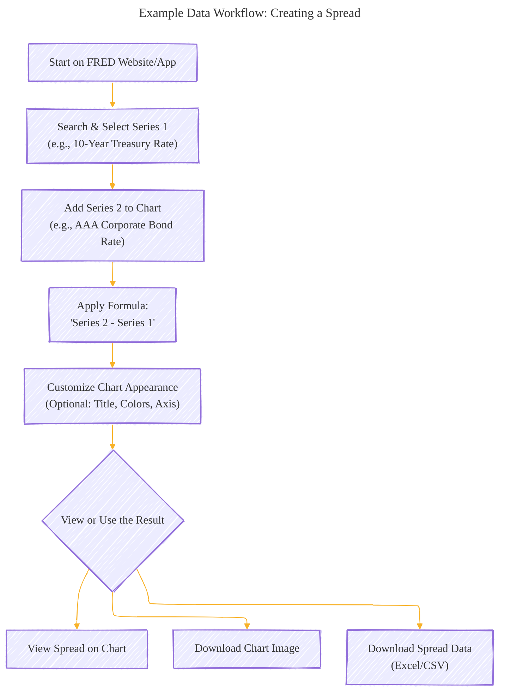
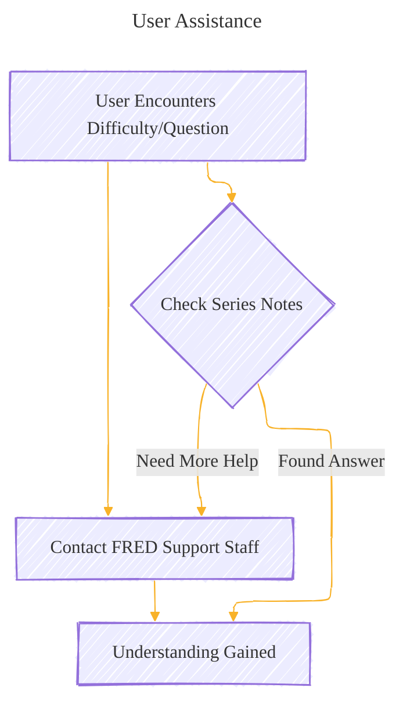

# What is FRED - A Diagrammatic Guide 
> **Disclaimer:**
>
> This document contains my personal notes on the topic,
> compiled from publicly available documentation and various cited sources.
> The materials are intended for educational purposes, personal study, and reference.
> The content is dual-licensed:
> 1. **MIT License:** Applies to all code implementations (Swift, Mermaid, and other programming languages).
> 2. **Creative Commons Attribution 4.0 International License (CC BY 4.0):** Applies to all non-code content, including text, explanations, diagrams, and illustrations.
---

### 1. FRED: Core Concept

This mind map provides a high-level overview of what FRED is, encompassing its data, tools, and purpose.

---

### 2. FRED History & Evolution

This Gantt chart illustrates the key milestones in FRED's development history.

---

### 3. Data Ecosystem: FRED & ALFRED

This flowchart explains the relationship between current data (FRED) and historical revisions (ALFRED).

---

### 4. Data Access Methods

This mind map shows the various ways users can access FRED data.

----

### 5. FRED Website: Browsing Structure

This flowchart details the different ways a user can browse data on the FRED website.

---

### 6. FRED Tools for Data Interaction

This mind map outlines the key tools available within FRED for working with the data.

----

### 7. Example Data Workflow: Creating a Spread

This flowchart illustrates a typical workflow for creating a custom series like a yield spread using FRED tools.

---

### 8. User Assistance

A simple flowchart showing the help resources available.

---
**Licenses:**

- **MIT License:**   - Full text in [LICENSE](LICENSE) file.
- **Creative Commons Attribution 4.0 International:**  - Legal details in [LICENSE-CC-BY](LICENSE-CC-BY) and at [Creative Commons official site](http://creativecommons.org/licenses/by/4.0/).

---