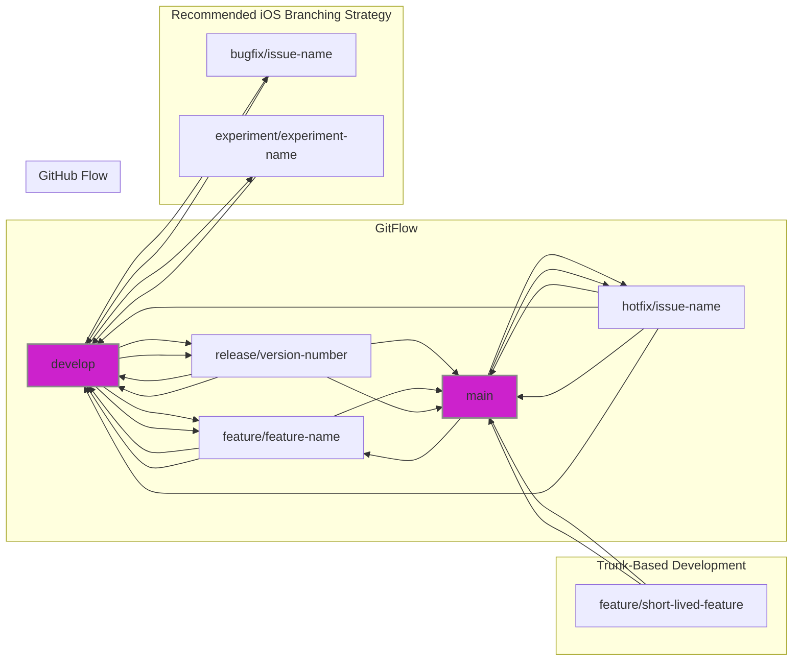
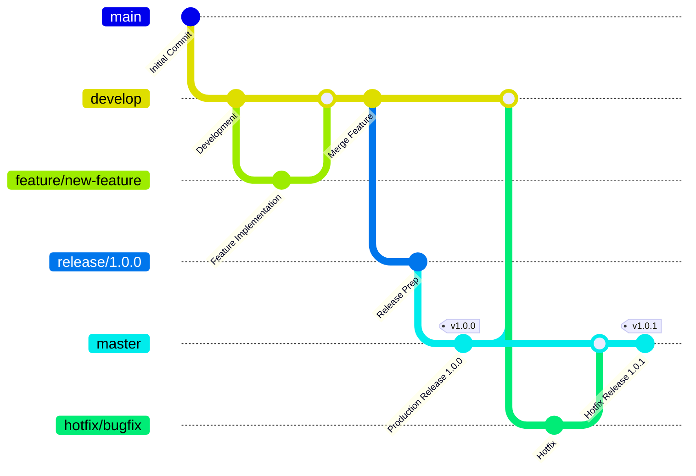
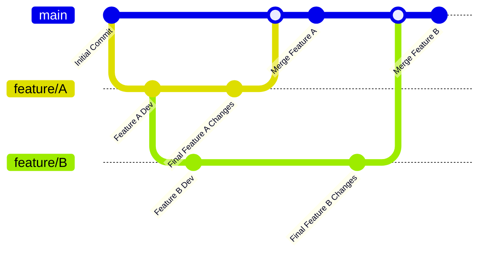
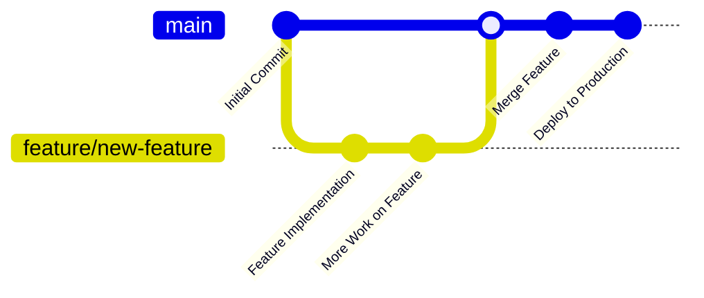

# Git Branching Strategies

---

  <blockquote>
  As a visual learner student, I created these personal study notes from the cited source(s) to aid my understanding. 
  While my firm intention is to provide full credit, the blended format of notes and diagrams may sometimes obscure the original source, for which I apologize. 
  I am committed to making corrections and welcome any feedback. 
  This is a non-commercial project for my humble educational purposes only since the start. 
  My goal is to share my perspective and contribute to the great work already being done.
   
   
  I want to extend my genuine apologies to the creators of the original material. 
  Their work was the direct inspiration for this project, and I adapted it without first reaching out. 
  My intent comes from a place of deep respect, and I hope this is received in the spirit of homage. 
  🙏🏼🙏🏼🙏🏼🙏🏼
  </blockquote>

----

# Overview

**Explanation and Details by Diagram:**

* **GitFlow:** This diagram depicts the core branches (main, develop) and supporting branches (feature, release, hotfix). Notice how features merge into `develop`, releases branch from `develop` and merge into both `main` and `develop`, and hotfixes branch from `main` and merge into both `main` and `develop`. This visualization clarifies the flow of changes in a more complex project.

* **GitHub Flow:**  Simplicity is key here.  Feature branches emerge from `main` and merge directly back into `main` after review. This model is visually streamlined, reflecting its focus on continuous delivery.

* **Trunk-Based Development:** This showcases the central role of the `main` (or sometimes called `trunk`) branch.  Short-lived feature branches or the concept of feature toggles are represented, emphasizing frequent integration directly into the main branch.

* **Recommended iOS Branching Strategy:**  This diagram builds upon GitFlow but incorporates additional branch types important in an iOS context – `bugfix` and `experiment`. Like GitFlow, features merge into develop, releases are branched from develop and merged back to both main and develop, and hotfixes branch from main and merge back into both main and develop. However, we now see bugfix branches addressing non-critical bugs handled on develop and experimental branches branching off of develop for specific testing and exploration before potentially becoming features.  This adds granularity and reflects a practical approach to common iOS development scenarios.

**Key improvements and added details to this Mermaid code:**

* **Clear Branch Labeling:** Each branch type (feature, release, hotfix, bugfix, experiment) now has distinct styling, improving readability and making it easier to follow the flow.
* **Explicit Branch Names:** Instead of generic names, the diagrams use examples like `feature/feature-name`, making the purpose of each branch clearer.
* **Distinct Visual Styles:**  The styling emphasizes the importance of the `main` and `develop` branches, helping to understand their central role within each model.
* **Comprehensive Representation:** The iOS-specific model now includes all relevant branch types discussed, including `bugfix` and `experiment`, providing a complete visual reference.

---

## 1. Git Flow

**Concept:** A robust strategy with dedicated branches for development, features, releases, and hotfixes.

**Explanation:**

- **master:** Represents the production-ready codebase. Only merge thoroughly tested code here.
- **develop:** The main development branch. Integrate completed features here.
- **feature branches:** Created from `develop` for each new feature or task.
- **release branches:** Branched from `develop` to prepare for a release.
- **hotfix branches:** Branched from `master` for urgent bug fixes in production.

**Pros:**

- Well-structured for larger teams and projects.
- Clear separation of concerns for different stages of development.

**Cons:**

- Can be overly complex for smaller projects.
- Frequent merging can lead to conflicts.

## 2. Feature Branch Workflow

**Concept:**  A simplified approach where all development happens on feature branches and merges directly into `main`.

**Explanation:**

- **main:** Represents the main development and (often) production branch.
- **feature branches:** Created for each new feature or bug fix.

**Pros:**

- Simple and easy to understand.
- Well-suited for smaller teams and projects.

**Cons:**

- Can become less organized for larger projects.
- Less strict about separating development and production code.

## 3. GitHub Flow

**Concept:** A streamlined workflow designed for continuous delivery and frequent deployments.

**Explanation:**

- **main:** The always deployable branch representing the production code.
- **feature branches:** Short-lived branches for individual features or bug fixes.

**Pros:**

- Encourages frequent deployments and continuous integration.
- Simple and efficient for small teams and web applications.

**Cons:**

- May not be suitable for projects with infrequent releases or complex release processes.

## Important Considerations:

- **Choose the Right Strategy:** The best strategy depends on your team size, project complexity, and release cycle.
- **Testing:** Implement thorough testing at each stage (feature branches, before merging, before deployment) regardless of the strategy.
- **Communication:** Clear communication between team members about branch usage and deployment plans is crucial.

----
