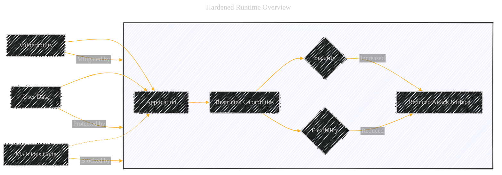
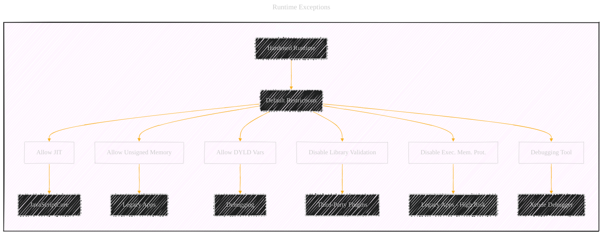
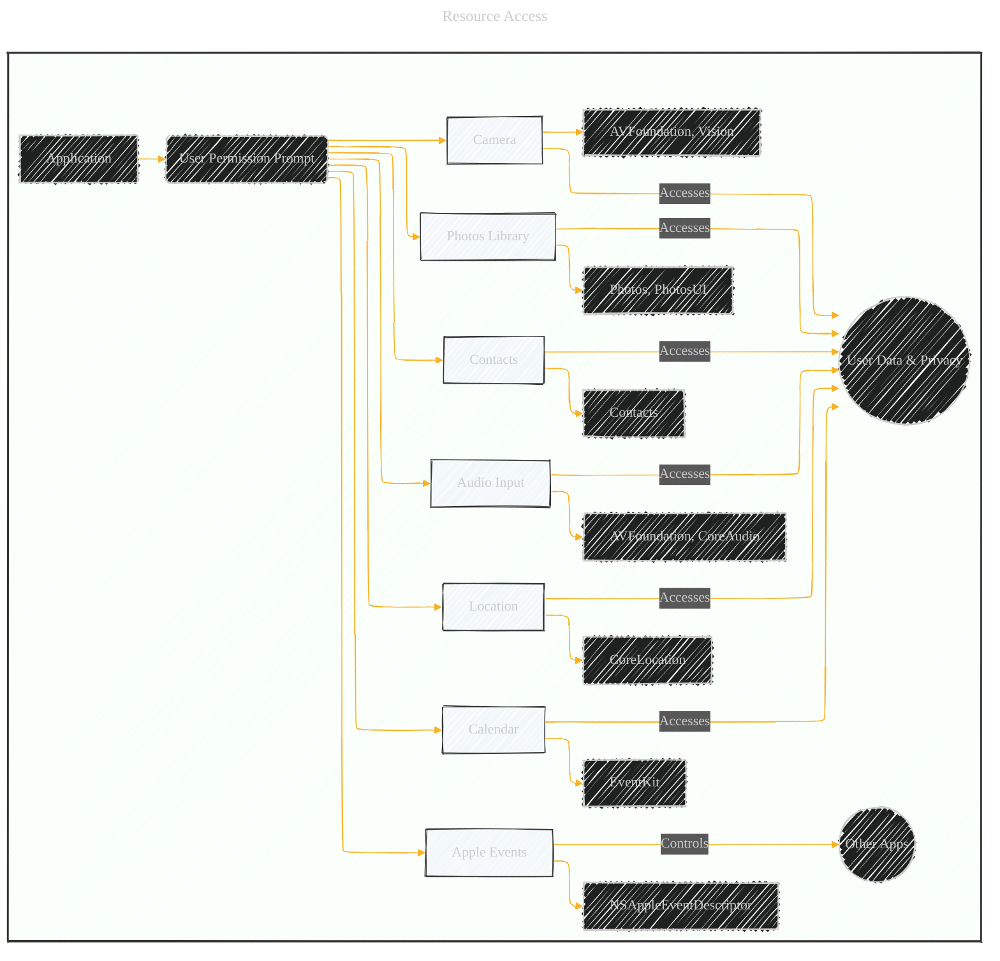
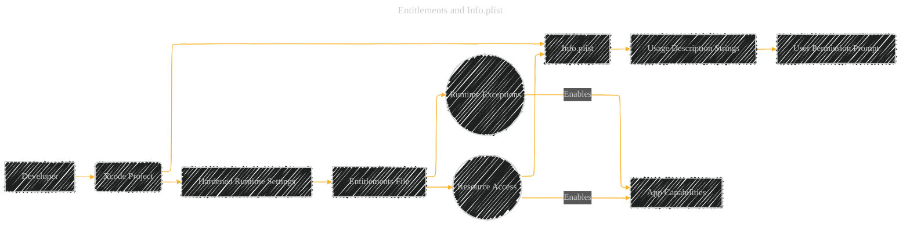
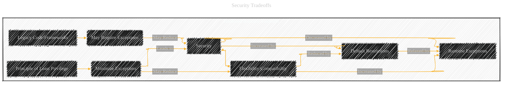

# Hardened Runtime
> **Disclaimer:**
>
> This document contains my personal notes on the topic,
> compiled from publicly available documentation and various cited sources.
> The materials are intended for educational purposes, personal study, and reference.
> The content is dual-licensed:
> 1. **MIT License:** Applies to all code implementations (Swift, Mermaid, and other programming languages).
> 2. **Creative Commons Attribution 4.0 International License (CC BY 4.0):** Applies to all non-code content, including text, explanations, diagrams, and illustrations.
---

## 1. Hardened Runtime: The Big Picture

*   **Purpose:**  The Hardened Runtime is a security mechanism that restricts an application's capabilities at runtime.  It's like putting your app in a "sandbox" with stricter rules.  This limits the potential damage an attacker can do if they manage to exploit a vulnerability in your code (e.g., a buffer overflow, code injection).
*   **Why it Matters:** Modern software is complex.  Even with careful coding, vulnerabilities can exist.  Hardened Runtime adds an extra layer of defense *after* your app is running, making it harder for attackers to take control.
*   **Trade-offs:**  Enabling Hardened Runtime capabilities usually involves a trade-off.  You gain security, but you might lose some flexibility or compatibility with older technologies.  The options you see in the screenshot are all about carefully managing this balance.
*   **Notarization:** To distribute a macOS app outside the Mac App Store (e.g., via a website download), Apple *requires* that the app be notarized.  Notarization involves submitting your app to Apple for a security check.  Hardened Runtime is a *requirement* for notarization.

---

## 2. Key Sections and Options Explained

The screenshot shows two main sections: "Runtime Exceptions" and "Resource Access."

**2.1. Runtime Exceptions (Entitlements)**

These options *relax* some of the default restrictions imposed by the Hardened Runtime.  You're essentially saying, "My app needs to do this specific thing, even though it's normally restricted."  Each of these is controlled by an *entitlement*, which is a special permission you request for your app.

*   **Allow Execution of JIT-compiled Code:**
    *   **What it is:** Just-In-Time (JIT) compilation is a technique where code is compiled to machine code *during* the program's execution, rather than beforehand.  This is common in JavaScript engines (like those used in web browsers) and some other dynamic languages.
    *   **Why it's restricted:** JIT compilers need to write executable code into memory.  This is a security risk because an attacker could potentially inject malicious code and have it executed.
    *   **When to use it:**  If your app uses `JavaScriptCore` (e.g., to run JavaScript within your app) or another framework that relies on JIT, you'll likely need this entitlement.
    *  **Relevant Framework**: `JavaScriptCore`

*   **Allow Unsigned Executable Memory:**
    *   **What it is:**  Allows your app to create and execute code in memory that isn't digitally signed.
    *   **Why it's restricted:** Code signing is a way to verify that code hasn't been tampered with.  Unsigned code is a major security risk.
    *   **When to use it:**  This is generally *not* recommended unless you have a very specific and well-justified reason.  Some legacy applications that generate code on-the-fly might need this, but it should be avoided if possible.

*   **Allow DYLD Environment Variables:**
    *   **What it is:**  `dyld` (the dynamic linker) is responsible for loading libraries and frameworks into your app.  Environment variables can influence how `dyld` behaves.
    *   **Why it's restricted:** Attackers can use `dyld` environment variables to inject malicious libraries into your app (a technique called "dylib hijacking").
    *   **When to use it:**  This is primarily for debugging and should generally *not* be enabled in production builds.  It can be useful for developers to diagnose library loading issues.

*   **Disable Library Validation:**
    *   **What it is:**  Normally, the Hardened Runtime checks that all the libraries your app loads are properly code-signed.  This option disables that check.
    *   **Why it's restricted:**  Loading unsigned or tampered-with libraries is a major security risk.
    *   **When to use it:**  If your app uses third-party plugins or frameworks that aren't signed by the expected developer, you might need this.  However, this is a significant security compromise, and you should explore alternatives (like getting the plugins properly signed) if at all possible.
    * **Relevant Framework**: Any third-party framework

*   **Disable Executable Memory Protection:**
    *   **What it is:** This disables code signing protections *entirely* on the application while it's executing.
    *   **Why it's restricted:**  This is the most extreme option, removing a fundamental security protection.
    *   **When to use it:**  Only for legacy applications that absolutely require it and cannot be updated.  This should be avoided in almost all cases.

*   **Debugging Tool:**
    *   **What it is:**  Allows your app to be attached to by a debugger (like Xcode's debugger).
    *   **Why it's restricted:**  Debuggers have extensive control over a running process.  In the wrong hands, this could be used to reverse engineer or exploit your app.
    *   **When to use it:**  Enable this during development, but *disable* it for production builds that you distribute to users.

**2.2. Resource Access**

These options control your app's access to sensitive system resources and user data.  These are also controlled by entitlements.

*   **Audio Input:**
    *   **What it is:** Allows your app to record audio from the microphone.
    *   **When to use it:**  If your app needs to record voice memos, handle audio calls, or use speech recognition, you'll need this.
    *   **Privacy:**  Access to the microphone is a sensitive privacy concern.  You must provide a clear explanation to the user (in your app's `Info.plist`) about why you need this access.  The system will prompt the user for permission the first time your app tries to use the microphone.
    *   **Relevant Frameworks:** `AVFoundation`, `Core Audio`

*   **Camera:**
    *   **What it is:** Allows your app to capture photos and videos.
    *   **When to use it:**  For apps that take pictures, record videos, scan QR codes, or use augmented reality.
    *   **Privacy:**  Camera access is also a sensitive privacy concern.  You need a usage description in your `Info.plist`, and the system will prompt the user for permission.
    *   **Relevant Frameworks:** `AVFoundation`, `Vision`

*   **Location:**
    *   **What it is:**  Grants access to the user's location information.
    *   **When to use it:**  For navigation apps, location-based reminders, or apps that tag content with location data.
    *   **Privacy:**  Location data is highly sensitive.  You need a usage description, and the system will prompt the user.  You should also choose the appropriate level of location accuracy (e.g., "when in use" or "always") and only request the minimum necessary.
    *   **Relevant Frameworks:** `Core Location`

*   **Contacts:**
    *   **What it is:**  Allows read/write access to the user's address book.
    *   **When to use it:**  For apps that manage contacts, sync with other services, or need to access contact information.
    *   **Privacy:**  Contact data is personal information.  You need a usage description and user permission.
    *   **Relevant Frameworks:** `Contacts`

*   **Calendar:**
    *   **What it is:**  Provides read/write access to the user's calendars.
    *   **When to use it:**  For calendar apps, scheduling tools, or apps that integrate with calendar events.
    *   **Privacy:**  Calendar data can reveal personal information.  You need a usage description and user permission.
    *   **Relevant Frameworks:** `EventKit`

*   **Photos Library:**
    *   **What it is:**  Allows read/write access to the user's photo library.
    *   **When to use it:**  For photo editing apps, social media apps, or apps that manage photos.
    *   **Privacy:**  Photos can contain sensitive information.  You need a usage description and user permission.  Consider using the `PHPickerViewController` (introduced in iOS 14) for a more privacy-friendly way to let users select photos without giving your app full access to their library.
    *   **Relevant Frameworks:** `Photos`, `PhotosUI`

*   **Apple Events:**
    *   **What it is:** Allows your app to send Apple Events to other applications.  Apple Events are a form of inter-process communication (IPC) on macOS.
    *   **When to use it:** If your app needs to control other apps (e.g., a scripting tool) or integrate with system services.
    *   **Security:**  Sending Apple Events can be a security risk if misused.  You need to be careful about which apps you communicate with and what data you send.
    * **Relevant Frameworks:** `Foundation` (specifically, the `NSAppleEventDescriptor` and related classes)

---

## 3. Key Takeaways and Best Practices

*   **Principle of Least Privilege:**  Only enable the Hardened Runtime exceptions and resource access options that your app *absolutely* needs.  This minimizes your app's attack surface.
*   **Privacy by Design:**  Always consider the privacy implications of requesting access to user data.  Be transparent with users about why you need access and how you will use their data.
*   **Usage Descriptions:**  For all resource access options that require user permission, you *must* provide clear and informative usage descriptions in your app's `Info.plist` file.  These descriptions are shown to the user when the system prompts them for permission.
*   **Testing:**  Thoroughly test your app with the Hardened Runtime enabled to ensure that it functions correctly and that you've requested all necessary entitlements.
* **Prioritize Security:**  Review your app's security posture regularly.  Stay up-to-date on Apple's security guidance and best practices.
* **Avoid Unnecessary Exceptions:** Before enabling a Runtime Exception, carefully consider if there's a more secure way to achieve the same functionality.  For example, instead of disabling library validation, work with the vendor of the third-party library to get it properly signed.

In summary, the Hardened Runtime is a powerful tool for improving the security of macOS applications. Understanding the options shown in this Xcode screenshot is essential for building secure and trustworthy apps that respect user privacy. It is all about balancing security and capability.

----

The diagrams below provide a comprehensive visual overview of the Hardened Runtime concepts, covering its purpose, exceptions, resource access, configuration, and relationship to notarization and security best practices. They should aid in understanding and remembering these important security features.

I'll break this down into several diagrams to cover different aspects:

1.  **Hardened Runtime Overview:** A high-level view of the Hardened Runtime and its purpose.
2.  **Runtime Exceptions:** A diagram showing the different runtime exceptions and their relationships.
3.  **Resource Access:** A diagram illustrating the various resource access options and their associated privacy considerations.
4.  **Entitlements and Info.plist:** A diagram showing how entitlements and `Info.plist` usage descriptions relate to Hardened Runtime.
5.  **Hardened Runtime and Notarization:** Connect Hardened Runtime to the macOS notarization process.
6. **Security Tradeoffs:** Hardened runtime capabilities tradeoffs.

---

## 1. Hardened Runtime Overview

**Explanation:**

*   This diagram shows the core concept of the Hardened Runtime: it restricts an application's capabilities, increasing security and reducing the attack surface, but at the cost of some flexibility.
*   Vulnerabilities and malicious code attempts are mitigated/blocked by the Hardened Runtime.
*   User data is protected.

---

## 2. Runtime Exceptions

**Explanation:**

*   The Hardened Runtime starts with default restrictions.
*   Each exception (represented by nodes with the `exception` class) relaxes a specific restriction.
*   The diagram shows the typical use case for each exception.  The red fill indicates higher risk exceptions.

---

## 3. Resource Access

**Explanation:**

*   Accessing resources requires user permission (triggered by the system).
*   The diagram lists the relevant frameworks for each resource.
*   It highlights the privacy implications of accessing user data.
*   Apple Events are slightly different as they control *other* apps.

---

## 4. Entitlements and Info.plist

**Explanation:**

*   This shows the relationship between the developer's actions (in Xcode), the entitlements file, the `Info.plist`, and how they ultimately lead to the app's capabilities and user permission prompts.
*   The entitlements file specifies which exceptions and resource access the app needs.
*   The `Info.plist` contains the usage description strings that explain *why* the app needs access.
*   These combine to trigger the user permission prompt at runtime.

---

## 5. Hardened Runtime and Notarization

**Explanation:**

*   This diagram shows the workflow for notarizing a macOS app.
*   Hardened Runtime is a *requirement* for notarization.
*   The diagram shows the steps, including code signing, enabling Hardened Runtime, configuring entitlements, submitting to Apple's Notary Service, and handling success/failure.

---

## 6. Security Tradeoffs

**Explanation:**

* This diagram visually presents the core trade-off between security and flexibility/compatibility when using the Hardened Runtime.
* It emphasizes the "Principle of Least Privilege" - minimizing exceptions to maximize security.
* It also acknowledges that legacy code or frameworks might necessitate exceptions, potentially reducing security.

---
**Licenses:**

- **MIT License:**   - Full text in [LICENSE](LICENSE) file.
- **Creative Commons Attribution 4.0 International:**  - Legal details in [LICENSE-CC-BY](LICENSE-CC-BY) and at [Creative Commons official site](http://creativecommons.org/licenses/by/4.0/).

---
