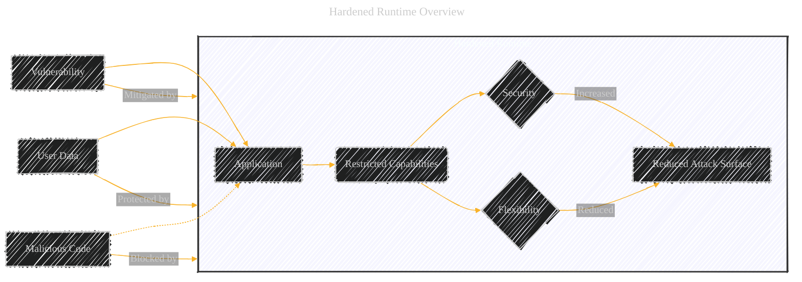
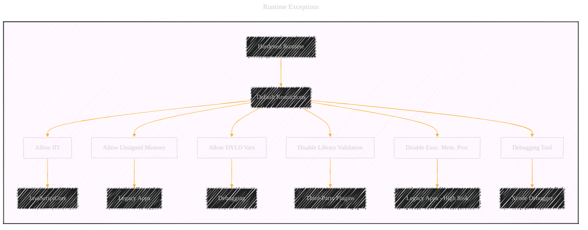
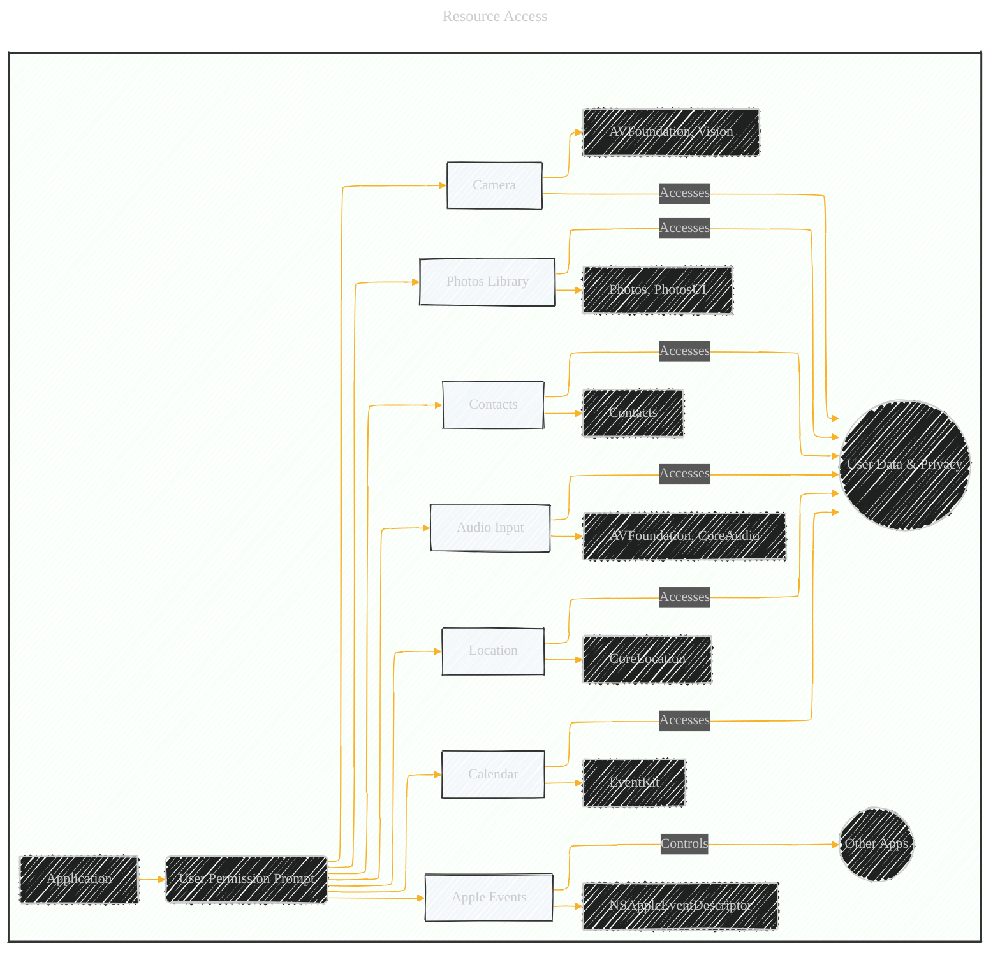
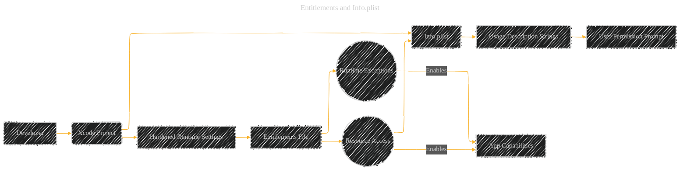
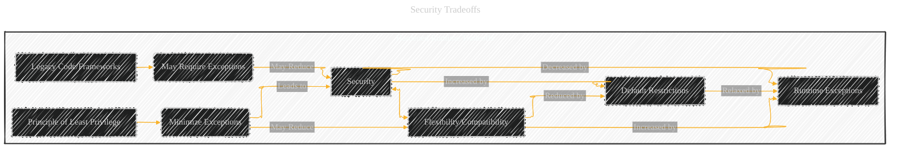

# Hardened Runtime
> **Disclaimer:**
>
> This document contains my personal notes on the topic,
> compiled from publicly available documentation and various cited sources.
> The materials are intended for educational purposes, personal study, and reference.
> The content is dual-licensed:
> 1. **MIT License:** Applies to all code implementations (Swift, Mermaid, and other programming languages).
> 2. **Creative Commons Attribution 4.0 International License (CC BY 4.0):** Applies to all non-code content, including text, explanations, diagrams, and illustrations.
---

The diagrams below provide a comprehensive visual overview of the Hardened Runtime concepts, covering its purpose, exceptions, resource access, configuration, and relationship to notarization and security best practices. They should aid in understanding and remembering these important security features.

I'll break this down into several diagrams to cover different aspects:

1.  **Hardened Runtime Overview:** A high-level view of the Hardened Runtime and its purpose.
2.  **Runtime Exceptions:** A diagram showing the different runtime exceptions and their relationships.
3.  **Resource Access:** A diagram illustrating the various resource access options and their associated privacy considerations.
4.  **Entitlements and Info.plist:** A diagram showing how entitlements and `Info.plist` usage descriptions relate to Hardened Runtime.
5.  **Hardened Runtime and Notarization:** Connect Hardened Runtime to the macOS notarization process.
6. **Security Tradeoffs:** Hardened runtime capabilities tradeoffs.

---

## 1. Hardened Runtime Overview

**Explanation:**

*   This diagram shows the core concept of the Hardened Runtime: it restricts an application's capabilities, increasing security and reducing the attack surface, but at the cost of some flexibility.
*   Vulnerabilities and malicious code attempts are mitigated/blocked by the Hardened Runtime.
*   User data is protected.

---

## 2. Runtime Exceptions

**Explanation:**

*   The Hardened Runtime starts with default restrictions.
*   Each exception (represented by nodes with the `exception` class) relaxes a specific restriction.
*   The diagram shows the typical use case for each exception.  The red fill indicates higher risk exceptions.

---

## 3. Resource Access

**Explanation:**

*   Accessing resources requires user permission (triggered by the system).
*   The diagram lists the relevant frameworks for each resource.
*   It highlights the privacy implications of accessing user data.
*   Apple Events are slightly different as they control *other* apps.

---

## 4. Entitlements and Info.plist

**Explanation:**

*   This shows the relationship between the developer's actions (in Xcode), the entitlements file, the `Info.plist`, and how they ultimately lead to the app's capabilities and user permission prompts.
*   The entitlements file specifies which exceptions and resource access the app needs.
*   The `Info.plist` contains the usage description strings that explain *why* the app needs access.
*   These combine to trigger the user permission prompt at runtime.

---

## 5. Hardened Runtime and Notarization

**Explanation:**

*   This diagram shows the workflow for notarizing a macOS app.
*   Hardened Runtime is a *requirement* for notarization.
*   The diagram shows the steps, including code signing, enabling Hardened Runtime, configuring entitlements, submitting to Apple's Notary Service, and handling success/failure.

---

## 6. Security Tradeoffs

**Explanation:**

* This diagram visually presents the core trade-off between security and flexibility/compatibility when using the Hardened Runtime.
* It emphasizes the "Principle of Least Privilege" - minimizing exceptions to maximize security.
* It also acknowledges that legacy code or frameworks might necessitate exceptions, potentially reducing security.

----

---
**Licenses:**

- **MIT License:**   - Full text in [LICENSE](LICENSE) file.
- **Creative Commons Attribution 4.0 International:**  - Legal details in [LICENSE-CC-BY](LICENSE-CC-BY) and at [Creative Commons official site](http://creativecommons.org/licenses/by/4.0/).

---