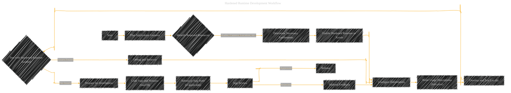
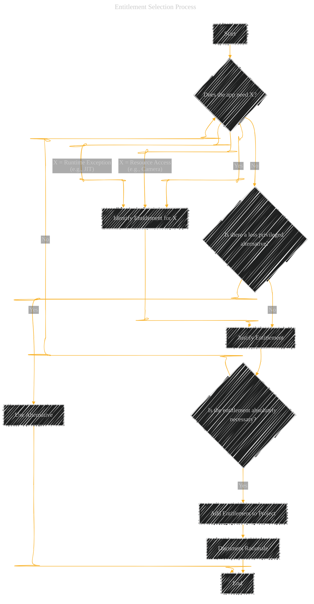
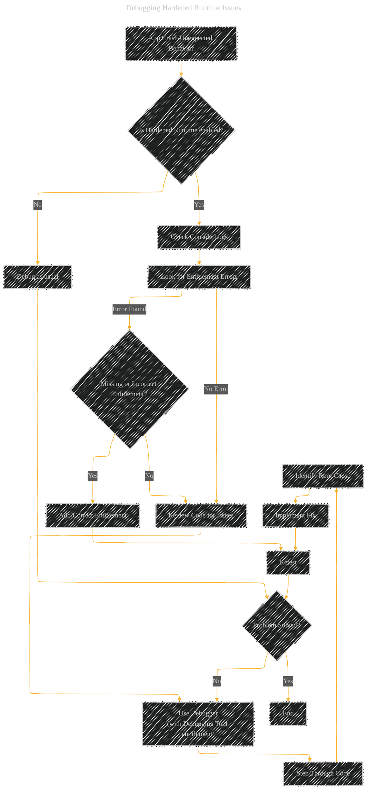
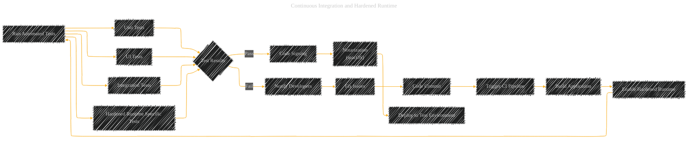

# Best Practices for Hardened Runtime
> **Disclaimer:**
>
> This document contains my personal notes on the topic,
> compiled from publicly available documentation and various cited sources.
> The materials are intended for educational purposes, personal study, and reference.
> The content is dual-licensed:
> 1. **MIT License:** Applies to all code implementations (Swift, Mermaid, and other programming languages).
> 2. **Creative Commons Attribution 4.0 International License (CC BY 4.0):** Applies to all non-code content, including text, explanations, diagrams, and illustrations.
---

The diagrams below provide a practical guide for developers to incorporate Hardened Runtime into their workflow, from planning and development to testing, debugging, and deployment.  They cover key considerations and best practices for building secure and robust macOS applications.

Here's a breakdown of the diagrams:

1.  **Hardened Runtime Development Workflow:** A high-level overview of the steps involved in incorporating Hardened Runtime.
2.  **Entitlement Selection Process:** A decision-making flowchart for choosing the right entitlements.
3.  **Testing with Hardened Runtime:**  A diagram outlining different testing strategies.
4.  **Debugging Hardened Runtime Issues:** A flowchart for troubleshooting common problems.
5.  **Continuous Integration and Hardened Runtime:** Integrating Hardened Runtime checks into a CI/CD pipeline.
6.  **App Review and Hardened Runtime:** Considerations for preparing for App Review or notarization.

---

## 1. Hardened Runtime Development Workflow

**Explanation:**

*   This diagram outlines the overall workflow, from initial planning to app release.
*   It highlights key steps: identifying required resources, determining entitlements, enabling Hardened Runtime, configuring settings, writing usage descriptions, testing, debugging, and preparing for distribution (including notarization for macOS).
*   It shows the iterative nature of development, with feedback loops for debugging and addressing App Review issues.

---

## 2. Entitlement Selection Process

**Explanation:**

*   This flowchart helps developers make informed decisions about which entitlements to include.
*   It emphasizes the principle of least privilege: only request the entitlements that are absolutely necessary.
*   It encourages considering less privileged alternatives before requesting a potentially risky entitlement.
*   It highlights the importance of documenting the rationale for each entitlement.

---

## 3. Testing with Hardened Runtime

**Explanation:**

*   This diagram outlines a comprehensive testing strategy for Hardened Runtime.
*   It includes standard testing practices (unit, UI, integration, manual) as well as tests specifically focused on Hardened Runtime behavior.
*   It emphasizes testing resource access, verifying entitlement behavior, and testing with and without certain entitlements to identify potential issues.

---

## 4. Debugging Hardened Runtime Issues

**Explanation:**

*   This flowchart provides a structured approach to debugging issues that may be related to Hardened Runtime.
*   It starts by checking console logs for entitlement errors.
*   It guides the developer through checking for missing or incorrect entitlements, reviewing code, and using the debugger.
*   It emphasizes the iterative nature of debugging, with retesting after each fix.

---

## 5. Continuous Integration and Hardened Runtime

**Explanation:**

*   This diagram shows how to integrate Hardened Runtime checks into a Continuous Integration/Continuous Delivery (CI/CD) pipeline.
*   It ensures that Hardened Runtime is enabled during the build process and that automated tests (including Hardened Runtime-specific tests) are run.
*   It automates code signing and notarization (for macOS).
*   It includes a feedback loop for notifying developers of test failures.

---

## 6. App Review and Hardened Runtime

**Explanation:**

*   This diagram outlines the steps to take when preparing an app for App Review (or notarization) with Hardened Runtime enabled.
*   It emphasizes verifying that all entitlements are justified and that usage descriptions are clear and accurate.
*   It shows how to handle potential rejections related to Hardened Runtime issues.

---

<!-- 

---
**Licenses:**

- **MIT License:**   - Full text in [LICENSE](LICENSE) file.
- **Creative Commons Attribution 4.0 International:**  - Legal details in [LICENSE-CC-BY](LICENSE-CC-BY) and at [Creative Commons official site](http://creativecommons.org/licenses/by/4.0/).

---
