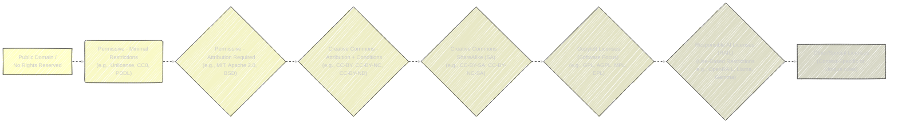

# An Overview on Licencing in Tech Industry - A Diagrammatic Guide
> This content is dual-licensed under your choice of the following licenses:
> 1.  **MIT License:** For the code implementations in Swift and Mermaid provided in this document.
> 2.  **Creative Commons Attribution 4.0 International License (CC BY 4.0):** For all other content, including the text, explanations, and the Mermaid diagrams and illustrations.

---

## Visualizing Hugging Face Hub Licenses

This document provides a visual and categorized overview of the licenses listed for use on the Hugging Face Hub and beyond. The aim is to clarify the types of licenses available and their relationships through Mermaid diagrams.

### Broad Categories of Licenses

Based on the provided list from [this link](https://huggingface.co/docs/hub/en/repositories-licenses), we can broadly categorize the licenses into several key groups, reflecting their purpose and characteristics. These categories are not mutually exclusive in all cases, but provide a useful high-level structure for understanding the landscape of available licenses.

*   **Permissive Licenses:** These licenses are characterized by minimal restrictions on reuse, modification, and distribution. They typically require attribution but are otherwise very flexible.
*   **Copyleft Licenses:** Also known as reciprocal licenses, these require that derivative works be licensed under the same terms. This "copyleft" effect aims to keep software and data open in derivative works.
*   **Creative Commons Licenses:** Primarily designed for creative works and data, they offer a range of permissions focusing on aspects like attribution, commercial use, and derivative works.
*   **Responsible AI Licenses (RAIL):**  Specifically designed for AI models and datasets, these licenses often include clauses around responsible use, ethical considerations, and sometimes restrictions on specific applications.
*   **Data-Specific Licenses:** Certain licenses are tailored for datasets, addressing unique aspects of data use and sharing.
*   **General Public Licenses (GPL Family):** A prominent family within Copyleft licenses, known for their strong copyleft provisions for software.
*   **Lesser General Public Licenses (LGPL Family):** A weaker form of copyleft, typically used for libraries, allowing more flexible linking in proprietary software.
*   **Other Licenses:** A miscellaneous category for licenses that don't fit neatly into the above groups or are less commonly categorized.

### License Category Mindmap

The following mindmap visualizes the hierarchical structure of these license categories and some of the representative licenses within each.

**Explanation of the Mindmap:**

*   The central node "Hugging Face Hub Licenses" represents the entire dataset of licenses provided.
*   The first level of branches represents the broad categories discussed earlier (Permissive, Copyleft, Creative Commons, etc.).
*   Subsequent levels branch out into license families and specific license names.
*   For Creative Commons, the branching highlights the key permission variations (BY, SA, NC, ND) and their combinations, with examples of versioned licenses.
*   Similarly, for GPL and LGPL, families are indicated with specific versions listed under them.
*   RAIL and Data-Specific licenses are grouped as these represent licenses with a more focused purpose beyond general software/content licensing.
*   "Other Licenses" acts as a catch-all for licenses that are either less common, have unique characteristics, or don't fit neatly into the primary categories.

---

## The License Evolution

Here's a conceptual flow of license evolution based on increasing restrictions:

1.  **Public Domain/No Rights Reserved:** Licenses that dedicate works to the public domain, effectively waiving all rights. These are the most permissive.
2.  **Permissive (Attribution Optional or Minimal):** Licenses that require very little, often just attribution.
3.  **Attribution Required (Standard Permissive):** Common permissive licenses requiring attribution but few other restrictions.
4.  **Creative Commons with Conditions (Non-Commercial, No Derivatives, Share-Alike):** Creative Commons licenses add layers of conditions like Non-Commercial use (NC), No Derivatives (ND), and Share-Alike (SA), increasing restrictiveness.
5.  **Copyleft (Share-Alike for Code/Software):** Licenses that ensure derivative works must also be open, primarily in the software domain.
6.  **Responsible AI Licenses (Use Restrictions):**  Licenses with additional clauses designed to govern the ethical and responsible use of AI and related technologies, adding use-based restrictions.

Let's create a Mermaid flowchart to visualize this evolution:

**Explanation of the Evolution Diagram:**

*   **Nodes as License Categories:** Each node in the flowchart represents a category of licenses grouped by the level of restrictions they enforce.
*   **Direction of Flow (A to H):** The flow from left to right (A to H) generally represents an increase in the level of restrictions and obligations imposed by the licenses.
*   **Node Content (Category and Examples):** Each node contains a description of the license category and examples of licenses that fall into that category (based on the provided list).
*   **Styling for Visual Hierarchy:** Different fill colors are used to visually distinguish categories, with a subtle progression to suggest increasing 'intensity' of restriction as you move from left to right.
*   **Dashed Arrows for Conceptual Connection:** The dashed arrows indicate a conceptual evolution or a spectrum, rather than a strict inheritance or dependency relationship. They show a progression from fewer to more impositions on the user.
*   **"Other/Special Licenses" Node:**  This acknowledges that there are licenses that may not fit neatly into the linear progression or have unique characteristics that make them distinct.

**Categories and their Positions in the Spectrum:**

*   **A. Public Domain:** Zero restrictions; complete freedom to use.
*   **B. Permissive (Minimal Restrictions):** Very few obligations, mainly around attribution (sometimes even optional). Examples like Unlicense, CC0, and PDDL are at this end.
*   **C. Permissive (Attribution Required):** Standard permissive licenses - require attribution but are otherwise very flexible. MIT, Apache 2.0, and BSD are key examples.
*   **D. Creative Commons (Attribution + Conditions):**  Creative Commons add conditions like Non-Commercial (NC) or No Derivatives (ND) which start to limit certain uses more than simple permissive licenses.
*   **E. Creative Commons (ShareAlike - SA):** ShareAlike condition in Creative Commons licenses is similar conceptually to copyleft in software licenses, requiring derivative works to use a similar license, adding a layer of reciprocity.
*   **F. Copyleft Licenses (Software Focus):**  Licenses like GPL, AGPL, MPL, and EPL are designed for software and have copyleft provisions, ensuring that modifications and distributions remain open source under similar terms. These are generally more restrictive than permissive licenses in terms of derivative work licensing.
*   **G. Responsible AI Licenses (RAIL):** RAIL licenses are a further step as they introduce restrictions based on *how* the technology is used, adding ethical and responsible use clauses, which can be seen as a more context-specific form of restriction.
*   **H. Other/Special Licenses:** This is for licenses that are unique, context-dependent, or don't fit neatly in the spectrum, indicating that license types can diversify beyond a simple linear spectrum.

----

## Time Chart Evolution of Licenses

Let's consider a horizontal timeline to represent the approximate emergence and evolution of different license categories. We can organize it into rough periods or "eras" of license development.

Here’s a conceptual timeline structure we can use:

1.  **Early Open Source/Permissive Licenses (Late 1980s - 1990s):**  Era emphasizing basic freedoms and minimal restrictions, often tied to academic and research contexts.
2.  **Rise of Copyleft (Late 1980s - 2000s):**  The Free Software Foundation and GPL gain prominence, focusing on reciprocal sharing and ensuring software stays free.
3.  **Creative Commons & Content Licensing (Early 2000s - Present):**  Recognizing the need for licenses beyond software, tailored for creative works, data, and content.
4.  **Data and Open Data Licenses (2000s - Present):**  Increased focus on data sharing, open data initiatives, and the unique considerations for licensing datasets.
5.  **Responsible AI Licenses (RAIL) (2010s - Present):**  Recent trend to address ethical concerns and responsible use, especially critical for AI models and related resources.

Using this framework, we can create a Mermaid flowchart to represent a license evolution timeline.

```mermaid
---
config:
  layout: elk
  look: handDrawn
  theme: dark
---
graph LR
    subgraph Era1["Early Permissive Licenses<br>(Late 1980s-90s)"]
    style Era1 fill:#faf5,stroke:#333,stroke-width:1px,dasharray:5 5
        A1[BSD Family]
        A2[MIT License]
        A3[Apache License 1.0/1.1]
        A1 --- A2 --- A3
    end
    subgraph Era2["Rise of Copyleft<br>(Late 1980s-2000s)"]
    style Era2 fill:#eaf5,stroke:#333,stroke-width:1px,dasharray:5 5
        B1[GNU GPL Family]
        B2[GNU LGPL Family]
        B3[Mozilla Public License 1.0/1.1]
        B1 --- B2 --- B3
    end
    subgraph Era3["Creative Commons<br>(Early 2000s-Present)"]
    style Era3 fill:#daf5,stroke:#333,stroke-width:1px,dasharray:5 5
        C1["CC Public Domain<br>(CC0, PDDL)"]
        C2["CC Attribution<br>(BY)"]
        C3["CC ShareAlike<br>(SA)"]
        C4["CC NonCommercial<br>(NC)"]
        C5["CC NoDerivatives<br>(ND)"]
        C1 --- C2 --- C3 --- C4 --- C5
    end
    subgraph Era4["Data & Open Data Licenses<br>(2000s-Present)"]
    style Era4 fill:#caf5,stroke:#333,stroke-width:1px,dasharray:5 5
        D1["Open Data Commons<br>(ODC)"]
        D2["Community Data License<br>(CDLA)"]
        D1 --- D2
    end
    subgraph Era5["Responsible AI Licenses <br> (2010s-Present)"]
    style Era5 fill:#baf5,stroke:#333,stroke-width:1px,dasharray:5 5
        E1["OpenRAIL Family"]
        E2["Llama Community Licenses"]
        E3["Gemma Terms of Use"]
        E1 --- E2 --- E3
    end
    subgraph Era6["Evolving & Specialized <br> (Present)"]
    style Era6 fill:#aaf5,stroke:#333,stroke-width:1px,dasharray:5 5
        F1[Etalab Open License 2.0]
        F2[Apple Sample Code License]
        F3[DeepFloyd IF License]
        F1 --- F2 --- F3
    end

    Start["Start of Open Source Licensing"] --> Era1
    Era1 --> Era2
    Era2 --> Era3
    Era3 --> Era4
    Era4 --> Era5
    Era5 --> Era6
    Era6 --> End["Present & Future License Evolution"]

    linkStyle 0 stroke-width:2px,stroke:#777,fill:none,stroke-dasharray:3 3
    linkStyle 1 stroke-width:2px,stroke:#777,fill:none,stroke-dasharray:3 3
    linkStyle 2 stroke-width:2px,stroke:#777,fill:none,stroke-dasharray:3 3
    linkStyle 3 stroke-width:2px,stroke:#777,fill:none,stroke-dasharray:3 3
    linkStyle 4 stroke-width:2px,stroke:#777,fill:none,stroke-dasharray:3 3
    linkStyle 5 stroke-width:2px,stroke:#777,fill:none,stroke-dasharray:3 3
    
```

**Explanation of the Time Chart Diagram:**

*   **Horizontal Flow - Time Evolution:** The diagram flows from left to right, representing the progression of time from the early days of open source to the present. "Start of Open Source Licensing" progressing to "Present & Future License Evolution".
*   **Eras as Subgraphs:** Each era is represented as a subgraph, visually grouping licenses that became prominent around the same time or share a similar philosophy. The dashed borders of subgraphs help to visually separate the eras while still showing a continuous flow.
*   **Licenses within Eras:** Within each era's subgraph, representative license families or individual licenses are listed. They are connected linearly within each era to imply a general adjacency within that period, not a strict dependency.
*   **Era Titles:** Each subgraph is titled with a descriptive name indicating the focus of licensing during that period and approximate timeframe.
*   **Connections Between Eras:** Dashed arrows connect the eras, indicating a historical progression and influence, but not a direct derivation.  The evolution is conceptual – later eras build on the needs and concepts established in earlier eras.
*   **"Evolving & Specialized Era":** This last era acknowledges that license development is ongoing and becoming more specialized to address new contexts like specific jurisdictions (Etalab), specific entities (Apple), or unique project needs (DeepFloyd).
*   **Styling:**  Slight color variations across eras to provide visual distinctiveness to time periods. Dashed lines for era borders and inter-era connections to emphasize the timeline is conceptual.

**Time Eras and Key Licenses Mapped:**

*   **Era 1: Early Permissive (Late 80s-90s):** BSD family, MIT, early Apache. These were foundational, emphasizing freedom to use, modify, and distribute with minimal obligations.
*   **Era 2: Rise of Copyleft (Late 80s-2000s):** GNU GPL, LGPL, MPL – driven by the Free Software movement to ensure community benefits are maintained and software remains open in derivative works.
*   **Era 3: Creative Commons (Early 2000s-Present):** CC licenses offered a spectrum of permissions for content, data, and creative works – addressing needs beyond software code, from public domain dedication to various combinations of Attribution, ShareAlike, NonCommercial, and NoDerivatives.
*   **Era 4: Data & Open Data (2000s-Present):** ODC and CDLA – specifically designed for datasets and databases, addressing unique aspects like data integrity, provider responsibilities, and data-specific freedoms.
*   **Era 5: Responsible AI (2010s-Present):** OpenRAIL family, Llama, Gemma – a recent response to the rise of AI, incorporating ethical considerations, use-case restrictions, and responsible innovation in licensing.
*   **Era 6: Evolving & Specialized (Present):** Etalab, Apple Sample Code, DeepFloyd – representing increasing specialization, jurisdictional relevance, and bespoke licensing needs in specific contexts.

---
**Licenses:**

- **MIT License:**   - Full text in [LICENSE](LICENSE) file.
- **Creative Commons Attribution 4.0 International:**  - Legal details in [LICENSE-CC-BY](LICENSE-CC-BY) and at [Creative Commons official site](http://creativecommons.org/licenses/by/4.0/).

---