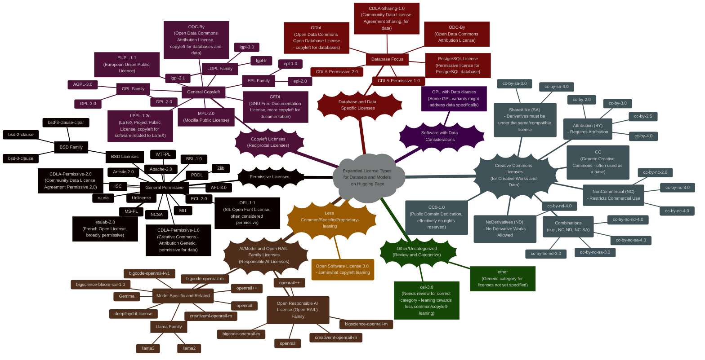
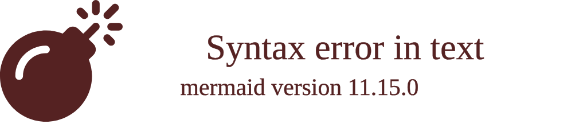

# An Overview on Licencing in Tech Industry - An Expanding Diagrammatic Guide
> This content is dual-licensed under your choice of the following licenses:
> 1.  **MIT License:** For the code implementations in Swift and Mermaid provided in this document.
> 2.  **Creative Commons Attribution 4.0 International License (CC BY 4.0):** For all other content, including the text, explanations, and the Mermaid diagrams and illustrations.

---

## An Expanding Overview on Tech Licenses

This document is an expansion of the initial version at [this doc](./Licensing_in_tech.md).

This version now attempts to be more exhaustive by incorporating more dataset-relevant licenses.

**Changes and Expansions Made:**

1.  **More Granular Categories:** I've created more specific categories like "General Permissive", "General Copyleft", "Creative Commons Licenses", "AI/Model & Open RAIL Family Licenses", and "Database & Data Specific Licenses" for better organization.
2.  **Added Dataset Specific Licenses:** Included licenses like `CDLA-Permissive-1.0`, `CDLA-Permissive-2.0`, `CDLA-Sharing-1.0`, `ODbL`, and `ODC-By`, which are common for datasets.
3.  **Expanded Creative Commons Breakdown:**  Further broke down Creative Commons licenses into categories like "Attribution (BY)", "ShareAlike (SA)", "NonCommercial (NC)", and "NoDerivatives (ND)", and combinations to clarify the structure.
4.  **Open RAIL Family Emphasis:**  Highlighted "Open RAIL" licenses as a distinct category relevant to AI models, emphasizing responsible AI use licensing.
5.  **"Other/Uncategorized (Review and Categorize)" Section:**  Kept an "Other" category but renamed with a note to "Review and Categorize". This helps to isolate licenses that need further investigation or better placement.  Licenses like `unlicense`, `other`, `cc` in its generic form, and `gemmma` (likely a typo) are placed here for review.

---

<!-- 

---
**Licenses:**

- **MIT License:**   - Full text in [LICENSE](LICENSE) file.
- **Creative Commons Attribution 4.0 International:**  - Legal details in [LICENSE-CC-BY](LICENSE-CC-BY) and at [Creative Commons official site](http://creativecommons.org/licenses/by/4.0/).

---
