# A Semantic Map of Licenses
> This content is dual-licensed under your choice of the following licenses:
> 1.  **MIT License:** For the code implementations in Swift and Mermaid provided in this document.
> 2.  **Creative Commons Attribution 4.0 International License (CC BY 4.0):** For all other content, including the text, explanations, and the Mermaid diagrams and illustrations.

---

## A Semantical Expansion on Tech Licenses

This document is an expansion of the initial version at [this doc](Licensing_in_tech_expanding.md).

Here's a revised Mermaid mindmap that attempts to semantically connect the licenses based on common grounds and mutual relationships. 

This diagram focuses on the nature of permissions, restrictions, and intended use cases, rather than just broad categories.

```mermaid
---
config:
  theme: default
---
mindmap
  root(("Semantic Map of Licenses:<br>Permissions, Restrictions, and Domain"))

    Core_License_Spectrum["Core License Spectrum"]
      Permissive_End["Permissive End<br>(Minimal Restrictions,<br>Max Freedom)"]
        MIT -- Extensively Permissive, Short & Simple, Software Focus
        Apache-2.0 -- Permissive, Patent Grant, Mature Projects, Software Focus
        BSD Family
            Permissive
            Software
            Variationsin Clause Count
                bsd-3-clause -- Standard BSD, Minimal Clauses
                bsd-2-clause -- Simplified BSD, Even Fewer Clauses
                bsd-3-clause-clear -- BSD with Advertising Clause Removed
        ISC -- Permissive, Similar to MIT, Simple
        ECL-2.0 -- Permissive, Explicit Patent Language, Software Focus
        Zlib/Libpng -- Very Permissive, Short, Software Libraries
        WTFPL -- "Do What The F*ck You Want To Public License", Extreme Permissiveness
        Unlicense -- Public Domain Equivalent, Waives Copyright
        MS-PL -- Microsoft Public License, Permissive, Software
        PDDL -- Public Domain Dedication and License, Data and Databases
        Artistic-2.0 -- Permissive, Artistic Works, Software
        BSL-1.0 -- Boost Software License, Permissive, Software
        AFL-3.0 -- Academic Free License, Permissive, Software
        c-uda -- CUDA Toolkit License, Permissive for CUDA Software
        NCSA -- NCSA Open Source License, Permissive, Software
        OFL-1.1 -- SIL Open Font License, Permissive, Fonts
        etalab-2.0 -- French Open License, Permissive, Broadly Applicable
        CDLA-Permissive-1.0
            Creative Commons
            Attribution_Generic_Data["Attribution Generic (Data)"]
            Permissive Data

      Copyleft_Reciprocal_End_Share_Alike_Derivatives_Open["Copyleft/Reciprocal End<br>(Share-Alike, Derivatives Open)"]
        GPL Family -- Strong Copyleft, Software, Requires Source Code Sharing
          GPL-3.0 -- Latest GPL, Addresses Patents & Tivoization
          AGPL-3.0 -- Network Copyleft, For Networked Software
          GPL-2.0 -- Older GPL, Widely Used
        LGPL Family -- Weak Copyleft, Software Libraries, Allows Proprietary Linking
          lgpl-3.0 -- Modern LGPL, Compatible with GPL-3.0
          lgpl-2.1 -- Common LGPL Version
        %%   lgpl-lr -- (Likely a typo or less common variant, needs clarification - assuming LGPL)
        MPL-2.0 -- Mozilla Public License, File-Based Copyleft, Software Modules
        EUPL-1.1 -- European Union Public Licence, Copyleft, Multi-lingual, Broadly Applicable
        GFDL -- GNU Free Documentation License, Copyleft for Documentation, Not Ideal for Software
        ODbL -- Open Data Commons Open Database License, Copyleft for Databases, Requires Share-Alike
        LPPL-1.3c -- LaTeX Project Public License, Copyleft, LaTeX Specific Software
        OSL-3.0 -- Open Software License 3.0, Source Available, Copyleft-leaning

    Creative_Commons_Spectrum["Creative Commons Spectrum<br>(Rights for Creative and Data Works)"]
      Public_Domain_Dedication["Public Domain Dedication<br>(No Rights Reserved)"]
        CC0-1.0 -- Dedication to Public Domain, Max Freedom, Data/Creative Works

      Attribution_Family_BY["Attribution Family (BY)<br>- Requires Credit"]
        cc-by-4.0 -- Attribution 4.0 International, Modern Version
        cc-by-3.0 -- Attribution 3.0 Unported
        cc-by-2.0 -- Attribution 2.0 Generic
        cc-by-2.5 -- Attribution 2.5 Generic
        CDLA-Permissive-2.0 -- Community Data License Agreement Permissive 2.0 (Permissive + Attribution for Data)
        ODC-By -- Open Data Commons Attribution License, Attribution for Data/Databases

      ShareAlike_Enhancements_SA["ShareAlike Enhancements (SA)<br>- Requires Share-Alike Derivatives"]
        cc-by-sa-4.0 -- Attribution-ShareAlike 4.0 International, Copyleft for Creative Works
        cc-by-sa-3.0 -- Attribution-ShareAlike 3.0 Unported

      NonCommercial_Restrictions_NC["NonCommercial Restrictions (NC)<br>- Limits Commercial Use"]
        cc-by-nc-4.0 -- Attribution-NonCommercial 4.0 International
        cc-by-nc-3.0 -- Attribution-NonCommercial 3.0 Unported
        cc-by-nc-2.0 -- Attribution-NonCommercial 2.0 Generic

      NoDerivatives_Restrictions_ND["NoDerivatives Restrictions (ND)<br>- No Modifications Allowed"]
        cc-by-nd-4.0 -- Attribution-NoDerivatives 4.0 International

      Combinations_and_Variations["Combinations and Variations<br>(e.g., NC-ND, NC-SA, Review for Specifics)"]
        cc-by-nc-nd-4.0 -- Attribution-NonCommercial-NoDerivatives 4.0
        cc-by-nc-nd-3.0 -- Attribution-NonCommercial-NoDerivatives 3.0
        cc-by-nc-sa-4.0 -- Attribution-NonCommercial-ShareAlike 4.0
        cc-by-nc-sa-3.0 -- Attribution-NonCommercial-ShareAlike 3.0

    AI_Responsible_Use_Licenses["AI and Responsible Use Licenses<br>(Emerging Domain - Restrictions on AI Use)"]
      Open_RAIL_Family["Open RAIL Family<br>(Responsible AI Licenses)<br>- Restrictions on Harmful Use"]
        openrail -- Generic Open RAIL License (Need Version Context)
        creativeml-openrail-m
            CreativeML Open RAIL-M
            For Models
        bigscience-openrail-m
            BigScience RAIL-M
            Specific Model License
        bigcode-openrail-m
            BigCode RAIL-M
            For BigCode Project Models
        openrail++
            Enhanced Open RAIL
            Need Version Context
        bigcode-openrail-l-v1
            BigCode OpenRAIL-L v1
            Specific Version
      Model_Specific_Stubs["Model Specific Stubs<br>(Placeholders - Need More Context)"]
        Llama_Family["Llama Family"]
            Llama 2
            Llama 3
            Often Custom Licenses, Check Terms
        Gemma
            Check Specific License Terms
            possibly model-specific
        deepfloyd-if-license
            DeepFloyd IF License
            For DeepFloyd IF Model, check terms
        bigscience-bloom-rail-1.0
            BigScience Bloom RAIL License 1.0
            Specific to Bloom Model

    Database_Specific_Licenses["Database Specific Licenses<br>(Optimized for Data Repositories)"]
      Database_Licenses["Database Licenses<br>(Designed for Data Access & Sharing)"]
        PostgreSQL_License["PostgreSQL License"]
            Permissive
            Database Focus
            Specifically for PostgreSQL
        ODBL
            Open Data Commons Open Database License
            Copyleft for Databases
        ODC-By
            Open Data Commons Attribution License
            Attribution for Data/Databases
        CDLA-Sharing-1.0
            Community Data License Agreement Sharing
            Share-Alike for Data
        PDDL
            Also listed as Permissive
            PDDL has both Public Domain Dedication and License
        CDLA-Permissive-1.0
        CDLA-Permissive-2.0


    Generic_Less_Defined_Categories["Generic/Less Defined Categories<br>(For Clarification or Re-Categorization)"]
        Generic_or_Placeholder_Licenses["Generic or Placeholder Licenses"]
            other 
                Generic 'Other' Category - Needs Specific License Review

    %%   Review_Placement["Review Placement<br>(Need to Confirm Best Semantic Category)"]
    %%     unlicense -- (Public Domain Equivalent, Very Permissive - Could be under "Permissive End" or separate "Public Domain")
    %%     GFDL -- (Copyleft for Documentation, maybe less relevant for Software/Data directly - Review Scope)
    %%     OSL-3.0 -- (Copyleft-leaning Software License - Review under "Copyleft/Reciprocal End" or "Less Common Copyleft")


```

**Semantic Connections and Strategic Grouping in this Diagram:**

1.  **Core License Spectrum (Permissive to Copyleft):**
    *   Licenses are primarily arranged along a spectrum from "Permissive End" to "Copyleft/Reciprocal End". This highlights the fundamental trade-off between freedom and community-driven openness.
    *   Permissive licenses are grouped by their very nature of minimal restrictions, emphasizing freedom to use, modify, and distribute with often just attribution needed.
    *   Copyleft licenses are grouped by requiring "share-alike," meaning derivatives must also be open, thus fostering a commons.

2.  **Creative Commons Spectrum (Rights for Creative & Data Works):**
    *   Creative Commons licenses are presented as a spectrum of rights modifiers (BY, SA, NC, ND) built upon the base of copyright.
    *   This spectrum emphasizes the choices available within CC, from public domain dedication (CC0) to combinations of attribution, share-alike, non-commercial, and no-derivatives restrictions.

3.  **AI & Responsible Use Licenses (Emerging Domain):**
    *   A separate category for "AI & Responsible Use Licenses" recognizes the emerging need to license AI models with considerations for ethical use, misuse prevention, etc.
    *   The "Open RAIL" family is highlighted as a key set of licenses in this domain, focusing on restrictions related to harmful use rather than just traditional copyright.

4.  **Database Specific Licenses:**
    *   Grouped database-specific licenses to emphasize that some licenses are tailored for the unique aspects of data and databases (like ODbL, CDLA-Sharing).

5.  **Semantic Descriptions within Categories:**
    *   For each license, I've added short descriptions indicating its key traits, target domain (Software, Data, Creative Works, Fonts, etc.), and important details (patent grants, clauses, copyleft type).
    *   These descriptions help to semantically differentiate licenses even within the same category. For example, within "Permissive," you see distinctions based on patent clauses (Apache-2.0), simplicity (MIT, ISC), and specific domains (OFL-1.1 for fonts).

6.  **"Generic/Less Defined" and "Review Placement" Categories:**
    *   These categories serve to highlight licenses that need more clarification or better semantic placement.
    *   "Generic" categories like `other` and `cc` signal placeholders that require more specific license identification.
    *   "Review Placement" is used for licenses like `unlicense`, `GFDL`, and `OSL-3.0` where their best semantic category needs confirmation (e.g., is `unlicense` best under "Permissive" or "Public Domain"? Is `GFDL` truly relevant for *data* licenses?).

---
**Licenses:**

- **MIT License:**   - Full text in [LICENSE](LICENSE) file.
- **Creative Commons Attribution 4.0 International:**  - Legal details in [LICENSE-CC-BY](LICENSE-CC-BY) and at [Creative Commons official site](http://creativecommons.org/licenses/by/4.0/).

---