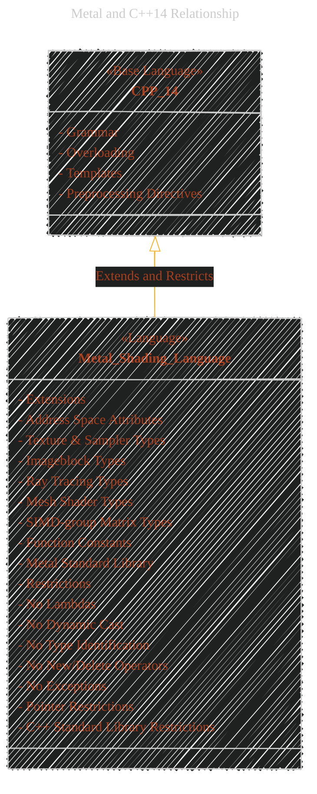
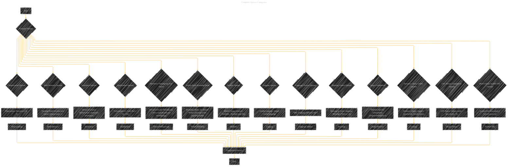

# Metal Shading Language Specification Version 3.2 - by Apple


---

<div align="center">
  <blockquote>
  As a visual learner student, I created these personal study notes from the cited source(s) to aid my understanding.<br/>
  While my firm intention is to provide full credit, the blended format of notes and diagrams may sometimes obscure the original source, for which I apologize.<br/>
  I am committed to making corrections and welcome any feedback.<br/>
  This is a non-commercial project for my humble educational purposes only since the start.<br/>
  My goal is to share my perspective and contribute to the great work already being done.
  <br/>
  <br/>
  I want to extend my genuine apologies to the creators of the original material.<br/>
  Their work was the direct inspiration for this project, and I adapted it without first reaching out.<br/>
  My intent comes from a place of deep respect, and I hope this is received in the spirit of homage.<br/>
  🙏🏼🙏🏼🙏🏼🙏🏼
  </blockquote>
</div>

----


Below is a collection of diagrams and illustrations on explaining Metal Shading Language accordingly to the original Apple specification documentation version 3.2 at [here](https://developer.apple.com/metal/Metal-Shading-Language-Specification.pdf).


---


## 1. Document Organization

This diagram visually represents the hierarchical structure of the MSL specification document, outlining the main chapters and their focus areas.


---

## 2. Metal and C++14 Relationship

This diagram illustrates how Metal Shading Language is based on C++14, highlighting the extensions and restrictions that MSL imposes.




----

# 3. Compiler Options Categories


This diagram categorizes the different compiler options available for MSL, illustrating the control that developers have over the compilation process.




----


## 4. Metal Data Types Hierarchy


This diagram organizes the various data types in Metal Shading Language into a class hierarchy, reflecting their categories and relationships.

```mermaid
---
title: "Metal Data Types Hierarchy"
config:
  layout: elk
  look: handDrawn
  theme: dark
---
%%%%%%%% Mermaid version v11.4.1-b.14
%%{
  init: {
    "classDiagram": { "htmlLabels": false },
    'fontFamily': 'Fantasy',
    'themeVariables': {
      'primaryColor': '#BB2528',
      'primaryTextColor': '#f529',
      'primaryBorderColor': '#7C0000',
      'lineColor': '#F8B229',
      'secondaryColor': '#006100',
      'tertiaryColor': '#fff'
    }
  }
}%%
classDiagram
    class Data_Type {
        <<Abstract Class>>
        Name
        Description
    }
    class Scalar_Types {
        <<Category>>
        - bool
        - char, schar, uchar
        - short, ushort
        - int, uint
        - long, ulong
        - half, bfloat, float
        - void
        - size_t, ptrdiff_t
    }
    class Vector_Types {
        <<Category>>
        - booln, charn, ucharn, shortn, ushortn, intn, uintn, longn, ulongn, halfn, bfloatn, floatn (n=2,3,4)
        - packed_charn, packed_ucharn, packed_shortn, packed_ushortn, packed_intn, packed_uintn, packed_halfn, packed_bfloatn, packed_floatn, packed_longn (n=2,3,4)
        - vec<T,n>, packed_vec<T,n>
    }
    class Matrix_Types {
        <<Category>>
        - halfnxm, floatnxm (n,m=2,3,4)
        - matrix<T,c,r>
        - simdgroup_half8x8, simdgroup_bfloat8x8, simdgroup_float8x8
    }
    class Texture_Types {
        <<Category>>
        - texture1d<T>, texture1d_array<T>
        - texture2d<T>, texture2d_array<T>, texture2d_ms<T>, texture2d_ms_array<T>
        - texture3d<T>
        - texturecube<T>, texturecube_array<T>
        - depth2d<T>, depth2d_array<T>, depth2d_ms<T>, depth2d_ms_array<T>
        - depthcube<T>, depthcube_array<T>
        - texture_buffer<T>
    }
    class Sampler_Type {
        <<Category>>
        - sampler
    }
    class Pixel_Data_Types {
        <<Category>>
        - r8unorm<T>, r8snorm<T>
        - r16unorm<T>, r16snorm<T>
        - rg8unorm<T>, rg8snorm<T>
        - rg16unorm<T>, rg16snorm<T>
        - rgba8unorm<T>, srgba8unorm<T>, rgba8snorm<T>
        - rgba16unorm<T>, rgba16snorm<T>
        - rgb10a2<T>, rg11b10f<T>, rgb9e5<T>
    }
    class Atomic_Types {
        <<Category>>
        - atomic<T> (T=int, uint, bool, ulong, float)
        - atomic_int, atomic_uint, atomic_bool, atomic_ulong, atomic_float (aliases)
    }
    class Buffer_Type {
        <<Category>>
        - buffer (pointers to device, constant, threadgroup memory)
        - argument_buffer
    }
    class Imageblock_Type {
        <<Category>>
        - imageblock<T, L>
    }
    class Ray_Tracing_Types {
        <<Category>>
        - ray
        - intersection_function_table
        - intersection_result
        - intersection_result_ref
        - intersector
        - acceleration_structure
        - intersection_query
    }
     class Mesh_Shader_Types {
        <<Category>>
        - mesh_grid_properties
        - mesh<V, P, NV, NP, t>
    }
    class Uniform_Type {
        <<Category>>
        - uniform<T>
    }
    class Visible_Function_Table_Type {
        <<Category>>
        - visible_function_table<T>
    }

    Data_Type <|-- Scalar_Types
    Data_Type <|-- Vector_Types
    Data_Type <|-- Matrix_Types
    Data_Type <|-- Texture_Types
    Data_Type <|-- Sampler_Type
    Data_Type <|-- Pixel_Data_Types
    Data_Type <|-- Atomic_Types
    Data_Type <|-- Buffer_Type
    Data_Type <|-- Imageblock_Type
    Data_Type <|-- Ray_Tracing_Types
    Data_Type <|-- Mesh_Shader_Types
    Data_Type <|-- Uniform_Type
    Data_Type <|-- Visible_Function_Table_Type
    
```




----

## 5. Address Spaces and Memory Model (Component Diagram) - TODO

This diagram componentizes the different address spaces in MSL and their relationship to memory and access permissions.

```mermaid
componentDiagram
    component Device_Address_Space {
        Memory_Pool [Device Memory]
        Access_Permissions [Read & Write]
        Lifespan [App Memory Allocation]
        Data_Types [Basic, Vector, Matrix, Aggregates]
    }
    component Constant_Address_Space {
        Memory_Pool [Device Memory (Read-Only)]
        Access_Permissions [Read-Only]
        Lifespan [Program Lifetime]
        Initialization [Required at Declaration (Core Constant Expression)]
        Data_Types [Basic, Vector, Matrix, Aggregates]
    }
    component Thread_Address_Space {
        Memory_Pool [Per-Thread Memory]
        Access_Permissions [Thread-Local]
        Lifespan [Function Call]
        Allocation [Automatic (Function Variables)]
        Data_Types [Basic, Vector, Matrix, Aggregates]
    }
    component Threadgroup_Address_Space {
        Memory_Pool [Threadgroup Shared Memory]
        Access_Permissions [Threadgroup Shared]
        Lifespan [Threadgroup Execution]
        Allocation [Explicit (threadgroup keyword)]
        Data_Types [Basic, Vector, Matrix, Aggregates, Imageblocks]
    }
    component Ray_Data_Address_Space {
        Memory_Pool [Ray-Tracing Function Local Memory]
        Access_Permissions [Intersection Function Access]
        Lifespan [Intersection Function Call]
        Purpose [Custom Ray Payload]
        Data_Types [Limited Set (No Atomics, Imageblocks)]
    }
    component Object_Data_Address_Space {
        Memory_Pool [Object Function Local Memory]
        Access_Permissions [Mesh Function Payload]
        Lifespan [Object Function Execution]
        Purpose [Mesh Shader Payload]
        Data_Types [Limited Set (No Atomics, Imageblocks)]
    }
    component Threadgroup_Imageblock_Address_Space {
        Memory_Pool [Threadgroup Imageblock Memory]
        Access_Permissions [Tile Function Access]
        Lifespan [Tile Shading Function Execution]
        Purpose [2D Image Data Processing in Tiles]
        Data_Types [Scalar, Vector, Pixel, Arrays, Structures]
    }

    Device_Address_Space --|> Memory_Model [Metal Memory Model]
    Constant_Address_Space --|> Memory_Model
    Thread_Address_Space --|> Memory_Model
    Threadgroup_Address_Space --|> Memory_Model
    Ray_Data_Address_Space --|> Memory_Model
    Object_Data_Address_Space --|> Memory_Model
    Threadgroup_Imageblock_Address_Space --|> Memory_Model
```

----

## 6. Function Types and Attributes (Sequence Diagram)


This diagram illustrates different types of MSL functions and the attributes that define their roles and execution contexts within the Metal pipeline.


These diagrams provide a semantic and strategic visual overview of the Metal Shading Language Specification document. Each diagram is designed to highlight specific aspects of MSL and their underlying technical complexities, following the instructions and guidelines provided. They should be helpful for anyone trying to understand and navigate the MSL specification.


---