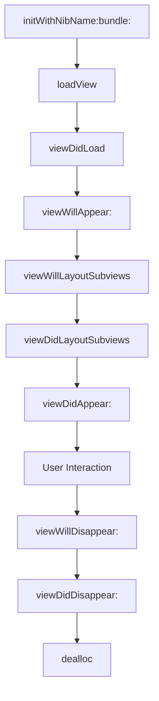

# The Objective-C View Controller - The standalone view controller

```mermaid
flowchart TD
    A[initWithNibName:bundle:] --> B[loadView]
    B --> C[viewDidLoad]
    C --> D[viewWillAppear:]
    D --> E[viewWillLayoutSubviews]
    E --> F[viewDidLayoutSubviews]
    F --> G[viewDidAppear:]
    G --> H[User Interaction]
    H --> I[viewWillDisappear:]
    I --> J[viewDidDisappear:]
    J --> K[dealloc]

```

---
