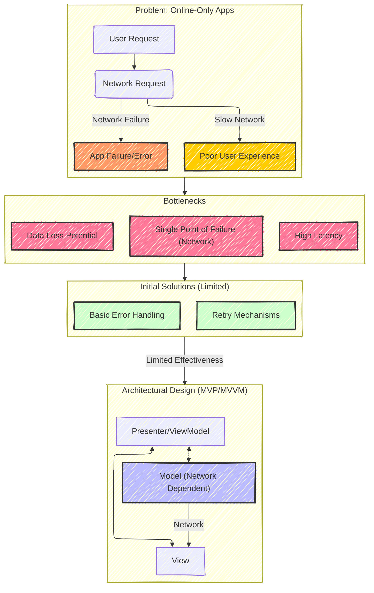
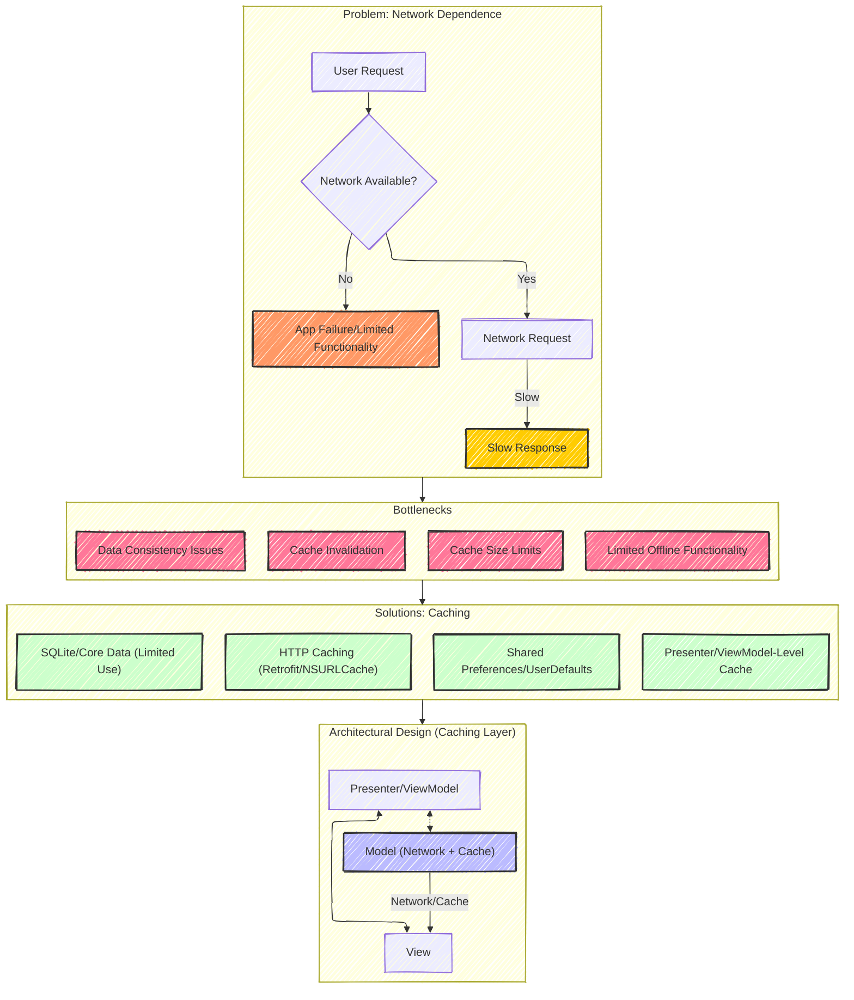
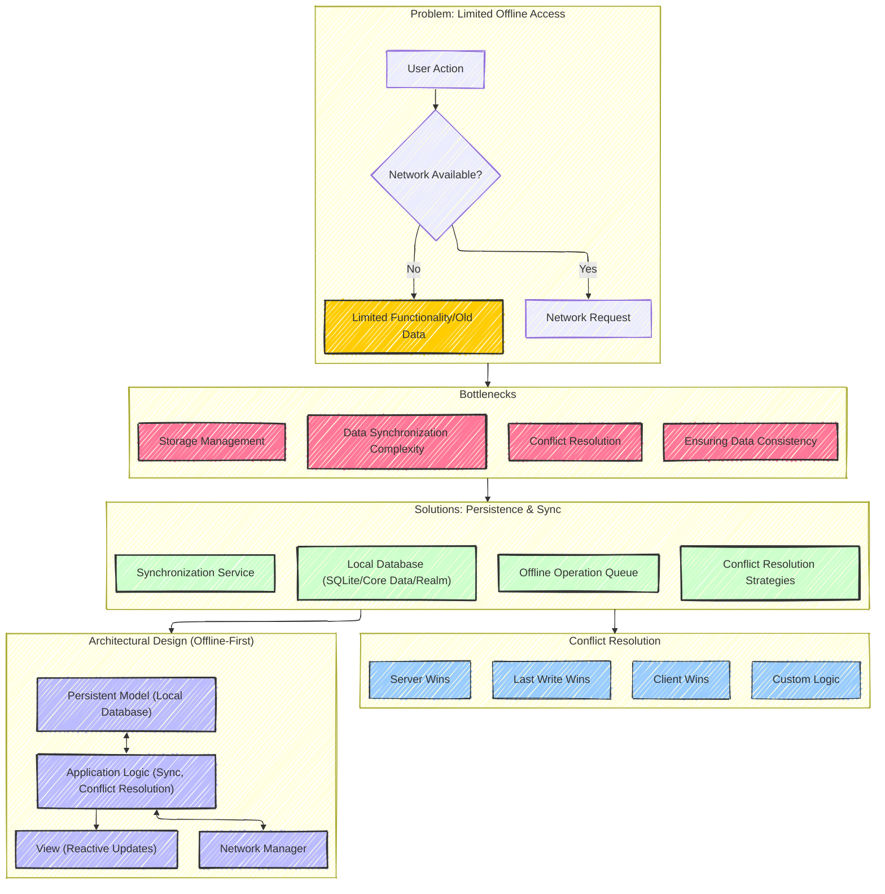
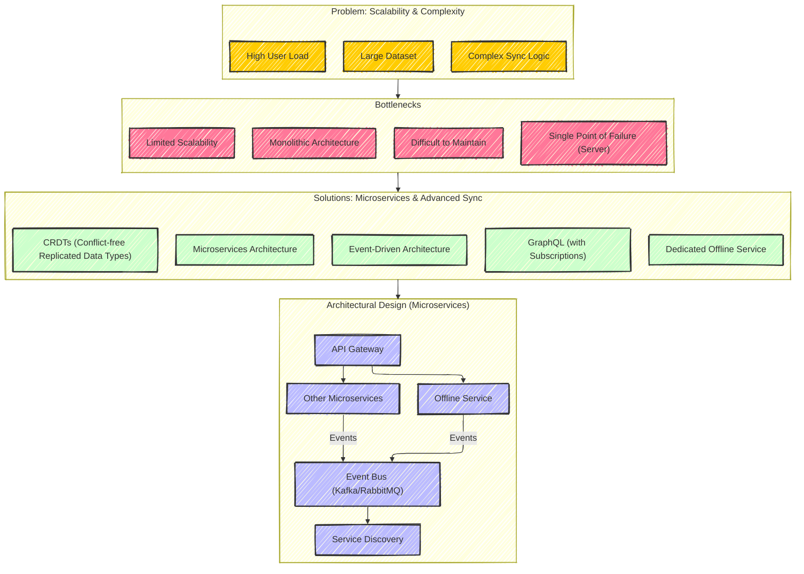

# Offline App Architecture Evolution in Mobile App - A Diagrammatic Guide
> This content is dual-licensed under your choice of the following licenses:
> 1.  **MIT License:** For the code implementations in Swift and Mermaid provided in this document.
> 2.  **Creative Commons Attribution 4.0 International License (CC BY 4.0):** For all other content, including the text, explanations, and the Mermaid diagrams and illustrations.

---

## 1. Evolution Stage 1: Online-Only Apps

**Explanation:**

*   **Problem:**  This section illustrates the fundamental issue with online-only applications: complete reliance on network connectivity.  Network failures or slow connections lead directly to app failures or a degraded user experience.
*   **Bottlenecks:** Highlights the core limitations: a single point of failure (the network), high latency, and potential for data loss.
*   **Solutions (Initial):**  Early attempts to mitigate these issues were limited, primarily focusing on basic error handling and retry mechanisms. These were often insufficient.
*   **New Architectural Design (MVP/MVVM):** The diagram shows a basic Model-View-Presenter (MVP) or Model-View-ViewModel (MVVM) architecture.  *Crucially*, the Model is still entirely network-dependent. This represents a *structural* improvement (separation of concerns) but doesn't solve the offline problem.

---

## 2. Evolution Stage 2: Caching Architectures

**Explanation:**

*   **Problem:**  Continues to highlight the issue of network dependence, even with basic error handling.
*   **Bottlenecks:** Introduces the limitations of caching:
    *   **Cache Invalidation:** Keeping the cache up-to-date.
    *   **Cache Size Limits:**  Mobile devices have limited storage.
    *   **Data Consistency:**  Ensuring the cached data is consistent with the server.
    *   **Limited Offline Functionality:** Caching only provides a partial solution.
*   **Solutions:** Various caching mechanisms are introduced: HTTP caching, shared preferences, limited use of databases, and caching within the Presenter/ViewModel.
*   **New Architectural Design:**  The Model now incorporates a caching layer, providing *some* offline capability, but still primarily relies on the network.

---

## 3. Evolution Stage 3: Persistent Offline Architecture

**Explanation:**

*   **Problem:**  The remaining issue is limited offline access; caching only provides a temporary solution.
*   **Bottlenecks:** Introduces the challenges of a fully offline-capable architecture:
    *   **Data Synchronization Complexity:** The logic for synchronizing data can be intricate.
    *   **Conflict Resolution:**  Handling situations where data is modified both locally and on the server.
    *   **Storage Management:** Efficiently managing local storage.
    *   **Ensuring Data Consistency:** Maintaining data integrity across the device and server.
*   **Solutions:**  Key components of an offline-first architecture:
    *   **Local Database:**  A robust local database (SQLite, Core Data, Realm) is essential.
    *   **Offline Operation Queue:**  A queue to manage operations performed while offline.
    *   **Synchronization Service:**  A dedicated service to handle data synchronization.
    *   **Conflict Resolution Strategies:** Various approaches to resolving data conflicts.
*   **New Architectural Design (Offline-First):**  The Model is now *primarily* based on a local, persistent data store. Application logic handles synchronization and conflict resolution. The View uses reactive updates to reflect changes in the local data.

---

## 4. Evolution Stage 4: Advanced Sync & Microservices (Optional)

**Explanation:**

*   **Problem:** This stage addresses the challenges of scale and complexity that arise in large, data-intensive applications with sophisticated offline requirements.
*   **Bottlenecks:** The limitations of a monolithic architecture become apparent:
    *   **Monolithic Architecture:**  A single, large codebase becomes difficult to manage.
    *   **Difficult to Maintain:**  Changes in one part of the application can have unintended consequences elsewhere.
    *   **Limited Scalability:** Scaling the entire application becomes challenging.
    *   **Single Point of Failure (Server):**  The server remains a potential bottleneck.
*   **Solutions:** Advanced techniques are introduced:
    *   **Microservices Architecture:**  Breaking down the application into smaller, independent services.
    *   **Event-Driven Architecture:**  Services communicate through asynchronous events, improving decoupling and resilience.
    *   **CRDTs:**  Data structures designed for automatic conflict resolution in distributed systems.
    *   **GraphQL (with Subscriptions):**  Efficient data fetching and real-time updates.
    *   **Dedicated Offline Service:** A microservice specifically responsible for managing offline data and synchronization.
*   **New Architectural Design (Microservices):**  The architecture shifts to a microservices-based approach:
    *   **API Gateway:**  A single entry point for client requests.
    *   **Offline Service:**  Handles offline data and synchronization.
    *   **Other Microservices:**  Other services handle specific functionalities (e.g., user authentication, product catalog, etc.).
    *   **Event Bus:**  Facilitates communication between services.
    *   **Service Discovery:**  Allows services to locate each other dynamically.

---

## 5. Synchronization Detail: Pull vs. Push vs. Hybrid - Sequence Diagram

**Explanation:**

This sequence diagram clarifies the differences between three common synchronization approaches:

*   **Pull Synchronization:**
    *   The client *periodically* requests updates from the server.
    *   The server checks for changes since the client's last sync (using a timestamp or version number).
    *   If changes are found, the server sends a *delta* (the changes) to the client.
    *   If no changes are found, the server sends a "no updates" response.
    *   **Advantages:** Simple to implement, client controls the sync frequency.
    *   **Disadvantages:** Can be inefficient if data changes frequently, potential for delays in receiving updates.

*   **Push Synchronization:**
    *   The server *pushes* updates to the client whenever data changes.
    *   Often uses a push notification service (e.g., Firebase Cloud Messaging, Apple Push Notification service).
    *   The client may need to request the full data after receiving a push notification, depending on the notification payload.
    *   **Advantages:** Real-time updates, efficient for frequently changing data.
    *   **Disadvantages:** More complex to implement, requires a persistent connection or push notification infrastructure, can drain battery if not managed carefully.

* **Hybrid Synchronization**:
   * Combines pull and push techniques.
   * Pull Sync: The client periodically requests updates from the server, and the server responds with either the updates.
   * Push Sync: The server initiates a data push only when certain critical conditions are met.
   * **Advantages**: Combines benefits from both pull and push synchronization, adaptable to different data update requirements.
   * **Disadvantages**: Higher complexity due to coordination with both Push and Pull approach synchronization.

---
**Licenses:**

- **MIT License:**   - Full text in [LICENSE](LICENSE) file.
- **Creative Commons Attribution 4.0 International:**  - Legal details in [LICENSE-CC-BY](LICENSE-CC-BY) and at [Creative Commons official site](http://creativecommons.org/licenses/by/4.0/).

---