# Offline Mobile App Architectures for iOS and Android Apps
> This content is dual-licensed under your choice of the following licenses:
> 1.  **MIT License:** For the code implementations in Swift and Mermaid provided in this document.
> 2.  **Creative Commons Attribution 4.0 International License (CC BY 4.0):** For all other content, including the text, explanations, and the Mermaid diagrams and illustrations.

---

Below is a collection of diagrams and illustrations on explaining Offline Mobile App Architecture for iOS and Android based on the article at [here](https://www.simform.com/blog/offline-mobile-app-architectures-ios-android/).

----

## 1. Main Architecture Flow

```mermaid
---
config:
  layout: elk
  look: handDrawn
  theme: dark
---
graph LR
    A["Offline Mobile App Architecture"];
    B{"Problem Statement"};
    B1["Network Unreliability"];
    B2["Low Bandwidth"];
    B3["Battery Constraints"];
    B4["Global User Base"];

    C{"Offline Categories"};
    C1["Data Stored Offline<br>(No Editing)"];
    C1a["Example:<br>GPS in Uber App"];
    C2["Offline Editing & Online Sync"];
    C2a["Example:<br>Note-Taking App<br>(Google Keep)"];
    C3["Offline Editing of Shared Data"];
    C3a["Example:<br>Google Docs"];

    D{"Architecture Evolution"};

    E["Trello's Offline Journey"];
    E1["Initial Architecture<br>(Online-Dependent)"];
    E2["Offline-FirstArchitecture<br>(Local Database)"];

    F["Application Architecture<br>(Without Offline)"];
    G{"Model-View-Presenter<br>(MVP)"};
    G1[Model:<br>Network/Server Dependency];
    G2["View:<br>UI Rendering"];
    G3["Presenter:<br>Handles data and interaction between the models and views"];

    H{"UI Behavior<br>(Without Network)"};
    H1["Stalled UI, No Response"];
    I{"Improvement:<br>Model Introduction"};
    I1["Local Model, Immediate UI Feedback"];
    I2["Comment Example"];

    J["Offline Architecture #2 & #3:<br>Caching"];

    K{"Cache Implementation"};
    K1["Shared Preferences<br>(Android)"];
    K2["SQLite Database<br>(Android)"];

    L{"Dedicated Cache Service"};
    L1["HTTP Request Caching"];
    L2["Presenter-Level Cache"];


    M{"Challenges with Caching"};
    M1["Edge Cases"];
    M2["SQLite Heavy & Migration"];
    
    N{"Performance Comparison"};
    N1["HTTP Cache:<br>O(1)"];
    N2["SQLite Database:<br>O(n²)"];
    N3["Shared Preferences:<br>O(n)"];

    O["Offline Architectures #4 & #5:<br>HTTP Caching with Retrofit"];
    
    P{"Retrofit Configuration"};
    P1["Custom HTTP Client"];
    P2["Cache Size Definition"];
    P3["Interceptor for Cache Retrieval"];

    Q{"Code Complexity"};
    Q1["HTTP Cache:<br>O(1)"];
    Q2["SQLite:<br>O(n²)"];
    Q3["Shared Preferences:<br>O(n)"];
    R{"Limitations of HTTP Caching"};
    R1["Background App Kill<br>(Android)"];
    R2["Cached Data Disappearance"];
    S["Lessons from Path App"];
    S1["Android vs iOS Discrepancies due to Network issue"];
    S2["1-Star Reviews and User Complaints"];

    T["Persistent Offline Architecture"];
    
    U{"Persistent Model"};
    U1["Data Persistence on Disk<br>(Local Database)"];
    U2["Application Logic<br>(Network Calls, Data Updates)"];
    U3["Event-Driven Views"];

    V["Optimizations:<br>Network Queue"];

    W["Default Network Queue"];
    W1["Slow Network Delays Local Operations"];

    X["Separated Network &<br>Local Queues"];
    X1["Instant Local Feedback, Independent Network Operations"];

    Y["Evolving Offline Sync Architecture<br>(Sync Job)"];

    Z{"Sync Service Introduction"};
    Z1["Program for Network Synchronization"];
    Z2["Ahead-of-Time &<br>Store-and-Forward Approach"];

    AA{"Architecture Comparison"};
    AA1["Persistent Architecture<br>(On-Demand)"];
    AA2["Sync Architecture<br>(Ahead-of-Time)"];
    
    AB["What Architecture to Use"];
    AC{"On-Demand"};

    AC1["E-commerce, Realtime Apps, News, Maps"];
    AD{"Ahead-of-Time"};

    AD1["Note-taking, Email, Weather, Finance, Messaging"];
    AE["Offline Considerations"];

    AF{"Key Challenges"};
    AF1["Data Caching Strategy"];
    AF2["Caching Reliability"];
    AF3["Concurrency Handling"];
    AF4["Data Conflict Resolution"];
    AF5["Connectivity Change Handling"];

    A --> B
    B --> B1
    B --> B2
    B --> B3
    B --> B4
    
    A --> C
    C --> C1
    C --> C1a
    C --> C2
    C --> C2a
    C --> C3
    C --> C3a

    A --> D
    D --> E
    E --> E1

    E --> E2
 
    F --> G
    G --> G1
    G --> G2
    G --> G3
    
    F --> H
 
    H --> H1
    H --> I
    I --> I1
    
    I --> I2
    
    J --> K
    
    K --> K1
    K --> K2

    J --> L
    L --> L1
    L --> L2
  
    J --> M
    M --> M1
    M --> M2
    
    J --> N
    N --> N1
    N --> N2
    N --> N3
    
    O --> P
    P --> P1
    P --> P2
    P --> P3

    P --> Q
    Q --> Q1
    Q --> Q2
    Q --> Q3
    O --> R
    R --> R1
    R --> R2
    R --> S
    S --> S1
    S --> S2
    
    T --> U
    U --> U1
    
  
    U --> U2
    U --> U3
    
    V --> W
    
    
    W --> W1
    W --> X

    X --> X1

    Y --> Z
    
    Z --> Z1
    Z --> Z2
    
    Y --> AA
    AA --> AA1
    AA --> AA2
    AB --> AC
   
    AC --> AC1
    AC --> AD
   
    AD --> AD1
    AE --> AF
    
    AF --> AF1
    AF --> AF2
    AF --> AF3
    AF --> AF4
    AF --> AF5

    style E1 fill:#f395,stroke:#333,stroke-width:2px
    style E2 fill:#c3c5,stroke:#333,stroke-width:2px
    style G fill:#c3c5,stroke:#333,stroke-width:2px
    style H fill:#f395,stroke:#333,stroke-width:2px
    style I fill:#c3c5,stroke:#333,stroke-width:2px
    style L fill:#c3c5,stroke:#333,stroke-width:2px
    style U fill:#c3c5,stroke:#333,stroke-width:2px
    style W fill:#f395,stroke:#333,stroke-width:2px
    style X fill:#c3c5,stroke:#333,stroke-width:2px
    style Z fill:#c3c5,stroke:#333,stroke-width:2px
    style AC fill:#c3c5,stroke:#333,stroke-width:2px
    style AD fill:#c3c5,stroke:#333,stroke-width:2px

```

### Explanation
This flowchart visually traces the entire architecture of a mobile application designed for offline usage, mapping out the stages of architectural evolution from basic online-dependent designs to more sophisticated, robust systems. It begins by acknowledging the prevalent issues in mobile environments, such as inconsistent network connectivity and the need for efficient operation with limited resources, and proceeds to classify different levels of offline functionality. It progresses through the architectural evolution, including detailed illustrations of critical modifications and optimizations. Moreover, the flowchart provides a comparative analysis to assist in the decision-making process for architectural selection, taking into account factors like data accessibility, user experience, and potential complexity.

This flowchart outlines the overall structure of offline mobile app architecture, starting with the problem statement (network unreliability, etc.). It branches into the classification of offline app categories and then charts the evolution of architectural approaches, focusing on the key aspects like persistent storage, the introduction of queue separation, and sync services. It also highlights the key factors when choosing an offline architecture.

---

## 2. Comment Posting Sequence

### Explanation

This diagram details the sequential steps involved in posting a comment. It highlights various phases, from the initial user action to the update of UI elements. In addition, the emphasis is on how the operation is managed in situations with and without network access.
This diagram depicts the sequence of steps involved in the process of a user posting a comment, including handling network availability or unavailability.  It demonstrates data persistence and eventual synchronization.

---

## 3. Data Sync State

### Explanation 

By depicting the possible states of comment synchronization, this state diagram demonstrates the management of data during the process. It demonstrates the procedures from making a comment, saving the content locally, and making an attempt to sync over the network.
This state diagram outlines the different states in the life-cycle of a data sync operation. It covers all the states that the comment data goes through from being typed, stored locally, attempting a network sync, and then either succeeding or failing.

----

## 4. Entity Relationship

### Explanation 
This is an entity-relationship diagram illustrating the relationships between the core components of the application: User, UI, Application Logic, Persistent Model and the Network. It shows who uses who to better illustrate flow.

----

## 5. Architecture Distribution

### Explanation

Demonstrates the relative popularity of various architectures, demonstrating each option's advantages and disadvantages.

---
**Licenses:**

- **MIT License:**   - Full text in [LICENSE](LICENSE) file.
- **Creative Commons Attribution 4.0 International:**  - Legal details in [LICENSE-CC-BY](LICENSE-CC-BY) and at [Creative Commons official site](http://creativecommons.org/licenses/by/4.0/).

---