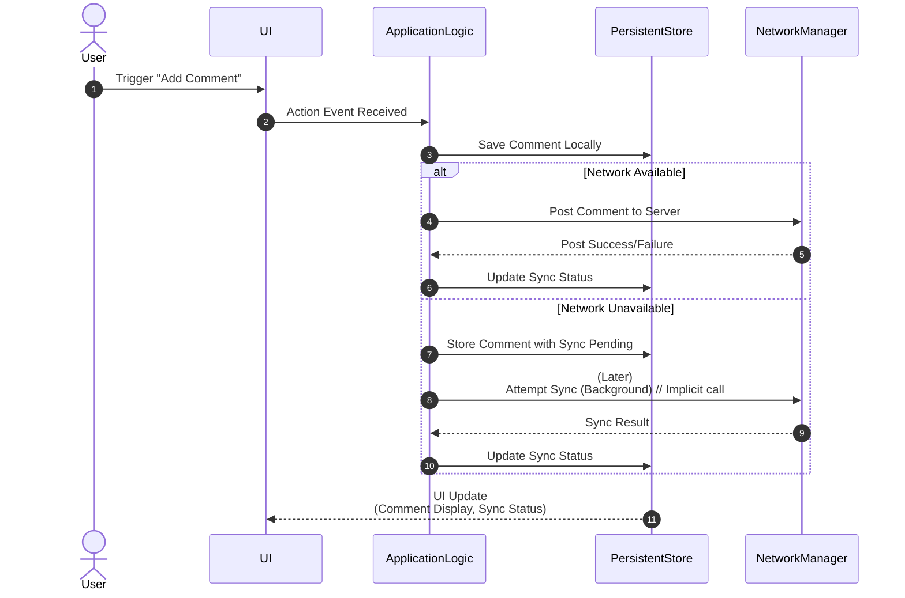
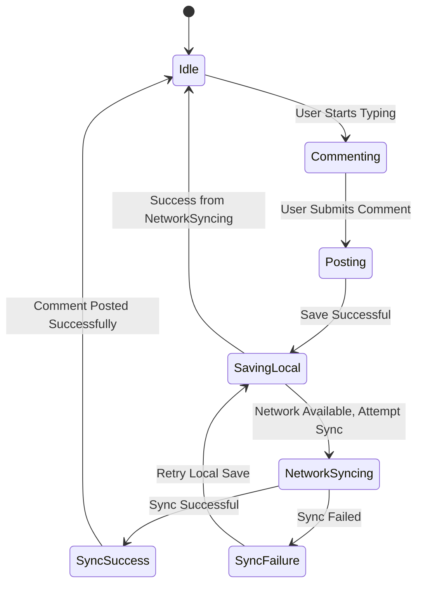
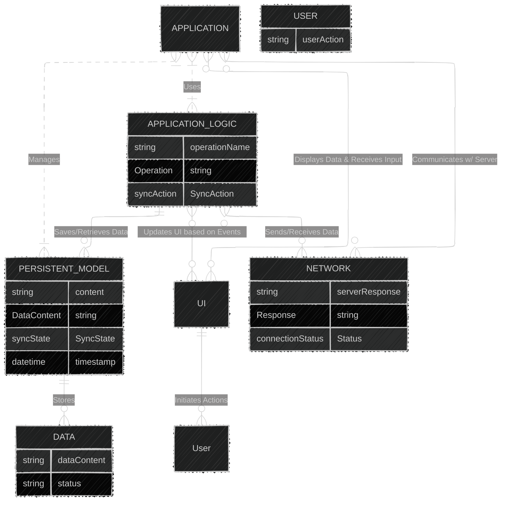
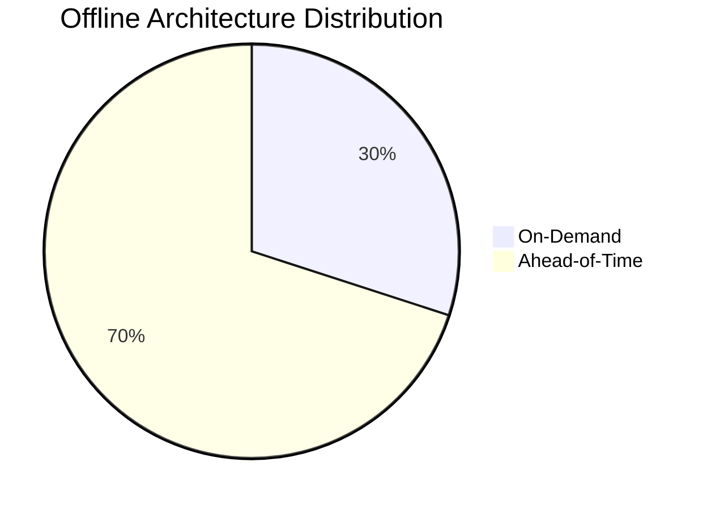

# Offline Mobile App Architectures for iOS and Android Apps
> This content is dual-licensed under your choice of the following licenses:
> 1.  **MIT License:** For the code implementations in Swift and Mermaid provided in this document.
> 2.  **Creative Commons Attribution 4.0 International License (CC BY 4.0):** For all other content, including the text, explanations, and the Mermaid diagrams and illustrations.

---

Below is a collection of diagrams and illustrations on explaining Offline Mobile App Architecture for iOS and Android based on the article at [here](https://www.simform.com/blog/offline-mobile-app-architectures-ios-android/).

---

## 1. Main Architecture Flow - Detailed and Comprehensive

```mermaid
---
config:
  layout: elk
  look: handDrawn
  theme: dark
  nodeSep: 150
---
graph LR
    subgraph Problem["Problem: Offline App Challenges"]
        NetworkUnreliability[Network Unreliability]:::problem
        LowBandwidth[Low Bandwidth]:::problem
        BatteryConstraints[Battery Constraints]:::problem
        GlobalUserBase[Global User Base]:::problem
        NetworkUnreliability --> LowBandwidth
        LowBandwidth --> BatteryConstraints
        BatteryConstraints --> GlobalUserBase
    end
    subgraph OfflineCategories["Offline App Categories"]
        DataNoEdit["Data Stored Offline (No Editing)"]:::category
        DataNoEditDesc["Example: GPS Data (Uber)"]:::example
        OfflineEditSync[Offline Editing & Online Sync]:::category
        OfflineEditSyncDesc["Example: Note-Taking (Google Keep)"]:::example
        SharedDataEdit[Offline Editing of Shared Data]:::category
        SharedDataEditDesc["Example: Google Docs"]:::example
        DataNoEdit --> DataNoEditDesc
        OfflineEditSync --> OfflineEditSyncDesc
        SharedDataEdit --> SharedDataEditDesc
    end

    subgraph Evolution["Architecture Evolution"]
        TrelloJourney[Trello's Offline Journey]:::evolution
        NoOfflineArch["Application Architecture (No Offline)"]:::architecture
        CachingArch["Caching Architectures"]:::architecture
        PersistentArch[Persistent Offline Architecture]:::architecture
        SyncArch["Evolving Sync Architecture (Sync Job)"]:::architecture

        TrelloJourney --> NoOfflineArch
        NoOfflineArch --> CachingArch
        CachingArch --> PersistentArch
        PersistentArch --> SyncArch
    end

    subgraph Trello["Trello's Journey"]
        TrelloInitial["Initial Architecture (Online-Dependent)"]:::archived
        TrelloOfflineFirst["Offline-First Architecture (Local Database)"]:::current
        TrelloInitial-- "Users Complained" --> TrelloOfflineFirst
    end
    subgraph NoOffline["Application Architecture (Without Offline)"]
        MVP["MVP (Model-View-Presenter)"]:::arch
        NetworkDepModel["Model: Network/Server Dependency"]:::model
        ViewUI["View: UI Rendering"]:::view
        PresenterHandlesData["Presenter: Handles data and interaction"]:::presenter
          MVP --> NetworkDepModel
          MVP --> ViewUI
          MVP --> PresenterHandlesData
          NetworkDepModel -- "No Network" --> UIStuck["UI Stalled/Frozen"]:::problem
    end
    subgraph Improve["Architecture Improvement (Model Introduction)"]
      LocalModel_ImmediateFeedback[Local Model: Immediate UI Feedback]:::improvement
      CommentExample["Example: Commenting"]:::exampleIM
      LocalModel_ImmediateFeedback--> CommentExample
    end

    subgraph Caching["Caching Architectures"]
      SharedPref["Shared Preferences (Android)"]:::cacheTech
      SQLiteDB["SQLite Database (Android)"]:::cacheTech
      CacheService["Dedicated Cache Service"]:::archCache
      PresLevelCache["Presenter-Level Cache"]:::archCache
      CacheService --> HTTPReqCaching["HTTP Request Caching"]:::cacheMethod
      PresLevelCache --> HTTPReqCaching
        SharedPref -- "Problems" -->  EdgeCases["Edge Cases Handling"]:::problemCaching
        SQLiteDB -- "Problems" --> SQLiteisHeavy["Migration Difficulties"]:::problemCaching
    end

    subgraph RetrofitArch["Retrofit Caching (Example)"]
        RetrofitClient["Custom HTTP Client"]:::retrofitComp
        CacheSize["Cache Size Definition (~50MB)"]:::retrofitComp
        CacheInterceptor["Interceptor for Cache Retrieval"]:::retrofitComp
        RetrofitClient --> CacheSize
        RetrofitClient --> CacheInterceptor
    end
    subgraph HttpCache["HTTP Caching Issues"]
        BackgroundKill["App Killed in Background (Android)"]:::problemHC
        CachedDataDisappear[Cached Data Disappears]:::problemHC
        AppKilledIssues["App Killed in Background (Android)"]:::problemHC
        AppKilledIssues -- "User Returns" --> CachedDataDisappear
    end

     subgraph PathApp["Lessons from Path App"]
        PathAndroidFail["Android Users Failing to Post"]:::failPath
        PathIOSLowEngagement["iOS Low Engagement"]:::failPath
        PathAPIFocus["Focus on API Parts"]:::pathSol
        PathAndroidFail --"Network Issues" -->  PathAPIFocus
        PathIOSLowEngagement --"Network Issues" --> PathAPIFocus
    end
    subgraph Persistent["Persistent Offline Architecture"]
      PersistentModel_PersData["Persistent Model: Data on Disk"]:::persistComp
      ApplicationLogic_NetworkCalls["Application Logic: Network Calls, Data Updates"]:::persistComp
      EventDrivenViews["Event-Driven Views"]:::persistComp
        PersistentModel_PersData --> ApplicationLogic_NetworkCalls
        PersistentModel_PersData --> EventDrivenViews
      CommentAdd["Comment Add Scenario"]:::examplePersist
      CommentAdd -- "UI Action" --> ViewCommunicate["View Communicates.."]
      ViewCommunicate -- "App Logic" --> ApplicationLogic_NetworkCalls
      ApplicationLogic_NetworkCalls --"Persist" --> PersistentModel_PersData
      PersistentModel_PersData -- "Updates" --> EventDrivenViews
    end

    subgraph Opti["Optimizations (Network Queue)"]
          DefaultQueue["Default Queue (Slow Network Delays Local Operations)"]:::queueStyle
          SeperateQueues[Separated Network & Local Queues]:::queueStyle
          DefaultQueue -- "Slow Net" --> NetworkDelaysLocal["Local Operations Delayed"]:::problemQueue
          SeperateQueues --> InstantLocalFeedback["Instant Local Feedback"]:::solutionQueue
          InstantLocalFeedback -- "Independent Actions" --> NetworkActions:::queueActions

    end

    subgraph SyncJob["Evolving Offline Sync Architecture (Sync Job)"]
        SyncService["Sync Service (Synchronization)"]:::syncComp
        StoreForward["Ahead-of-Time & Store-and-Forward"]:::syncComp
        SyncService-- "Network Sync" -->  StoreForward
    end

    subgraph WhatsBest["What Architecture to Use?"]
      OnDemandArch["On-Demand"]:::archBest
      AheadOfTimeArch["Ahead-of-Time"]:::archBest
      OnDemandArch -- "Better For" --> EcommerceRealtimeNewsMaps["E-commerce, Realtime Apps, News, Maps"]:::exampleArch
      AheadOfTimeArch -- "Better For" --> NoteTakingEmailWeatherMessaging["Note-taking, Email, Weather, Finance, Messaging"]:::exampleArch
      OnDemandArch -- "Characteristics"  --> FastDataRetrieval["Fast Data Retrieval"]
      OnDemandArch -- "Characteristics" --> BetterConnectivity["Better Connectivity"]
      AheadOfTimeArch -- "Characteristics" --> FastDataRetrieval2["Fast Data Retrieval"]
      AheadOfTimeArch -- "Characteristics" --> CompleteOfflineCapabilities["Complete Offline Capabilities"]
      AheadOfTimeArch -- "Characteristics" --> UISeparation["No Dependency on UI"]
    end

    Problem --> Evolution
 Problem:::problem
 OfflineCategories --> Evolution
    Evolution --> Trello
    Trello --> NoOfflineArch
    NoOfflineArch --> Improve
    Improve --> CachingArch
    CachingArch --> RetrofitArch
    RetrofitArch --> HttpCache
    HttpCache --> PathApp
     PathApp --> Persistent
    Persistent -- "Optimizations" --> Opti
    Opti --> SyncJob
    SyncJob --> WhatsBest
    classDef problem fill:#FF6961,stroke:#333,stroke-width:2px;
    classDef category fill:#ADD8E6,stroke:#333,stroke-width:2px;
    classDef example fill:#90EE90,stroke:#333,stroke-width:2px;
    classDef evolution fill:#F0E68C,stroke:#333,stroke-width:2px;
    classDef architecture fill:#D8BFD8,stroke:#333,stroke-width:2px;
    classDef archived fill:#A9A9A9,stroke:#333,stroke-width:2px;
    classDef current fill:#77DD77,stroke:#333,stroke-width:2px;
    classDef arch fill:#98FB98,stroke:#333,stroke-width:2px;
    classDef model fill:#B0C4DE,stroke:#333,stroke-width:2px;
    classDef view fill:#DAA520,stroke:#333,stroke-width:2px;
    classDef presenter fill:#F08080,stroke:#333,stroke-width:2px;
    classDef improvement fill:#98FB98,stroke:#333,stroke-width:2px;
    classDef exampleIM fill:#90EE90,stroke:#333,stroke-width:2px;
    classDef cacheTech fill:#D3D3D3,stroke:#333,stroke-width:2px;
    classDef archCache fill:#B0E0E6,stroke:#333,stroke-width:2px;
    classDef cacheMethod  fill:#FFA07A,stroke:#333,stroke-width:2px;
    classDef problemCaching fill:#FF6961,stroke:#333,stroke-width:2px;
    classDef retrofitComp fill:#DAA520,stroke:#333,stroke-width:2px;
    classDef problemHC fill:#FF6961,stroke:#333,stroke-width:2px;
    classDef failPath fill:#FF6961,stroke:#333,stroke-width:2px;
    classDef pathSol fill:#90EE90,stroke:#333,stroke-width:2px;
    classDef persistComp fill:#D8BFD8,stroke:#333,stroke-width:2px;
    classDef examplePersist fill:#90EE90,stroke:#333,stroke-width:2px;
    classDef queueStyle fill:#B0C4DE,stroke:#333,stroke-width:2px;
    classDef problemQueue fill:#FF6961,stroke:#333,stroke-width:2px;
    classDef solutionQueue fill:#90EE90,stroke:#333,stroke-width:2px;
     classDef syncComp fill:#D3D3D3,stroke:#333,stroke-width:2px;
     classDef archBest fill:#D8BFD8,stroke:#333,stroke-width:2px;
    classDef exampleArch fill:#ADD8E6,stroke:#333,stroke-width:2px;

```

### Explanation
This comprehensive flowchart encapsulates the key arguments for the necessity of offline capabilities in mobile applications. It breaks down the core problems, categorizes offline functionalities, and then elucidates the evolution through time. The evolution of architecture including MVP, caching, and persistent architectures with queue optimization are the most important highlights. The diagram outlines the factors for choosing one architecture over another, with all the best use cases.

This flowchart comprehensively lays out the progression of offline app architecture, starting from fundamental challenges caused by unreliable networks and resource restrictions. Each component of this architecture is highlighted, including all cache implementations, with a discussion of the benefits and drawbacks of each method for persistence. The flowchart concludes with a practical guide that aids in selecting the most suitable architectural solutions with different contexts.

---

## 2. Comment Posting Sequence - Reactive Approach

### Explanation
This sequence diagram clarifies the dynamic procedure used in a comment posting system to deal with real-time network conditions and data synchronization. The process starts with a user interaction and proceeds with the local storage of comments and network synchronization attempts. If the network is unavailable, the comment is saved locally with the intent of synchronizing at a later time. The user interface is refreshed asynchronously, and sync operations are triggered in the background.

This sequence diagram illustrates the flow of data, including a user action, UI actions, and network communications. It's designed to highlight the event-driven nature of the update process.

---

## 3. Data Sync State - State Diagram Refined

### Explanation
This state diagram provides a concise overview of how data is synchronized within the application to represent network dependability, handling scenarios where synchronization may succeed or fail. The whole comment management workflow is depicted, commencing from an inactive state and then evolving to the creation of a comment, local storage, and network sync, with retries being used if there is a syncing failure.

The state diagram refines the previous version by clarifying states and the transitions in the data-sync process.  It clearly shows the branching paths for success and failure in the sync operations.

---

## 4. Entity Relationship Diagram - More Specific

### Explanation

This diagram indicates the relationship between the core components User, UI, Application Logic, Persistent Model, Network. The main functions or properties of each component and the corresponding information they contain are also listed to provide a detailed, comprehensive overview.

The ERD gives a clear picture of components their interactions, with precise information included for the entities.

---

## 5. Architecture Distribution - Visual Pie Chart

### Explanation
This is a visual representation of architecture proportion. The pie chart is designed to provide an overview with exact measurements.

---
**Licenses:**

- **MIT License:**   - Full text in [LICENSE](LICENSE) file.
- **Creative Commons Attribution 4.0 International:**  - Legal details in [LICENSE-CC-BY](LICENSE-CC-BY) and at [Creative Commons official site](http://creativecommons.org/licenses/by/4.0/).

---