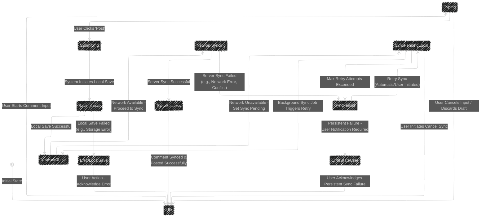

# Offline Mobile App Architectures for iOS and Android Apps
> This content is dual-licensed under your choice of the following licenses:
> 1.  **MIT License:** For the code implementations in Swift and Mermaid provided in this document.
> 2.  **Creative Commons Attribution 4.0 International License (CC BY 4.0):** For all other content, including the text, explanations, and the Mermaid diagrams and illustrations.

---

Below is a collection of diagrams and illustrations on explaining Offline Mobile App Architecture for iOS and Android based on the article at [here](https://www.simform.com/blog/offline-mobile-app-architectures-ios-android/).

---

## 1. Main Architecture Flow

```mermaid
---
config:
  layout: elk
  look: handDrawn
  theme: dark
  nodeSep: 150
---
graph LR
    subgraph Problem["Challenges of Offline Mobile Apps"]
        NetworkIssues[Network Unreliability]:::problem
        BandwidthLimits[Low Bandwidth Conditions]:::problem
        BatteryDrain[Battery Constraints]:::problem
        GlobalReach[Diverse Global User Base]:::problem
        NetworkIssues --> BandwidthLimits
        BandwidthLimits --> BatteryDrain
        BatteryDrain --> GlobalReach
        GlobalReach --> NeedOfflineSupport["Need for Robust Offline Support"]:::problem
    end

    subgraph OfflineCategories["Categorizing Offline App Functionality"]
        DataReadOnly["Data Stored Offline (Read-Only)"]:::category
        DataReadOnlyExamples["Examples:<br/>- GPS Data in Navigation Apps<br/>- Temporary Caching for Display"]:::example
        OfflineEditSync["Offline Edits & Online Sync"]:::category
        OfflineEditSyncExamples["Examples:<br/>- Note-Taking Apps (Google Keep)<br/>- Basic Data Editing with Later Sync"]:::example
        SharedEditConflict["Offline Edits of Shared Data (Conflict Resolution)"]:::category
        SharedEditConflictExamples["Examples:<br/>- Collaborative Docs (Google Docs)<br/>- Complex Sync with Conflict Handling"]:::example
        DataReadOnly --> DataReadOnlyExamples
        OfflineEditSync --> OfflineEditSyncExamples
        SharedEditConflict --> SharedEditConflictExamples
    end

    subgraph ArchEvolution["Architecture Evolution for Offline Capability"]
        InitialTrello[Trello's Initial Online-First Approach]:::archived
        MVPNoOffline["Basic MVP Architecture<br>(No Offline)"]:::architecture
        CacheIntroArch["Caching Architectures<br>(Basic Offline Support)"]:::architecture
        PersistentModelArch["Persistent Model Architecture<br>(Robust Offline)"]:::architecture
        SyncServiceArch["Evolving to Sync Service Architecture<br>(Advanced Sync)"]:::architecture

        InitialTrello --> MVPNoOffline
        MVPNoOffline --> CacheIntroArch
        CacheIntroArch --> PersistentModelArch
        PersistentModelArch --> SyncServiceArch
    end

    subgraph TrelloJourney["Trello's Architectural Transformation"]
        TrelloOnlineFirst["Online-Dependent Architecture<br>(Pre-2016)"]:::archived
        TrelloOnlineFirstDetails["Assumed Constant Network<br/>- Server-Reliant"]:::detailsArchived
        TrelloOfflineFirstArch["Offline-First Architecture<br>(Post-2016)"]:::current
        TrelloOfflineFirstDetails["Local Database Centric<br/>- Full Offline Functionality<br/>- Enhanced User Experience"]:::detailsCurrent
        TrelloOnlineFirst -- "User Complaints:<br>Offline Inaccessibility" --> TrelloOfflineFirstArch
        TrelloOnlineFirst --> TrelloOnlineFirstDetails
        TrelloOfflineFirstArch --> TrelloOfflineFirstDetails
    end

    subgraph NoOfflineMVP["Basic MVP Architecture<br>(No Offline Support)"]
        MVPStructure["MVP Design Pattern"]:::arch
        NetworkDependentModel["Model:<br>Direct Network/Server Dependency"]:::model
        UIRendersView["View:<br>UI Rendering<br>(Data Display)"]:::view
        PresenterInteraction["Presenter:<br>Handles Logic & Data Flow"]:::presenter
          MVPStructure --> NetworkDependentModel
          MVPStructure --> UIRendersView
          MVPStructure --> PresenterInteraction
          NetworkDependentModel -- "Network Interruption" --> UIStuckState["UI Freezes, No Data Display"]:::problemUI
    end

    subgraph ImproveUI["UI Improvement -<br> Model Introduction<br>(Visual Feedback)"]
      LocalModelFeedback["Local Model for Immediate UI Feedback"]:::improvement
      CommentExampleUI["Example:<br>Commenting with Visual Confirmation"]:::exampleIM
      LocalModelFeedback--> CommentExampleUI
      CommentExampleUIDetails["Temporary UI Update<br/>- Color Coded for Sync Status<br/>- Enhanced User Perception"]:::detailsImprove
      CommentExampleUI --> CommentExampleUIDetails
    end

    subgraph CachingArchDetails["Caching Architectures -<br> Levels & Techniques"]
      SharedPrefCache["Shared Preferences<br>(Light Caching - Basic)"]:::cacheTech
      SQLiteCache["SQLite Database (Structured Cache - Medium Complexity)"]:::cacheTech
      DedicatedCacheSrv["Dedicated Cache Service<br>(Centralized Caching)"]:::archCache
      PresenterLevelCacheImpl["Presenter-Level Cache<br>(Localized Caching)"]:::archCache
      DedicatedCacheSrv --> HTTPReqCachingMethod["HTTP Request Caching"]:::cacheMethod
      PresenterLevelCacheImpl --> HTTPReqCachingMethod
        SharedPrefCache -- "Limitations" -->  SharedPrefIssues["Edge Cases, Limited Data, Complexity for Advanced Features"]:::problemCaching
        SQLiteCache -- "Limitations" --> SQLiteIssues["Schema Migrations, Concurrency, Overhead"]:::problemCaching
    end

    subgraph RetrofitCacheExample["Retrofit Caching Implementation"]
        RetrofitCustomClient["Custom Retrofit Client"]:::retrofitComp
        CacheSizeConfig["Cache Size Configuration<br>(e.g., 50MB)"]:::retrofitComp
        CacheInterceptorImpl["Cache Interceptor<br>(Request Handling)"]:::retrofitComp
        RetrofitCustomClient --> CacheSizeConfig
        RetrofitCustomClient --> CacheInterceptorImpl
        RetrofitCacheBenefit["Benefits: Simple HTTP Caching<br/>- Reduces Network Requests"]:::retrofitBenefit
        RetrofitCacheIssue["Limitations:<br>Doesn't Solve All Offline Issues"]:::retrofitIssue
        RetrofitCustomClient --> RetrofitCacheBenefit
        RetrofitCustomClient --> RetrofitCacheIssue

    end

    subgraph HttpCacheLimitations["HTTP Caching Shortcomings<br>(Persistent Access)"]
        AppBackgroundState["App in Background<br>(Android OS)"]:::problemHC
        OSProcessKill["Android OS Kills App Process"]:::problemHC
        CacheInaccessibleRestart["In-Memory Cache Lost on Restart"]:::problemHC
        UserReturnApp["User Re-opens App"]:::problemHC
        CachedDataMissing["Cached Data Not Accessible After Restart"]:::problemHC
        OSProcessKill -- "App Restart" --> CacheInaccessibleRestart
        CacheInaccessibleRestart -- "User Expects Data" --> CachedDataMissing
        CachedDataMissing -- "User Experience" --> UserFrustration["User Frustration,<br>Data Loss Perception"]:::problemUI
    end


     subgraph PathAppLessons["Path App Offline Lessons"]
        PathAndroidFailPost["Android Users Unable to Post"]:::failPath
        PathIOSLowEngagementPosts["iOS Users Low Engagement"]:::failPath
        PathAPIDebugFocus["Initial API Focus<br>(Misdiagnosis)"]:::pathSol
        PathNetworkRealCause["Root Cause:<br>Network Issues in Indonesia"]:::pathSol
        PathAndroidFailPost --"Network Dependent Issues" -->  PathAPIDebugFocus
        PathIOSLowEngagementPosts --"Network Dependent Issues" --> PathAPIDebugFocus
        PathAPIDebugFocus --> PathNetworkRealCause
    end

    subgraph PersistentArchDetails["Persistent Offline Architecture -<br> Core Components"]
      PersistentDataModel["Persistent Model:<br>Local Disk Storage"]:::persistComp
      AppDataLogic["Application Logic:<br>Network & Data Sync"]:::persistComp
      EventDrivenUIViews["Event-Driven UI Views<br>(Reactive Updates)"]:::persistComp
        PersistentDataModel --> AppDataLogic
        PersistentDataModel --> EventDrivenUIViews
      CommentAddExample["'Add Comment' Persistent Scenario"]:::examplePersist
      CommentAddProcess["Process Flow:<br/>1. UI Action -> View Communication<br/>2. View -> Application Logic<br/>3. Application Logic -> Persistent Model (Disk)<br/>4. Persistent Model -> UI Updates<br>(Event-Driven)"]:::detailsPersist
      CommentAddExample -- "User Interaction" --> CommentAddProcess
      AppDataLogic --"Network State Check" --> NetworkServerUpdate["Network Available:<br>Update Server<br>(Async)"]
      AppDataLogic --"Network State Check" --> LocalPersistenceOnly["Network Unavailable:<br>Local Persistence Only"]

      CommentAddProcess --> LocalPersistenceOnly
      CommentAddProcess --> NetworkServerUpdate


    end

    subgraph QueueOpt["Queue Optimization -<br> Separation for Responsiveness"]
          SingleDefaultQueue["Single Default Queue<br>(Network & Local Tasks Mixed)"]:::queueStyle
          QueueSeparation["Separated Queues:<br>Network Queue & Local Queue"]:::queueStyle
          SingleDefaultQueueIssue["Network Delay Blocks Local Tasks"]:::problemQueue
          QueueSeparationBenefit["Instant Local UI Updates<br/>- Independent Network Operations"]:::solutionQueue
          SingleDefaultQueue -- "Network Bottleneck" --> SingleDefaultQueueIssue
          QueueSeparation --> QueueSeparationBenefit
          QueueSeparationBenefit -- "Performance Improvement" --> EnhancedResponsiveness["Enhanced App Responsiveness"]:::performanceImprovement


    end

    subgraph SyncServiceEvol["Evolving to Dedicated Sync Service"]
        DedicatedSyncService["Dedicated Sync Service (Background Sync)"]:::syncComp
        AheadOfTimeSyncStrategy["'Ahead-of-Time' Synchronization"]:::syncComp
        StoreForwardMechanism["'Store-and-Forward' Data Handling"]:::syncComp
        DedicatedSyncService-- "Background Task" -->  AheadOfTimeSyncStrategy
        AheadOfTimeSyncStrategy --> StoreForwardMechanism
        SyncServiceBenefit["Benefits:<br/>- Background Data Synchronization<br/>- Improved Data Consistency<br/>- Enhanced Architecture Scalability"]:::syncBenefit
        DedicatedSyncService --> SyncServiceBenefit
    end

    subgraph ArchChoiceGuidance["Architecture Choice Guidance"]
      OnDemandArchitecture["'On-Demand' Architecture"]:::archBest
      AheadOfTimeArchitecture["'Ahead-of-Time' Architecture"]:::archBest
      OnDemandBestFor["Best For:<br/>- E-commerce Apps<br/>- Real-time Apps<br/>- News Apps<br/>- Map Apps"]:::exampleArch
      AheadOfTimeBestFor["Best For:<br/>- Note-taking Apps<br/>- Email Apps<br/>- Weather Apps<br/>- Finance Apps<br/>- Messaging Apps"]:::exampleArch
      OnDemandChars["Characteristics:<br/>- Fast First-Request Data<br/>- Good Connectivity Handling<br/>- Not Full Offline"]:::archCharacteristics
      AheadOfTimeChars["Characteristics:<br/>- Fast Multiple-Request Data<br/>- Complete Offline Capability<br/>- UI Independence<br/>- Higher Complexity"]:::archCharacteristics
      OnDemandArchitecture -- "Suitable Applications" --> OnDemandBestFor
      AheadOfTimeArchitecture -- "Suitable Applications" --> AheadOfTimeBestFor
      OnDemandArchitecture -- "Key Characteristics"  --> OnDemandChars
      AheadOfTimeArchitecture -- "Key Characteristics" --> AheadOfTimeChars
    end


    Problem --> ArchEvolution
    OfflineCategories --> ArchEvolution
    ArchEvolution --> TrelloJourney
    TrelloJourney --> NoOfflineMVP
    NoOfflineMVP --> ImproveUI
    ImproveUI --> CachingArchDetails
    CachingArchDetails --> RetrofitCacheExample
    RetrofitCacheExample --> HttpCacheLimitations
    HttpCacheLimitations --> PathAppLessons
     PathAppLessons --> PersistentArchDetails
    PersistentArchDetails -- "Optimization: Queues" --> QueueOpt
    QueueOpt --> SyncServiceEvol
    SyncServiceEvol --> ArchChoiceGuidance

    classDef problem fill:#FF6961,stroke:#333,stroke-width:2px;
    classDef category fill:#ADD8E6,stroke:#333,stroke-width:2px;
    classDef example fill:#90EE90,stroke:#333,stroke-width:2px;
    classDef evolution fill:#F0E68C,stroke:#333,stroke-width:2px;
    classDef architecture fill:#D8BFD8,stroke:#333,stroke-width:2px;
    classDef archived fill:#A9A9A9,stroke:#333,stroke-width:2px;
    classDef current fill:#77DD77,stroke:#333,stroke-width:2px;
    classDef arch fill:#98FB98,stroke:#333,stroke-width:2px;
    classDef model fill:#B0C4DE,stroke:#333,stroke-width:2px;
    classDef view fill:#DAA520,stroke:#333,stroke-width:2px;
    classDef presenter fill:#F08080,stroke:#333,stroke-width:2px;
    classDef improvement fill:#98FB98,stroke:#333,stroke-width:2px;
    classDef exampleIM fill:#90EE90,stroke:#333,stroke-width:2px;
    classDef cacheTech fill:#D3D3D3,stroke:#333,stroke-width:2px;
    classDef archCache fill:#B0E0E6,stroke:#333,stroke-width:2px;
    classDef cacheMethod  fill:#FFA07A,stroke:#333,stroke-width:2px;
    classDef problemCaching fill:#FF6961,stroke:#333,stroke-width:2px;
    classDef retrofitComp fill:#DAA520,stroke:#333,stroke-width:2px;
    classDef problemHC fill:#FF6961,stroke:#333,stroke-width:2px;
    classDef failPath fill:#FF6961,stroke:#333,stroke-width:2px;
    classDef pathSol fill:#90EE90,stroke:#333,stroke-width:2px;
    classDef persistComp fill:#D8BFD8,stroke:#333,stroke-width:2px;
    classDef examplePersist fill:#90EE90,stroke:#333,stroke-width:2px;
    classDef queueStyle fill:#B0C4DE,stroke:#333,stroke-width:2px;
    classDef problemQueue fill:#FF6961,stroke:#333,stroke-width:2px;
    classDef solutionQueue fill:#90EE90,stroke:#333,stroke-width:2px;
    classDef syncComp fill:#D3D3D3,stroke:#333,stroke-width:2px;
    classDef archBest fill:#D8BFD8,stroke:#333,stroke-width:2px;
    classDef exampleArch fill:#ADD8E6,stroke:#333,stroke-width:2px;
    classDef detailsArchived fill:#D3D3D3,stroke:#333,stroke-width:1px,font-style:italic;
    classDef detailsCurrent fill:#77DD77,stroke:#333,stroke-width:1px,font-style:italic;
    classDef problemUI fill:#FF6961,stroke:#333,stroke-width:2px;
    classDef detailsImprove fill:#98FB98,stroke:#333,stroke-width:1px,font-style:italic;
    classDef retrofitBenefit fill:#98FB98,stroke:#333,stroke-width:1px,font-style:italic;
    classDef retrofitIssue fill:#FF6961,stroke:#333,stroke-width:1px,font-style:italic;
    classDef problemUI fill:#FF6961,stroke:#333,stroke-width:2px;
    classDef detailsPersist fill:#D8BFD8,stroke:#333,stroke-width:1px,font-style:italic;
    classDef solutionQueue fill:#90EE90,stroke:#333,stroke-width:2px;
    classDef performanceImprovement fill:#90EE90,stroke:#333,stroke-width:2px;
    classDef syncBenefit fill:#90EE90,stroke:#333,stroke-width:1px,font-style:italic;
    classDef archCharacteristics fill:#D8BFD8,stroke:#333,stroke-width:1px,font-style:italic;

```

---

## 2. Comment Posting Sequence

## 3. Data Sync State

----

## 4. Entity Relationship

----

## 5. Architecture Distribution

---
**Licenses:**

- **MIT License:**   - Full text in [LICENSE](LICENSE) file.
- **Creative Commons Attribution 4.0 International:**  - Legal details in [LICENSE-CC-BY](LICENSE-CC-BY) and at [Creative Commons official site](http://creativecommons.org/licenses/by/4.0/).

---