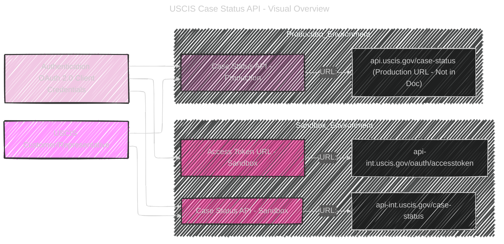
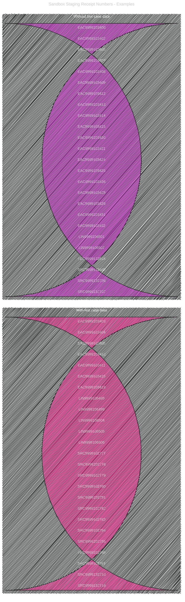
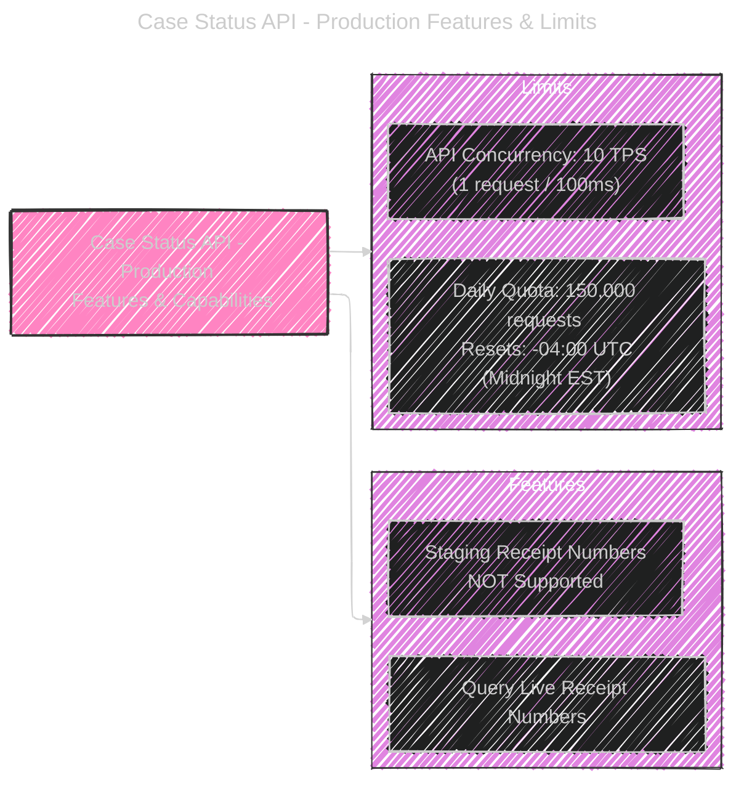

# USCIS Case Status API Overview
> This content is dual-licensed under your choice of the following licenses:
> 1.  **MIT License:** For the code implementations in Swift and Mermaid provided in this document.
> 2.  **Creative Commons Attribution 4.0 International License (CC BY 4.0):** For all other content, including the text, explanations, and the Mermaid diagrams and illustrations.

---

## USCIS Case Status API - Visual Overview



## Authentication Flow - OAuth 2.0 Client Credentials


---

## Sandbox Staging Receipt Numbers - Examples




---

## Production Access Requirements Checklist - TODO

```mermaid
---
title: Production Access Requirements Checklist
config:
  layout: elk
  look: handDrawn
  theme: dark
---
requirementDiagram
    requirement ProdAccessReq {
        id: PROD_ACCESS_REQ
        text: "To request Production Access for Case Status API, you must meet the following requirements:"
        type: functionalRequirement
    }

    requirement DevAccount {
        id: DEV_ACCOUNT
        text: "Registered Developer Account on developer.uscis.gov"
        type: functionalRequirement
        parentRelationship: contains
        tags: ["Prerequisite"]
    }

    requirement DevAppSandbox {
        id: DEV_APP_SANDBOX
        text: "Registered Developer App for Case Status API - Sandbox"
        type: functionalRequirement
        parentRelationship: contains
        tags: ["Prerequisite"]
    }

    requirement SandboxTesting {
        id: SANDBOX_TESTING
        text: "Actively implemented and tested API solution in Sandbox"
        type: functionalRequirement
        parentRelationship: contains
    }

    requirement ApiTraffic {
        id: API_TRAFFIC
        text: "Minimum 5 consecutive calendar days of API traffic in Sandbox"
        type: functionalRequirement
        parentRelationship: contains
    }

    requirement HttpResponsesTested {
        id: HTTP_RESPONSES_TESTED
        text: "Success (200) and Error (4xx) HTTPS responses tested in Sandbox"
        type: functionalRequirement
        parentRelationship: contains
    }

    ProdAccessReq -- contains --> DevAccount
    ProdAccessReq -- contains --> DevAppSandbox
    ProdAccessReq -- contains --> SandboxTesting
    ProdAccessReq -- contains --> ApiTraffic
    ProdAccessReq -- contains --> HttpResponsesTested

    style PROD_ACCESS_REQ fill:#f9f,stroke:#333,stroke-width:2px
    style DEV_ACCOUNT fill:#ccf,stroke:#333,stroke-width:1px
    style DEV_APP_SANDBOX fill:#ccf,stroke:#333,stroke-width:1px
    style SANDBOX_TESTING fill:#ccf,stroke:#333,stroke-width:1px
    style API_TRAFFIC fill:#ccf,stroke:#333,stroke-width:1px
    style HTTP_RESPONSES_TESTED fill:#ccf,stroke:#333,stroke-width:1px
    
```

Note: This is new syntax by the bot


---


## Case Status API - Production Features & Limits





---
**Licenses:**

- **MIT License:**  [](LICENSE) - Full text in [LICENSE](LICENSE) file.
- **Creative Commons Attribution 4.0 International:** [](LICENSE-CC-BY) - Legal details in [LICENSE-CC-BY](LICENSE-CC-BY) and at [Creative Commons official site](http://creativecommons.org/licenses/by/4.0/).

---