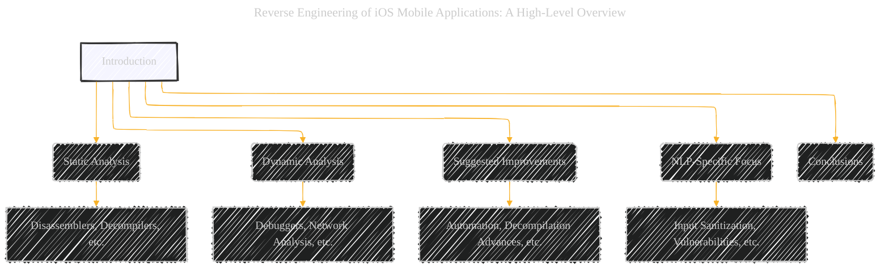
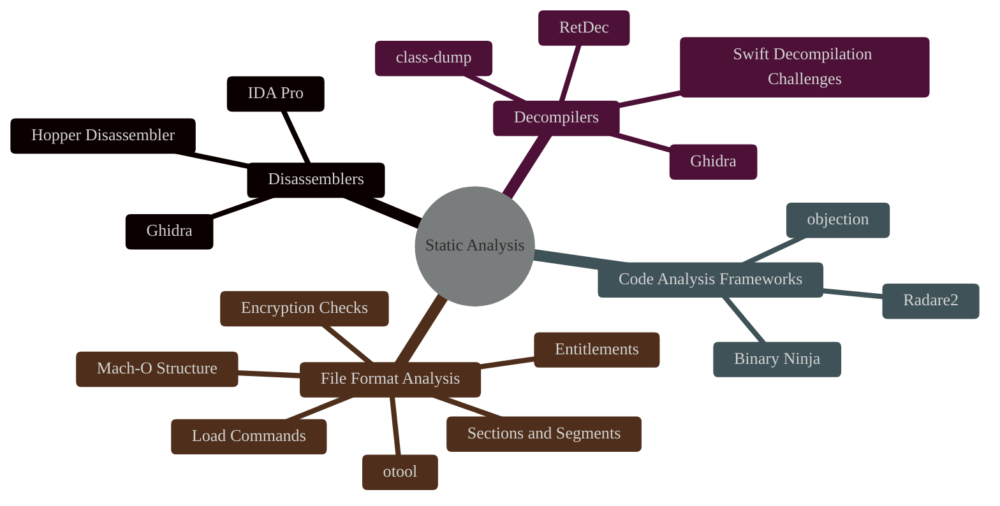
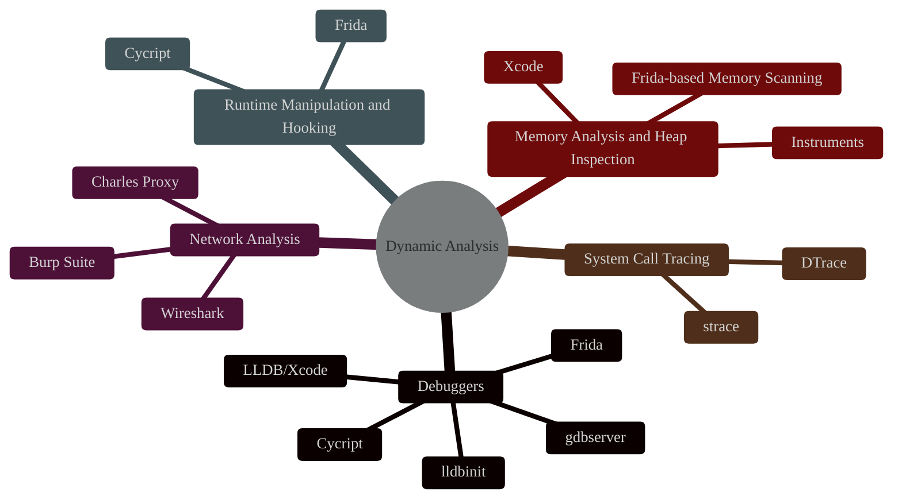
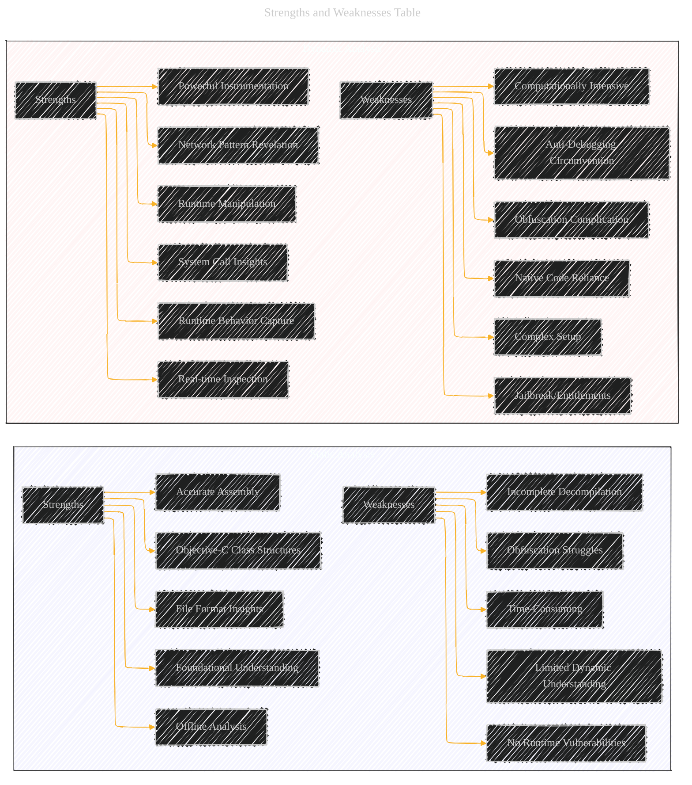
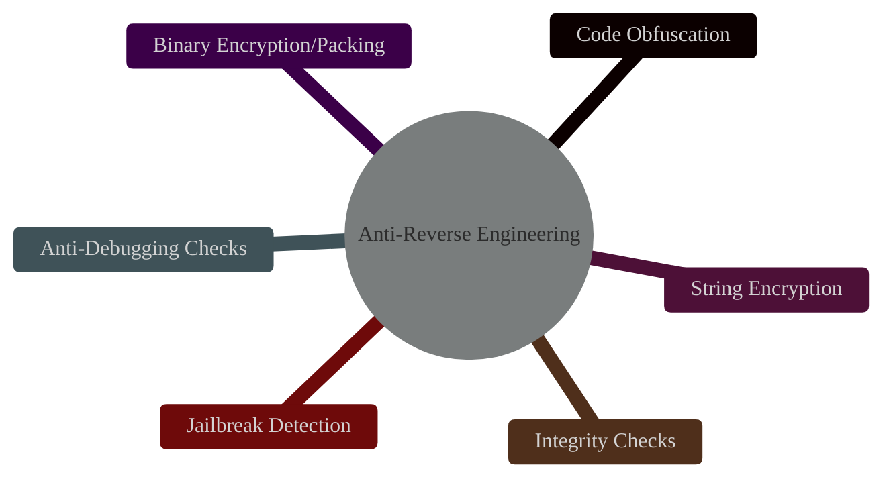
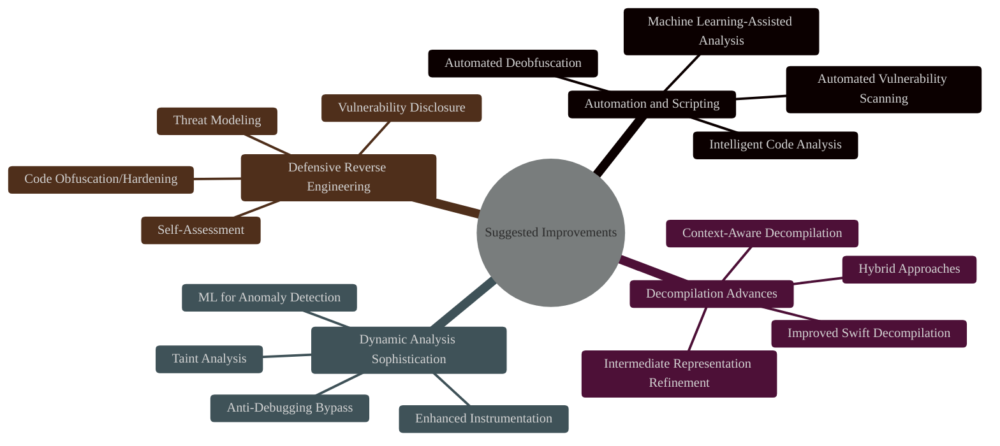
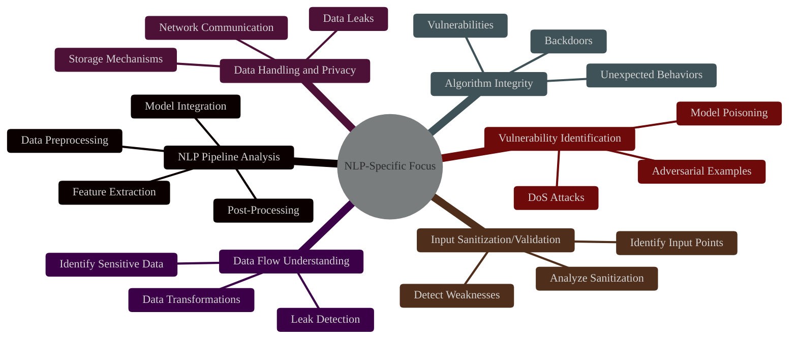
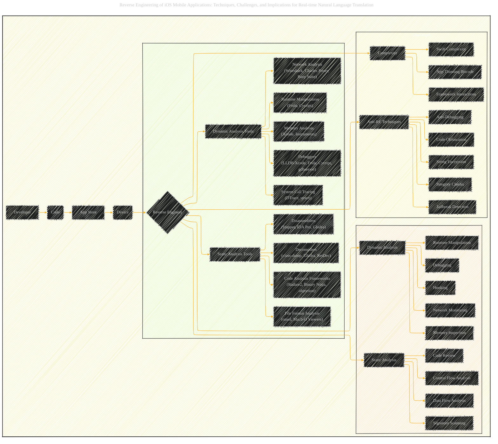

# Reverse Engineering of iOS Mobile Applications: A Focus on Real-time Natural Language Translation
> **Disclaimer:**
>
> This document contains my personal notes on the topic,
> compiled from publicly available documentation and various cited sources.
> The materials are intended for educational purposes, personal study, and reference.
> The content is dual-licensed:
> 1. **MIT License:** Applies to all code implementations (Swift, Mermaid, and other programming languages).
> 2. **Creative Commons Attribution 4.0 International License (CC BY 4.0):** Applies to all non-code content, including text, explanations, diagrams, and illustrations.
---

## Techniques, Challenges, and Implications for Real-time Natural Language Translation

The Mermaid diagrams below provide a visual, structured representation of the key information on the research topic.

**Diagram Breakdown:**

1.  **High-Level Overview:** A flowchart showing the main areas of the paper (Introduction, Static Analysis, Dynamic Analysis, Improvements, NLP Focus, Conclusion).
2.  **Static Analysis Tools and Techniques:** A mindmap detailing the tools and sub-techniques within static analysis (Disassemblers, Decompilers, Code Analysis Frameworks, File Format Analysis).
3.  **Dynamic Analysis Tools and Techniques:** A mindmap similar to the static analysis diagram, but focused on dynamic analysis tools.
4.  **Strengths and Weaknesses Table:** A graph (using subgraphs for clarity) representing the table comparing static and dynamic analysis.
5.  **Anti-Reverse Engineering Techniques:** A mindmap listing common anti-reverse engineering methods.
6.  **Suggested Improvements:** A mindmap outlining the proposed improvements and alternative approaches.
7.  **NLP-Specific Reverse Engineering Focus:** A mindmap detailing the areas of focus for reverse engineering NLP/ML applications.
8. **iOS Reverse Engineering Ecosystem:** Depict the complex ecosystem of iOS reverse engineering.

---

## Diagram 1: High-Level Overview

---

## Diagram 2: Static Analysis Tools and Techniques

---

## Diagram 3: Dynamic Analysis Tools and Techniques

---

## Diagram 4: Strengths and Weaknesses Table

---

## Diagram 5: Anti-Reverse Engineering Techniques

---

## Diagram 6: Suggested Improvements

---

## Diagram 7: NLP-Specific Reverse Engineering Focus

---

## Diagram 8: iOS Reverse Engineering Ecosystem

---
**Licenses:**

- **MIT License:**   - Full text in [LICENSE](LICENSE) file.
- **Creative Commons Attribution 4.0 International:**  - Legal details in [LICENSE-CC-BY](LICENSE-CC-BY) and at [Creative Commons official site](http://creativecommons.org/licenses/by/4.0/).

---