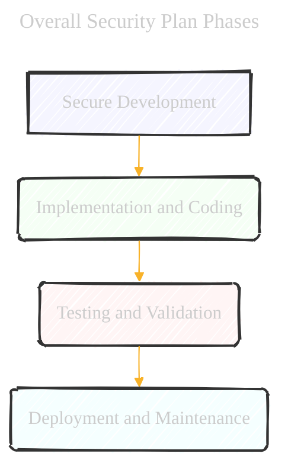
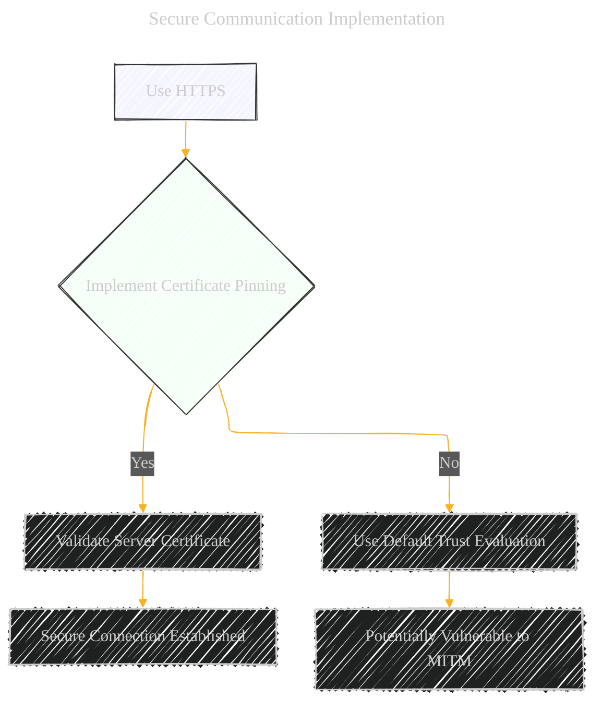
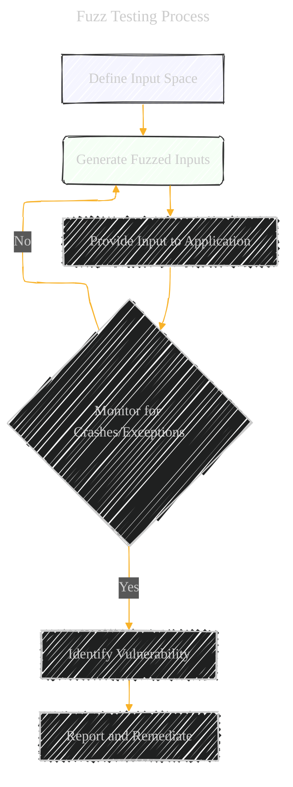

# The Security Implementation Plan
> **Disclaimer:**
>
> This document contains my personal notes on the topic,
> compiled from publicly available documentation and various cited sources.
> The materials are intended for educational purposes, personal study, and reference.
> The content is dual-licensed:
> 1. **MIT License:** Applies to all code implementations (Swift, Mermaid, and other programming languages).
> 2. **Creative Commons Attribution 4.0 International License (CC BY 4.0):** Applies to all non-code content, including text, explanations, diagrams, and illustrations.
---

Below is my draft Mermaid diagrams to visualize the comprehensive security plan for my iOS NLP application project. They aim to provide a clear, structured, and actionable roadmap for implementing the necessary security measures throughout the application's lifecycle.

1.  **Overall Security Plan Phases:** A flowchart outlining the four main phases (Secure Development, Implementation, Testing, Deployment).
2.  **Secure Development Practices:** A mindmap detailing the pre-coding security steps.
3.  **Implementation and Coding:** A mindmap showing the security measures during the coding phase.
4.  **Testing and Validation:** A mindmap outlining the pre-release testing procedures.
5.  **Deployment and Maintenance:** A mindmap for the post-release security activities.
6.  **NLP-Specific Considerations:** A mindmap highlighting security measures specific to NLP applications.
7.  **Threat Modeling Process:** A flowchart detailing the steps involved in the threat modeling process.
8.  **Secure Data Storage Techniques:** A mindmap detailing the various secure data storage options.
9.  **Secure Communication Implementation:** A flowchart showing the steps for secure network communication.
10. **Anti-Debugging/Anti-Tampering Techniques:** A mindmap of the techniques.
11. **Fuzz Testing Process:** A flowchart for the fuzz testing process.

---

## Diagram 1: Overall Security Plan Phases

---

## Diagram 2: Secure Development Practices

---

## Diagram 3: Implementation and Coding

---

## Diagram 4: Testing and Validation

---

## Diagram 5: Deployment and Maintenance

---

## Diagram 6: NLP-Specific Considerations

---

## Diagram 7: Threat Modeling Process

---

## Diagram 8: Secure Data Storage Techniques

---

## Diagram 9: Secure Communication Implementation

---

## Diagram 10: Anti-Debugging/Anti-Tampering Techniques

---

## Diagram 11: Fuzz Testing Process

---
**Licenses:**

- **MIT License:**   - Full text in [LICENSE](LICENSE) file.
- **Creative Commons Attribution 4.0 International:**  - Legal details in [LICENSE-CC-BY](LICENSE-CC-BY) and at [Creative Commons official site](http://creativecommons.org/licenses/by/4.0/).

---