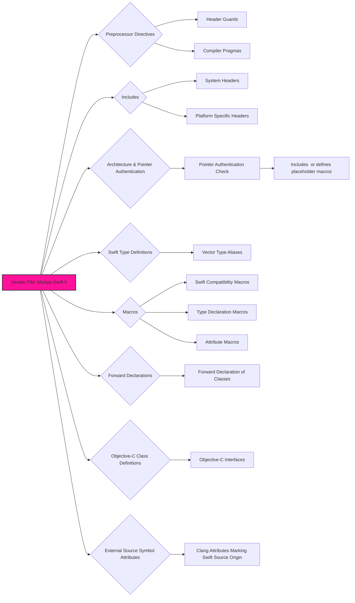
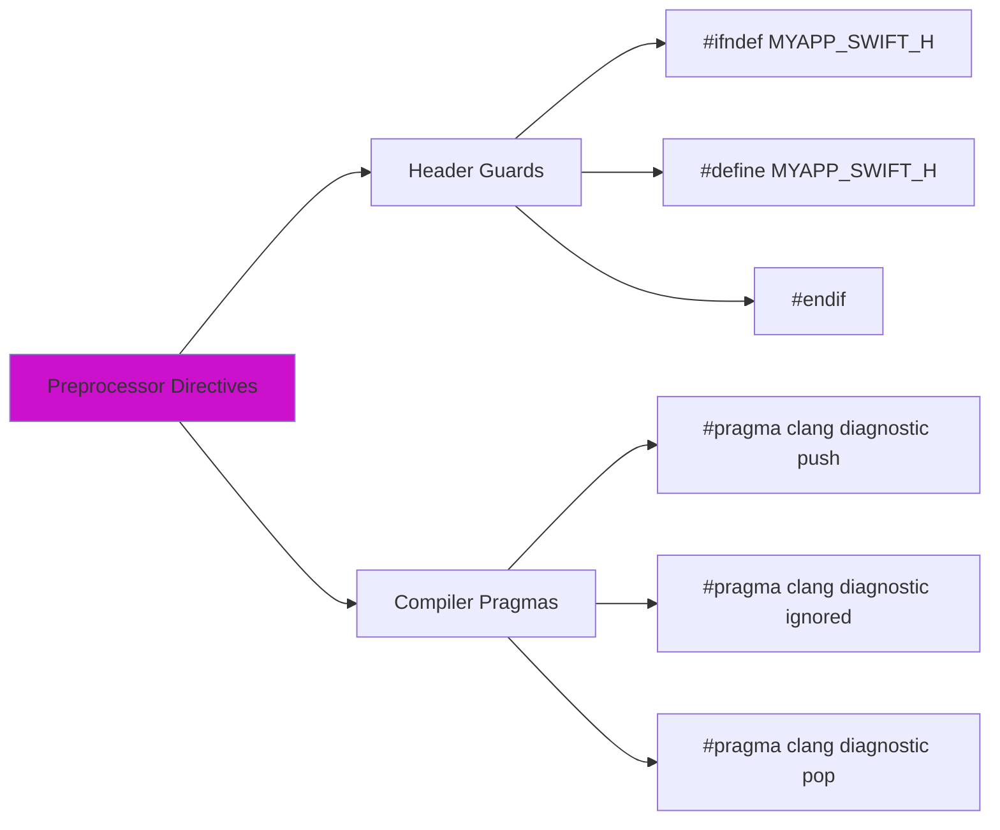
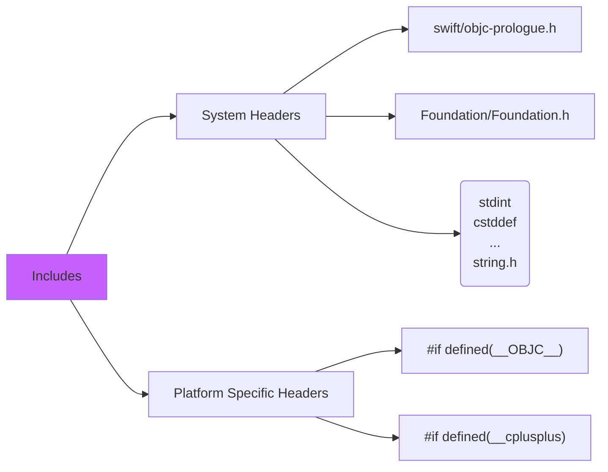
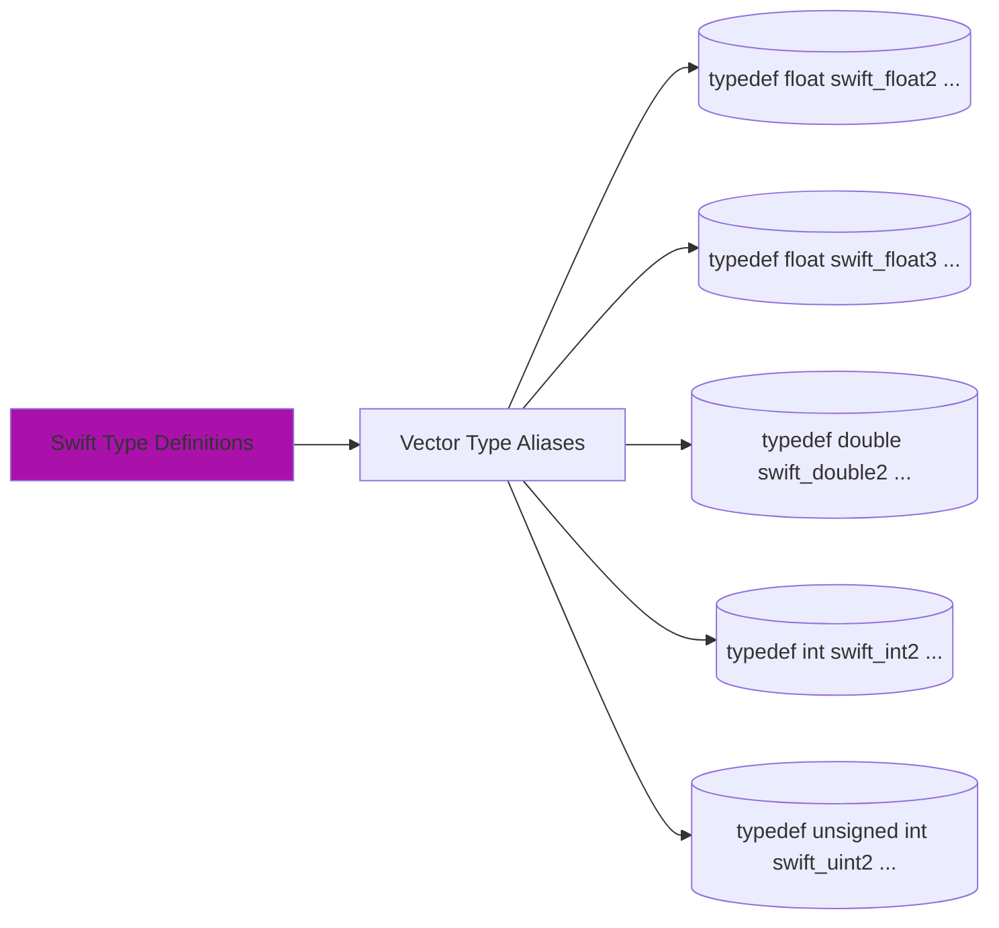
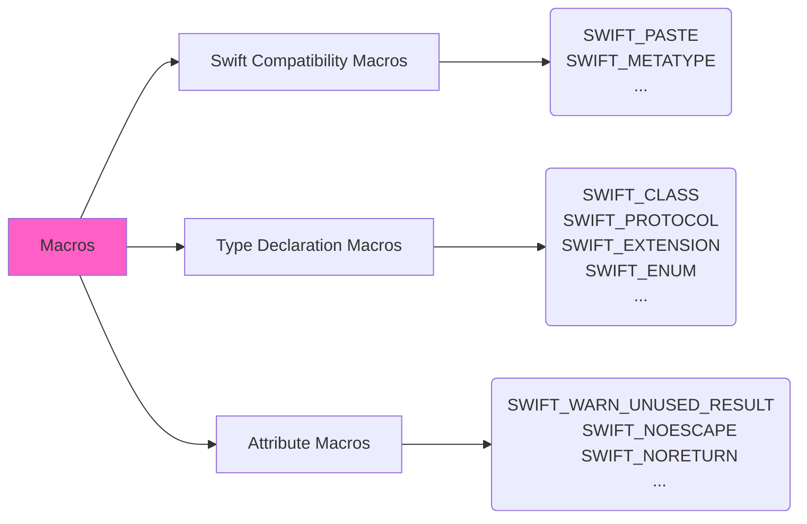
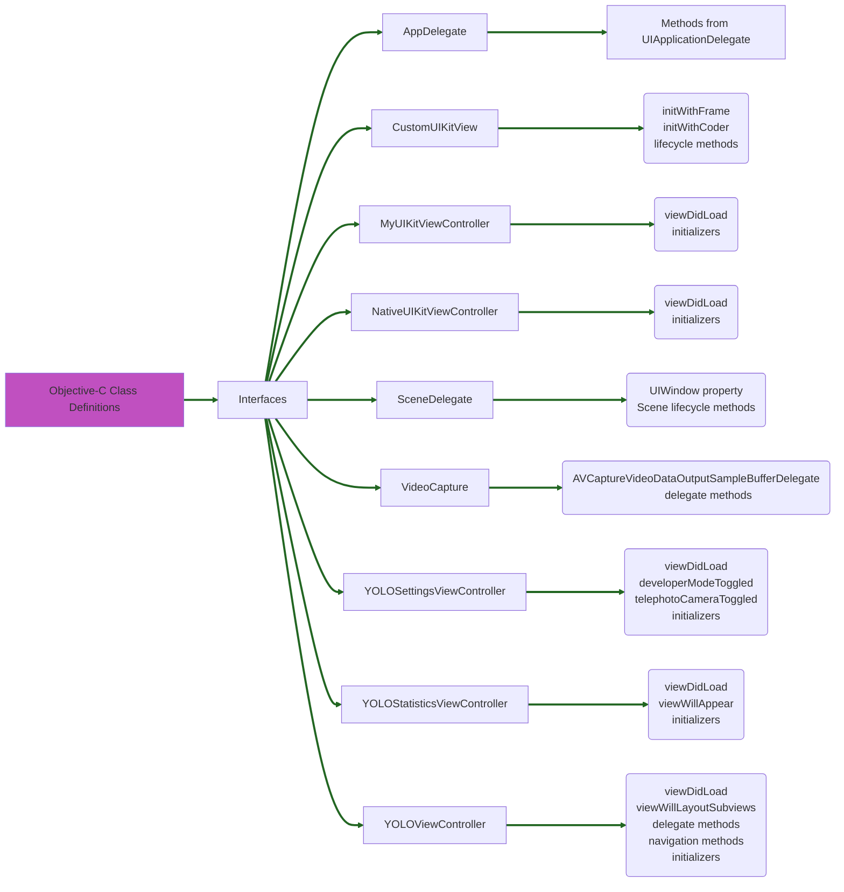
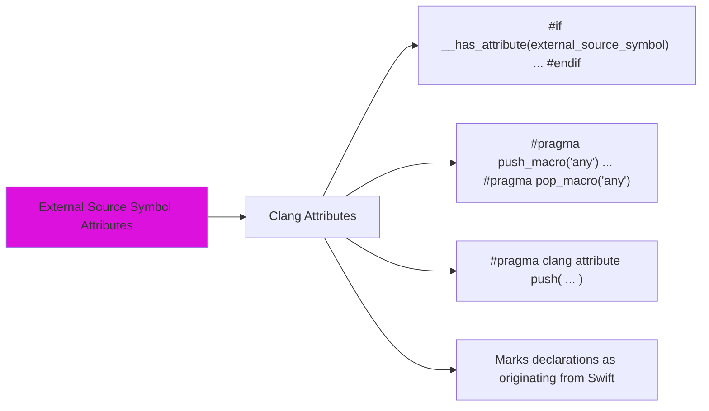

# Swift-generated header file in Mermaid diagrams

Let's break down the explanation of the Swift-generated header file into a set of Mermaid diagrams. I'll focus on the main structural elements and their relationships.

## Diagram 1: Overall Structure of the Header File

## Diagram 2: Preprocessor Directives Details

## Diagram 3: Includes Section

## Diagram 4: Swift Type Definitions

## Diagram 5: Macros Section

## Diagram 6: Objective-C Class Definitions

## Diagram 7: External Source Symbol Attributes

-----