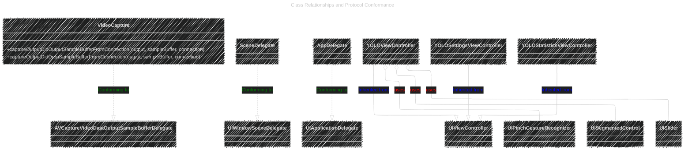
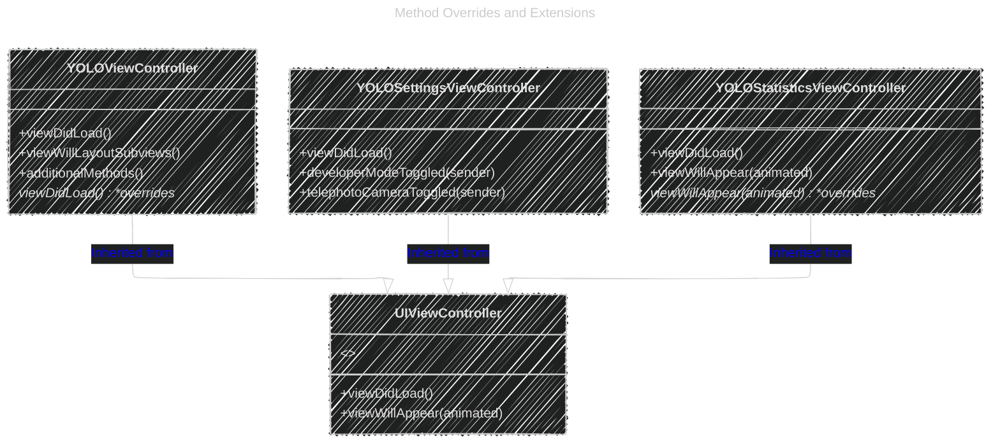
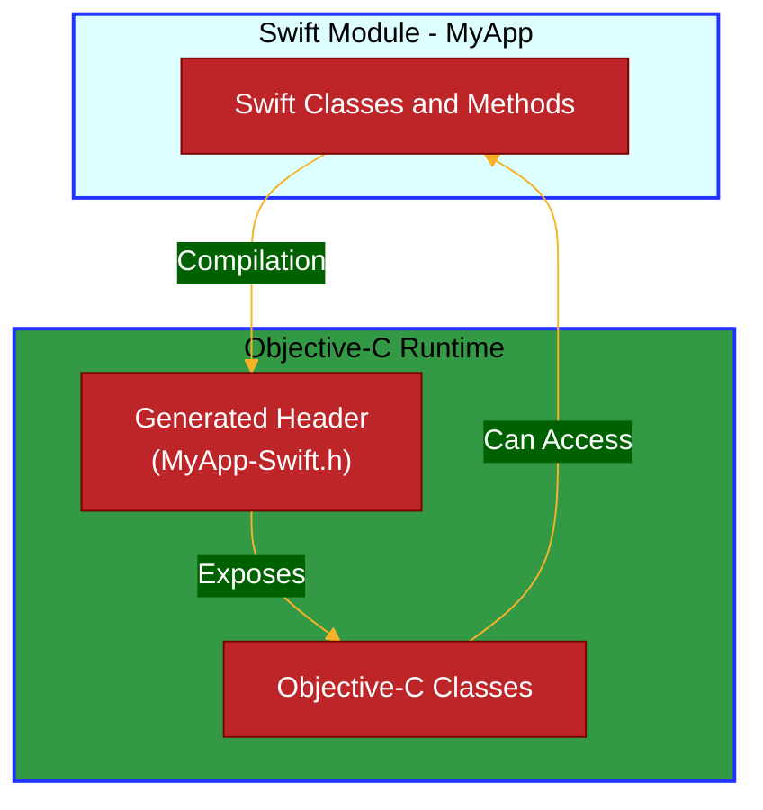
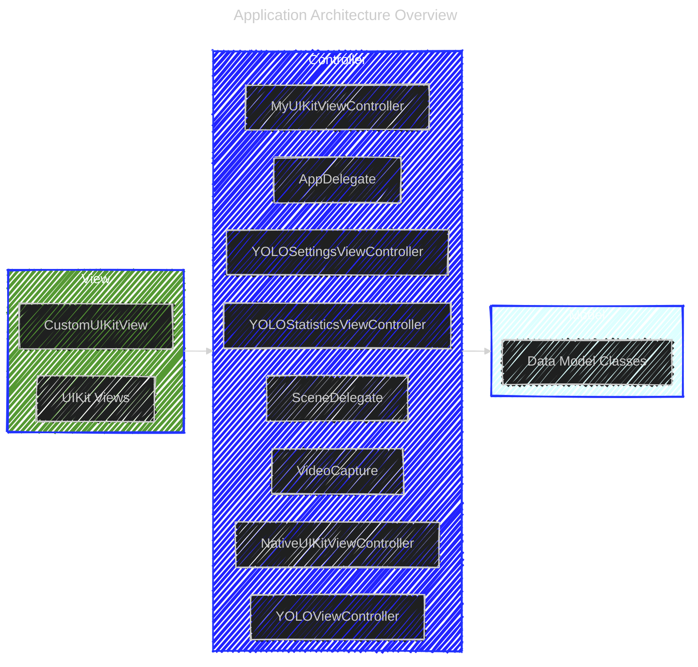
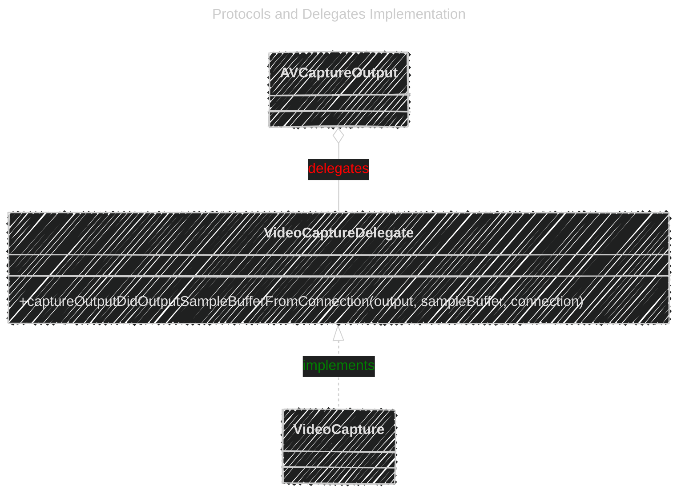

# Swift-generated header file - Mermaid Diagrams of the Code Content

> This content is dual-licensed under your choice of the following licenses:
> 1.  **MIT License:** For the code implementations in Swift and Mermaid provided in this document.
> 2.  **Creative Commons Attribution 4.0 International License (CC BY 4.0):** For all other content, including the text, explanations, and the Mermaid diagrams and illustrations.

---

Below are Mermaid diagrams representing the content explained content in file: 
Reversing_Engineer_through_Interfaces/Swift-generated_header_file-Explaination-in-depth.md.

These diagrams illustrate the class hierarchy, inheritance, protocols, and relationships among the classes in your `MyApp` Swift module as exposed to Objective-C. These will serve as reference documentation for future use.

---

## 1. Class Hierarchy Diagram

This diagram shows the inheritance relationships between the classes and protocols.

```mermaid
---
title: Class Hierarchy Diagram
config:
  layout: elk
  look: handDrawn
  theme: dark
---
%%   Notes:
%%   - Blue Solid arrows (`--|>`) represent inheritance.
%%   - Green Dashed arrows (`..|>`) represent protocol conformance.
%%   - Red Open diamonds Solid arrows (`o--`) represent associations (usage/has-a relationships).

classDiagram
    %% Base Classes and Protocols
    class NSObject
    class UIResponder
    class UIView
    class UIViewController
    class UIApplicationDelegate
    class UIWindowSceneDelegate
    class AVCaptureVideoDataOutputSampleBufferDelegate
    
    %% AppDelegate
    class AppDelegate {
        +applicationDidFinishLaunchingWithOptions(application, launchOptions) BOOL
        +applicationDidBecomeActive(application)
        +applicationWillResignActive(application)
        +applicationDidEnterBackground(application)
        +applicationWillEnterForeground(application)
        +applicationWillTerminate(application)
        +applicationConfigurationForConnectingSceneSessionOptions(application, connectingSceneSession, options) UISceneConfiguration
    }
    %% AppDelegate is inherited from UIResponder 
    %% AppDelegate is conforming to UIApplicationDelegate
    AppDelegate --|> UIResponder :  <font color=blue>Inherited from</font>
    AppDelegate ..|> UIApplicationDelegate : <font color=green>Conforming to</font>

    %% SceneDelegate
    class SceneDelegate {
        +window UIWindow
        +sceneWillConnectToSessionOptions(scene, session, connectionOptions)
        +sceneDidBecomeActive(scene)
        +sceneWillResignActive(scene)
        +sceneDidEnterBackground(scene)
        +sceneWillEnterForeground(scene)
        +sceneDidDisconnect(scene)
    }
    %% SceneDelegate is inherited from UIResponder
    %% SceneDelegate is conforming to UIWindowSceneDelegate
    SceneDelegate --|> UIResponder : <font color=blue>Inherited from</font>
    SceneDelegate ..|> UIWindowSceneDelegate : <font color=green>Conforming to</font>

    %% CustomUIKitView
    class CustomUIKitView {
        +initWithFrame(frame) 
        +initWithCoder(coder)
        +awakeFromNib()
        +layoutSubviews()
        +drawRect(rect)
        +didMoveToSuperview()
        +didMoveToWindow()
    }
    %% CustomUIKitView is inherited from UIView
    CustomUIKitView --|> UIView : <font color=blue>Inherited from</font>

    %% View Controllers
    class MyUIKitViewController {
        +viewDidLoad()
        +initWithNibNameBundle(nibNameOrNil, nibBundleOrNil)
        +initWithCoder(coder)
    }
    %% MyUIKitViewController is inherited from UIViewController
    MyUIKitViewController --|> UIViewController : <font color=blue>Inherited from</font>

    class NativeUIKitViewController {
        +viewDidLoad()
        +initWithNibNameBundle(nibNameOrNil, nibBundleOrNil)
        +initWithCoder(coder)
    }
    %% NativeUIKitViewController is inherited from UIViewController
    NativeUIKitViewController --|> UIViewController : <font color=blue>Inherited from</font>

    class YOLOViewController {
        +viewDidLoad()
        +viewWillLayoutSubviews()
        +pinch(pinch)
        +modelChanged(sender)
        +sliderChanged(sender)
        +playButtonTapped()
        +pauseButtonTapped()
        +navigateToStatistics()
        +navigateToSettings()
        +initWithNibNameBundle(nibNameOrNil, nibBundleOrNil)
        +initWithCoder(coder)
    }
    %% YOLOViewController is inherited from UIViewController
    YOLOViewController --|> UIViewController : <font color=blue>Inherited from</font>

    class YOLOSettingsViewController {
        +viewDidLoad()
        +developerModeToggled(sender)
        +telephotoCameraToggled(sender)
        +initWithNibNameBundle(nibNameOrNil, nibBundleOrNil)
        +initWithCoder(coder)
    }
    %% YOLOSettingsViewController is inherited from UIViewController
    YOLOSettingsViewController --|> UIViewController : <font color=blue>Inherited from</font>

    class YOLOStatisticsViewController {
        +viewDidLoad()
        +viewWillAppear(animated)
        +initWithNibNameBundle(nibNameOrNil, nibBundleOrNil)
        +initWithCoder(coder)
    }
    %% YOLOStatisticsViewController is inherited from UIViewController
    YOLOStatisticsViewController --|> UIViewController : <font color=blue>Inherited from</font>

    %% VideoCapture
    class VideoCapture {
        +init()
        +captureOutputDidOutputSampleBufferFromConnection(output, sampleBuffer, connection)
        +captureOutputDidDropSampleBufferFromConnection(output, sampleBuffer, connection)
    }
    %% VideoCapture is inherited from NSObject
    %% VideoCapture is conforming to AVCaptureVideoDataOutputSampleBufferDelegate
    VideoCapture --|> NSObject : <font color=blue>Inherited from</font>
    VideoCapture ..|> AVCaptureVideoDataOutputSampleBufferDelegate : <font color=green>Conforming to</font>

```

## 2. Flowchart Diagram

Note: Mainly to introduce new Mermaid syntax for now

Styling Relationships: 
- Inheritance: blue solid line
- Conformance: green dashed line
- Association: red solid line, open arrowhead

```mermaid
---
title: Flowchart Diagram
config:
  layout: elk
  look: handDrawn
  theme: dark
---
flowchart TD
    AppDelegate --> |Inherits| UIResponder
    AppDelegate -.-> |Conforms| UIApplicationDelegate

    SceneDelegate --> |Inherits| classUIResponder
    SceneDelegate -.-> |Conforms| UIWindowSceneDelegate

    CustomUIKitView --> |Inherits| UIView
    MyUIKitViewController --> |Inherits| UIViewController
    NativeUIKitViewController --> |Inherits| UIViewController
    YOLOViewController --> |Inherits| UIViewController
    YOLOSettingsViewController --> |Inherits| UIViewController
    YOLOStatisticsViewController --> |Inherits| UIViewController

    VideoCapture --> |Inherits| NSObject
    VideoCapture -.-> |Conforms| AVCaptureVideoDataOutputSampleBufferDelegate


    %% Styling Relationships
    linkStyle 0,2,4,5,6,7,8,9,10 stroke:#0000FF,stroke-width:2px %% Inheritance: blue solid line
    linkStyle 1,3,11 stroke:#00FF00,stroke-dasharray:5 5 %% Protocol Conformance: green dashed line
    linkStyle 2 stroke:#FF0000,stroke-width:2px %% Association: red solid line, open arrowhead

%% Note: The numbers in linkStyle correspond to the order of links above.

```

---

## 3. App Lifecycle and Delegate Methods

This diagram illustrates how `AppDelegate` and `SceneDelegate` interact with the application and scene lifecycles.

```mermaid
---
title: App Lifecycle and Delegate Methods
config:
  layout: elk
  look: handDrawn
  theme: dark
---
sequenceDiagram

    participant App as UIApplication
    participant AD as AppDelegate
    participant SD as SceneDelegate
    participant Scene as UIScene
    
    
    rect rgb(121, 13, 255)
    Note over App,AD: Application launched
    App ->> AD: application:didFinishLaunchingWithOptions:
    AD -->> App: BOOL
    end

    rect rgb(21, 23, 255)
    Note over App,SD: Configuring new scene
    App ->> SD: configurationForConnectingSceneSession:
    SD -->> App: UISceneConfiguration
    end

    rect rgb(21, 91, 33)
    Note over SD,Scene: Scene is connecting
    App ->> SD: scene:willConnectToSession:options:
    SD -->> Scene: Setup UIWindow
    end

    rect rgb(21, 71, 33)
    App ->> SD: sceneDidBecomeActive:
    Note over SD: Scene became active
    end
    
    rect rgb(21, 61, 33)
    App ->> SD: sceneWillResignActive:
    Note over SD: Scene will resign active
    end

    rect rgb(21, 51, 33)
    App ->> SD: sceneDidEnterBackground:
    Note over SD: Scene entered background
    end

    rect rgb(21, 41, 33)
    App ->> SD: sceneWillEnterForeground:
    Note over SD: Scene will enter foreground
    end

    rect rgb(121, 83, 255)
    App ->> AD: applicationWillTerminate:
    Note over AD: Application will terminate
    end

```

---

## 4. Video Capture Flow

This diagram shows how `VideoCapture` handles video frames from the camera.

```mermaid
---
title: Video Capture Flow
config:
  layout: elk
  look: handDrawn
  theme: dark
---
sequenceDiagram
    participant Camera as AVCaptureSession
    participant VC as VideoCapture
    participant Delegate as AVCaptureVideoDataOutputSampleBufferDelegate

    rect rgb(21, 13, 51)
    Camera ->> VC: captureOutput:didOutputSampleBuffer:fromConnection:
    VC ->> Delegate: Process sampleBuffer
    Note over VC: Processes the frame
    end

    rect rgb(21, 123, 51)
    Camera ->> VC: captureOutput:didDropSampleBuffer:fromConnection:
    VC ->> Delegate: Handle dropped buffer
    Note over VC: Handles dropped frame
    end
      
```

---

## 5. YOLOViewController User Interactions

This diagram represents user interactions within `YOLOViewController`.

```mermaid
---
title: YOLOViewController User Interactions
config:
  layout: elk
  look: handDrawn
  theme: dark
---
flowchart TD
    subgraph YOLOViewController
        %% Background style for subgraph YOLOViewController
        style YOLOViewController fill:#234,stroke:#23F,stroke-width:2px
        
        A[viewDidLoad]
        B[viewWillLayoutSubviews]
        C[pinchGesture]
        D[modelChanged]
        E[sliderChanged]
        F[playButtonTapped]
        G[pauseButtonTapped]
        H[navigateToStatistics]
        I[navigateToSettings]
    end

    User -->|Pinch Gesture| C
    User -->|Change Model| D
    User -->|Adjust Slider| E
    User -->|Tap Play| F
    User -->|Tap Pause| G
    User -->|Statistics| H
    User -->|Settings| I


%% Style for arrows
linkStyle 0,1,2,3,4,5,6 stroke:#00FF00,stroke-width:3px,stroke-dasharray:5 5
%% Note: The numbers in linkStyle correspond to the order of links above.
%% linkStyle default stroke:#451,stroke-width:3px

```

---

## 6. Class Relationships and Protocol Conformance

This class diagram focuses on protocol conformance and delegates.

---

## 7. Method Overrides and Extensions

This diagram highlights how certain methods are overridden in subclasses.

---

## 8. Interoperability Between Swift and Objective-C

This flowchart outlines how Swift classes are exposed to Objective-C through the generated header.

---

## 9. Application Architecture Overview

This diagram represents the overall architecture, highlighting the adherence to the MVC pattern.

---

## 10. Protocols and Delegates Implementation

This diagram shows how delegates are used within the app, particularly with `VideoCapture`.

---

**Notes:**

- **Classes and Inheritance:**
  - Solid arrows (`--|>`) represent inheritance.
  - Dashed arrows (`..|>`) represent protocol conformance.
  - Open diamonds (`o--`) represent associations (usage/has-a relationships).

- **Protocols and Delegates:**
  - Protocol conformance is shown with dashed lines and open arrowheads.
  - Delegation relationships are indicated where a class implements a delegate protocol.

- **Sequence Diagrams:**
  - Show the flow of method calls and lifecycle events.
  - Useful for understanding how objects interact over time.

- **Flowcharts:**
  - Represent user interactions and application logic flow.
  - Help visualize the sequence of events triggered by user actions.

- **Architecture Overview:**
  - Highlights the separation of concerns following the MVC pattern.
  - Shows how controllers mediate between views and models.

---
**Licenses:**

- **MIT License:**   - Full text in [LICENSE](LICENSE) file.
- **Creative Commons Attribution 4.0 International:**  - Legal details in [LICENSE-CC-BY](LICENSE-CC-BY) and at [Creative Commons official site](http://creativecommons.org/licenses/by/4.0/).

---