# Access Control - A Diagrammatic Guide
> This content is dual-licensed under your choice of the following licenses:
> 1.  **MIT License:** For the code implementations in Swift and Mermaid provided in this document.
> 2.  **Creative Commons Attribution 4.0 International License (CC BY 4.0):** For all other content, including the text, explanations, and the Mermaid diagrams and illustrations.

---

## 1.  Overview: Access Control in Swift

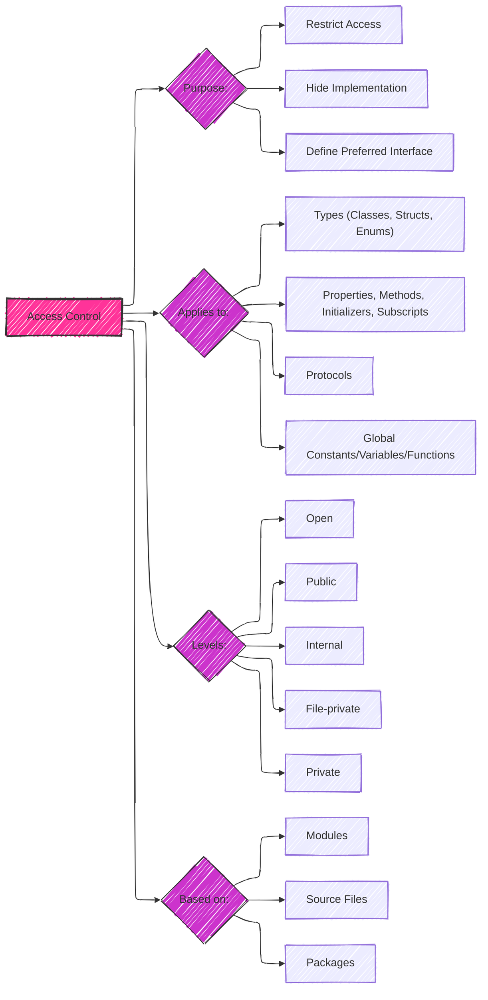
```mermaid
---
config:
  layout: elk
  look: handDrawn
  theme: default
---
graph LR
    A[Access Control] --> B{Purpose:};
    B --> C[Restrict Access];
    B --> D[Hide Implementation];
    B --> E[Define Preferred Interface];
    A --> F{Applies to:};
    F --> G["Types (Classes, Structs, Enums)"];
    F --> H[Properties, Methods, Initializers, Subscripts];
    F --> I[Protocols];
    F --> J["Global Constants/Variables/Functions"];
    A --> K{Levels:};
    K -->L[Open];
    K -->M[Public];
    K -->N[Internal];
    K -->O[File-private];
    K -->P[Private];
    A -->Q{Based on:};
    Q --> R[Modules];
    Q --> S[Source Files];
    Q --> T[Packages];
    
    style A fill:#f39f,stroke:#333,stroke-width:2px
    style B fill:#c3cf,stroke:#333,stroke-width:1px
    style F fill:#c3cf,stroke:#333,stroke-width:1px
    style K fill:#c3cf,stroke:#333,stroke-width:1px
    style Q fill:#c3cf,stroke:#333,stroke-width:1px
```

**Explanation:** This flowchart provides a high-level overview of access control, its purpose, the elements it applies to, access levels, and the core concepts involved in Swift programming.

----

## 2. Modules, Source Files, and Packages

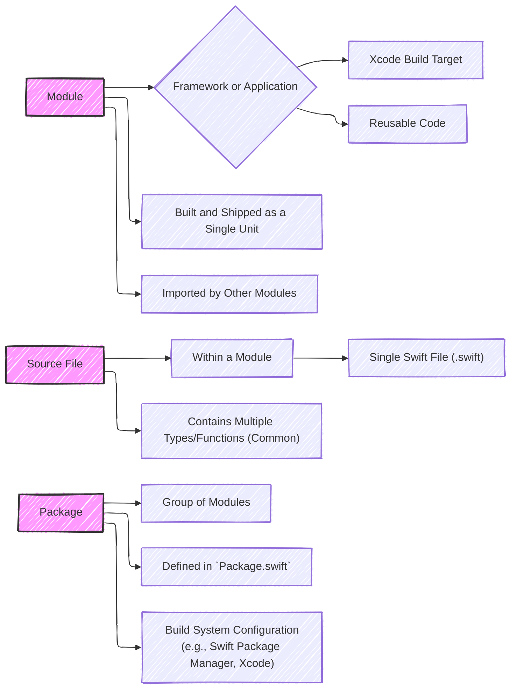
```mermaid
---
config:
  layout: elk
  look: handDrawn
  theme: default
---
graph LR
    A[Module] --> B{Framework or Application};
    A --> C[Built and Shipped as a Single Unit];
    A --> D[Imported by Other Modules];
    B --> E[Xcode Build Target];
    B --> F[Reusable Code];
    G[Source File] --> H[Within a Module];
    H --> I["Single Swift File (.swift)"];
    G --> J["Contains Multiple Types/Functions (Common)"];
    K[Package] --> L[Group of Modules];
    K --> M["Defined in `Package.swift`"];
    K --> N["Build System Configuration<br>(e.g., Swift Package Manager, Xcode)"];
    
    style A fill:#f9f,stroke:#333,stroke-width:2px
    style G fill:#f9f,stroke:#333,stroke-width:2px
    style K fill:#f9f,stroke:#333,stroke-width:2px
```

**Explanation:** This diagram clarifies the relationships between modules, source files, and packages, the fundamental building blocks of Swift code organization. The `style` attribute highlights the importance of these three subjects to the overall context.

---

## 3. Access Level Hierarchy & Relationships

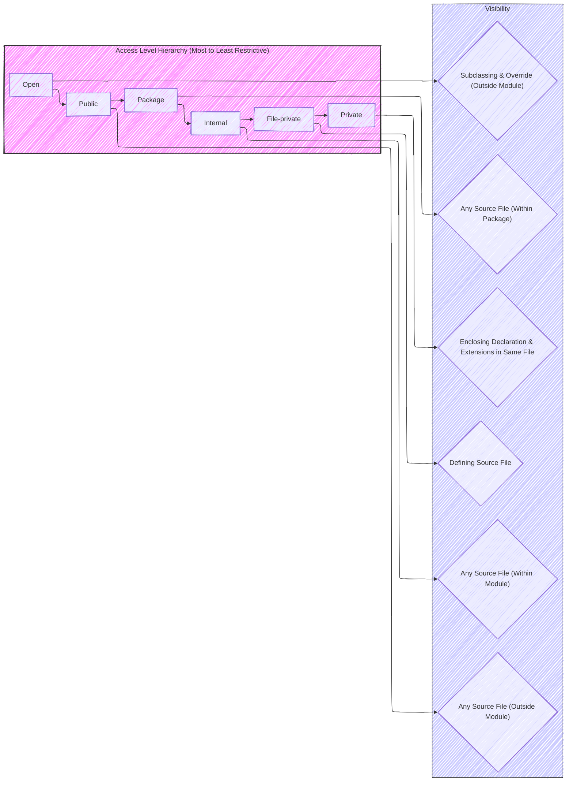
```mermaid
---
config:
  layout: elk
  look: handDrawn
  theme: default
---
graph LR
    subgraph AccessLevelHierarchy["Access Level Hierarchy (Most to Least Restrictive)"]
        A[Open] --> B[Public];
        B --> C[Package];
        C --> D[Internal];
        D --> E[File-private];
        E --> F[Private];
    end

    subgraph Visibility["Visibility"]
        A --> G{"Subclassing & Override (Outside Module)"};
        B --> H{"Any Source File (Outside Module)"};
        C --> I{"Any Source File (Within Package)"};
        D --> J{"Any Source File (Within Module)"};
        E --> K{"Defining Source File"};
        F --> L{"Enclosing Declaration & Extensions in Same File"};
    end

    style AccessLevelHierarchy fill:#f9f,stroke:#333,stroke-width:2px
    style Visibility fill:#ccf,stroke:#333,stroke-width:1px
```

**Explanation:** This diagram concisely presents the access level hierarchy, demonstrating the level of access and visibility afforded by each level. The `subgraph` elements further clarify the relationships, while style attributes highlight subjects within the context.&#x20;

---

## 4. Guiding Principle of Access Levels

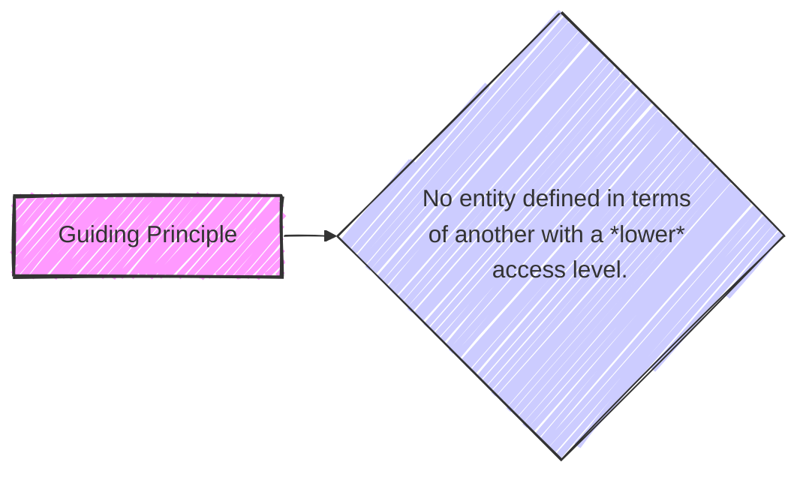
```mermaid
---
config:
  layout: elk
  look: handDrawn
  theme: default
---
graph LR
    A[Guiding Principle] --> B{No entity defined in terms of another with a *lower* access level.};
    style A fill:#f9f,stroke:#333,stroke-width:2px
    style B fill:#ccf,stroke:#333,stroke-width:1px
```

**Explanation:** This simple illustration highlights the core rule governing access control.

---

## 5. Custom Types and Member Defaults

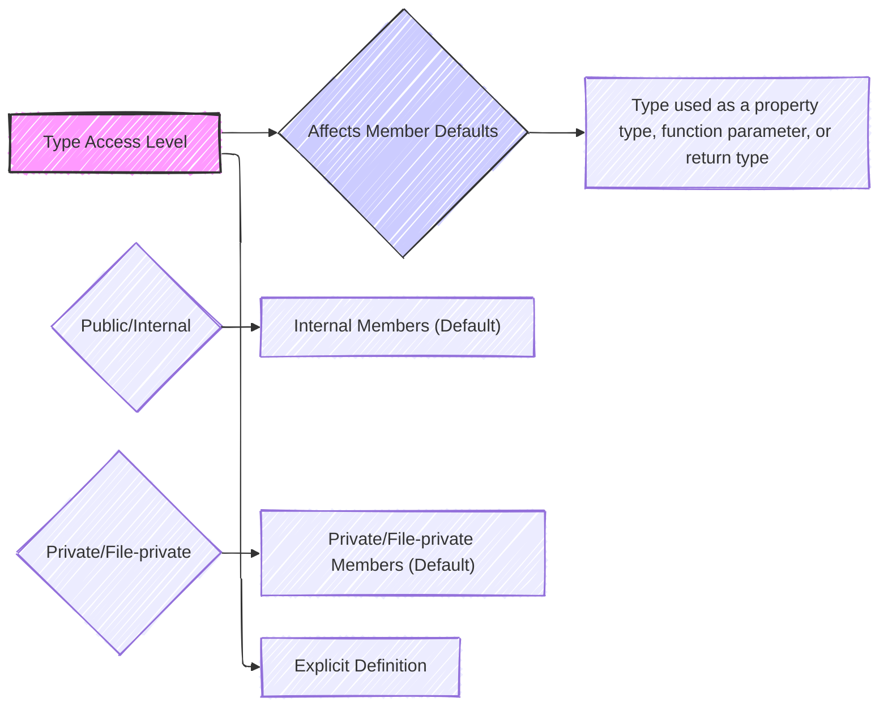
```mermaid
---
config:
  layout: elk
  look: handDrawn
  theme: default
---
graph LR
    A["Type Access Level"] --> B{"Affects Member Defaults"};
    C{"Public/Internal"} --> D["Internal Members (Default)"];
    E{"Private/File-private"} --> F["Private/File-private Members (Default)"];
    A --> G["Explicit Definition"];
    B --> H["Type used as a property type, function parameter, or return type"];
    
    style A fill:#f9f,stroke:#333,stroke-width:2px
    style B fill:#ccf,stroke:#333,stroke-width:1px
```

**Explanation:** This diagram explains how a type's access level influences the default access for its members and restricts type usage based on the guiding principle.

---

## 6. Tuple Type Access Level

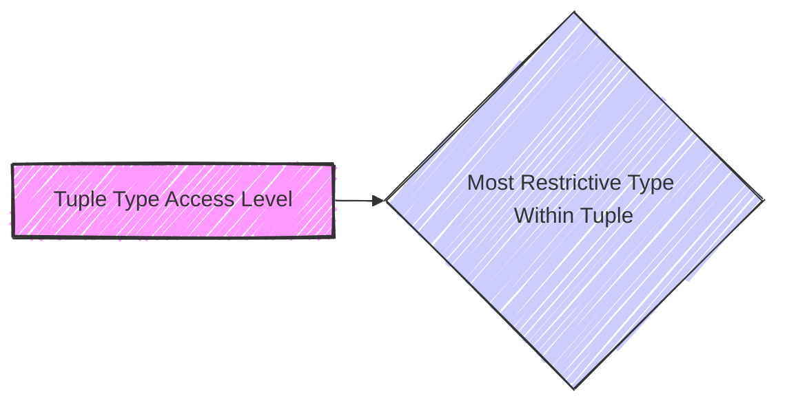
```mermaid
---
config:
  layout: elk
  look: handDrawn
  theme: default
---
graph LR
    A[Tuple Type Access Level] --> B{Most Restrictive Type Within Tuple};
    style A fill:#f9f,stroke:#333,stroke-width:2px
    style B fill:#ccf,stroke:#333,stroke-width:1px
```

**Explanation:** This succinct diagram explains how tuple access is determined.

---

## 7. Function Type Access Level

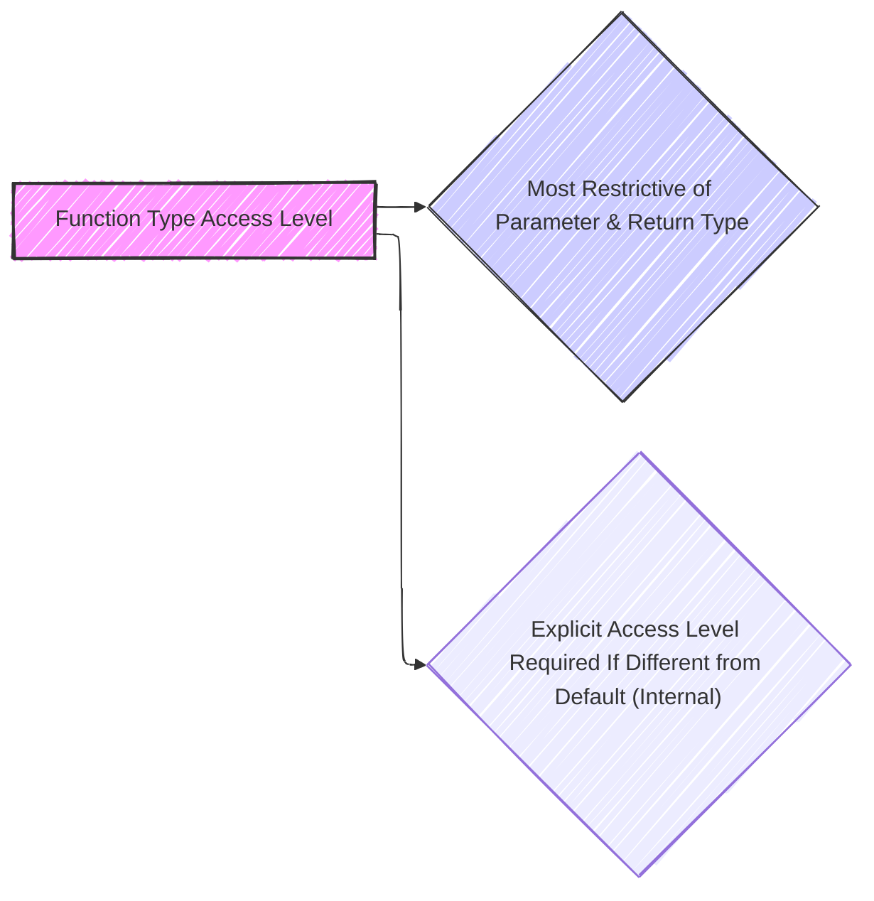
```mermaid
---
config:
  layout: elk
  look: handDrawn
  theme: default
---
graph LR
    A["Function Type Access Level"] --> B{"Most Restrictive of Parameter & Return Type"};
    A --> C{"Explicit Access Level Required If Different from Default (Internal)"};
    
    style A fill:#f9f,stroke:#333,stroke-width:2px
    style B fill:#ccf,stroke:#333,stroke-width:1px
```

**Explanation:** This illustrates how a function type's access is determined and when explicit modifiers are required.

---

## 8. Enumeration Types

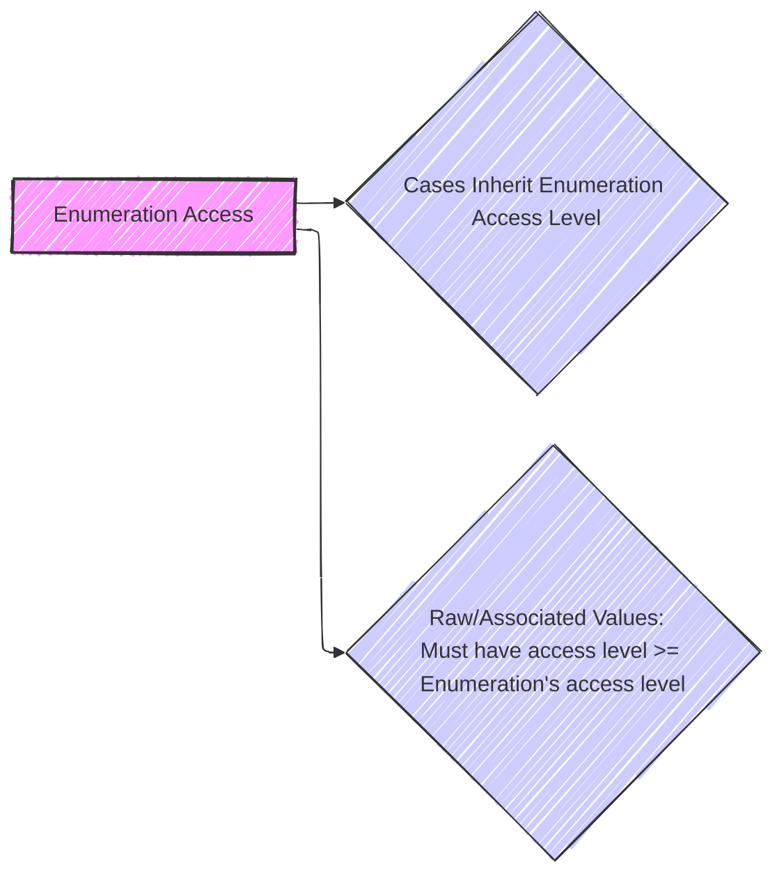
```mermaid
---
config:
  layout: elk
  look: handDrawn
  theme: default
---
graph LR
    A[Enumeration Access] --> B{Cases Inherit Enumeration Access Level};
    A --> C{Raw/Associated Values:  Must have access level >= Enumeration's access level};
    style A fill:#f9f,stroke:#333,stroke-width:2px
    style B fill:#ccf,stroke:#333,stroke-width:1px
    style C fill:#ccf,stroke:#333,stroke-width:1px
```

**Explanation:** Captures access behavior for enumerations and their associated values.

---

## 9. Nested Types

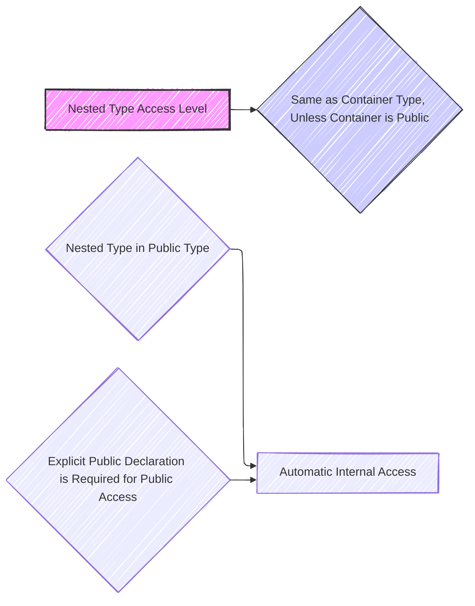
```mermaid
---
config:
  layout: elk
  look: handDrawn
  theme: default
---
graph LR
    A[Nested Type Access Level] --> B{Same as Container Type, Unless Container is Public};
    C{Nested Type in Public Type} --> D[Automatic Internal Access];
    E{Explicit Public Declaration is Required for Public Access} --> D
    style A fill:#f9f,stroke:#333,stroke-width:2px
    style B fill:#ccf,stroke:#333,stroke-width:1px
```

**Explanation:** This clearly explains the access rules for nested types.

---

## 10. Subclassing

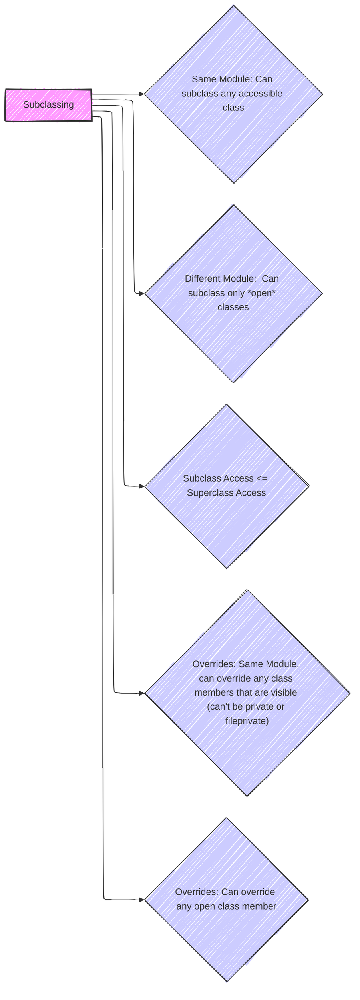
```mermaid
---
config:
  layout: elk
  look: handDrawn
  theme: default
---
graph LR
    A["Subclassing"] --> B{"Same Module: Can subclass any accessible class"};
    A --> C{"Different Module:  Can subclass only *open* classes"};
    A --> D{"Subclass Access <= Superclass Access"};
   A --> E{"Overrides: Same Module, can override any class members that are visible (can't be private or fileprivate)"};
   A --> F{"Overrides: Can override any open class member"};
   
    style A fill:#f9f,stroke:#333,stroke-width:2px
    style B fill:#ccf,stroke:#333,stroke-width:1px
    style C fill:#ccf,stroke:#333,stroke-width:1px
    style D fill:#ccf,stroke:#333,stroke-width:1px
    style E fill:#ccf,stroke:#333,stroke-width:1px
    style F fill:#ccf,stroke:#333,stroke-width:1px
    
```

**Explanation:** Details the rules governing class inheritance and overrides.

---

## 11. Properties, Constants, Variables, and Subscripts

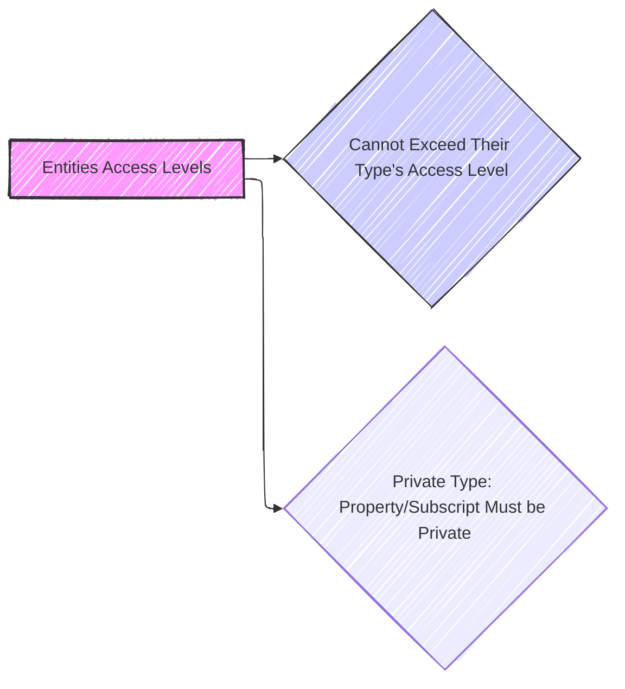
```mermaid
---
config:
  layout: elk
  look: handDrawn
  theme: default
---
graph LR
    A[Entities Access Levels] --> B{Cannot Exceed Their Type's Access Level};
    A --> C{Private Type: Property/Subscript Must be Private};
    style A fill:#f9f,stroke:#333,stroke-width:2px
    style B fill:#ccf,stroke:#333,stroke-width:1px
```

**Explanation:** This explains how different parts of the code can control the properties, subscripts, and more with the defined access levels.

---

## 12. Getters and Setters

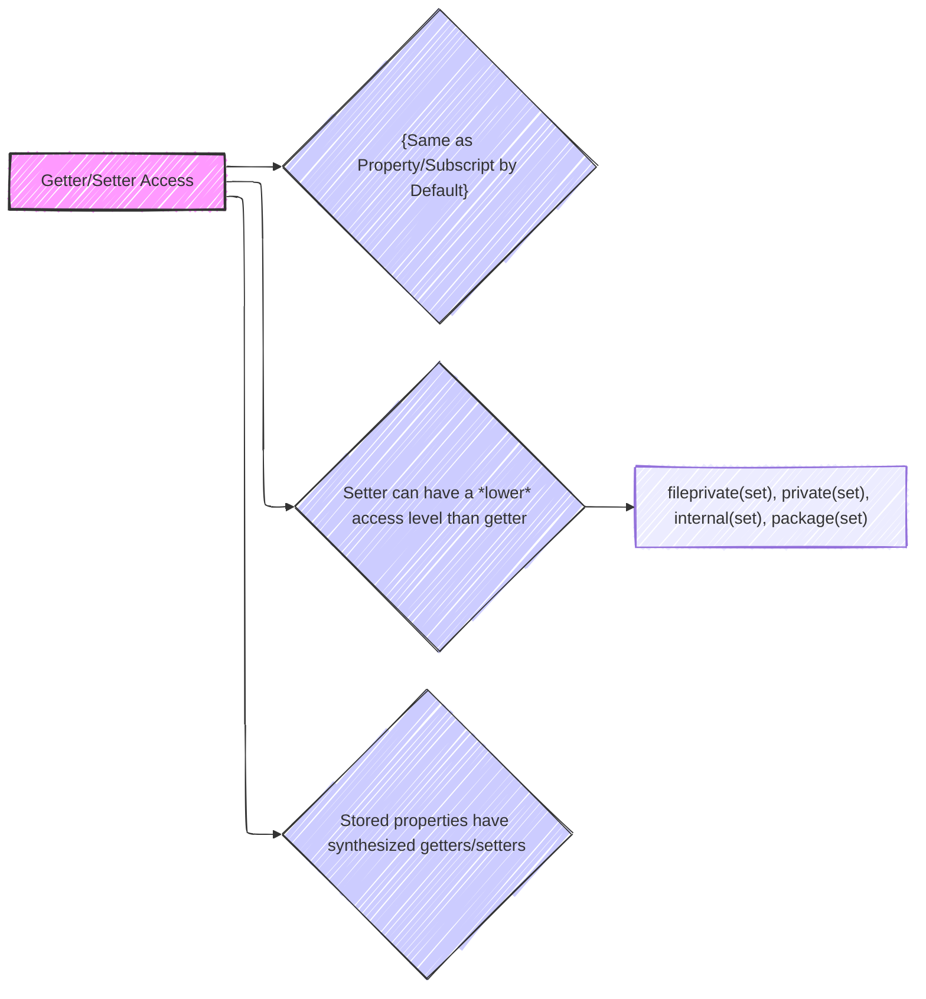
```mermaid
---
config:
  layout: elk
  look: handDrawn
  theme: default
---
graph LR
    A["Getter/Setter Access"] --> B{"{Same as Property/Subscript by Default}"};
    A --> C{"Setter can have a *lower* access level than getter"};
    C --> D["fileprivate(set), private(set), internal(set), package(set)"];
    A --> E{"Stored properties have synthesized getters/setters"};
    
    style B fill:#ccf,stroke:#333,stroke-width:1px
    style A fill:#f9f,stroke:#333,stroke-width:2px
    style C fill:#ccf,stroke:#333,stroke-width:1px
    style E fill:#ccf,stroke:#333,stroke-width:1px
```

**Explanation:** Illustrates the flexibility in controlling read/write access to properties.

---

## 13. Initializers

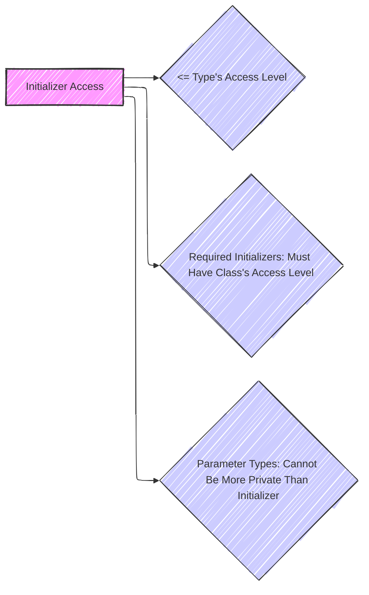
```mermaid
---
config:
  layout: elk
  look: handDrawn
  theme: default
---
graph LR
    A[Initializer Access] --> B{<= Type's Access Level};
    A --> C{Required Initializers: Must Have Class's Access Level};
    A --> D{Parameter Types: Cannot Be More Private Than Initializer};
    style A fill:#f9f,stroke:#333,stroke-width:2px
    style B fill:#ccf,stroke:#333,stroke-width:1px
    style C fill:#ccf,stroke:#333,stroke-width:1px
    style D fill:#ccf,stroke:#333,stroke-width:1px
```

**Explanation:** Explains the rules for initializer access, including the special case of `required` initializers.

---

## 14. Default Initializers

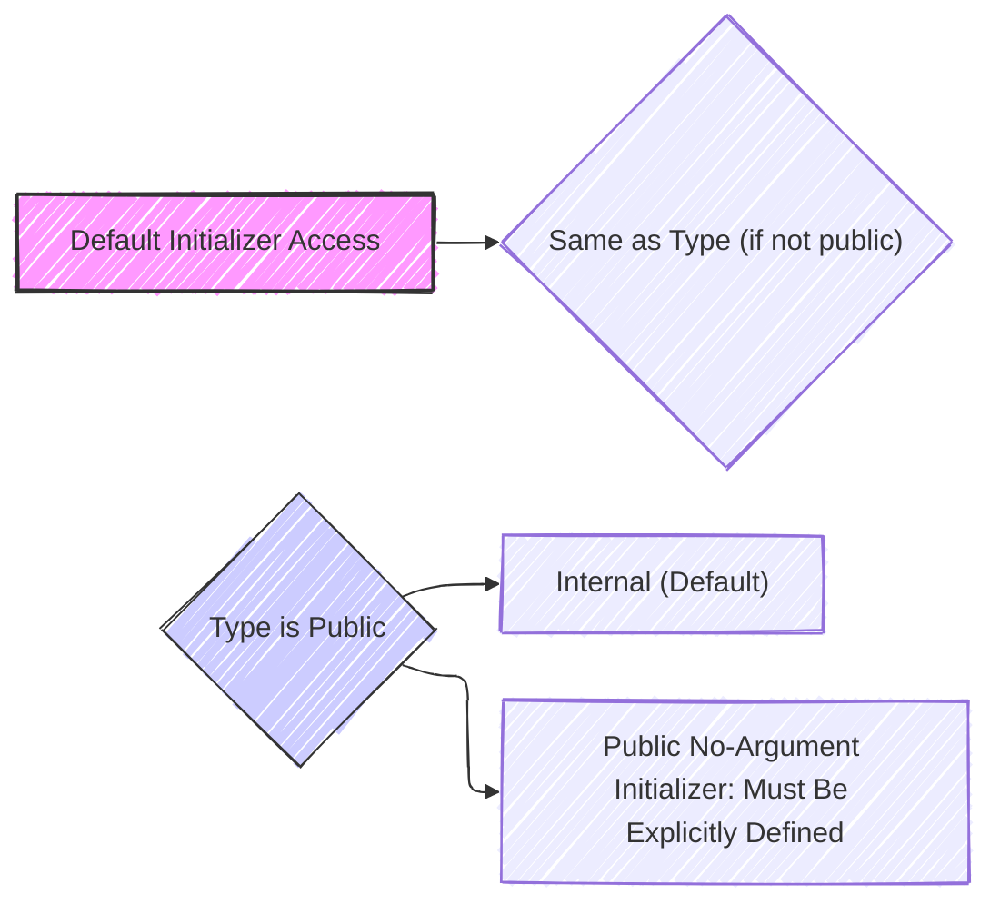
```mermaid
---
config:
  layout: elk
  look: handDrawn
  theme: default
---
graph LR
    A["Default Initializer Access"] --> B{"Same as Type (if not public)"};
    C{"Type is Public"} --> D["Internal (Default)"];
    C --> E["Public No-Argument Initializer: Must Be Explicitly Defined"];
    
    style A fill:#f9f,stroke:#333,stroke-width:2px
    style C fill:#ccf,stroke:#333,stroke-width:1px
```

**Explanation:** Details rules for default initializer access levels.

---

## 15. Default Memberwise Initializers for Structure Types

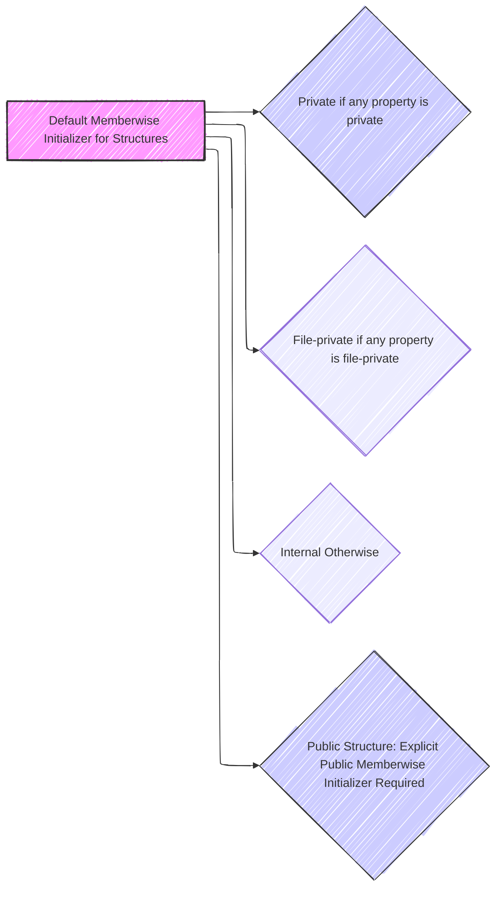
```mermaid
---
config:
  layout: elk
  look: handDrawn
  theme: default
---
graph LR
    A[Default Memberwise Initializer for Structures] --> B{Private if any property is private};
    A --> C{File-private if any property is file-private};
    A --> D{Internal Otherwise};
    A --> E{Public Structure: Explicit Public Memberwise Initializer Required};
    style A fill:#f9f,stroke:#333,stroke-width:2px
    style B fill:#ccf,stroke:#333,stroke-width:1px
    style E fill:#ccf,stroke:#333,stroke-width:1px
```

**Explanation:** Specifically explains access rules for memberwise initializers.

---

## 16. Protocols

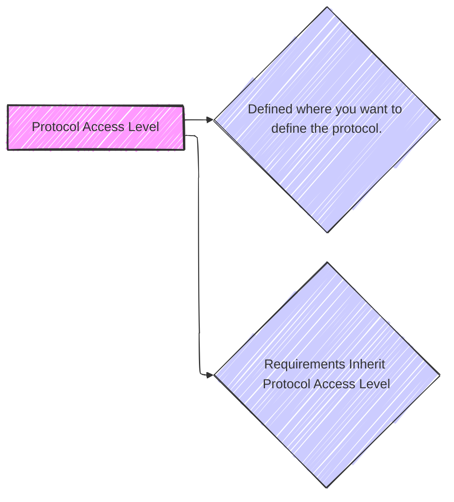
```mermaid
---
config:
  layout: elk
  look: handDrawn
  theme: default
---
graph LR
    A[Protocol Access Level] --> B{Defined where you want to define the protocol.};
    A --> C{Requirements Inherit Protocol Access Level};
    style A fill:#f9f,stroke:#333,stroke-width:2px
    style B fill:#ccf,stroke:#333,stroke-width:1px
    style C fill:#ccf,stroke:#333,stroke-width:1px
```

**Explanation:** Highlights key rules for protocol access control.

---

## 17. Protocol Inheritance

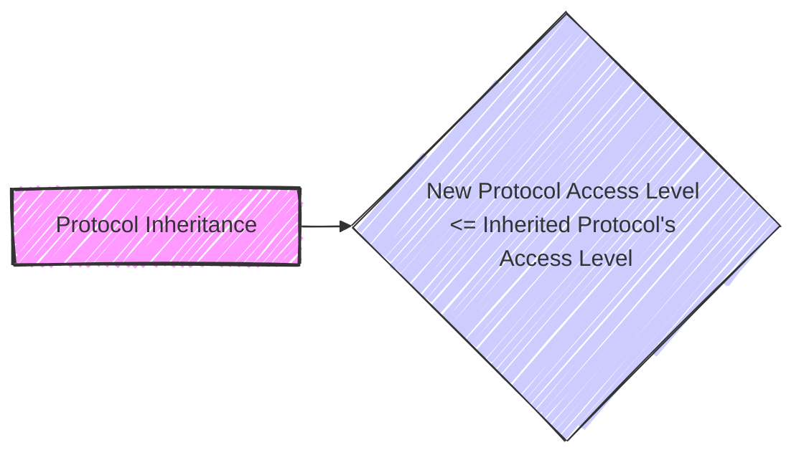
```mermaid
---
config:
  layout: elk
  look: handDrawn
  theme: default
---
graph LR
    A[Protocol Inheritance] --> B{New Protocol Access Level <= Inherited Protocol's Access Level};
    style A fill:#f9f,stroke:#333,stroke-width:2px
    style B fill:#ccf,stroke:#333,stroke-width:1px
```

**Explanation:** Rules for protocol inheritance.

---

## 18. Protocol Conformance

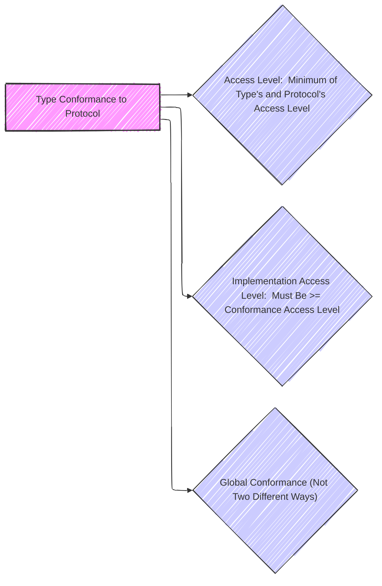
```mermaid
---
config:
  layout: elk
  look: handDrawn
  theme: default
---
graph LR
   A["Type Conformance to Protocol"] --> B{"Access Level:  Minimum of Type's and Protocol's Access Level"};
   A --> C{"Implementation Access Level:  Must Be >= Conformance Access Level"};
   A --> D{"Global Conformance (Not Two Different Ways)"};
    
    style A fill:#f9f,stroke:#333,stroke-width:2px
    style B fill:#ccf,stroke:#333,stroke-width:1px
    style C fill:#ccf,stroke:#333,stroke-width:1px
    style D fill:#ccf,stroke:#333,stroke-width:1px
```

**Explanation:** Explains protocol conformance access.

---

## 19. Extensions

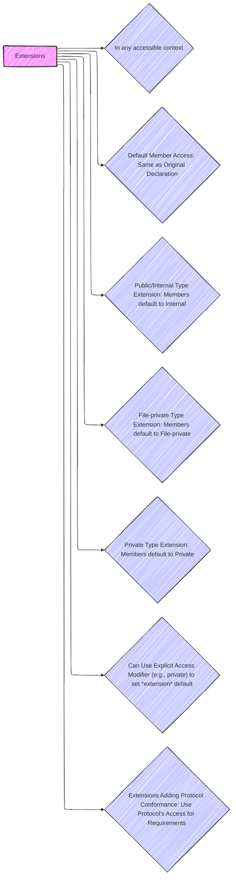
```mermaid
---
config:
  layout: elk
  look: handDrawn
  theme: default
---
graph LR
    A[Extensions] --> B{In any accessible context};
    A --> C{Default Member Access: Same as Original Declaration};
    A --> D{Public/Internal Type Extension: Members default to Internal};
    A --> E{File-private Type Extension: Members default to File-private};
    A --> F{Private Type Extension: Members default to Private};
    A --> G{"Can Use Explicit Access Modifier (e.g., private) to set *extension* default"};
    A --> H{"Extensions Adding Protocol Conformance: Use Protocol's Access for Requirements"};
    style A fill:#f9f,stroke:#333,stroke-width:2px
    style B fill:#ccf,stroke:#333,stroke-width:1px
    style C fill:#ccf,stroke:#333,stroke-width:1px
    style D fill:#ccf,stroke:#333,stroke-width:1px
    style E fill:#ccf,stroke:#333,stroke-width:1px
    style F fill:#ccf,stroke:#333,stroke-width:1px
    style G fill:#ccf,stroke:#333,stroke-width:1px
    style H fill:#ccf,stroke:#333,stroke-width:1px
```

**Explanation:** Details access control in extensions.

---

## 20. Private Members in Extensions

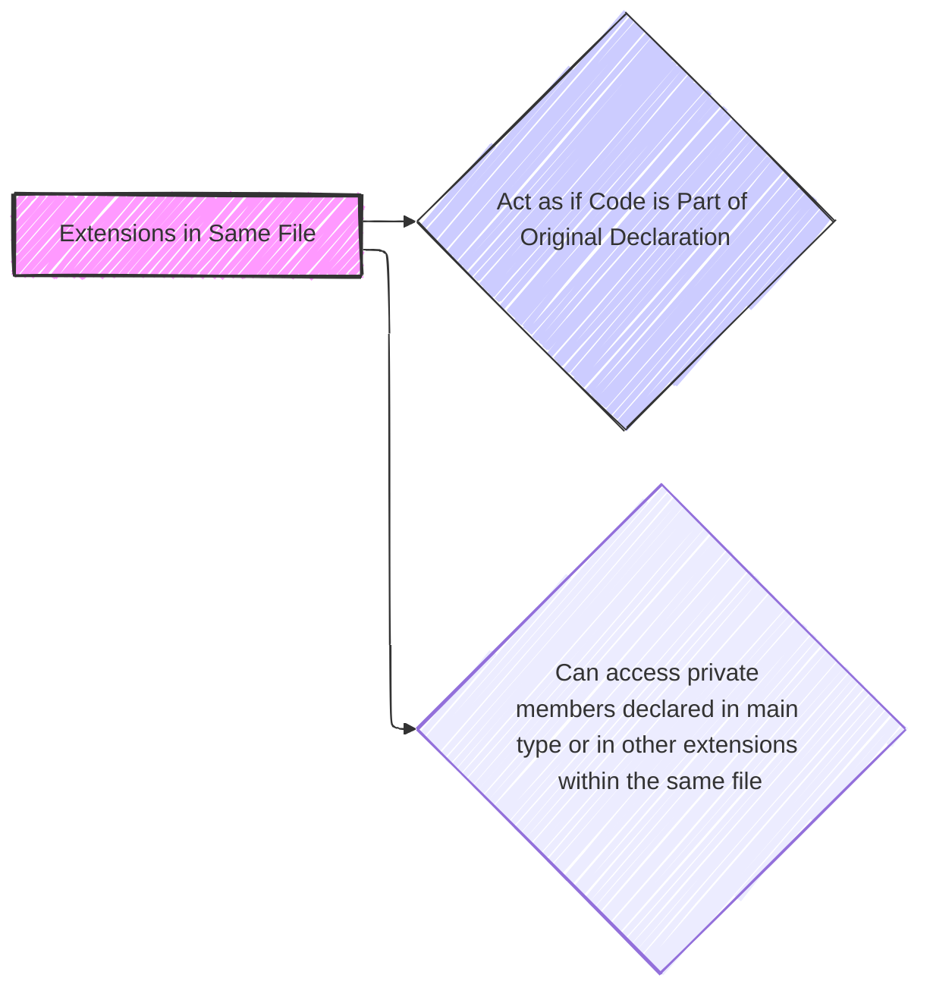
```mermaid
---
config:
  layout: elk
  look: handDrawn
  theme: default
---
graph LR
  A[Extensions in Same File] --> B{Act as if Code is Part of Original Declaration};
  A --> C{Can access private members declared in main type or in other extensions within the same file};
  style A fill:#f9f,stroke:#333,stroke-width:2px
  style B fill:#ccf,stroke:#333,stroke-width:1px
```

**Explanation:** Explains how private members are handled in extensions within the same source file.

---

## 21. Generics

```mermaid
---
config:
  layout: elk
  look: handDrawn
  theme: default
---
graph LR
    A[Generic Types/Functions] --> B{Access Level: Minimum of Generic and Constraint Access};
    style A fill:#f9f,stroke:#333,stroke-width:2px
    style B fill:#ccf,stroke:#333,stroke-width:1px
```

**Explanation:** Explains access control in generic code.

---

## 22. Type Aliases

```mermaid
---
config:
  layout: elk
  look: handDrawn
  theme: default
---
graph LR
    A[Type Alias] --> B{Distinct Types for Access Control};
    A --> C{Alias Access <= Aliased Type Access};
    D{Public Alias} --> E{Cannot Alias Internal, File-private, or Private};
    style A fill:#f9f,stroke:#333,stroke-width:2px
    style B fill:#ccf,stroke:#333,stroke-width:1px
    style D fill:#ccf,stroke:#333,stroke-width:1px
```

**Explanation:** Access control for type aliases.

---

---
**Licenses:**

- **MIT License:**   - Full text in [LICENSE](LICENSE) file.
- **Creative Commons Attribution 4.0 International:**  - Legal details in [LICENSE-CC-BY](LICENSE-CC-BY) and at [Creative Commons official site](http://creativecommons.org/licenses/by/4.0/).

---