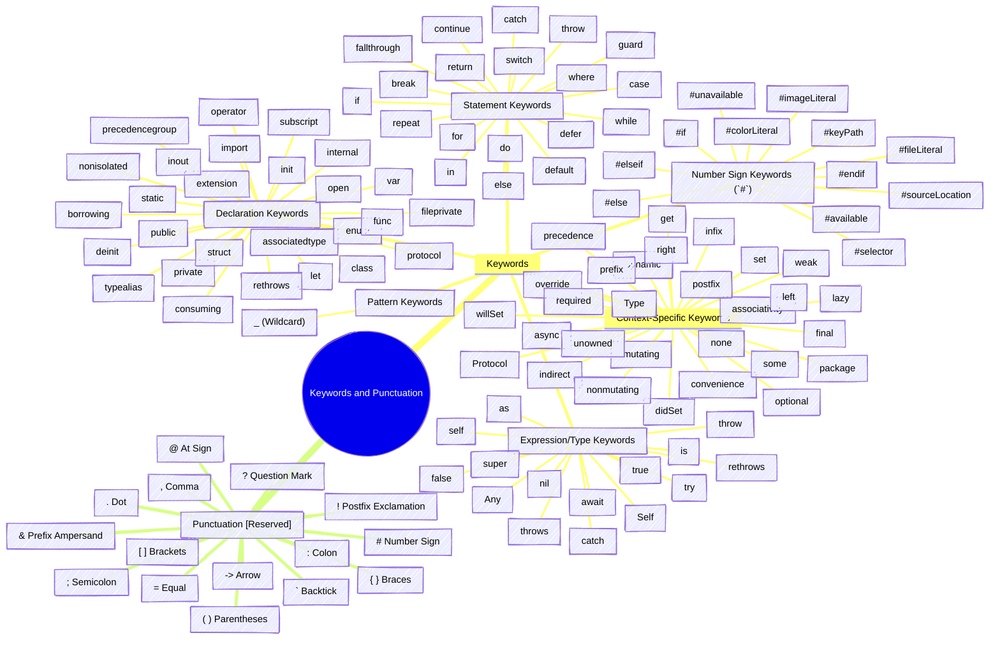
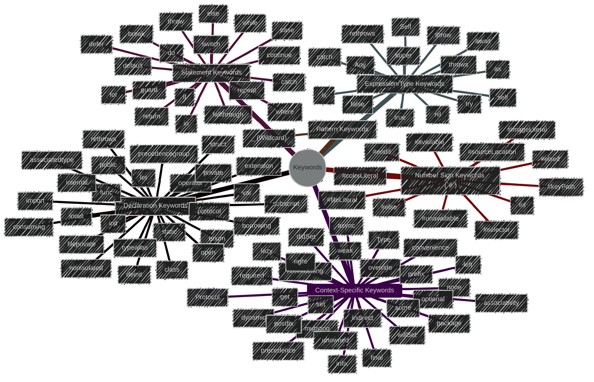
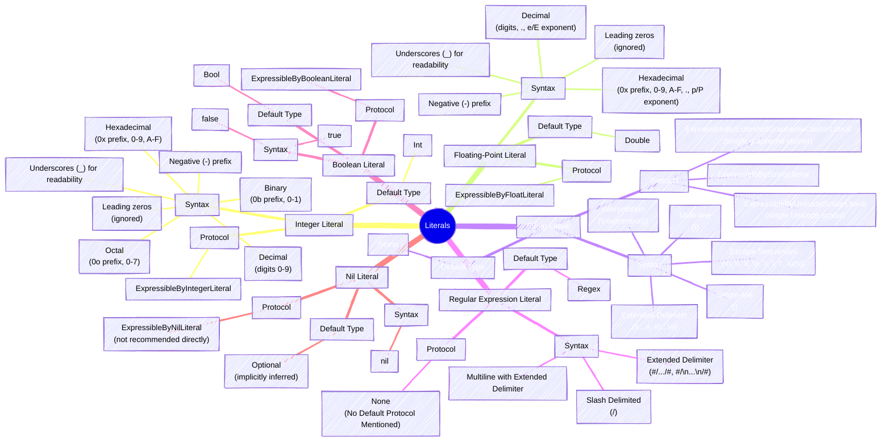
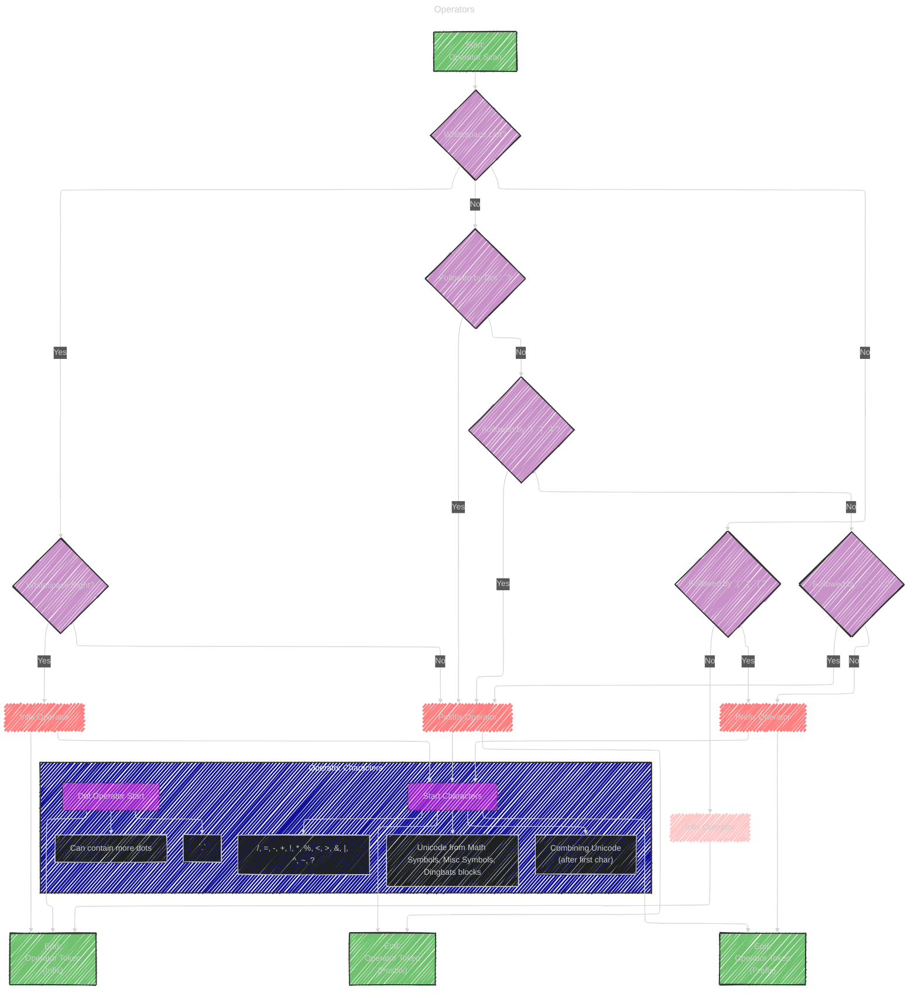

> This content is dual-licensed under your choice of the following licenses:
> 1.  **MIT License:** For the code implementations in Swift and Mermaid provided in this document.
> 2.  **Creative Commons Attribution 4.0 International License (CC BY 4.0):** For all other content, including the text, explanations, and the Mermaid diagrams and illustrations.

---

The document on Swift's [Lexical Structure](https://github.com/swiftlang/swift-book/blob/main/TSPL.docc/ReferenceManual/LexicalStructure.md) describes the basic building blocks of the Swift language - tokens - and how they are formed from characters.

To visually represent this, I'll use a variety of Mermaid diagrams, focusing on flowcharts and mind maps to illustrate the parsing process and categorize different lexical elements. 

Here's a breakdown of diagrams to cover the article's content:

----
# Diagram 1: Lexical Structure Overview (Mind Map)

This mind map provides a high-level view of the lexical structure process in Swift, starting from the source file and progressing to the final language structure. It highlights the central role of lexical analysis in converting characters into tokens, which are then used for syntax analysis.

---

# Diagram 2: Whitespace and Comments (Flowchart)

This flowchart illustrates the Swift compiler's handling of whitespace and comments during lexical analysis. It shows that both are essentially treated as separators and ignored for the purpose of tokenization, except for their role in operator disambiguation. The diagram details types of whitespace and comment syntax.

---

# Diagram 3: Identifiers (Flowchart)

This flowchart details the rules for forming valid Swift identifiers. It covers the allowed starting and subsequent characters, handling of reserved words (with backticks), and highlights special identifier types like those for implicit parameters and property wrapper projections.  It visually represents the decision process the compiler uses to identify tokens as valid identifiers.

---

# Diagram 4: Keywords and Punctuation (Mind Map)

This mind map categorizes Swift keywords based on their usage context: declaration, statement, expression & type, pattern, number sign keywords, and context-specific keywords. It also lists reserved punctuation marks. This representation offers a structured overview of these essential lexical elements, making it easy to grasp their variety and purpose.

To make a nicer view for the mindmap, I break down the keyword graph into a separate mindmap below: 

---

# Diagram 5: Literals (Mind Map)

This comprehensive mind map breaks down Swift literals by type: Integer, Floating-point, String, Regular Expression, Boolean, and Nil. For each literal type, it details the syntax variations, default inferred type, and the relevant `ExpressibleBy` protocol from the Swift standard library. This diagram is designed to serve as a quick reference guide for understanding different types of literals and their properties in Swift.

---

# Diagram 6: Operators (Flowchart and Character Set)

This diagram combines a flowchart explaining how Swift determines if an operator is infix, prefix, or postfix based on whitespace rules, with a 'character set' subgraph detailing valid characters for custom operators. The flowchart visualizes the decision process based on whitespace around the operator. The character set provides a reference for allowed operator head characters (ASCII and Unicode ranges) and the special case of dot operators.

---
**Licenses:**

- **MIT License:**   - Full text in [LICENSE](LICENSE) file.
- **Creative Commons Attribution 4.0 International:**  - Legal details in [LICENSE-CC-BY](LICENSE-CC-BY) and at [Creative Commons official site](http://creativecommons.org/licenses/by/4.0/).

---