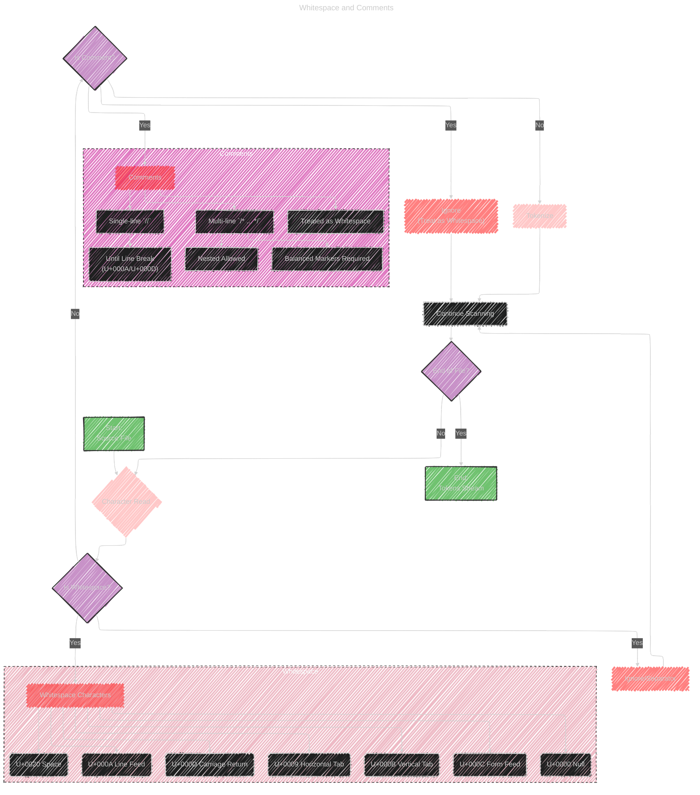
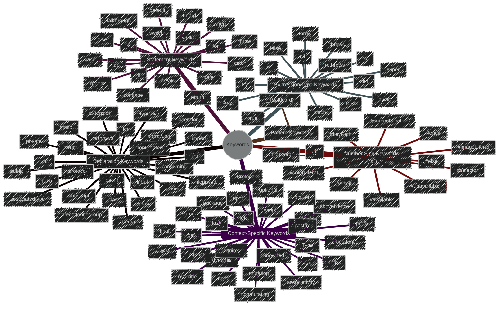
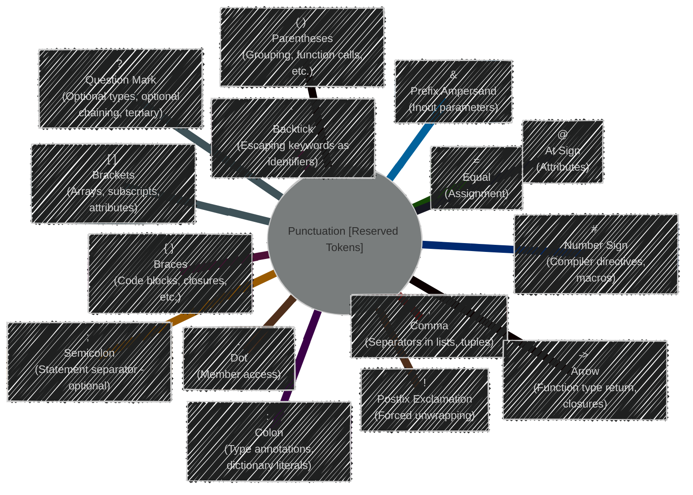
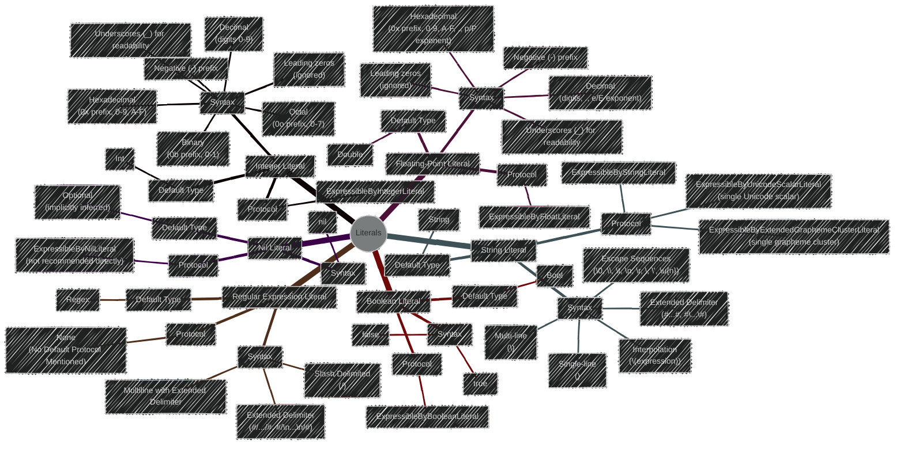

---

  <blockquote>
  As a visual learner student, I created these personal study notes from the cited source(s) to aid my understanding. 
  While my firm intention is to provide full credit, the blended format of notes and diagrams may sometimes obscure the original source, for which I apologize. 
  I am committed to making corrections and welcome any feedback. 
  This is a non-commercial project for my humble educational purposes only since the start. 
  My goal is to share my perspective and contribute to the great work already being done.
   
   
  I want to extend my genuine apologies to the creators of the original material. 
  Their work was the direct inspiration for this project, and I adapted it without first reaching out. 
  My intent comes from a place of deep respect, and I hope this is received in the spirit of homage. 
  🙏🏼🙏🏼🙏🏼🙏🏼
  </blockquote>

----

Below is a collection of enhanced diagrams and illustrations, which providing a more complete, clear, and effective visual representation of [Swift's Lexical Structure](https://github.com/swiftlang/swift-book/blob/main/TSPL.docc/ReferenceManual/LexicalStructure.md).

The diagrams and illustrations below are optimized versions of [their previous first versions in this doc](./Lexical_Structure_V1.md)

----

# Diagram 1: Lexical Structure Overview (Mind Map)

This enhanced mind map now provides a more structured process overview and richer context for each stage, especially for "Tokens," by giving concrete examples, making it easier to understand the role of lexical analysis in the broader compilation process.

---

# Diagram 2: Whitespace and Comments (Flowchart)

The flowchart is now more detailed and structured. The visual grouping of whitespace and comment characteristics in subgraphs enhances readability and makes it easier to grasp the specifics of how Swift handles these elements. The node styling further improves the flow visualization.

---

# Diagram 3: Identifiers (Flowchart)

This revised flowchart has a cleaner flow, improved decision point logic, and prominently highlights the special identifier cases within a subgraph.  It is now more effective in guiding someone through the process of validating Swift identifiers.

---

# Diagram 4: Keywords and Punctuation (Mind Map)

## Diagram 4a: Keywords (Mind Map)

## Diagram 4b: Punctuation (Mind Map)

By separating Keywords and Punctuation, and creating dedicated mind maps for each, both become more focused and easier to read and understand. The descriptions added to punctuation nodes provide immediate context and function.

---

# Diagram 5: Literals (Mind Map)

The restructured Literals mind map is now much more organized and easier to navigate. The consistent branch structure and expanded details under "Syntax" make it a more effective reference for understanding Swift literals.

---

# Diagram 6: Operators (Flowchart and Character Set)

The optimized Operators diagram now offers a more direct and understandable flowchart for operator type classification based on whitespace. The enhanced "Operator Characters" subgraph provides richer detail and clarity about valid characters for custom operators.

---
