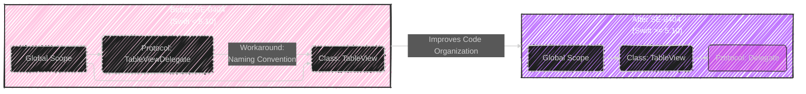
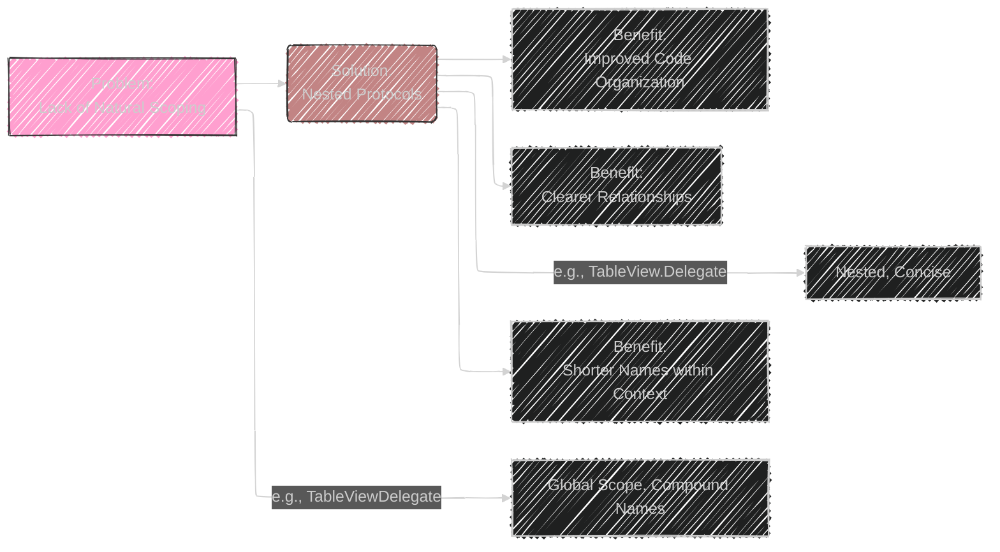
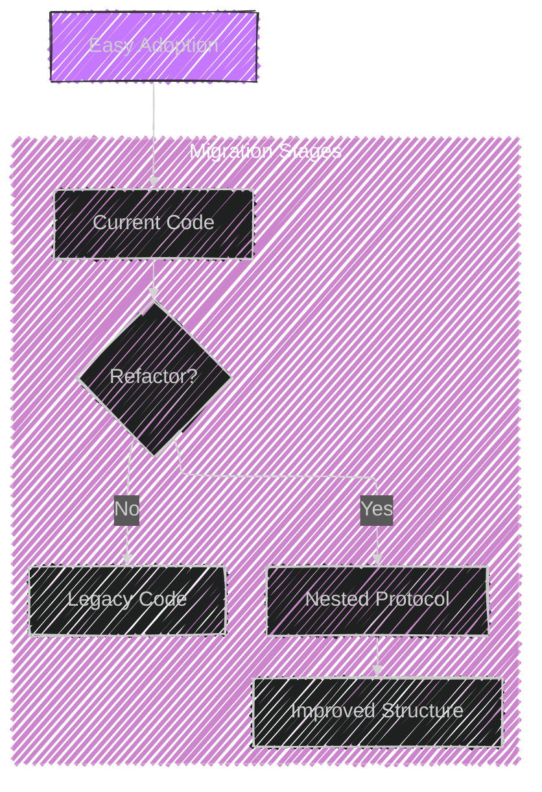
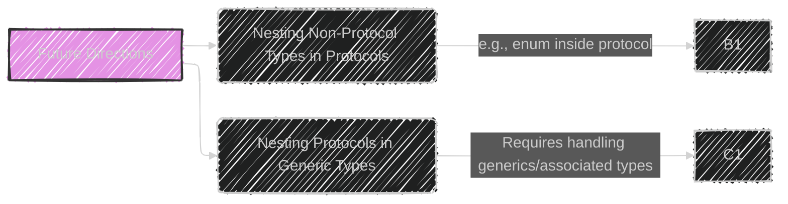

# A Diagrammatic Guide to SE-0404: Allow Protocols to be Nested in Non-Generic Contexts
> This content is dual-licensed under your choice of the following licenses:
> 1.  **MIT License:** For the code implementations in Swift and Mermaid provided in this document.
> 2.  **Creative Commons Attribution 4.0 International License (CC BY 4.0):** For all other content, including the text, explanations, and the Mermaid diagrams and illustrations.

---


---


## Overview: SE-0404 - Nested Protocols

This proposal enhances Swift by allowing protocols to be nested within non-generic types (structs, classes, enums, actors) and functions.  This improves code organization and readability by clearly scoping protocols to their related types.



**Explanation:**

*   **Before SE-0404:** Protocols had to be declared at the global scope.  Developers used naming conventions (like `TableViewDelegate`) to indicate relationships.
*   **After SE-0404:** Protocols can be nested within the types they relate to, making the relationship explicit and improving code clarity.

---

## Motivation:  Why Nest Protocols?

The core idea is *natural scoping*. Just like `String.UTF8View` clearly belongs to `String`, a `TableView.Delegate` protocol clearly defines the delegate interface for a `TableView`.



**Key Benefits:**

*   **Improved Code Organization:**  Protocols are grouped with the types they logically belong to.
*   **Clearer Relationships:**  The nesting visually and structurally emphasizes the relationship between the protocol and its enclosing type.
*   **Shorter Names:** Within the enclosing type, you can refer to the nested protocol by its short name (`Delegate` instead of `TableView.Delegate`).

---

## Proposed Solution: Where Can Protocols Be Nested?

Protocols can be nested in:

1.  Non-generic `struct`, `class`, `enum`, `actor` types.
2.  Non-generic functions and closures.


**Example (Class):**

```swift
class TableView {
  protocol Delegate: AnyObject { // Nested protocol
    func tableView(_: TableView, didSelectRowAtIndex: Int)
  }

  weak var delegate: Delegate?  // Use short name
}
```

**Example (Function):**

```swift
func processData() {
  protocol DataHandler { // Nested protocol
    func handle(_ data: Data)
  }

  struct MyHandler: DataHandler {
    func handle(_ data: Data) { /* ... */ }
  }

  // ... use MyHandler ...
}
```

---

## Restrictions:  No Nesting in Generic Contexts

Crucially, protocols *cannot* be nested within generic types or functions. This is a key limitation of SE-0404.


**Example (Incorrect - Generic Class):**

```swift
class GenericTableView<Element> {
  // ERROR: Cannot nest protocol in generic context
  protocol Delegate {
    func didSelect(_: Element)
  }
}
```

**Example (Incorrect - Generic Function):**

```swift
func genericFunction<T>(value: T) {
  // ERROR: Cannot nest protocol in generic context
  protocol Processor {
    func process(_: T)
  }
}
```

**Reasoning:**  Supporting nested protocols in generic contexts would require more complex features like:

*   Generic protocols
*   Mapping generic type parameters to associated types

These are explicitly *out of scope* for SE-0404, but potential future directions.

---

## Associated Type Matching

Nested protocols *do not* witness associated type requirements of an outer protocol.


**Example:**
```swift
    protocol Widget {
        associatedtype Delegate // Associated type in outer protocol
   }

    struct TableWidget: Widget{
    // Nested protocol does NOT satisfy the 'Delegate' requirement
        protocol Delegate{ }
    }
```

**Explanation:**

*   Associated types define a *single* concrete type that fulfills a requirement.
*   Protocols represent *constraints* that multiple types can conform to.  There's no clear way to map a nested protocol to a single associated type.
*   A hypothetical future feature ("associated protocols") might address this.

---

## Source and ABI Compatibility

*   **Source Compatibility:**  SE-0404 is purely additive; existing code will not break.
*   **ABI Compatibility:**  Moving a protocol in/out of a nested context is an *ABI-breaking* change.  This is because the protocol's mangled name includes the enclosing type's name.
*   **Mitigation (Source Breakage):** When moving a protocol, provide a `typealias` to maintain source compatibility:

    ```swift
    // Old code:
    protocol MyProtocol { /* ... */ }

    // New code (nested):
    class MyContainer {
      protocol InnerProtocol { /* ... */ }
    }
    typealias MyProtocol = MyContainer.InnerProtocol // For source compatibility
    ```

---
## Implications on Adoption
This part emphasizes how easily developers can start using the new feature.

**Adoption Illustration**




*   **Easy Adoption**: The feature can be freely adopted without any constraints.
*  **Refactoring**: Developers can easily refactor existing flat code structures to use nested protocols.

---

## Future Directions

1.  **Nesting Non-Protocol Types in Protocols:**  Allowing structs, enums, etc., to be nested within protocols.  This is useful for types that are specific to a protocol (e.g., `FloatingPointRoundingRule` within the `FloatingPoint` protocol).

2.  **Nesting Protocols in Generic Types:** This opens the door to greater expressiveness, but would require addressing how generics and associated types interact with nested protocols.



---

## Alternatives Considered

The proposal states that no other alternatives were considered, as this is a straightforward extension of existing nesting capabilities.

---
## Key Takeaways (Table)

| Feature                   | Description                                                                         | Status     |
| :------------------------ | :---------------------------------------------------------------------------------- | :--------- |
| Nested Protocols          | Protocols can be nested within non-generic structs, classes, enums, actors, and functions. | Implemented (Swift 5.10) |
| Generic Contexts          | Nesting protocols in generic contexts is *not* allowed.                               | N/A        |
| Associated Type Witnessing | Nested protocols *do not* witness associated type requirements.                       | N/A        |
| Source Compatibility      | Fully additive; does not break existing code.                                     | Compatible |
| ABI Compatibility         | Moving protocols in/out of nesting is ABI-breaking.                                  | Incompatible |
| Adoption                  | Easy to adopt and un-adopt; use `typealias` for source compatibility during moves.   | Easy       |

---


---
**Licenses:**

- **MIT License:**  [](LICENSE) - Full text in [LICENSE](LICENSE) file.
- **Creative Commons Attribution 4.0 International:** [](LICENSE-CC-BY) - Legal details in [LICENSE-CC-BY](LICENSE-CC-BY) and at [Creative Commons official site](http://creativecommons.org/licenses/by/4.0/).

---
