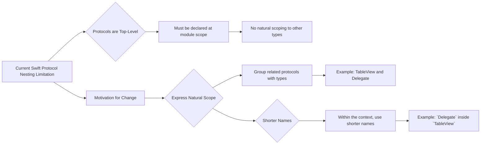
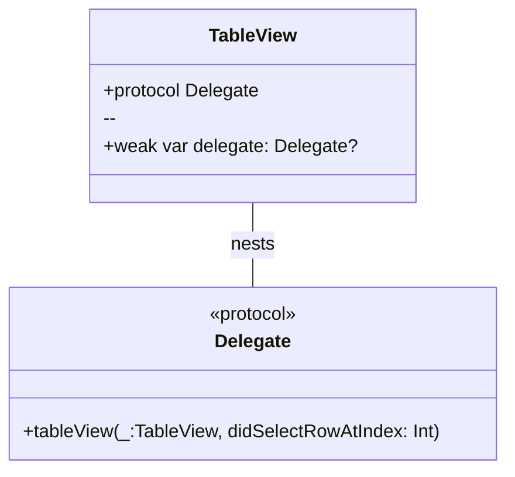
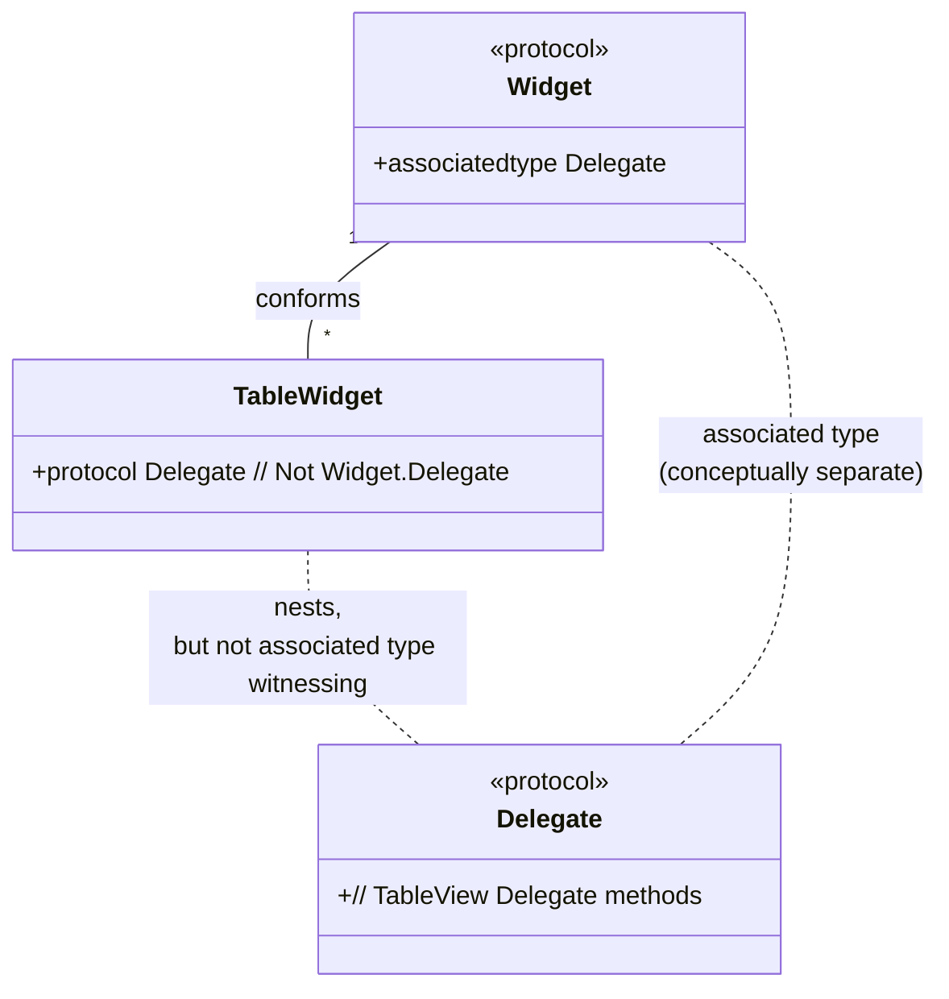
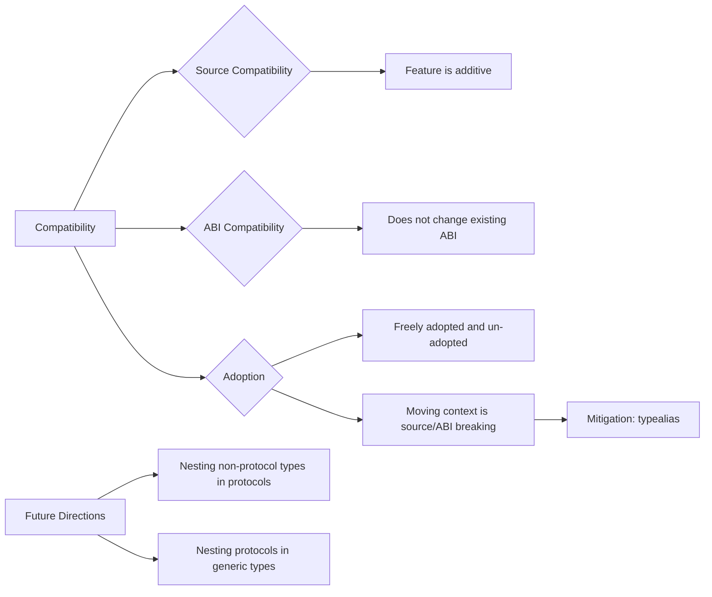

```mermaid
graph LR
    subgraph Allowed_Nesting_Contexts["Allowed Nesting Contexts"]
    style Allowed_Nesting_Contexts fill:#e3e5,stroke:#333,stroke-width:1px
        A[Non-Generic Struct]
        B[Non-Generic Class]
        C[Non-Generic Enum]
        D[Non-Generic Actor]
        E[Non-Generic Function]
        F[Non-Generic Closure]
    end
    subgraph Forbidden_Nesting_Contexts["Forbidden Nesting Contexts"]
    style Forbidden_Nesting_Contexts fill:#f664,stroke:#333,stroke-width:1px
        G[Generic Struct]
        H[Generic Class]
        I[Generic Enum]
        J[Generic Actor]
        K[Generic Function]
        L[Functions in Generic Contexts]
    end
    
    %% Direction: Allowed Nesting --> Forbidden Nesting
    %% Allowed Nesting -- Allows Nesting Protocols --> Forbidden Nesting
    %% Forbidden Nesting -- Disallows Nesting Protocols --> Allowed Nesting
    
    Allowed_Nesting_Contexts --> Forbidden_Nesting_Contexts
    Allowed_Nesting_Contexts -- Allows Nesting Protocols --> Forbidden_Nesting_Contexts
    Forbidden_Nesting_Contexts -- Disallows Nesting Protocols --> Allowed_Nesting_Contexts
    
```

# A Diagrammatic Guide to SE-0404: Allow Protocols to be Nested in Non-Generic Contexts

---

  <blockquote>
  As a visual learner student, I created these personal study notes from the cited source(s) to aid my understanding. 
  While my firm intention is to provide full credit, the blended format of notes and diagrams may sometimes obscure the original source, for which I apologize. 
  I am committed to making corrections and welcome any feedback. 
  This is a non-commercial project for my humble educational purposes only since the start. 
  My goal is to share my perspective and contribute to the great work already being done.
   
   
  I want to extend my genuine apologies to the creators of the original material. 
  Their work was the direct inspiration for this project, and I adapted it without first reaching out. 
  My intent comes from a place of deep respect, and I hope this is received in the spirit of homage. 
  🙏🏼🙏🏼🙏🏼🙏🏼
  </blockquote>

----

## 1. Current Limitation and Motivation

*   **Current Limitation:** Protocols in Swift must be top-level types and cannot be nested within other types.
*   **Motivation:** Nesting is a useful way to express scope and relationship between types (e.g., `String.UTF8View`). Applying this to protocols would enhance code clarity and organization.

    *   **Visualization Idea:** Use a simple flowchart or a contrast diagram to show the "Before" (limitation) and "After" (motivation/benefit) scenarios.

---

## 2. Proposed Solution: Nesting Protocols in Non-Generic Contexts

*   **Allowed Nesting:**  Proposes allowing protocols to be nested within:
    *   Non-generic `struct`, `class`, `enum`, `actor`
    *   Non-generic functions/closures
*   **Example: `TableView.Delegate`:**  Illustrates the natural grouping of a delegate protocol with its class, improving naming and discoverability.

    *   **Visualization Idea:** Use a class diagram-like structure to show the nesting of `TableView` and `Delegate` protocol, highlighting the improved code organization.

---

## 3. Restrictions: No Nesting in Generic Contexts

*   **Forbidden Nesting:** Protocols cannot be nested within:
    *   Generic `struct`, `class`, `enum`, `actor`
    *   Generic functions
    *   Functions within generic contexts
*   **Reason:** Complexity related to generic protocols or mapping generic parameters to associated types, which are out of scope for this proposal.

    *   **Visualization Idea:** Use a "Not Allowed" or "Restriction" diagram, perhaps a flowchart that branches to show allowed and disallowed nesting scenarios based on generics.

---

## 4. Associated Type Matching

*   **Non-Witnessing:** Nested protocols within concrete types do *not* automatically witness associated type requirements from outer protocols.
*   **Explanation:** Protocols are constraint types, and witnessing is designed for concrete type relationships, not constraint-to-constraint.

    *   **Visualization Idea:** A class diagram or object diagram to explicitly show the `Widget` protocol with `associatedtype Delegate` and `TableWidget` with a nested `Delegate` protocol, emphasizing that they are *not* related in terms of associated type witnessing in this context.

---

## 5. Compatibility and Future Directions

*   **Source/ABI Compatibility:** The feature is additive and ABI-compatible. Moving protocols in/out of contexts is source and ABI breaking but can be mitigated with `typealias`.
*   **Future Directions:**
    *   Nesting non-protocol types in protocols.
    *   Nesting protocols in generic types (potential future exploration).

    *   **Visualization Idea:** For compatibility, perhaps a simple icon or text symbol to denote "Additive" and "ABI Compatible." For future directions, use a list or simple flowchart of potential expansions.

Based on these points, here are some Mermaid diagrams in Markdown format to represent these concepts textually:

----

---

---

---

These diagrams, presented textually in Markdown with Mermaid syntax, aim to visually summarize the key aspects of the SE-0404 proposal by showing:

*   **Problem and Motivation:** Why the change is needed and what benefits it brings.
*   **Proposed Solution and Restrictions:** Where protocol nesting is allowed and crucially, where it is *not* allowed.
*   **Associated Type Behavior:**  Clarifying how nested protocols interact with associated types (or rather, don't directly in terms of witnessing).
*   **Compatibility and Evolution:**  Highlighting the compatibility aspects and potential future expansions of the feature.

---
