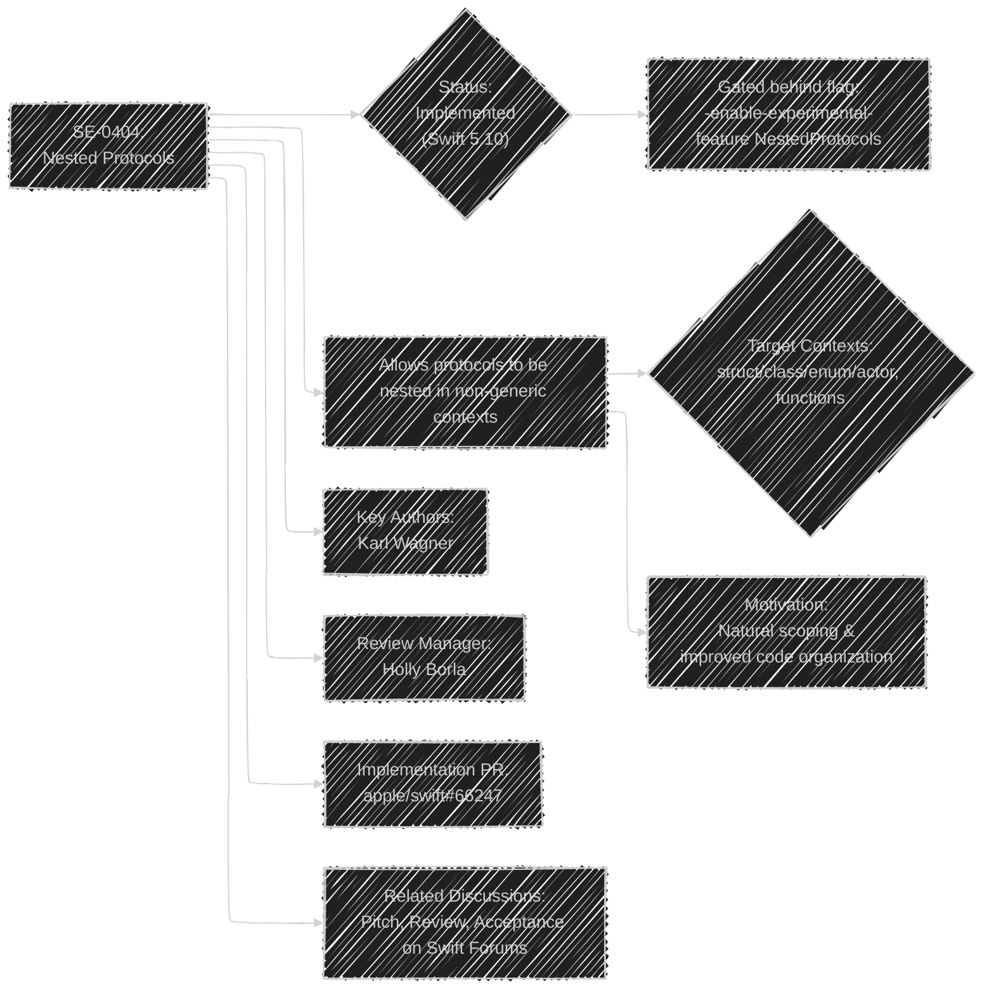
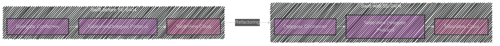
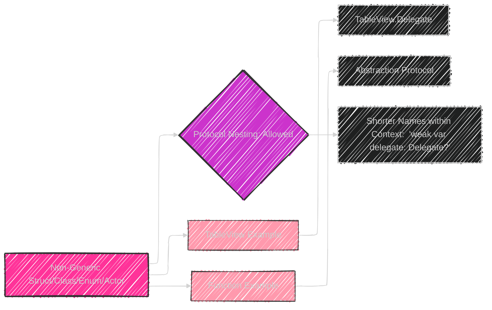
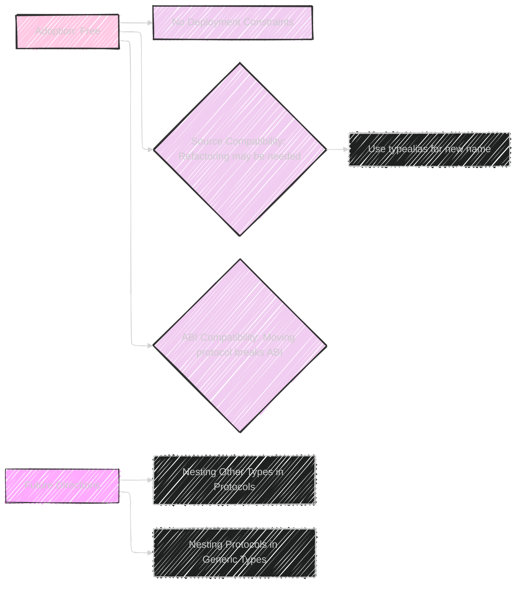

# A Diagrammatic Guide to SE-0404: Allow Protocols to be Nested in Non-Generic Contexts
> This content is dual-licensed under your choice of the following licenses:
> 1.  **MIT License:** For the code implementations in Swift and Mermaid provided in this document.
> 2.  **Creative Commons Attribution 4.0 International License (CC BY 4.0):** For all other content, including the text, explanations, and the Mermaid diagrams and illustrations.

---


## 1. Proposal Overview

**Diagram 1: Proposal Status and Key Elements**




**Textual Summary:**

*   **Purpose:** This Swift Evolution proposal enables developers to nest protocols within nominal types (structs, classes, enums, actors) and functions, provided these contexts aren't generic.
*   **Status:** Implemented in Swift 5.10, but initially behind a feature flag.
*   **Motivation:** To allow for a more natural and organized structure, reflecting the logical relationships between types in the codebase. For instance, the delegate protocol for a `TableView` logically belongs inside the `TableView` class.
*   **Core Change:** Permits nested protocols, mirroring the existing ability to nest other types (e.g., structs, enums).

---

## 2. Motivation: Natural Scoping and Code Organization

**Diagram 2: Before and After - Code Organization**



**Textual Explanation**

*   **Problem:** Developers previously used compound names (e.g., `TableViewDelegate`) creating an indirect scoping relationship.
*   **Solution:** SE-0404 allows the `Delegate` protocol to be nested directly inside `TableView`. This makes the code easier to understand (explicit scoping) reducing the naming complexity. The use of short names within the context helps enhance code clarity.

---

## 3. Proposed Solution: Nesting in Different Contexts

**Diagram 3: Nesting Scope**



**Textual Explanation**

*   **Contexts:** Protocols can be nested within non-generic structs, classes, enums, actors and non-generic functions and closures.
*   **TableView Example:** The `Delegate` protocol is nested inside a `TableView` class to represent the conceptual link.
*   **Function Example:** Protocols can also be defined within functions which is useful when creating abstractions in local scopes.
*   **Benefits:** Shorter, more readable code when referencing the nested protocol within the parent type.

---

## 4. Detailed Design: Restrictions and Associated Types

**Diagram 4: Restrictions: No Generic Contexts**


**Textual Explanation:**

*   **Restriction:** Protocol nesting is **not permitted** within generic contexts (generic classes, generic functions or functions contained within a generic context).
*   **Reasoning:** It would require extending the language to include either generic protocols or a mechanism to map generic parameters into associated types and either approach is beyond the scope of this proposal.
*   **Associated Type Matching:** Nested protocols do **not** automatically witness associated type requirements.  There is no obvious meaning as protocols are constraint types which many concrete types can conform to.

---

## 5. Associated Type Matching

**Code Example**

```swift
protocol Widget {
  associatedtype Delegate
}

struct TableWidget: Widget {
  // Does NOT witness Widget.Delegate
  protocol Delegate { ... }
}
```

**Textual Explanation**

*   **Associated types:** When nested in a concrete type, protocols do not witness associated type requirements.
*   **Concrete vs constraint types:** Associated types associate one concrete type with one conforming type which is different from the protocol being a constraint type which many concrete types can conform to.

---

## 6. Source and ABI Compatibility

**Textual Explanation:**

*   **Source Compatibility:** This feature is *additive*. It does not break existing code. Providing a `typealias` can mitigate source breakage if refactoring code to nest a protocol.
*   **ABI Compatibility:** Moving a protocol in or out of a parent context *is* an ABI-incompatible change, because the parent context forms part of the mangled name.

---

## 7. Adoption Implications and Future Directions

**Diagram 5: Adoption and Future Directions**



**Textual Explanation:**

*   **Adoption:** The feature can safely be adopted and abandoned without affecting deployment.
*   **Refactoring:** Moving a protocol source-breaking change. Using `typealias` can help in these situations.
*   **ABI:** Moving a protocol is an incompatible change. The parent context changes the mangled name.
*   **Future:**
    *   Allow nesting non-protocol types (e.g., enums) within protocols. This would enable protocols that define their own helper types.
    *   Enable protocol nesting inside generic contexts.


---


---
**Licenses:**

- **MIT License:**  [](LICENSE) - Full text in [LICENSE](LICENSE) file.
- **Creative Commons Attribution 4.0 International:** [](LICENSE-CC-BY) - Legal details in [LICENSE-CC-BY](LICENSE-CC-BY) and at [Creative Commons official site](http://creativecommons.org/licenses/by/4.0/).

---
