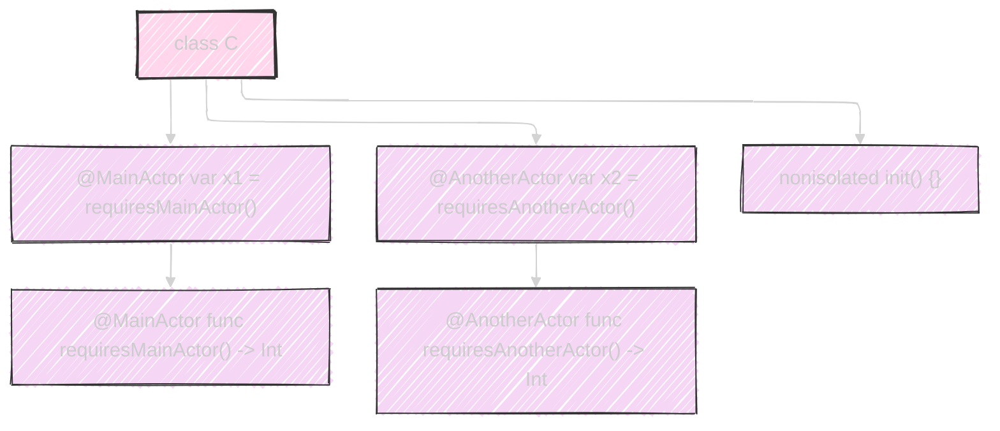
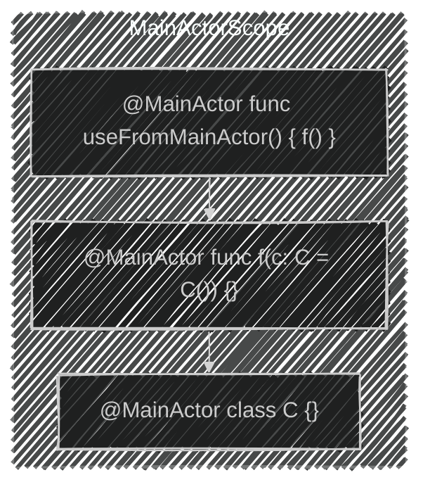
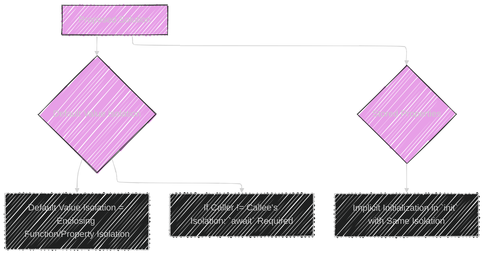
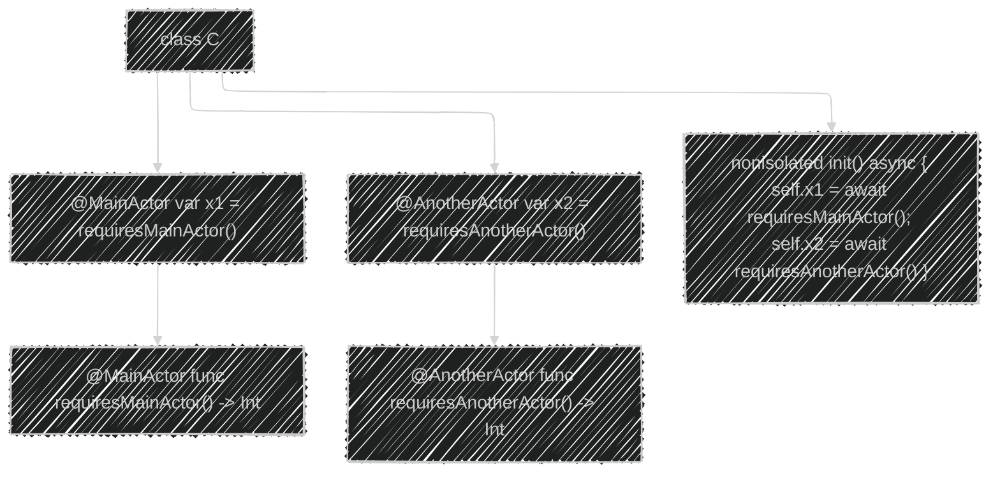
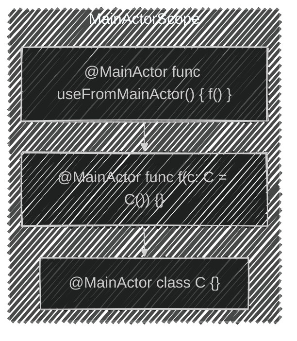
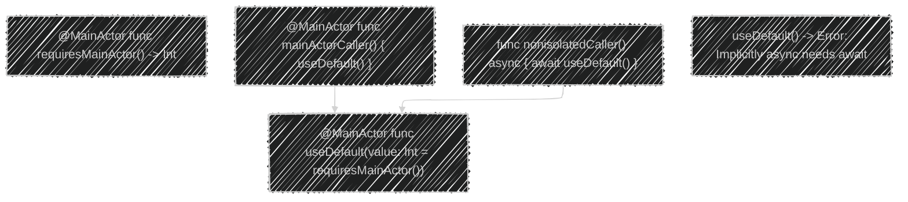
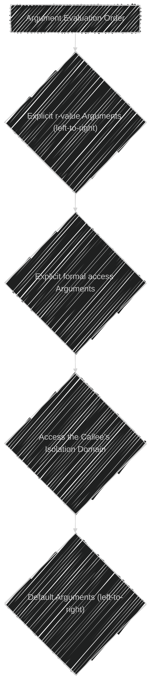
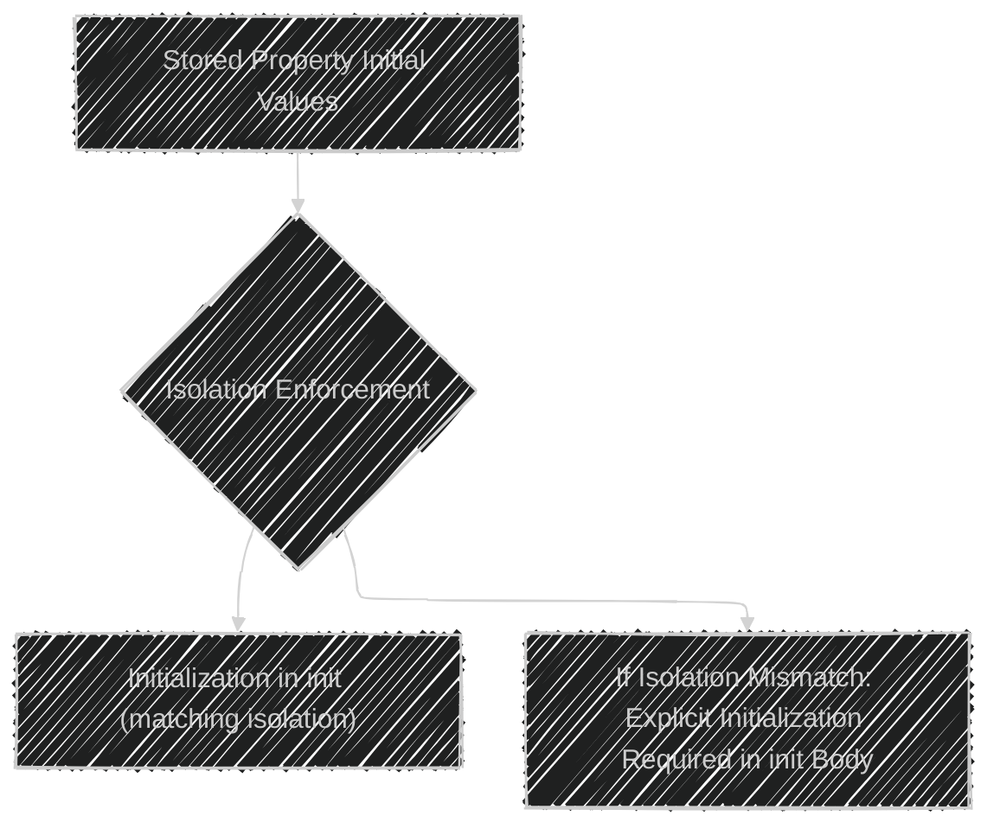

# A Diagrammatic Guide to SE-0411 - Isolated default value expressions
> This content is dual-licensed under your choice of the following licenses:
> 1.  **MIT License:** For the code implementations in Swift and Mermaid provided in this document.
> 2.  **Creative Commons Attribution 4.0 International License (CC BY 4.0):** For all other content, including the text, explanations, and the Mermaid diagrams and illustrations.

---

## 1. Overview of the Proposal

A high-level diagram to summarize the core issue and proposed solution:

Textual summary:

The core problem addressed is the inconsistent and unsafe handling of actor isolation when using default values in stored properties and function arguments.  The proposal aims to create a unified model that is safer (eliminating data races) and more flexible (less restrictive).

## 2. Motivation: Examples of Problems

Diagrams illustrating the code examples and the issues:

**a. Data Race in Stored Properties (Problematic Code - Invalid)**

Textual summary:

This code creates a data race because the `nonisolated init()` can simultaneously call `@MainActor` and `@AnotherActor` functions, violating actor isolation.

**b. Overly Restrictive Default Arguments (Problematic Code - Invalid)**

Textual summary:

The compiler prevents this code, which is not technically unsafe since the default value initializer and the function are isolated to the same actor.

## 3. Proposed Solution: Unified Isolation Rules

A diagram representing the solution:

Textual Summary:

The proposal enforces that the isolation of a default value expression matches the isolation of whatever it's part of (function, property).  If a caller is not in the same isolation, using the default value requires `await`.

**a. Solution to the Data Race Example:**

This code is invalid without `await` in the initializer

Textual summary:  The `nonisolated init` now correctly uses `await` before initializing the properties, addressing the violation.

**b. Solution to the Default Argument Example:**

Textual summary:  The original code is now valid.  The default value expression and the enclosing function share the same actor isolation (`@MainActor`).

## 4. Detailed Design

### **a. Isolation Inference Rules**

Textual Summary: The isolation of a default value is determined by the isolation of any functions/properties called within the expression.

Special note about closures: The Isolation of a closure in a default value can not be determined by the actor instance of the closure.

**Restrictions:**

*   If function or type has actor isolation, default value expressions must share it.
*   `nonisolated` function/type implies `nonisolated` default value expressions.

### **b. Enforcing Isolation Requirements**

**Diagram (Default Arguments):**

Textual Summary for the diagram: Isolation is enforced at the caller, including `await` when needed.

**a. Argument Evalutation**

Textual Summary: The evaluation process includes evaluating explicit arguments, formal-access arguments, transitioning to the callee’s isolation if necessary and then evaluating the default arguments

### **c. Stored Property Initial Values**

Textual summary: The stored properties are initialized within the init’s body if there is an isolation mismatch.

### **d. Stored property isolation in initializers**

Textual summary: Synthesized init's are only isolated if non-sendable properties require actor isolation

## 5. Source, ABI Compatibility, and Adoption

Text summary

*   **Source Compatibility**: Stricter rules, staged under a feature flag.
*   **ABI Compatibility**: No changes to the Application Binary Interface.
*   **Adoption**: Can be adopted freely without deployment or compatibility problems.

## 6. Alternatives Considered

Text summary:

This section summarizes an alternative considered during the proposal's development.

*   Original Proposal (SE-0327): all default initializer expressions were `nonisolated`.  But this was causing a large number of problems/inconveniences since often the stored properties are of `@MainActor` types.

----

## 7. Acknowledgments
Text summary:
Recognition of the people who helped move the proposal forward, and the issues that it uncovered.

## 8. Revision History

Text Summary:
Changes Made on the First Pitch, with the key change, is for isolated default values to have the same isolation as the enclosing function or types

---
**Licenses:**

- **MIT License:**   - Full text in [LICENSE](LICENSE) file.
- **Creative Commons Attribution 4.0 International:**  - Legal details in [LICENSE-CC-BY](LICENSE-CC-BY) and at [Creative Commons official site](http://creativecommons.org/licenses/by/4.0/).

---