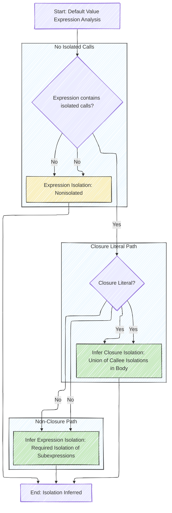
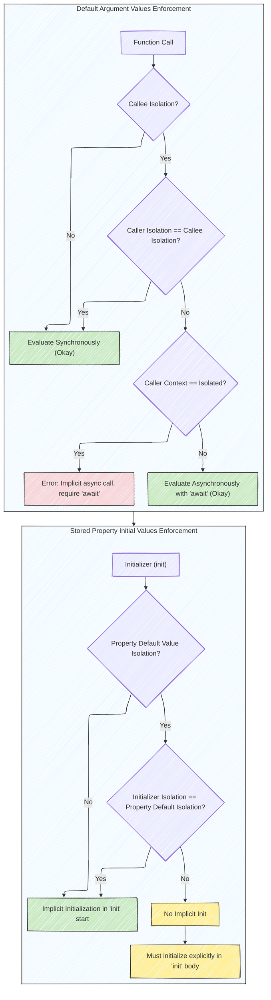
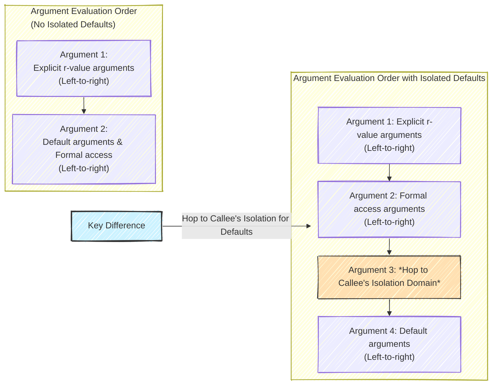
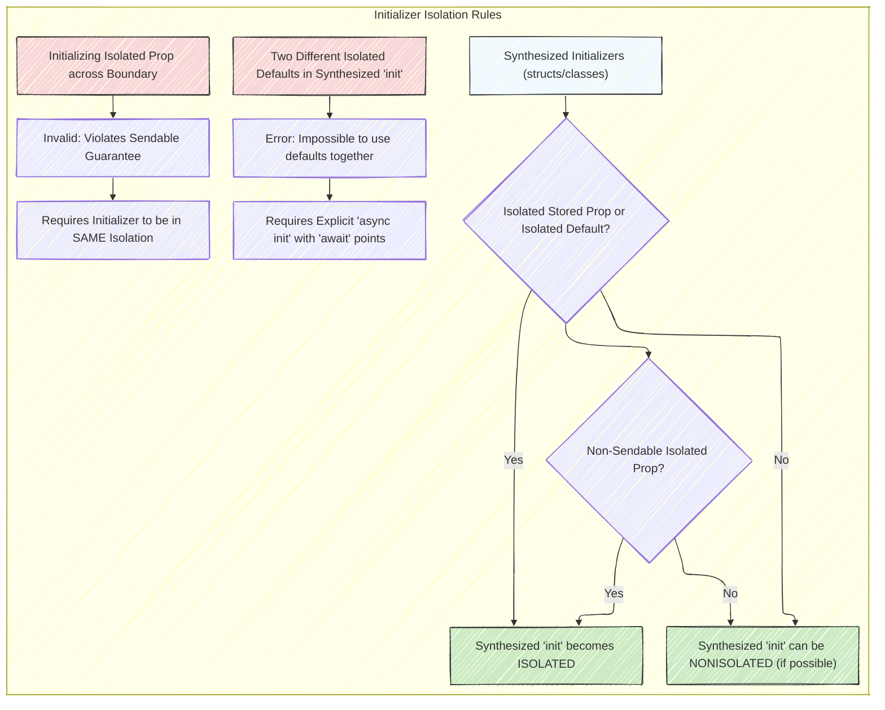

# A Diagrammatic Guide to SE-0411 - Isolated default value expressions
> This content is dual-licensed under your choice of the following licenses:
> 1.  **MIT License:** For the code implementations in Swift and Mermaid provided in this document.
> 2.  **Creative Commons Attribution 4.0 International License (CC BY 4.0):** For all other content, including the text, explanations, and the Mermaid diagrams and illustrations.

---

## 1. Problem Statement: Data Races and Restrictive Rules (Motivation)

This diagram illustrates the issues with the existing actor isolation rules before SE-0411.

**Explanation:**

*   **"Current Rules (Pre SE-0411)" subgraph**:  Highlights the problems with the actor isolation rules before the proposal.
*   **Data Races in Stored Properties (Red)**: Emphasizes the most critical issue - the potential for data races when using actor-isolated stored properties within nonisolated initializers due to synchronous, potentially concurrent calls during initialization.
*   **Overly Restrictive Default Arguments (Yellow)**: Shows the unnecessary limitation that prevents safe `@MainActor` calls in default arguments of `@MainActor` functions.
*   **Inconsistent Rules (Blue)**: Points out the lack of uniformity between isolation rules for stored properties and default arguments, leading to a less clear actor isolation model.
*   **"Overall Goal of SE-0411" (Highlighted)**:  Summarizes the main objective of the proposal - to create a more unified and safer system.

---

## 2. Proposed Solution: Unified Isolation (Detailed Design)

This sequence diagram demonstrates how the proposed solution addresses the issues by allowing default value expressions to inherit the isolation of their context.

Note: 
Below is my workaround diagram for now.

**Explanation:**

*   **Participants**:  Clearly defines the involved components: the context where the default value is used (function or property), the default value expression itself, and any isolated function it might call.
*   **Synchronous Evaluation**: Highlights that default value expressions are evaluated synchronously.
*   **Isolation Check**: Emphasizes the core of the proposal - the default value expression attempts a synchronous isolated call to the `Callee`.
*   **"Alt" Block**: Illustrates the crucial conditional behavior:
    *   **Different Isolation**: If the context and the default value expression have different isolation domains, synchronous calls are disallowed, resulting in an error (requiring `await`).
    *   **Same Isolation**: If they share the same isolation, synchronous calls are permitted without errors.
*   **Return Value & Note**:  Shows the default value expression returning the calculated value to the context and includes a note about the conditional initialization in initializers, reinforcing the concept of isolation domain matching for implicit initialization.

---

## 3. Inference of Default Value Isolation

This flowchart explains how the isolation of a default value expression is inferred.

\

**Explanation:**

*   **Start & Decision (A & B)**:  Begins the process and checks if the default value expression includes any isolated function calls.
*   **Closure Literal Check (C)**: If there are isolated calls, it distinguishes between closure literals and other expressions.
*   **Closure Literal Inference (D - Green)**: For closures, the isolation is inferred as the *union* of the isolations of all synchronously called functions within the closure body. This means if a closure calls both `@MainActor` and `@AnotherActor` isolated functions, the closure itself needs to respect both isolations (though in practice, constraints will limit this combination).
*   **Non-Closure Inference (E - Green)**: For non-closure expressions, the isolation is inferred as the *required* isolation of its constituent parts (sub-expressions). Essentially, the strictest isolation requirement propagates up.
*   **Nonisolated Case (F - Yellow)**: If the expression contains no isolated calls, it's inferred to be `nonisolated`.
*   **End (G)**:  Concludes with the isolation being determined.
*   **Subgraphs (Blue)**:  Visually separates the logic flow for different scenarios (closure vs. non-closure, and presence of isolated calls), improving readability.

---

## 4. Enforcement of Isolation Requirements

This flowchart details how isolation requirements are enforced for default argument values and stored property initial values.

**Explanation:**

*   **Two Subgraphs**: Separates enforcement for default arguments and stored properties for clarity.
*   **Default Argument Value Enforcement (Top)**:
    *   Checks if the callee function is isolated (DB).
    *   If isolated, it verifies if the caller is in the same isolation domain (DC).
    *   If same isolation, synchronous evaluation is okay (DD - Green).
    *   If different isolation, it checks if the caller context *is* isolated. If so, it's an error because implicit async calls outside the required isolation domain must be marked with `await` (DF - Red). If the caller isn't isolated, async call with `await` is required and okay (DG - Green).
    *   If the callee is not isolated, synchronous evaluation is okay (DD - Green).
*   **Stored Property Initial Value Enforcement (Bottom)**:
    *   In an initializer, it checks if the property has an isolated default value (SB).
    *   If yes, it compares the initializer's isolation to the property's default value isolation (SC).
    *   If they match, implicit initialization happens at the start of `init` (SD - Green).
    *   If they don't match, no implicit initialization occurs (SE - Yellow), and the property *must* be initialized explicitly in the `init` body (SF - Yellow).
    *   If the property's default value is not isolated, implicit initialization happens at the start of `init` (SD - Green).

---

## 5. Argument Evaluation Order

This ordered list clarifies the argument evaluation order in function calls, especially with isolated default arguments.

**Explanation:**

*   **"Argument Evaluation Order with Isolated Defaults" subgraph (Top)**:  Details the modified evaluation order when isolated default arguments are involved:
    1.  Explicit r-value arguments are evaluated first, left-to-right.
    2.  Formal access arguments (like `inout`) are evaluated next, left-to-right.
    3.  **"Hop to Callee's Isolation Domain" (Orange - Key Step)**:  Crucially, the execution context shifts to the callee's isolation domain *before* default arguments are evaluated. This ensures default arguments are evaluated in the correct isolation.
    4.  Default arguments are then evaluated, left-to-right, within the callee's isolation domain.
*   **"Argument Evaluation Order (No Isolated Defaults)" subgraph (Bottom)**: Shows the simpler order for calls without isolated defaults, for comparison:
    1.  Explicit r-value arguments (left-to-right).
    2.  Default arguments and formal access arguments are evaluated together, left-to-right, without a domain hop.
*   **"Key Difference" (Highlighted)**:  Emphasizes the central change: the "hop" to the callee's domain specifically for isolated default argument evaluation. This is the mechanism that allows synchronous isolated calls within default values when called from the appropriate isolation domain.

---

## 6. Stored Property Isolation in Initializers

This diagram illustrates the rules surrounding initializer isolation and how it relates to stored properties, particularly with synthesized initializers.

**Explanation:**

*   **"Initializer Isolation Rules" subgraph**: Groups rules for clarity.
*   **Initializing Isolated Property Across Boundary (Red)**:  Highlights the error condition of initializing an actor-isolated property from a different isolation domain, emphasizing `Sendable` violations. The initializer *must* also be isolated to the same actor in such cases.
*   **Synthesized Initializers (Blue)**:
    *   Checks if the type has any isolated stored properties or if any default initializer expressions are isolated (B1).
    *   If yes (or if there are non-`Sendable` isolated properties), the synthesized initializer *must* be actor-isolated (B2 - Green).
    *   If no isolated stored properties or default value isolations (and no non-Sendable isolated props), the synthesized initializer *can* be `nonisolated` (B4 - Green - for scenarios where it's safe).
*   **Two Different Isolated Defaults (Red)**:  Points out the error scenario where a synthesized initializer would try to use two default value expressions that require *different* actor isolations; this is an impossible situation, signaling a fundamental design flaw.  The solution is to use an explicit `async init` to handle these different isolations explicitly with `await`.

---
**Licenses:**

- **MIT License:**   - Full text in [LICENSE](LICENSE) file.
- **Creative Commons Attribution 4.0 International:**  - Legal details in [LICENSE-CC-BY](LICENSE-CC-BY) and at [Creative Commons official site](http://creativecommons.org/licenses/by/4.0/).

---