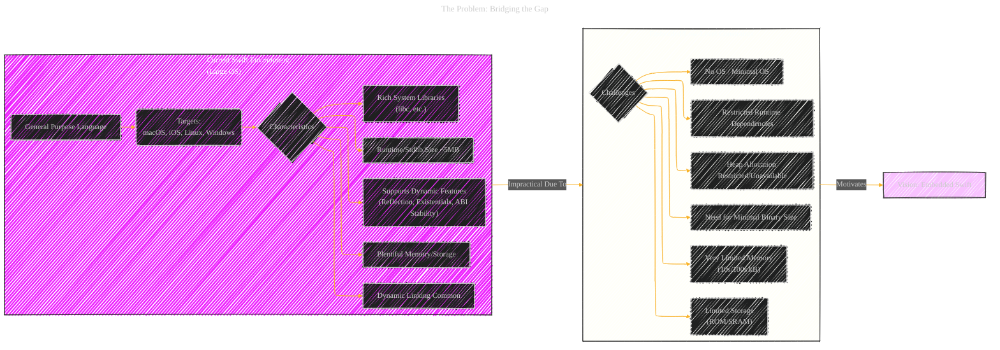
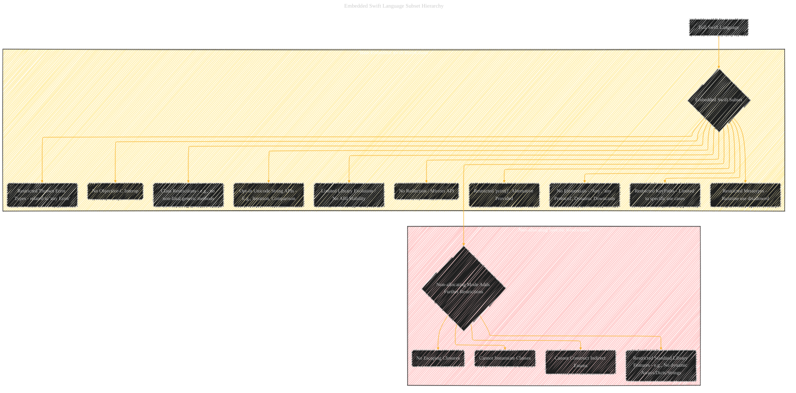
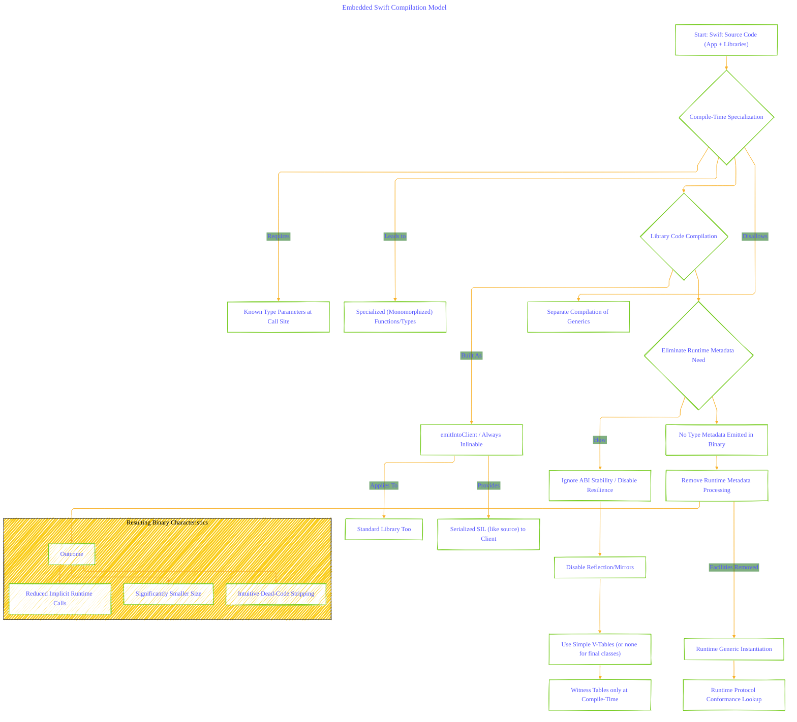
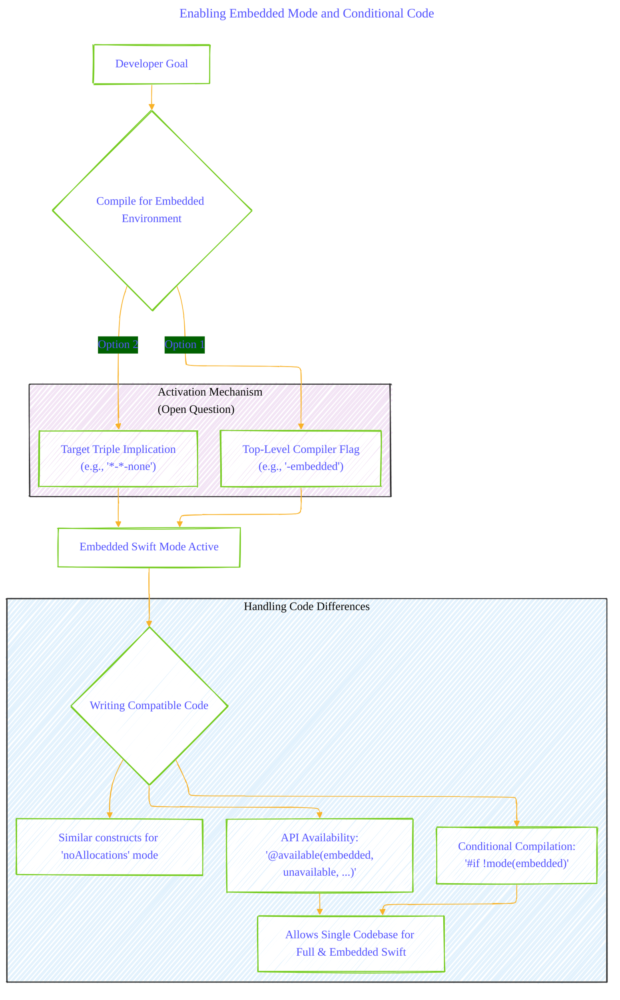
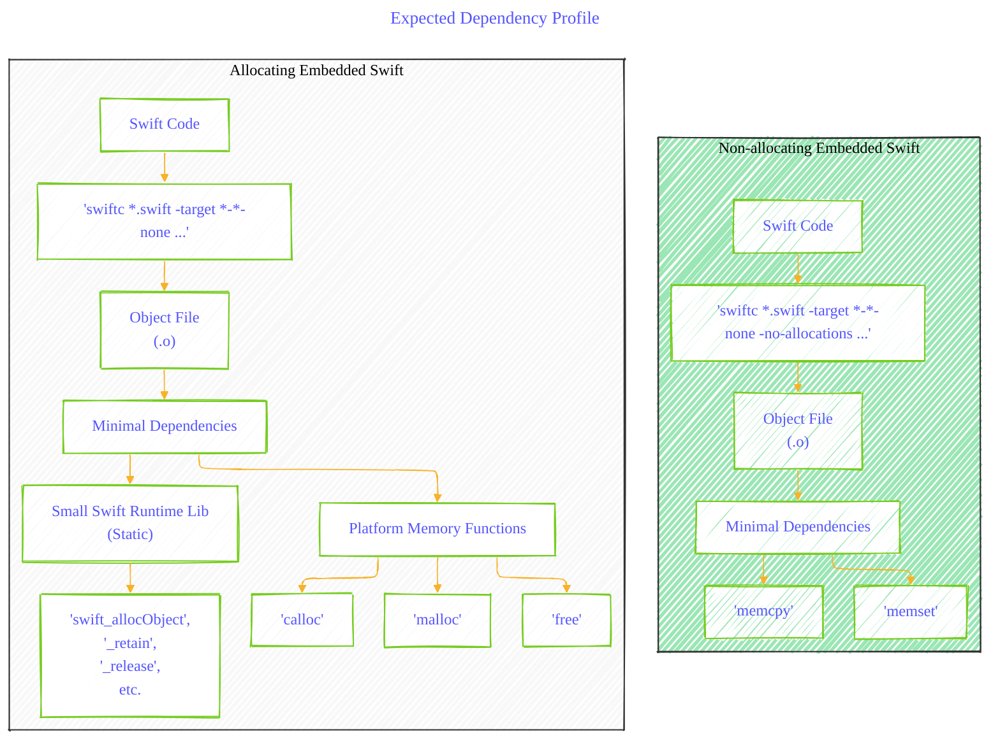

# A Vision for Embedded Swift

---

  <blockquote>
  As a visual learner student, I created these personal study notes from the cited source(s) to aid my understanding. 
  While my firm intention is to provide full credit, the blended format of notes and diagrams may sometimes obscure the original source, for which I apologize. 
  I am committed to making corrections and welcome any feedback. 
  This is a non-commercial project for my humble educational purposes only since the start. 
  My goal is to share my perspective and contribute to the great work already being done.
   
   
  I want to extend my genuine apologies to the creators of the original material. 
  Their work was the direct inspiration for this project, and I adapted it without first reaching out. 
  My intent comes from a place of deep respect, and I hope this is received in the spirit of homage. 
  🙏🏼🙏🏼🙏🏼🙏🏼
  </blockquote>

----

## Embedded Swift: Visualizing the Vision

This document uses Mermaid diagrams to illustrate the key aspects of the proposed Embedded Swift initiative, breaking down the problem, goals, technical approach, and anticipated outcomes.

---

### 1. The Problem: Bridging the Gap

This diagram contrasts the characteristics of current Swift deployments with the constraints of embedded environments, highlighting the motivation for Embedded Swift.

-----

### 2. Core Goals of Embedded Swift

This mind map outlines the primary objectives driving the development of the Embedded Swift compilation mode.

---

### 3. Embedded Swift Language Subset Hierarchy

This diagram details the features restricted in Embedded Swift, showing the base restrictions and the additional limitations introduced in the "non-allocating" mode.

-----

### 4. Embedded Swift Compilation Model

This flowchart explains the core compiler techniques used to achieve the goals of Embedded Swift.

### 5. Enabling Embedded Mode and Conditional Code

This diagram shows how developers might enable Embedded Swift and write code compatible with both modes.

### 6. Expected Dependency Profile

This illustrates the minimal external dependencies anticipated for binaries compiled in Embedded Swift modes.

---
