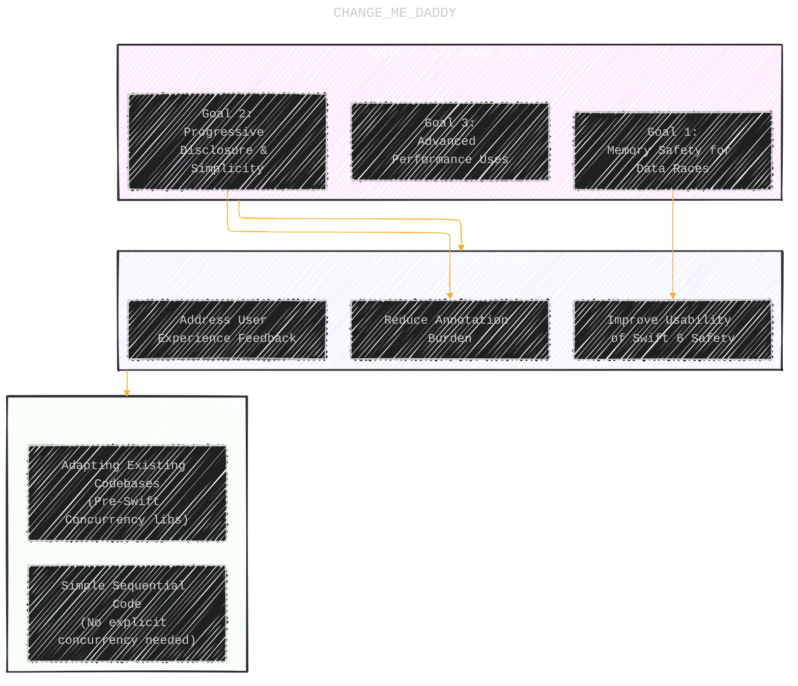
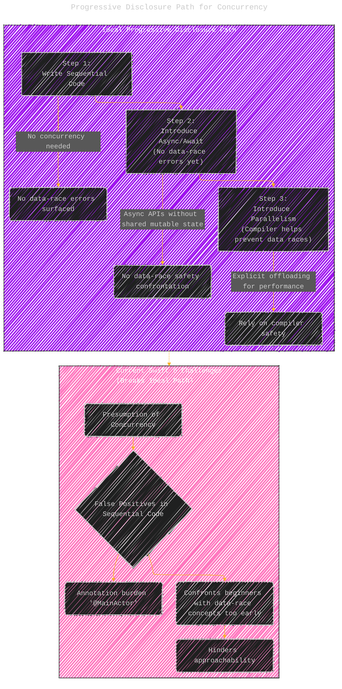
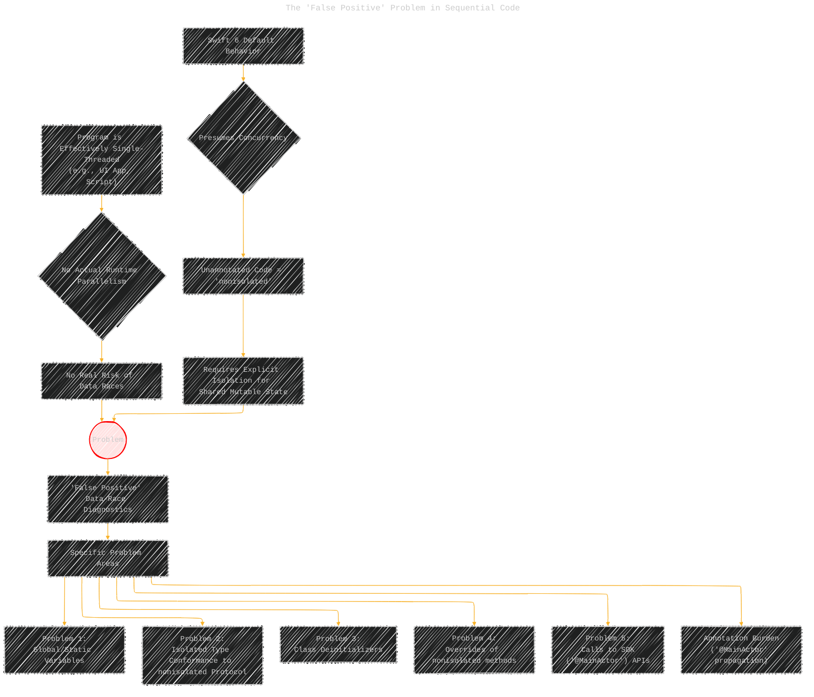
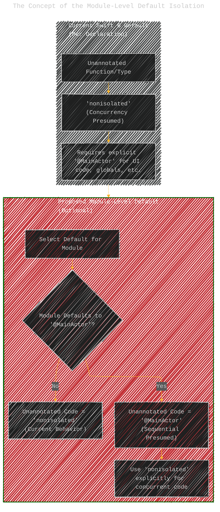
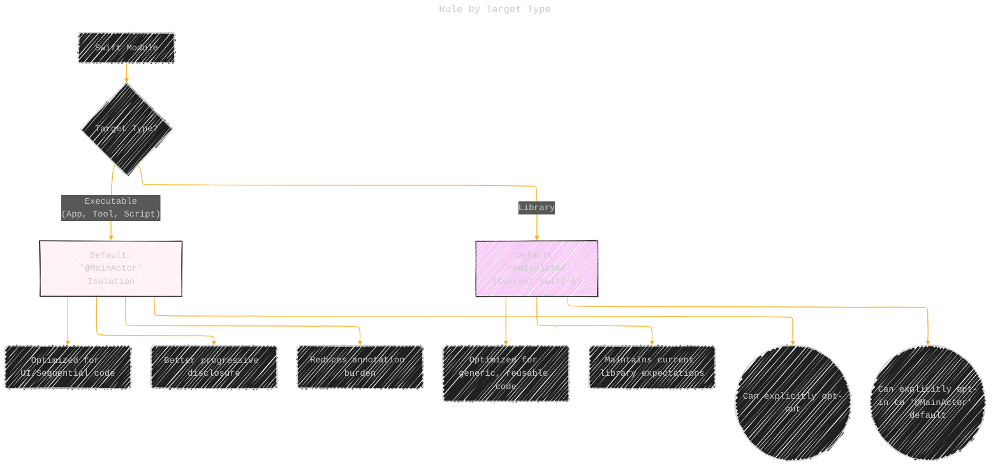
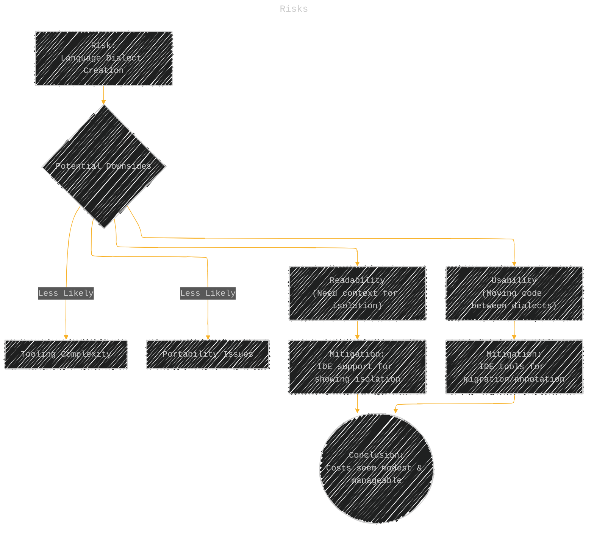
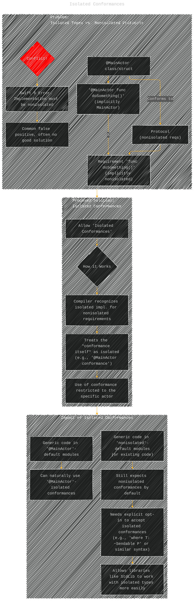
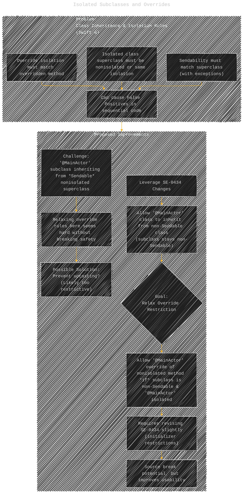
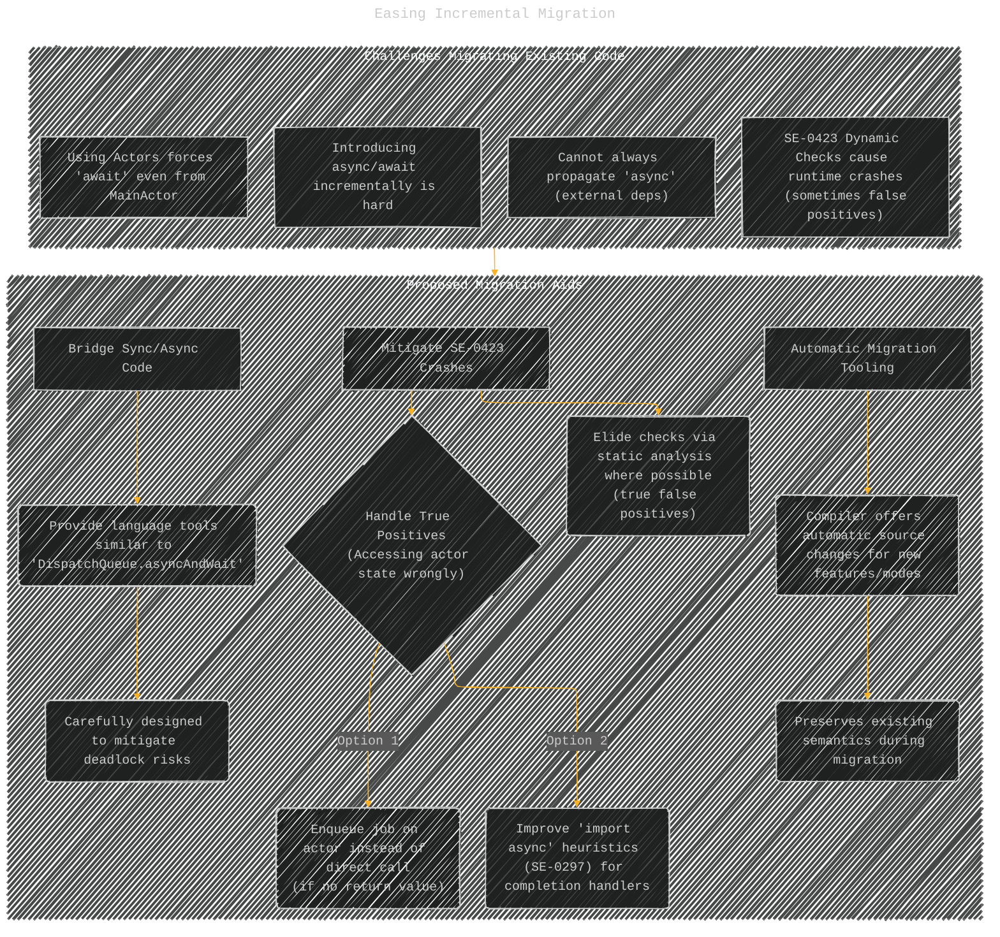
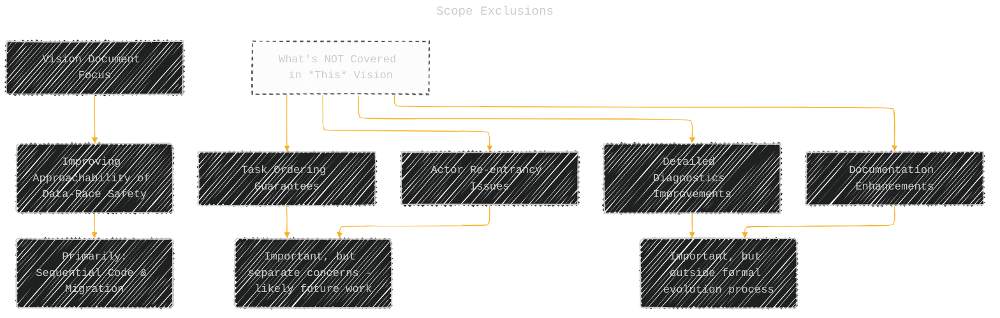

# Improving the approachability of data-race safety
> **Disclaimer:**
>
> This document contains my personal notes on the topic,
> compiled from publicly available documentation and various cited sources.
> The materials are intended for educational purposes, personal study, and reference.
> The content is dual-licensed:
> 1. **MIT License:** Applies to all code implementations (Swift, Mermaid, and other programming languages).
> 2. **Creative Commons Attribution 4.0 International License (CC BY 4.0):** Applies to all non-code content, including text, explanations, diagrams, and illustrations.
---

## Overview of Swift Concurrency Goals and Vision

This diagram provides a high-level overview of the core goals driving Swift's concurrency model and the main focus areas of this vision document.

**Explanation:**
*   Swift's concurrency aims for safety, ease of use through progressive disclosure, and enabling performant advanced use cases.
*   This vision document focuses specifically on improving the usability of the safety features introduced in Swift 6, driven by community feedback, aiming to reduce how often explicit annotations like `@MainActor` are required.
*   The primary targets for improvement are developers writing simple, effectively single-threaded code and those migrating existing projects that used older concurrency mechanisms.

---

## Progressive Disclosure Path for Concurrency

This illustrates the intended ideal path for learning and adopting concurrency features, contrasting it with the challenges currently faced in Swift 6.

**Explanation:**
*   The **Ideal Path** shows a smooth progression: start sequential, add basic `async/await` without immediate data-race issues (if not using shared mutable state concurrently), and only confront data-race safety when *intentionally* introducing parallelism.
*   The **Swift 6 Challenges** diagram highlights how the current default presumption of concurrency disrupts this ideal path, leading to false positive errors in sequential code, forcing premature learning about data races, and requiring excessive annotations.

----

## The "False Positive" Problem in Sequential Code

This diagram explains *why* sequential code often encounters data-race errors in Swift 6 and lists common scenarios.

**Explanation:**
*   Many programs run sequentially on the `MainActor` without introducing parallelism. In these cases, data races are impossible at runtime.
*   However, Swift 6 defaults to assuming code *could* run concurrently (`nonisolated`).
*   This mismatch forces the compiler to flag potential issues (like using a non-`Sendable` global variable) as errors, even though no concurrent access will actually occur in the single-threaded context.
*   This leads to "false positives" in various common coding patterns and necessitates widespread `@MainActor` annotations.

----

## Proposed Solution: Module-Level Default Isolation

This set of diagrams explains the core proposal: allowing modules to default to `@MainActor` isolation.

**1. Concept:**

**2. Rule by Target Type:**

**3. Risks:**

**Explanation:**
*   The core idea is to flip the default isolation assumption *at the module level*. Instead of defaulting to `nonisolated`, code *within* a specific module can default to `@MainActor`.
*   This would be the standard default for *executable* targets (apps, tools), aligning with their typical main-thread-centric nature and improving the experience for beginners.
*   *Libraries* would retain the current `nonisolated` default, suitable for general-purpose, context-agnostic code. Modules can override the default.
*   Explicit `nonisolated` annotations can be used when concurrency is intended within a module defaulting to `@MainActor`.
*   The main risk is creating a language "dialect," potentially affecting readability and code movement, but these risks are deemed manageable, especially with potential IDE support.

----

## Isolated Conformances

This addresses the difficulty of conforming isolated types (like `@MainActor` classes) to nonisolated protocols.

**Explanation:**
*   Currently, if a type is `@MainActor` isolated, its methods are also implicitly `@MainActor`. This conflicts with implementing requirements from protocols that assume `nonisolated` implementations. This is a major source of "false positives" and usability issues.
*   The proposal introduces the concept of an "isolated conformance." If the compiler sees an isolated implementation (like `@MainActor func...`) for a nonisolated requirement, it can treat the entire conformance *as if* it's isolated (e.g., a `@MainActor conformance`).
*   Using such an isolated conformance would then be restricted to the appropriate context (e.g., only callable from the `@MainActor`).
*   Generic code would default to accepting conformances matching the module's isolation default but could explicitly opt-in to accepting isolated conformances when needed, making libraries more flexible.

----

## Isolated Subclasses and Overrides

This deals with restrictions related to class inheritance and isolation.

**Explanation:**
*   Swift 6 enforces rules about matching sendability and isolation between subclasses and superclasses, and for method overrides. These can cause false positives in sequential code.
*   Building on SE-0434, the vision proposes relaxing the override restriction: specifically, allow a method in a `@MainActor`-isolated, *non-Sendable* subclass to override a nonisolated method from its superclass. This requires minor adjustments to SE-0434.
*   Solving this for `@MainActor` subclasses inheriting from *Sendable* superclasses is harder and might require overly restrictive solutions.

----

## Easing Basic Async Code Introduction (SE-0338 Revision)

This addresses the execution behavior of `nonisolated async` functions.

**Explanation:**
*   Currently (SE-0338), calling a `nonisolated async` function from an actor *always* switches off that actor to execute the function. This was done for performance reasons but complicates basic usage by forcing data-race checks when passing data from the actor.
*   The proposal changes the *default* behavior: a `nonisolated async` function will run *on* the caller's executor if called from one (like a synchronous `nonisolated` function does).
*   This makes simple `async` calls easier and avoids unnecessary data-race checks when no concurrency boundary is actually needed.
*   If the old "switch off" behavior is desired (e.g., for performance-critical code that shouldn't block the actor), it can be explicitly requested with a new `@execution(concurrent)` (or similar) annotation.

---

## Easing Incremental Migration

This covers proposals to help migrate existing codebases.

**Explanation:**
*   Migrating existing, often synchronous, codebases to use Swift Concurrency presents challenges like the inability to easily call `async` code from sync code and runtime crashes due to new dynamic isolation checks (SE-0423).
*   The vision proposes aids:
    *   Language-level tools to bridge sync and async code (akin to `Dispatch.sync`, but safer).
    *   Reducing SE-0423 crashes by eliminating true false positives via analysis and providing mechanisms (like auto-enqueuing or better import heuristics) to handle real data races revealed by the checks.
    *   Strong compiler tooling to automatically migrate code to adopt these new features while preserving behavior.

---

## Scope Exclusions

**Explanation:**
*   This diagram clarifies that while important, issues related to specific task execution order, actor re-entrancy behaviors, and general improvements to compiler error messages and documentation are outside the scope of *this specific* vision document, which is focused on the core usability of the static safety model.

---
**Licenses:**

- **MIT License:**   - Full text in [LICENSE](LICENSE) file.
- **Creative Commons Attribution 4.0 International:**  - Legal details in [LICENSE-CC-BY](LICENSE-CC-BY) and at [Creative Commons official site](http://creativecommons.org/licenses/by/4.0/).

---