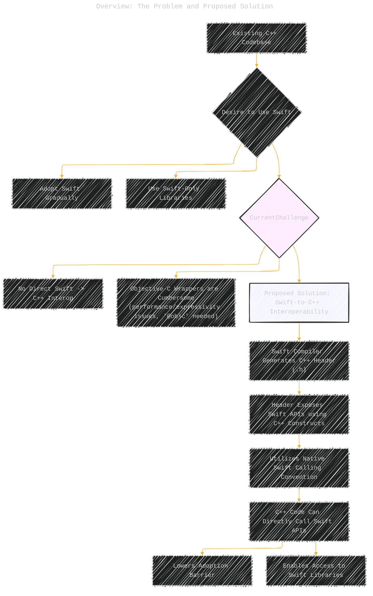
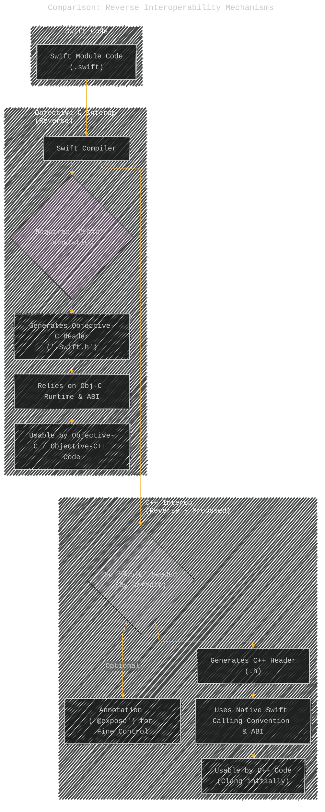
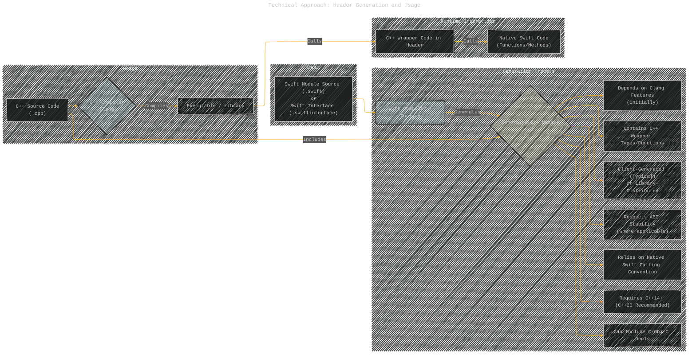
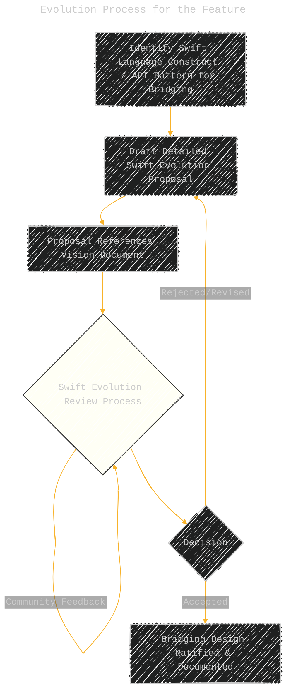

# Using Swift from C++
> **Disclaimer:**
>
> This document contains my personal notes on the topic,
> compiled from publicly available documentation and various cited sources.
> The materials are intended for educational purposes, personal study, and reference.
> The content is dual-licensed:
> 1. **MIT License:** Applies to all code implementations (Swift, Mermaid, and other programming languages).
> 2. **Creative Commons Attribution 4.0 International License (CC BY 4.0):** Applies to all non-code content, including text, explanations, diagrams, and illustrations.
---

## A Diagrammatic Guide 

Here is a collection of Mermaid diagrams illustrating the concepts and complexities described in the "Using Swift from C++" vision document.

### 1. Overview: The Problem and Proposed Solution

This flowchart illustrates the core motivation and the high-level solution proposed for Swift-to-C++ interoperability.

------

### 2. Comparison: Reverse Interoperability Mechanisms

This diagram contrasts the proposed C++ reverse interoperability mechanism with the existing Objective-C mechanism.

---

### 3. Core Goals of Swift-to-C++ Interoperability

This mind map outlines the primary objectives guiding the design of the feature.

---

### 4. Technical Approach: Header Generation and Usage

This diagram illustrates the flow of generating and using the C++ header file.

---

### 5. Bridging Key Swift Constructs to C++

This mind map summarizes how major Swift language features are expected to be represented in C++.

----

### 6. Evolution Process for the Feature

This flowchart outlines how the specific bridging details will be designed and approved.

---

### 7. Ecosystem Integration

This mind map details the planned support within the broader Swift ecosystem tools.

---
**Licenses:**

- **MIT License:**   - Full text in [LICENSE](LICENSE) file.
- **Creative Commons Attribution 4.0 International:**  - Legal details in [LICENSE-CC-BY](LICENSE-CC-BY) and at [Creative Commons official site](http://creativecommons.org/licenses/by/4.0/).

---