# Using C++ from Swift 
> **Disclaimer:**
>
> This document contains my personal notes on the topic,
> compiled from publicly available documentation and various cited sources.
> The materials are intended for educational purposes, personal study, and reference.
> The content is dual-licensed:
> 1. **MIT License:** Applies to all code implementations (Swift, Mermaid, and other programming languages).
> 2. **Creative Commons Attribution 4.0 International License (CC BY 4.0):** Applies to all non-code content, including text, explanations, diagrams, and illustrations.
---

## A Diagrammatic Guide 

These diagrams aim to capture the core concepts, challenges, and proposed solutions outlined in the Swift C++ interoperability vision document.

### 1. Overall Vision and Goals

This mindmap outlines the central theme, primary goals, and key motivations behind the C++ interoperability vision.

---

### 2. Core Interoperability Approach: Pattern Recognition & Mapping

This flowchart illustrates the general decision-making process the Swift compiler aims to follow when importing a C++ API.

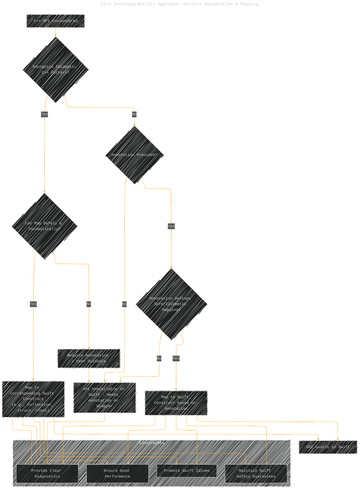

---

### 3. Type Import Strategy: Value vs. Reference Semantics

This diagram outlines the high-level strategy for deciding whether to import a C++ class/struct as a Swift struct (value semantics) or class (reference semantics).

---

### 4. Reference Type Management Strategies

This diagram details the different ways C++ reference types can be managed and how Swift aims to import them.

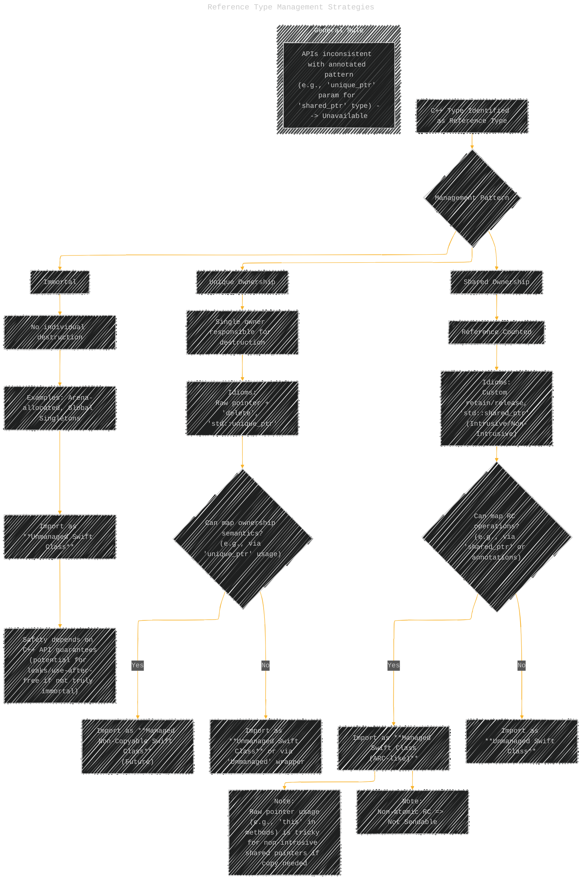

----

### 5. Value Type Categories

This diagram categorizes the different kinds of C++ types imported as Swift structs, highlighting safety implications.

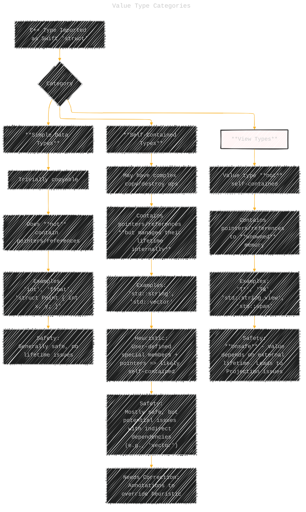

---

### 6. Projection Handling Challenge

This diagram illustrates the core problem with "projections" – values (often pointers/references) derived from another value whose lifetime they depend on, especially problematic with value types in Swift.

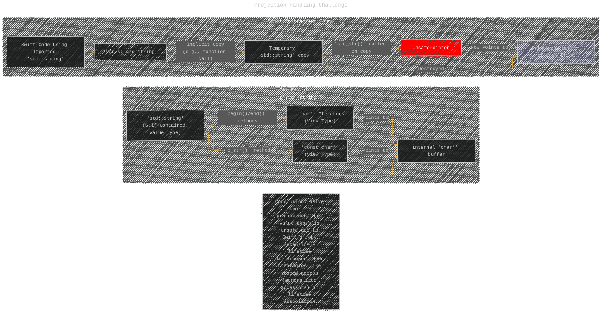

----

### 7. Iterator and Range Mapping

This flowchart shows the desired mapping for common C++ iterator patterns.

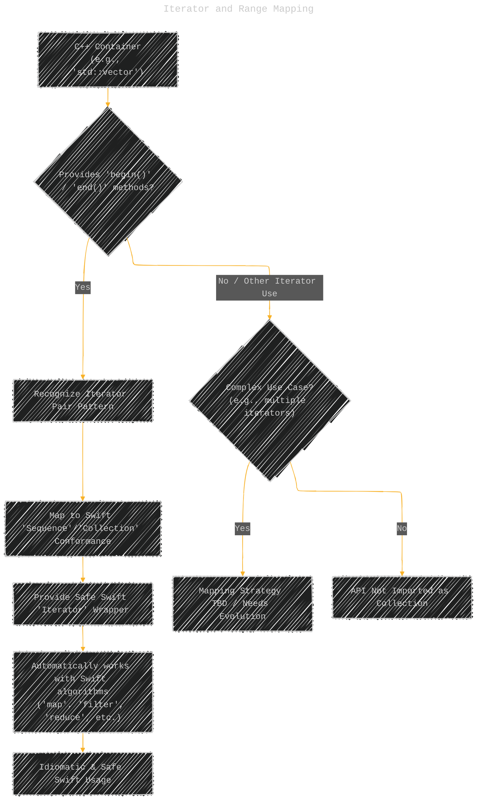

----

### 8. Mutability Mapping (`const` vs. Swift Mutability)

This diagram highlights the mapping between C++ `const` and Swift's mutability system.

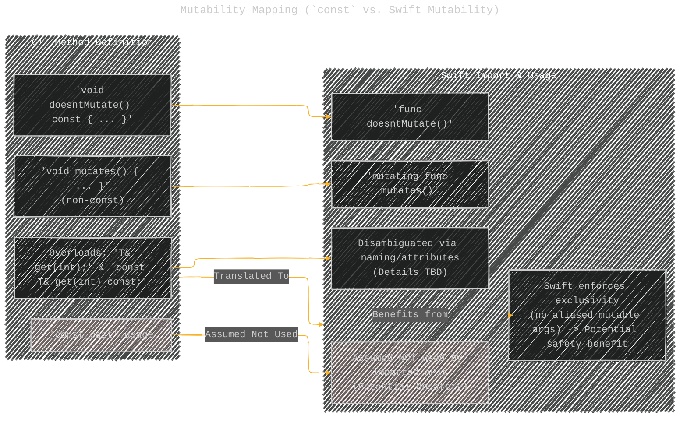

### 9. Computed Property Mapping (Getters/Setters)

Illustrates mapping common C++ getter/setter patterns to Swift computed properties.

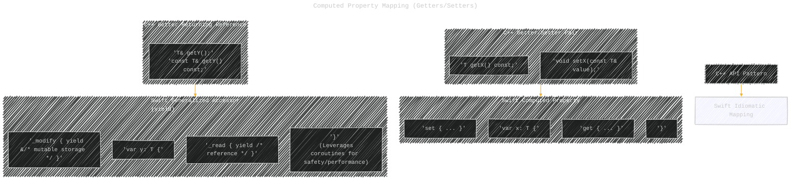

---

### 10. C++ Templates / Swift Generics Limitation

Highlights the difficulty in bridging the two generic systems.

----

### 11. Standard Library Interaction & Overlay

Shows the relationship between Swift code, the Swift standard library, the C++ standard library, and the necessary overlays/utility modules.

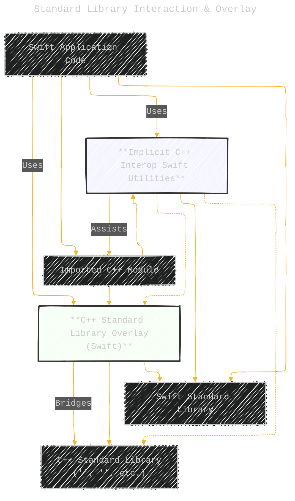

----

### 12. Evolution Strategy

Outlines the proposed staged approach for developing and stabilizing C++ interoperability.

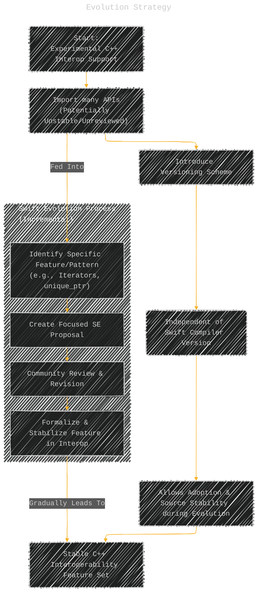

---

### 13. Tooling and Build Process Requirements

Summarizes the necessary tooling support for a good user experience.

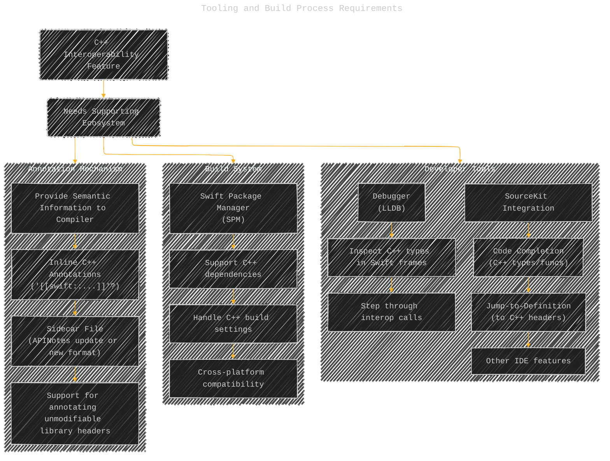

---

### 14. Appendix 2: Lifetime Issue with Projections from Value Types

This flowchart specifically illustrates the dangling pointer problem described in Appendix 2 when naively importing projections from self-contained C++ value types.

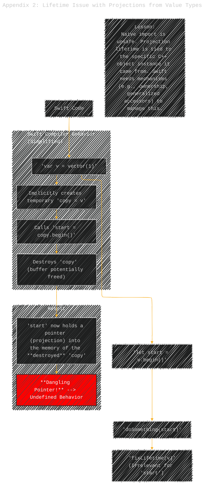

---
**Licenses:**

- **MIT License:**   - Full text in [LICENSE](LICENSE) file.
- **Creative Commons Attribution 4.0 International:**  - Legal details in [LICENSE-CC-BY](LICENSE-CC-BY) and at [Creative Commons official site](http://creativecommons.org/licenses/by/4.0/).

---