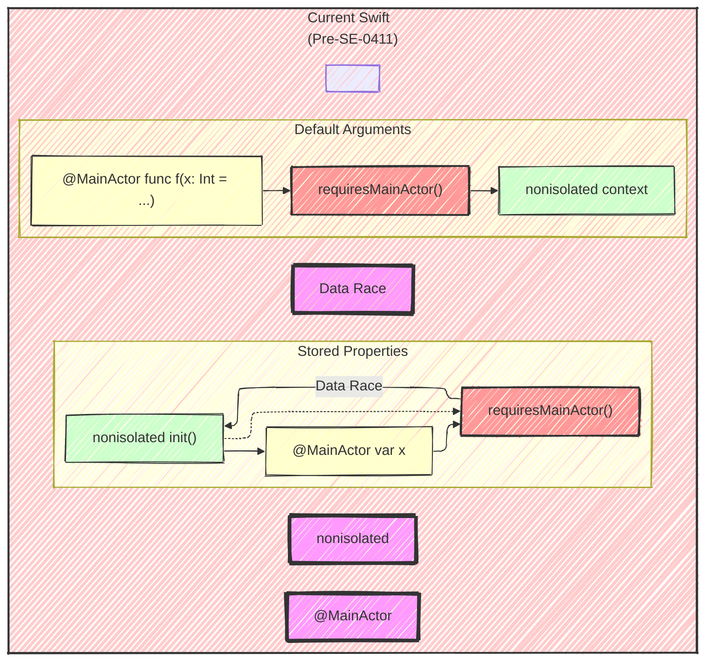

# A Diagrammatic Guide to SE-0411 - Isolated default value expressions
> This content is dual-licensed under your choice of the following licenses:
> 1.  **MIT License:** For the code implementations in Swift and Mermaid provided in this document.
> 2.  **Creative Commons Attribution 4.0 International License (CC BY 4.0):** For all other content, including the text, explanations, and the Mermaid diagrams and illustrations.

---


## 1. The Problem: Data Races and Inconsistent Rules

The original document highlights two primary issues:

*   **Data Races with Stored Properties:** Current rules allow non-isolated initializers to potentially trigger concurrent access to `@MainActor` or other global-actor-isolated properties, leading to data races.
*   **Overly Restrictive Default Arguments:** Default argument values are always `nonisolated`, preventing safe use of `@MainActor` or global-actor-isolated calls within default arguments of functions that *are* isolated to the same actor.

**Conceptual Illustration (`graph`):**



**Explanation:**

*   **Stored Properties (Left Side):**  A `nonisolated init()` (green) can directly call a `@MainActor` function (`requiresMainActor()`), which is a potential data race condition (red arrow).
*   **Default Arguments (Right Side):** A `@MainActor` function (`f`) *cannot* have a default argument that calls another `@MainActor` function (`requiresMainActor()`), even if it's logically safe.  This is because default arguments are currently evaluated in a `nonisolated` context.

---

## 2. Proposed Solution

The core idea is to allow default value expressions to *inherit* the isolation of their context (function or stored property).  Key changes:

*   **Stored Properties:**  If a stored property is `@MainActor`-isolated, its default value expression is also implicitly `@MainActor`-isolated.  Non-isolated initializers can no longer implicitly initialize such properties; explicit initialization (potentially with `await`) is required.
*   **Default Arguments:** Default arguments now inherit the isolation of the enclosing function.  If the function is `@MainActor`, the default argument can safely call `@MainActor` code.

---

## 3. Detailed Design

### 3.1 Inference of Default Value Isolation

*   **General Rule:** The default value expression's isolation is the "required isolation" of its subexpressions.  This means it needs the *same* isolation as any isolated calls it makes.

*   **Closures:**
    *   A closure literal's isolation is determined by the isolation required by the calls *within* its body.
    *   Closures in default arguments cannot capture values from the enclosing context, only its own parameters.
*  **Restrictions**
     * If the function or type has actor isolation, its required isolation of its default value expressions must be the same. 
     *  If the function or type is `nonisolated`, then the required isolation of its default value should be `nonisolated.

**Flowchart of Inference Rules (`flowchart`):**


**Explanation:**

1.  **Start:**  Begin analysis of the default value expression.
2.  **Closure?** Check if the expression is a closure literal.
3.  **Closure Body Calls (If Closure):**  If it's a closure, examine the calls *inside* the closure body.  Do they require a specific isolation (e.g., `@MainActor`)?
4.  **Closure Isolation (If Closure, Isolated Calls):** If the closure makes synchronous calls to isolated functions, its isolation is the *union* of the isolations required by those calls.
5. **Closure isolation (If Closure, nonisolated calls):** If the closure makes no isolated calls, it is `nonisolated.
6.  **Direct Calls (If Not Closure):** If it's not a closure, does the expression directly call isolated functions/properties?
7.  **Expression Isolation (If Not Closure, Isolated Calls):** If so, its required isolation is the same as the calls it makes.
8. **Expression Isolation (If Not Closure, nonisolated calls):** If the expression makes no isolated calls, it is `nonisolated.
9.  **Requirement Restrictions:** Default value expressions need to have the same isolation as it's function or type and nonisolated if the function or type is nonisolated.

---

### 3.2 Enforcing Isolation Requirements

*   **Default Argument Values:**  Enforcement happens at the *call site*.  If the caller isn't in the required isolation domain, the call using the default argument must be `async` and marked with `await`.
*    **Argument Evaluation**
    *   Left-to-right evaluation of explicit r-value arguments
    *   Left-to-right evaluation of default arguments and formal access arguments
    *    If isolated, must be evaluated in isolation domain of the callee
        *   Left-to-right evaluation of explicit r-value arguments
        *   Left-to-right evaluation of formal access arguments
        *   Hop to the callee's isolation domain
        *   Left-to-right evaluation of default arguments
*   **Stored Property Initial Values:** Enforcement happens *within initializers*.  An `init` that doesn't match the isolation of a stored property's default value *cannot* use that default value implicitly.  The property must be initialized explicitly within the `init` body (potentially with `await`).

**Sequence Diagram (Argument Evaluation with Isolation):**


**Explanation:**

10.  **Caller:** Initiates the call (e.g., `await myFunction(paramWithDefaultValue)`).
11.  **Async Context:** A suspension point occurs (`await`).  The system prepares to switch to the callee's isolation domain.
12.  **Hop to Callee's Isolation:**  Execution transfers to the actor (`@MainActor`, etc.) that the callee (`myFunction`) is isolated to.
13.  **Evaluate Default Argument:**  *Inside* the callee's isolation domain, the default argument expression is evaluated.
14.  **Execute Function Body:** The function body now executes, using the evaluated default argument (if needed).
15.  **Return:**  Results are returned through the asynchronous context, and execution eventually resumes at the caller.

### 3.3 Stored Property Isolation in Initializers

*  **Initializing Isolated Properties**
    *   Can't happen from a nonisolated context, sendable guarantees must be satisfied.
*   **Synthesized Initializers:**
    *   For `structs`, default values become default arguments in the memberwise initializer.
    *   If *any* stored property with a non-`Sendable` type is actor-isolated, *or* if any default value expression is actor-isolated, the synthesized initializer is also actor-isolated.  Otherwise, it's `nonisolated`.

**Example (Synthesized Initializer Isolation):**

```swift
@MainActor struct MyModel {
  var value: NonSendable = .init() // Implicitly @MainActor
}

// The synthesized init is also @MainActor:
// @MainActor init(value: NonSendable = .init()) { ... }

@MainActor struct MyView {
  var count: Int = 0 // Not isolated (Int is Sendable)
}

// The synthesized init is nonisolated:
// nonisolated init(count: Int = 0) { ... }
```

---

## 4. Source Compatibility

The proposal acknowledges that the stricter rules for stored property initialization are a source-breaking change. This change can impact current valid code.

*   **Mitigation:** The changes are staged in under the `IsolatedDefaultValues` upcoming feature flag.

---

## 5. Alternatives Considered

The proposal discusses and rejects the idea of making *all* default initializer expressions `nonisolated`. This was previously attempted but caused significant usability issues, as highlighted.

---

## 6. Key Takeaways (Mind Map)


This mind map summarizes the key points of the proposal in a hierarchical, easily digestible format.


---
**Licenses:**

- **MIT License:**  [](LICENSE) - Full text in [LICENSE](LICENSE) file.
- **Creative Commons Attribution 4.0 International:** [](LICENSE-CC-BY) - Legal details in [LICENSE-CC-BY](LICENSE-CC-BY) and at [Creative Commons official site](http://creativecommons.org/licenses/by/4.0/).

---