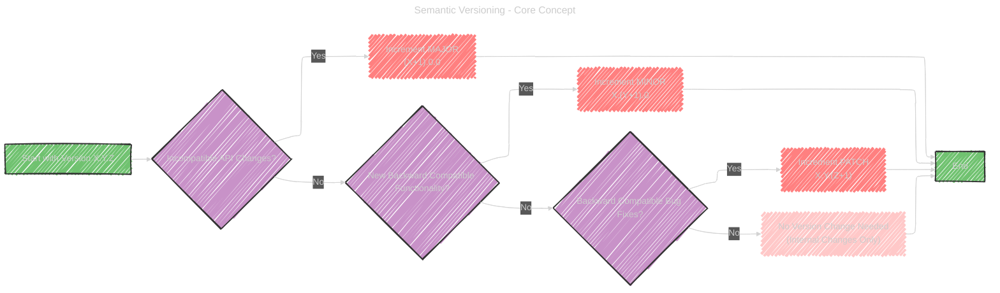
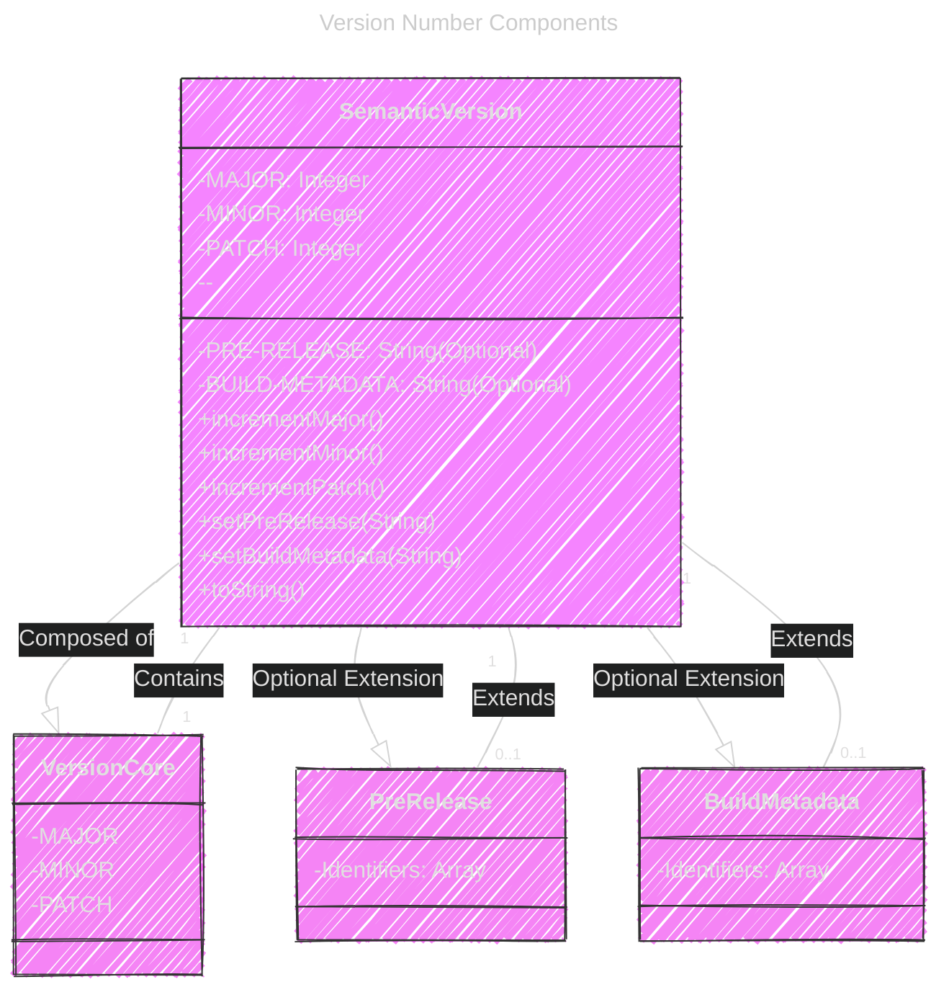
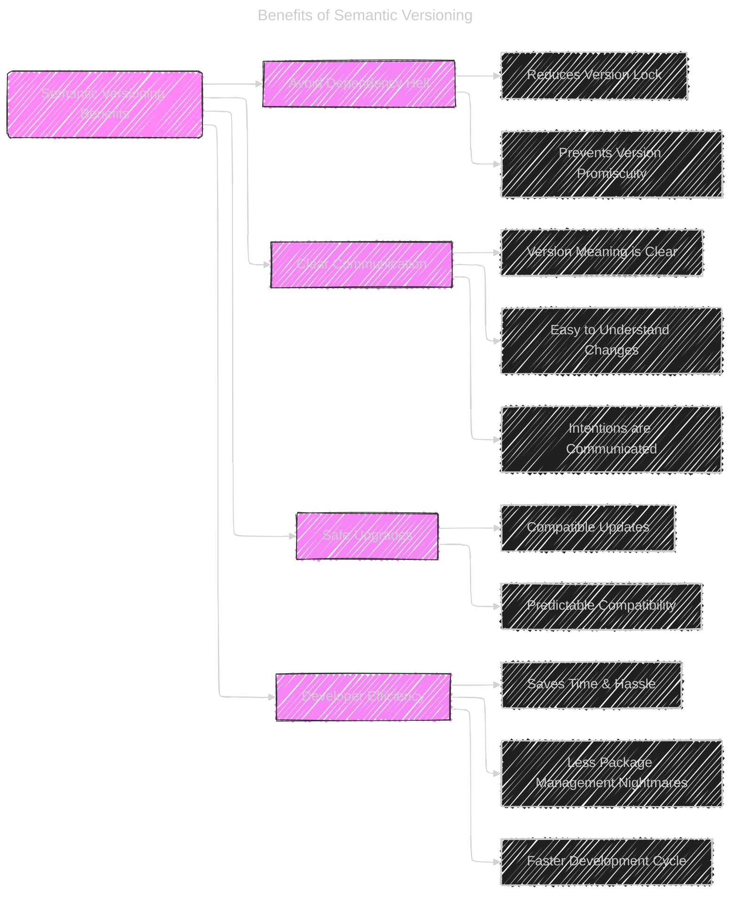

---

<div align="center">
  <blockquote>
  As a visual learner student, I created these personal study notes from the cited source(s) to aid my understanding.<br/>
  While my firm intention is to provide full credit, the blended format of notes and diagrams may sometimes obscure the original source, for which I apologize.<br/>
  I am committed to making corrections and welcome any feedback.<br/>
  This is a non-commercial project for my humble educational purposes only since the start.<br/>
  My goal is to share my perspective and contribute to the great work already being done.
  <br/>
  <br/>
  I want to extend my genuine apologies to the creators of the original material.<br/>
  Their work was the direct inspiration for this project, and I adapted it without first reaching out.<br/>
  My intent comes from a place of deep respect, and I hope this is received in the spirit of homage.<br/>
  🙏🏼🙏🏼🙏🏼🙏🏼
  </blockquote>
</div>

----


Below is a collection of diagrams and illustrations aim to cover the core technical concepts of Semantic Versioning described in the original source document, using a combination of flowcharts, class diagrams, sequence diagrams, tables, textual examples, and a mind map-like structure to enhance understanding and visual clarity.


# 1. Semantic Versioning - Core Concept (Flowchart)

This diagram illustrates the fundamental decision process for incrementing the version number components (MAJOR, MINOR, PATCH).




**Explanation:** This flowchart visually breaks down the decision process for updating the MAJOR, MINOR, and PATCH versions based on the type of changes introduced.

---

# 2. Version Number Components (Class Diagram)

This diagram represents the structure of a Semantic Version number, highlighting its components.




**Explanation:** This class diagram provides a structural view of a SemVer version number, showing its core components (Major, Minor, Patch) and optional extensions (Pre-release, Build Metadata). It illustrates that a `SemanticVersion` *is composed of* a `VersionCore` and *extends* with `PreRelease` and `BuildMetadata`.

---

# 3. Version Precedence (Sequence Diagram)

This diagram illustrates the process of comparing two Semantic Versions to determine precedence.


**Explanation:** This sequence diagram outlines the steps involved in comparing two SemVer versions, emphasizing the order of comparison (Major -> Minor -> Patch -> Pre-release) and the rules for pre-release identifier comparison. It also highlights that build metadata is not considered in precedence.

---

# 4. Increment Rules Table (Table Illustration)

Instead of a Mermaid diagram, a table might be best to summarize the increment rules.

| Change Type                     | Version Component to Increment | Reset Minor & Patch |
|---------------------------------|--------------------------------|----------------------|
| Incompatible API Changes        | **MAJOR**                      | Yes (to 0)           |
| New Backward Compatible Functionality | **MINOR**                      | Yes (to 0)           |
| Backward Compatible Bug Fixes   | **PATCH**                      | No                     |
| No API Change (Internal)        | **None**                       | No                     |

**Explanation:** This table concisely summarizes when to increment each part of the version number based on the type of change. It's a direct and easy-to-read format for this information.

---

# 5. Pre-release and Build Metadata (Textual Illustration)

Here's a simple textual illustration breaking down the components of a version with pre-release and build metadata.

```markdown
Semantic Version Example:  1.2.3-alpha.1+build.123

Breakdown:
  - Version Core: 1.2.3  (MAJOR.MINOR.PATCH)
  - Pre-release:  alpha.1 (Indicates unstable, lower precedence)
  - Build Metadata: build.123 (For build information, ignored in precedence)
```

**Explanation:** This textual illustration provides a clear example of a version string with pre-release and build metadata, breaking down each part for clarity.

---

# 6. BNF Grammar Structure (Mind Map - PlantUML Style)

While Mermaid doesn't directly support Mind Maps in the same way as PlantUML's `@startmindmap`, we can use a nested graph structure to approximate a mind map, or present it in a structured list form. Let's use a structured list for better readability as mindmaps in text are not very efficient.

**BNF Grammar Breakdown:**

*   **\<valid semver\>**:  Defines the overall structure of a valid semantic version.
    *   **\<version core\>**: The mandatory MAJOR.MINOR.PATCH part.
        *   **\<major\>**: Numeric identifier (non-negative integer, no leading zeros).
        *   **\<minor\>**: Numeric identifier.
        *   **\<patch\>**: Numeric identifier.
    *   **\<pre-release\>**: Optional, denoted by `-` followed by dot-separated identifiers.
        *   **\<dot-separated pre-release identifiers\>**: One or more pre-release identifiers separated by dots.
        *   **\<pre-release identifier\>**: Alphanumeric or numeric identifier.
    *   **\<build\>**: Optional, denoted by `+` followed by dot-separated identifiers.
        *   **\<dot-separated build identifiers\>**: One or more build identifiers separated by dots.
        *   **\<build identifier\>**: Alphanumeric identifier or digits (numeric string).
    *   **\<alphanumeric identifier\>**: Starts with a letter or hyphen, followed by zero or more identifier characters.
    *   **\<numeric identifier\>**: "0" or positive digit followed by digits.
    *   **\<identifier characters\>**: Digits or letters or hyphens.
    *   **\<non-digit\>**: Letters or hyphen.
    *   **\<digits\>**: One or more digits.
    *   **\<digit\>**: "0" or a positive digit ("1" - "9").
    *   **\<positive digit\>**: "1", "2", ..., "9".
    *   **\<letter\>**: "A" - "Z", "a" - "z".

**Explanation:**  This structured list breaks down the Backus-Naur Form (BNF) grammar, explaining each rule and term used in defining a valid SemVer string. It mirrors the hierarchical nature of the grammar.

-----

# 7. Benefits of Semantic Versioning (Mind Map - Approximated with Mermaid Graph)

We can use a nested graph to represent the benefits like a mind map.




**Explanation:** This diagram illustrates the key benefits of using Semantic Versioning. It shows the main advantages and their sub-points, similar to a mind map structure.


---
